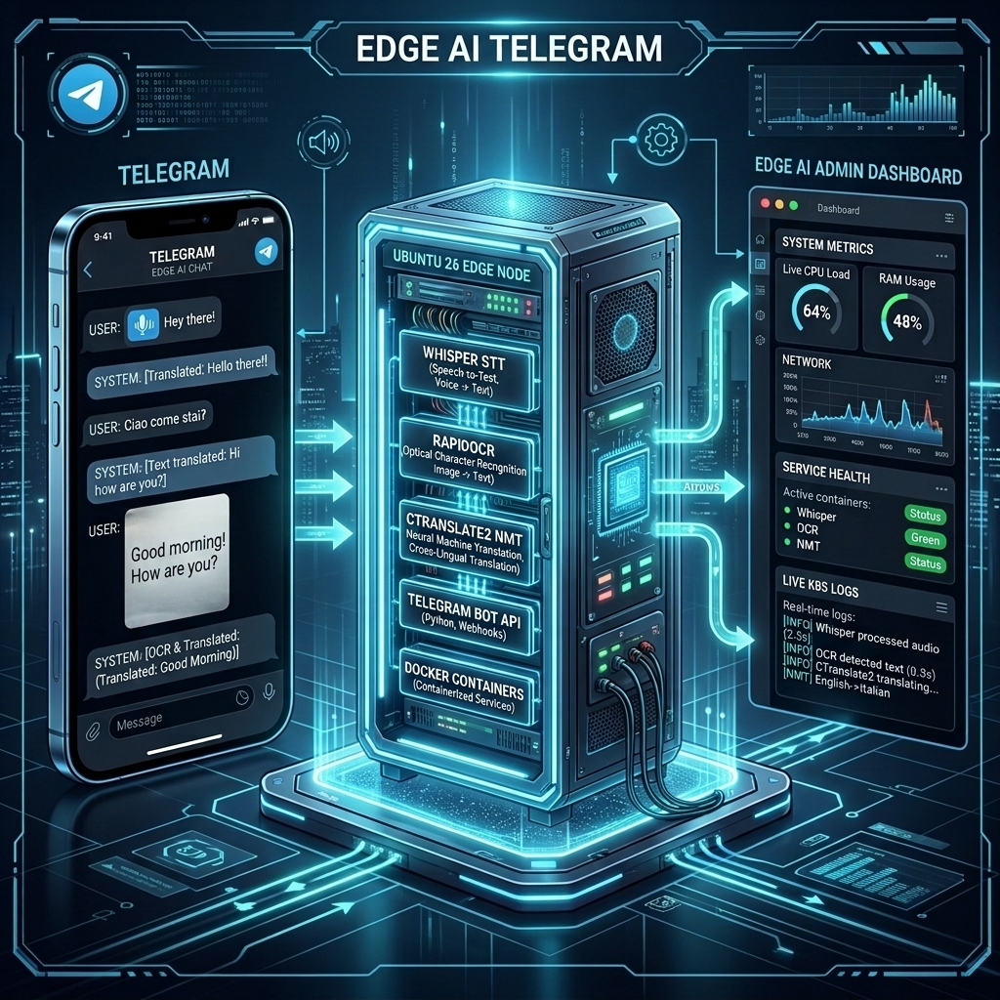

# 🤖 01. 시스템 개요 (System Overview)
> **Edge AI 텔레그램 멀티모달 번역 및 웹 통합 관리 시스템 가이드**

---

## 🔗 문서 이동 (Navigation)
- **[01. 시스템 개요](./01_system_overview.md)**
- [02. 전체 시스템 구성도 및 아키텍처](./02_system_architecture.md)
- [03. 단계별 초기 구축 및 설치 내역](./03_installation_history.md)
- [04. 설치 이후 추가 기능 및 업그레이드](./04_upgrades_and_evolution.md)
- [05. 상세 컴포넌트 동작 및 데이터 흐름](./05_detailed_workflows.md)
- [06. 보안 및 인프라 성능 최적화](./06_security_and_tuning.md)
- [07. 운영 관리, 검증 테스트 및 배포 가이드](./07_operations_and_deployment.md)

---

## 1. 개요 (Overview)

본 시스템은 **Ubuntu 26 기반 엣지 서버(Edge Node)** 환경에서 경량 쿠버네티스(**K3s**) 클러스터를 활용하여 구축된 **하이브리드 Edge AI 텔레그램 봇 및 웹 관리자 플랫폼**입니다. 

사용자가 텔레그램을 통해 전송한 다양한 미디어(텍스트, 이미지, 음성)를 엣지 환경에 구축된 딥러닝 인공지능 파이프라인을 거쳐 실시간으로 한국어로 번역하고 상황 분석을 수행합니다. 동시에 관리자는 웹 브라우저를 통해 클러스터 리소스 제어, 전문 용어 사전 관리, 실시간 보안 관제를 하나의 통합 대시보드에서 처리할 수 있습니다.

![system_architecture.jpg]

---

## 2. 🌟 핵심 목표 및 가치 (Core Values)

- **오프라인/경량 우선(Edge-First)**
  - 외부 인터넷망 장애 시에도 로컬 딥러닝 엔진(RapidOCR, CTranslate2, Whisper)을 통해 텍스트, 이미지, 음성을 고속 처리 및 한국어로 정밀 번역합니다.
  - 외부 클라우드 의존성 및 API 호출 비용을 획기적으로 낮춥니다.
  
- **하이브리드 VLM 확장성**
  - 단순 OCR(문자 판독) 수준을 넘어 메뉴판, 복잡한 안내문, 간판 등 시각적 맥락(Context)이 중요한 이미지는 클라우드 VLM(GPT-4o-mini 등)으로 자동 승격하여 해석합니다.
  
- **실시간 자연스러운 음성(TTS)**
  - Microsoft Edge-TTS 및 gTTS 라이브러리를 결합하여 텍스트 번역 결과를 생생한 오디오 음성 파일(.mp3, .ogg)로 즉시 합성하여 사용자에게 회신합니다.
  
- **쿠버네티스 인클러스터 통합 관제(Web K9s)**
  - 웹 대시보드에서 CLI 도구인 k9s처럼 Pod 상태 조회, 실시간 로그 스트리밍, 원클릭 Pod 재기동, 배포 스케일링을 관리할 수 있습니다.
  - 전용 사전(Glossary) 편집기를 제공하여 고유명사나 특정 언어 매핑을 유연하게 제어합니다.
  
- **엔터프라이즈급 3중 보안 설계**
  - **호스트**: SSH 무차별 대입 공격을 감지하여 24시간 IP를 차단하는 Fail2ban 탑재.
  - **웹 대입 방어**: 웹 대시보드 로그인 3회 연속 실패 시 클라이언트 IP 즉시 영구 차단.
  - **도메인 전용 접근**: IP 직접 스캐닝을 방지하고 허용된 도메인(`edgeai.local` 등)을 통해서만 웹 접속을 허용하는 Direct IP Blocker 정책 적용.
