# 🧠 02. System Architecture Blueprint & Drawings
> **Edge AI Telegram Multimodal Translation and Web Integrated Management System Guide**

> [!TIP]
> 🌐 **Language Selector**: **[🇰🇷 한국어 버전으로 전환 (Switch to Korean)](./02_system_architecture.md)** | **[🇺🇸 English (Current Document)](./02_system_architecture_EN.md)**

---

## 🔗 Navigation
- [01. System Overview](./01_system_overview_EN.md)
- **[02. System Architecture Blueprint](./02_system_architecture_EN.md)**
- [03. Installation History](./03_installation_history_EN.md)
- [04. Upgrades & Evolution](./04_upgrades_and_evolution_EN.md)
- [05. Detailed Workflows](./05_detailed_workflows_EN.md)
- [06. Security & Tuning](./06_security_and_tuning_EN.md)
- [07. Operations & Deployment](./07_operations_and_deployment_EN.md)
- [08. K9s AI Engine Monitoring](./08_k9s_ai_engine_and_workload_monitoring_EN.md)
- [09. MLOps Multi-Engine Benchmark](./09_mlops_multi_engine_architecture_and_benchmark_EN.md)
- [10. Smart Text Chunking & Splitter](./10_smart_text_chunking_and_message_splitter_EN.md)
- [11. External AI (Gemini) Integration](./11_external_ai_gemini_integration_and_admin_console_EN.md)
- [12. Host OS Firewall & IPS](./12_host_os_firewall_and_intrusion_prevention_guide_EN.md)
- [13. Hardware Scale-Up (32C/192GB/GPU)](./13_hardware_scaleup_32core_192gb_gpu_optimization_EN.md)
- [14. eBPF Cilium & AI Firewall + Telegram SOC](./14_ebpf_cilium_ai_firewall_and_telegram_soc_EN.md)

---

## 1. System Architecture Blueprint

This system is structured on a microservices architecture (MSA), with all core services deployed onto a **K3s Kubernetes** cluster to interact seamlessly.

```mermaid

graph TD
    %% External clients
    subgraph "External Clients / End Users"
        User([📱 Telegram App User])
        Admin([💻 Web Admin Browser])
        Attacker([⚠️ Unauthenticated Scanner/Attacker])
    end

    %% Telegram Cloud
    subgraph "Telegram Cloud Ecosystem"
        TelegramAPI[Telegram Bot Cloud Gateway]
    end

    User <-->|"Text / Image / Voice / Inline Buttons"| TelegramAPI

    %% Edge Node
    subgraph "Ubuntu 26 Edge Server (16 vCPU, 60GB RAM - K3s Cluster)"
        
        %% Network & Security Layer
        subgraph "Ingress & Edge Security Layer"
            Ingress["Traefik / Nginx Ingress Controller (Port 80)"]
            SecModule["Direct IP Blocker & Web Banwall"]
            Fail2ban["Fail2ban Host Protection (SSH)"]
        end

        Admin <-->|"HTTPS / HTTP Port 80"| Ingress
        Attacker -.->|Direct IP / Brute-force Attack| SecModule
        Attacker -.->|SSH Port Attack| Fail2ban

        %% Kubernetes Microservices
        subgraph "Kubernetes Workloads (Microservices Layer)"
            BotService["💬 telegram-bot (aiogram)<br/>- Asynchronous Polling/Webhook<br/>- VLM / RapidOCR Mode Selector<br/>- TTS Auto Playback Manager"]
            
            AIEngine1["🧠 edge-ai-engine (Pod 1)<br/>FastAPI Worker"]
            AIEngine2["🧠 edge-ai-engine (Pod 2)<br/>FastAPI Worker"]
            
            WebDashboard["📊 web-dashboard (FastAPI + Modern UI)<br/>- K9s Web Terminal & Pod Manager<br/>- Glossary Custom Dictionary<br/>- Realtime Telemetry & Security Audit"]
        end

        TelegramAPI <-->|"Long-polling Async Stream"| BotService
        Ingress --> WebDashboard
        BotService -->|"HTTP REST: /api/v1/process"| AIEngine1
        BotService -->|"HTTP REST: /api/v1/process"| AIEngine2

        %% Core AI Engines
        subgraph "Edge AI Processing Core"
            RapidOCR["🔍 RapidOCR Engine<br/>(ONNX Runtime + Tesseract Fallback)"]
            NMT["🌐 CTranslate2 NMT<br/>(Quantized INT8 NLLB / Marian)"]
            STT["🎙️ Speech Recognition<br/>(Whisper / Google STT)"]
            TTS["🔊 Voice Synthesis<br/>(Edge-TTS / gTTS Pipeline)"]
            VLM["👁️ Direct VLM Parser<br/>(GPT-4o-mini Vision Hybrid)"]
        end

        AIEngine1 --- RapidOCR
        AIEngine2 --- RapidOCR
        AIEngine1 --- NMT
        AIEngine2 --- NMT
        AIEngine1 --- STT
        AIEngine2 --- STT
        AIEngine1 --- TTS
        AIEngine2 --- TTS
        AIEngine1 --- VLM
        AIEngine2 --- VLM

        %% Storage & Persistence
        subgraph "Shared Persistent Storage (hostPath & Memory)"
            TokenAudit[("🪙 token_audit_logs.json<br/>(Atomic Shared JSON Storage)")]
            GlossaryDB[("📖 glossary.json<br/>(Custom Translation Dictionary)")]
            UserDB[("👥 users.json<br/>(Bcrypt Hashed Security Storage)")]
            AuthLog[("🔒 /var/log/auth.log<br/>(Host SSH Security Log)")]
            SharedMemory["⚡ /dev/shm (8GB RAM Cache)"]
        end

        AIEngine1 & AIEngine2 <-->|"Atomic Append/Read"| TokenAudit
        AIEngine1 & AIEngine2 <-->|"Dictionary Lookup"| GlossaryDB
        WebDashboard <-->|"Read/Write GUI"| GlossaryDB
        WebDashboard <-->|"Audit Aggregation"| TokenAudit
        WebDashboard <-->|"Auth & JWT"| UserDB
        WebDashboard <-->|"SSH Scan Inspection"| AuthLog
        AIEngine1 --- SharedMemory
        AIEngine2 --- SharedMemory

        %% K8s API
        K8sAPI[("☸️ Kubernetes API Server<br/>(RBAC: ClusterRole)")]
        WebDashboard <-->|"In-Cluster Pod Exec/Logs/Scale"| K8sAPI
    end

    %% External Cloud AI
    subgraph "External Cloud AI (Hybrid Fallback)"
        OpenAI["OpenAI API (GPT-4o-mini / GPT-4o)"]
    end
    VLM -.->|Optional Hybrid Routing| OpenAI
```

---

## 2. Core Microservice Components

### 2.1 Telegram Bot Gateway (`telegram-bot`)
- **Role**: Long-polling asynchronous event listener handling user interactions from the Telegram Bot API.
- **Tech Stack**: Python 3.11, `aiogram v3`.
- **Features**:
  - Parses voice notes, images, and multi-line text messages and forwards them to `edge-ai-engine`.
  - Provides inline button keyboards to toggle between OCR mode (fast literal translation) and VLM mode (scene comprehension).

### 2.2 Edge AI Inference Engine (`edge-ai-engine`)
- **Role**: Dispatches incoming multimedia payloads across the local neural networks and returns structured inference results.
- **Tech Stack**: Python, FastAPI, ONNX Runtime, CTranslate2.
- **Features**:
  - Scaled to `replicas: 2` for load distribution.
  - Hybrid router: delegates to local models or falls back to cloud Vision LLMs when appropriate.

### 2.3 Web Administration Dashboard (`web-dashboard`)
- **Role**: Centralized web console for infrastructure telemetry, Pod orchestration, glossary adjustments, and security logging.
- **Tech Stack**: Python, FastAPI, Vanilla JS / HTML CSS.
- **Features**:
  - Bound to an in-cluster RBAC ServiceAccount for cluster operations via the Kubernetes API.

---

## 3. Network Topology & Port Mapping

Inbound traffic traverses through the Traefik Ingress controller before dispatching to the respective K8s services:

| Port | Protocol | Target Service | Exposure | Responsibility |
| :--- | :--- | :--- | :--- | :--- |
| **80** | HTTP | Ingress (Traefik) | Public / Edge | Web administration entry gateway |
| **`████`** | TCP/SSH | Host Server | Restricted | Remote management monitored by Fail2ban |
| **8000** | HTTP | `edge-ai-engine` | K8s ClusterIP | Internal REST API for AI inference |
| **3000** | HTTP | `web-dashboard` | K8s ClusterIP | Web admin server |
| **5432** | TCP | `postgresql` | K8s ClusterIP | Persistent transaction and audit log storage |
