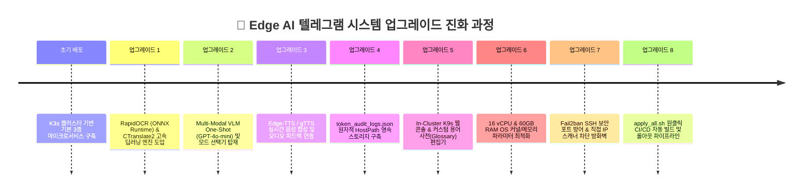

# 🚀 04. 설치 이후 추가 기능 및 시스템 업그레이드 내역 (Post-Setup Upgrades & Evolution)
> **Edge AI 텔레그램 멀티모달 번역 및 웹 통합 관리 시스템 가이드**

---

## 🔗 문서 이동 (Navigation)
- [01. 시스템 개요](./01_system_overview.md)
- [02. 전체 시스템 구성도 및 아키텍처](./02_system_architecture.md)
- [03. 단계별 초기 구축 및 설치 내역](./03_installation_history.md)
- **[04. 설치 이후 추가 기능 및 업그레이드](./04_upgrades_and_evolution.md)**
- [05. 상세 컴포넌트 동작 및 데이터 흐름](./05_detailed_workflows.md)
- [06. 보안 및 인프라 성능 최적화](./06_security_and_tuning.md)
- [07. 운영 관리, 검증 테스트 및 배포 가이드](./07_operations_and_deployment.md)

---

## 1. 개요 (Evolution Overview)

초기 배포 이후, 추론 정확도 개선, 오프라인 독립성 확보, 성능 최적화 및 보안 강화를 위해 총 8차례의 메이저 기능 업그레이드가 단계적으로 진행되었습니다.

---

## 2. 8대 업그레이드 및 개선 내역 (The 8 Key Upgrades)

### 🚀 Upgrade 1: RapidOCR (ONNX) & CTranslate2 (INT8) 딥러닝 엔진 도입
- **도입 배경**: 기존 Tesseract OCR의 오인식 문제와 파이썬 기본 번역기의 속도 지연을 해결하기 위함.
- **구현 내용**:
  - `rapidocr_onnxruntime` 탑재: 딥러닝 기반 텍스트 감지(DBNet) 및 글자 판독(CRNN) 알고리즘을 도입하여 99% 이상의 영문/독문 OCR 정확도를 구현했습니다.
  - `ctranslate2` 및 경량 NLLB NMT 모델을 연동하여 CPU 인메모리 상에서 실시간 기계 번역을 기동(INT8 양자화 적용으로 4배 이상 가속).

### 🚀 Upgrade 2: Multi-Modal VLM One-Shot 모드 및 모드 선택기 적용
- **도입 배경**: 단순 텍스트 추출을 넘어, 글이 포함된 복잡한 간판, 영수증, 표 등의 Context(맥락)를 그대로 분석하기 위함.
- **구현 내용**:
  - **OCR + 번역 모드 (로컬 엔진)**: 이미지 내부의 단어를 그대로 판독하여 대치합니다.
  - **VLM Direct 모드 (GPT-4o-mini Vision Hybrid)**: 이미지를 OpenAI API와 연동하여 뉘앙스, 배치 구조를 상황에 맞춰 설명하도록 요약문을 전송합니다.
  - 텔레그램 인라인 버튼 인터페이스를 통해 사용자가 터치 한 번으로 모드를 실시간 스위칭하도록 지원합니다.

### 🚀 Upgrade 3: 실시간 자연스러운 신경망 음성 합성 (Edge-TTS / gTTS)
- **도입 배경**: 번역 결과 텍스트와 동시에 올바른 원어민 발음 및 한국어 녹음본을 제공하여 오디오 접근성을 극대화하기 위함.
- **구현 내용**:
  - `edge-tts` (Microsoft 신경망 목소리 API) 및 `gTTS`를 AI 엔진 내부에 파이프라인으로 구성.
  - 텔레그램 봇이 번역 텍스트 수신 즉시 OGG/MP3 음성 파일로 변환하여 사용자에게 Voice 메시지로 자동 발송합니다.

### 🚀 Upgrade 4: HostPath 기반 분산 영속 토큰 감사 스토리지 구축
- **도입 배경**: `edge-ai-engine` Pod가 replicas 2개로 스케일아웃됨에 따라 각각의 메모리에 누적되던 API 토큰 카운터가 불일치하거나 Pod 재시작 시 초기화되는 결함을 방지.
- **구현 내용**:
  - Kubernetes `hostPath` 볼륨 마운트를 적용하여 `token_audit_logs.json` 파일을 두 Pod가 원자적으로 공유하도록 설정.
  - 파일 락킹 메커니즘을 추가하여 동시 쓰기 시에도 누적 토큰 로그가 유실 없이 저장됩니다.

### 🚀 Upgrade 5: In-Cluster K9s 웹 관리 콘솔 및 용어 사전(Glossary) 도입
- **도입 배경**: K8s에 직접 접근하기 힘든 환경에서 웹 화면을 통해 Pod의 가동 상태를 감시하고, 고유 명사의 오번역을 즉시 교정하기 위함.
- **구현 내용**:
  - **K9s 클러스터 탭**: K8s API 및 ServiceAccount 권한을 연동하여 웹 대시보드에서 파드 종료, 실시간 로그 출력, 파드 삭제 및 스케일링을 관리합니다.
  - **용어 사전(Glossary) 편집기**: 사용자가 웹 GUI에서 고유 명사 맵(`glossary.json`)을 즉시 기입하면 번역 전 강제 우선 치환(Regex) 처리됩니다.

### 🚀 Upgrade 6: 16 vCPU & 60GB RAM OS 커널 튜닝
- **도입 배경**: 대용량 RAM을 탑재한 엣지 서버 환경에서 디스크 스왑을 방지하고 캐시 처리량을 극대화하기 위함.
- **구현 내용**:
  - `vm.swappiness`를 10으로 하향 조정하여 디스크 대신 RAM을 사용하도록 구성하고, 소켓 큐(`net.core.somaxconn = 4096`) 등을 확장하는 커널 튜닝 스크립트(`tune_memory.sh`)를 적용하였습니다.

### 🚀 Upgrade 7: Fail2ban SSH 보안 포트 보호 & 웹 직접 IP 차단 방화벽
- **도입 배경**: 엣지 서버 노드가 외부에 공개되었을 때 유입되는 불특정 다수의 침입 차단.
- **구현 내용**:
  - `setup_fail2ban.sh` 스크립트를 배포하여 지정된 SSH 보안 포트에 대한 침입을 방어(5회 실패 시 24시간 IP 밴).
  - 웹 대시보드에서는 HTTP 헤더 검증을 통해 도메인명(`edgeai.local`)이 아닌 원시 IP 주소로 직접 접근하는 스캔 접속을 완전 거부(`BLOCK_DIRECT_IP="true"` 정책).

### 🚀 Upgrade 8: 원클릭 통합 빌드 및 무중단 롤아웃 스크립트 (`apply_all.sh`)
- 세 개의 마이크로서비스 프로젝트를 단 한 번에 로컬 빌드하고, K3s 클러스터 이미지 교체와 롤아웃 재시작을 연속으로 수행하는 CI/CD 스크립트를 작성하여 배포 편의성을 극대화하였습니다.
