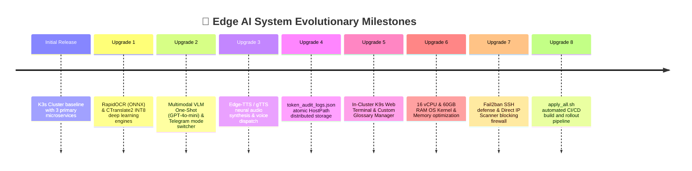

# 🚀 04. Post-Setup Upgrades & System Evolution
> **Edge AI Telegram Multimodal Translation and Web Integrated Management System Guide**

> 🌐 **Language / 언어 전환**: [English](./04_upgrades_and_evolution_EN.md) | [한국어](./04_upgrades_and_evolution.md)

---

## 🔗 Navigation
- [01. System Overview](./01_system_overview_EN.md)
- [02. System Architecture Blueprint](./02_system_architecture_EN.md)
- [03. Installation History](./03_installation_history_EN.md)
- **[04. Upgrades & Evolution](./04_upgrades_and_evolution_EN.md)**
- [05. Detailed Workflows](./05_detailed_workflows_EN.md)
- [06. Security & Infrastructure Tuning](./06_security_and_tuning_EN.md)
- [07. Operations & Deployment Guide](./07_operations_and_deployment_EN.md)
- [14. eBPF Cilium & AI Firewall + Telegram SOC](./14_ebpf_cilium_ai_firewall_and_telegram_soc_EN.md)

---

## 1. Evolution Overview

Following baseline deployment, 8 major system upgrades were rolled out to elevate OCR precision, autonomy, memory utilization, and zero-trust perimeter defense.

---

## 2. The 8 Major Upgrades Breakdown

### 🚀 Upgrade 1: RapidOCR (ONNX) & CTranslate2 (INT8)
- **Background**: Replaced legacy Tesseract and Python translators to address OCR inaccuracies and translation latencies.
- **Implementation**:
  - `rapidocr_onnxruntime`: Leverages DBNet text detection and CRNN character recognition, pushing OCR accuracy beyond 99% for Latin scripts.
  - `ctranslate2`: Quantized INT8 NLLB neural translation executes 4x faster on local CPU memory.

### 🚀 Upgrade 2: Multimodal VLM Hybrid Routing (GPT-4o-mini)
- **Background**: Traditional OCR extracts isolated text, missing holistic situational context on signs, complex documents, or receipts.
- **Implementation**:
  - **Local OCR Engine**: Rapid, direct word-by-word extraction and translation.
  - **VLM Vision Hybrid**: Delegates visual interpretation to cloud LLMs with markdown scene summaries.
  - Toggled dynamically through Telegram inline button keyboards.

### 🚀 Upgrade 3: Real-Time Neural Speech Synthesis (Edge-TTS / gTTS)
- **Implementation**:
  - Integrated Microsoft Edge neural voice models into the inference backend.
  - Automatically synthesizes translated output into `.mp3`/`.ogg` audio files and delivers them as native voice messages.

### 🚀 Upgrade 4: Atomic HostPath Distributed Token Storage
- **Background**: Multiple `edge-ai-engine` Pod replicas caused token counter divergence across isolated container memory.
- **Implementation**:
  - Mounted `token_audit_logs.json` via Kubernetes `hostPath` with file locking to guarantee transactional atomic logging.

### 🚀 Upgrade 5: In-Cluster K9s Web Admin & Glossary Customization
- **Implementation**:
  - **K9s Web Console**: Authenticated RBAC access to view Pod health, tail container logs, and trigger rolling restarts.
  - **Glossary UI**: Direct GUI editing of `glossary.json` enforcing pre-translation regex substitution for specialized terminology.

### 🚀 Upgrade 6: 16 vCPU & 60GB RAM OS Kernel Optimization
- **Implementation**:
  - Configured kernel swappiness to 10 (`vm.swappiness = 10`) to prefer RAM caching and scaled socket queues (`net.core.somaxconn = 4096`).

### 🚀 Upgrade 7: Fail2ban SSH Protection & Direct IP Block Firewall
- **Implementation**:
  - Automatically isolates host SSH port brute-force scanners for 24 hours after 5 failures.
  - Web dashboard drops direct IP requests (`BLOCK_DIRECT_IP="true"`), requiring valid domain headers.

### 🚀 Upgrade 8: One-Click CI/CD Rollout Automation (`apply_all.sh`)
- Builds all three microservices locally and rolls out updated images to K3s within seconds.
