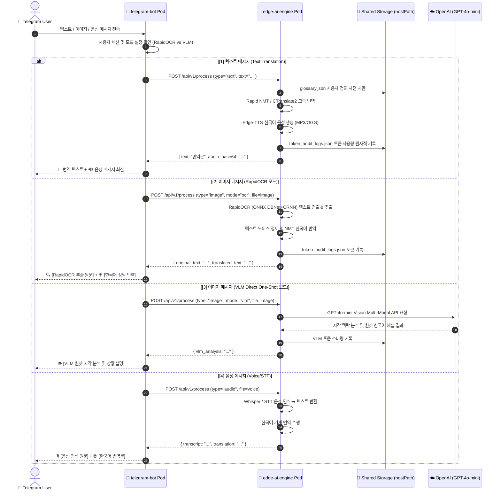
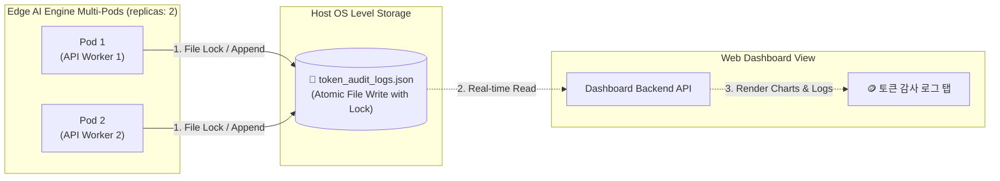

# ⚙️ 05. 상세 컴포넌트별 동작 및 데이터 흐름도 (Detailed Workflow Diagrams)
> **Edge AI 텔레그램 멀티모달 번역 및 웹 통합 관리 시스템 가이드**

---

## 🔗 문서 이동 (Navigation)
- [01. 시스템 개요](file:///home/aiadmin01/edge_ai_guide/01_system_overview.md)
- [02. 전체 시스템 구성도 및 아키텍처](file:///home/aiadmin01/edge_ai_guide/02_system_architecture.md)
- [03. 단계별 초기 구축 및 설치 내역](file:///home/aiadmin01/edge_ai_guide/03_installation_history.md)
- [04. 설치 이후 추가 기능 및 업그레이드](file:///home/aiadmin01/edge_ai_guide/04_upgrades_and_evolution.md)
- **[05. 상세 컴포넌트 동작 및 데이터 흐름](file:///home/aiadmin01/edge_ai_guide/05_detailed_workflows.md)**
- [06. 보안 및 인프라 성능 최적화](file:///home/aiadmin01/edge_ai_guide/06_security_and_tuning.md)
- [07. 운영 관리, 검증 테스트 및 배포 가이드](file:///home/aiadmin01/edge_ai_guide/07_operations_and_deployment.md)

---

## 1. 멀티모달 텔레그램 메시지 처리 시퀀스 (Telegram Processing Flow)

사용자가 텔레그램으로 보낸 메시지는 종류에 따라 `edge-ai-engine` 백엔드 내부의 각기 다른 프로세싱 모듈로 인입되어 처리됩니다.



---

## 2. K9s Web Console 인클러스터 관제 흐름도 (In-Cluster Control)

웹 대시보드에서 파드의 상태를 가져오고 명령을 내릴 때의 보안 및 데이터 전달 경로입니다.

```mermaid
flowchart TD
    subgraph Browser ["💻 Web Admin Dashboard GUI"]
        UI_K9s["☸️ K9s 클러스터 탭"]
        UI_Logs["📜 실시간 파드 로그 뷰어"]
        UI_Action["⚡ 원클릭 Pod 재기동 버튼"]
        UI_Glossary["📖 용어 사전(Glossary) 편집기"]
        UI_Tokens["🪙 토큰 감사 로그 누적 탭"]
    end

    subgraph DashboardBackend ["Web Dashboard Backend (FastAPI)"]
        K8sClient["Kubernetes Python Client<br/>(In-Cluster Config)"]
        GlossaryMgr["Glossary Storage Manager"]
        TokenViewer["Token Log Aggregator"]
    end

    subgraph K8sRBAC ["Kubernetes Cluster Security (RBAC)"]
        SA["ServiceAccount: web-dashboard-sa"]
        CRB["ClusterRoleBinding: web-dashboard-sa-binding"]
        CR["ClusterRole: web-dashboard-k9s-role<br/>• pods (get, list, watch, delete)<br/>• pods/log, events, nodes<br/>• deployments/scale"]
    end

    subgraph K8sCore ["Kubernetes API & Pods"]
        APIServer["☸️ K8s API Server"]
        Pod_Engine["🧠 Pod: edge-ai-engine-xxxx"]
        Pod_Bot["💬 Pod: telegram-bot-xxxx"]
        Pod_Dash["📊 Pod: web-dashboard-xxxx"]
    end

    UI_K9s -->|GET /api/v1/k8s/pods| K8sClient
    UI_Logs -->|GET /api/v1/k8s/pods/{name}/logs| K8sClient
    UI_Action -->|POST /api/v1/k8s/pods/{name}/restart| K8sClient
    UI_Glossary <-->|GET / POST / DELETE /api/v1/glossary| GlossaryMgr
    UI_Tokens -->|GET /api/v1/tokens/audit| TokenViewer

    K8sClient --- SA
    SA --- CRB
    CRB --- CR
    CR --> APIServer

    APIServer -.->|Live Log Stream| Pod_Engine
    APIServer -.->|Live Log Stream| Pod_Bot
    APIServer -.->|Restart/Delete Pod| Pod_Engine
```

---

## 3. 영속 저장소 동기화 흐름 (Storage Sync Flow)

다중 파드 환경에서 데이터 불일치를 피하기 위한 파일 락킹 및 HostPath 마운팅 개념도입니다.


- **원자적 파일 락킹**: 파이썬 `portalocker` 또는 `fcntl` 기술을 활용하여, Pod 1과 Pod 2가 동시에 로그 쓰기를 시도할 때 발생할 수 있는 레이스 컨디션(Race Condition)을 방어하고 데이터 무결성을 보장합니다.
- **영구 보존**: Pod가 다운되거나 쿠버네티스가 스케줄러에 의해 강제 교체하더라도, 로그는 물리 호스트 시스템 디스크 상에 완벽히 잔존합니다.
