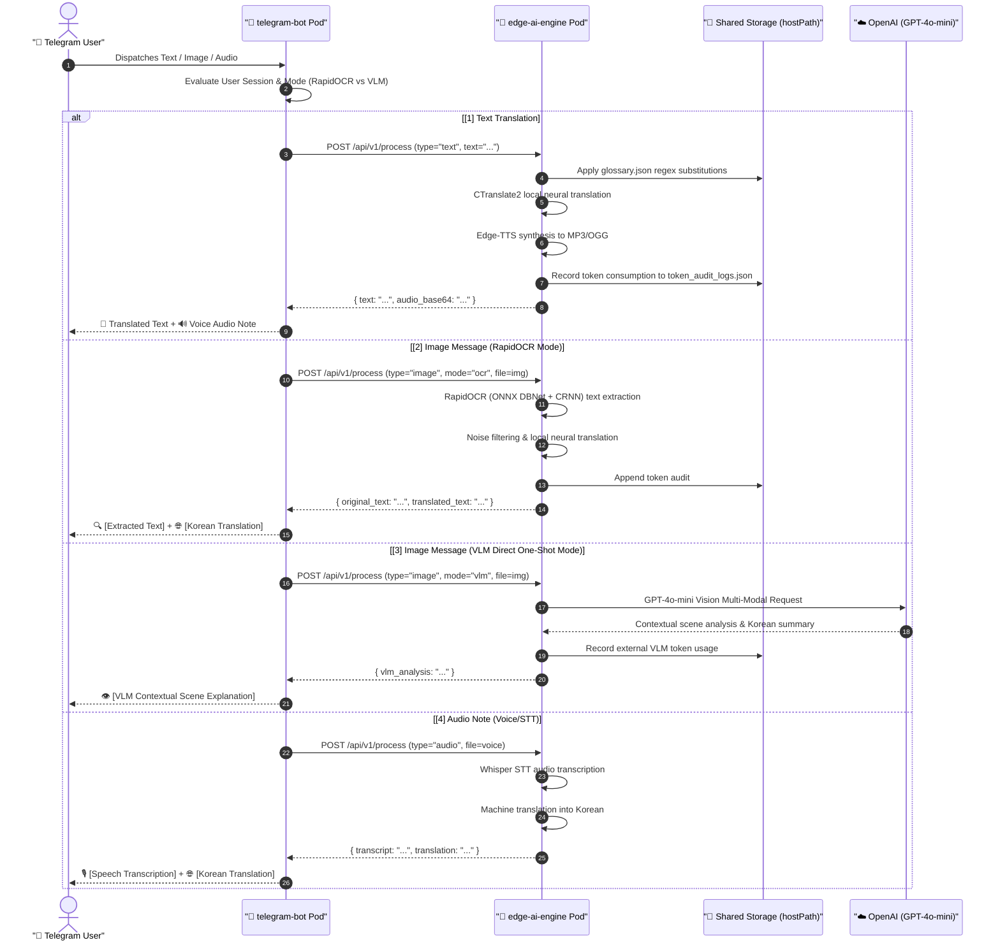
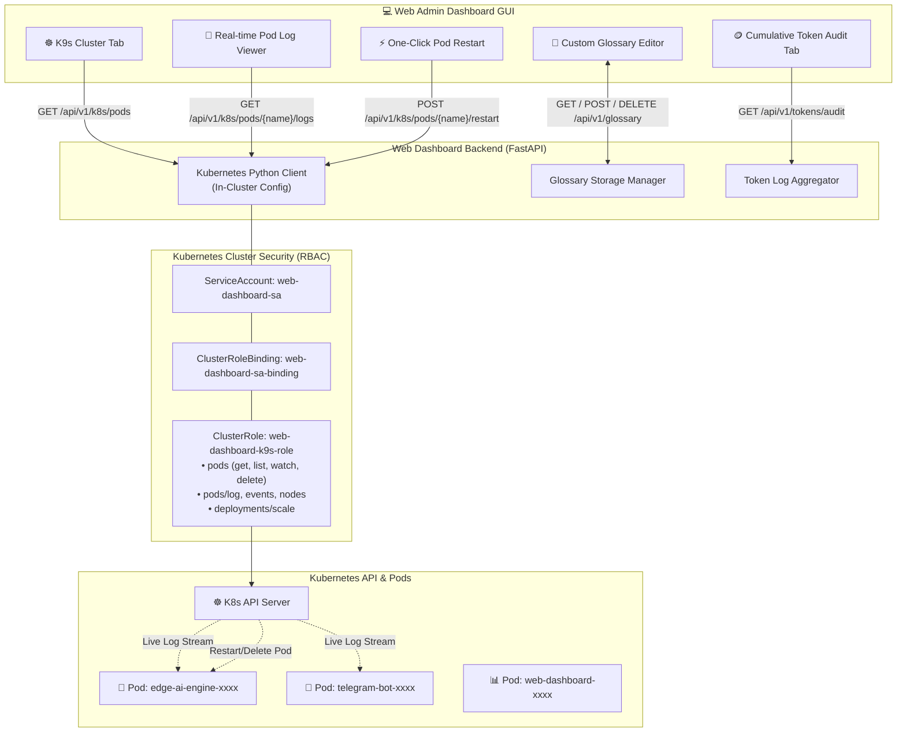
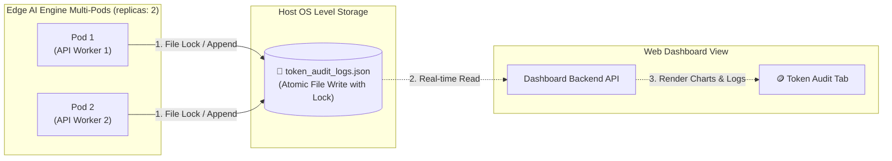

# ⚙️ 05. Detailed Component Workflows & Data Flow Diagrams
> **Edge AI Telegram Multimodal Translation and Web Integrated Management System Guide**

> [!TIP]
> 🌐 **Language Selector**: **[🇰🇷 한국어 버전으로 전환 (Switch to Korean)](./05_detailed_workflows.md)** | **[🇺🇸 English (Current Document)](./05_detailed_workflows_EN.md)**

---

## 🔗 Navigation
- [01. System Overview](./01_system_overview_EN.md)
- [02. System Architecture Blueprint](./02_system_architecture_EN.md)
- [03. Installation History](./03_installation_history_EN.md)
- [04. Upgrades & Evolution](./04_upgrades_and_evolution_EN.md)
- **[05. Detailed Workflows](./05_detailed_workflows_EN.md)**
- [06. Security & Tuning](./06_security_and_tuning_EN.md)
- [07. Operations & Deployment](./07_operations_and_deployment_EN.md)
- [08. K9s AI Engine Monitoring](./08_k9s_ai_engine_and_workload_monitoring_EN.md)
- [09. MLOps Multi-Engine Benchmark](./09_mlops_multi_engine_architecture_and_benchmark_EN.md)
- [10. Smart Text Chunking & Splitter](./10_smart_text_chunking_and_message_splitter_EN.md)
- [11. External AI (Gemini) Integration](./11_external_ai_gemini_integration_and_admin_console_EN.md)
- [12. Host OS Firewall & IPS](./12_host_os_firewall_and_intrusion_prevention_guide_EN.md)
- [13. Hardware Scale-Up (32C/192GB/GPU)](./13_hardware_scaleup_32core_192gb_gpu_optimization_EN.md)
- [14. eBPF Cilium & AI Firewall + Telegram SOC](./14_ebpf_cilium_ai_firewall_and_telegram_soc_EN.md)

---

## 1. Multimodal Telegram Request Processing Sequence

User payloads delivered through the messaging gateway route dynamically based on mime-type into modular processing pipelines within `edge-ai-engine`:

---

## 2. In-Cluster K9s Web Console Management Architecture

Controls and metrics collected by the web admin backend traverse in-cluster RBAC boundaries to interact directly with the Kubernetes API server:

---

## 3. Persistent Storage Synchronization

Eliminates race conditions between multi-replica inference pods:

- **Atomic File Locking**: Utilizes POSIX `fcntl` locking to prevent race conditions during high concurrent traffic.
- **Hardware Persistence**: HostPath mounts guarantee log preservation across Pod eviction or restart cycles.
