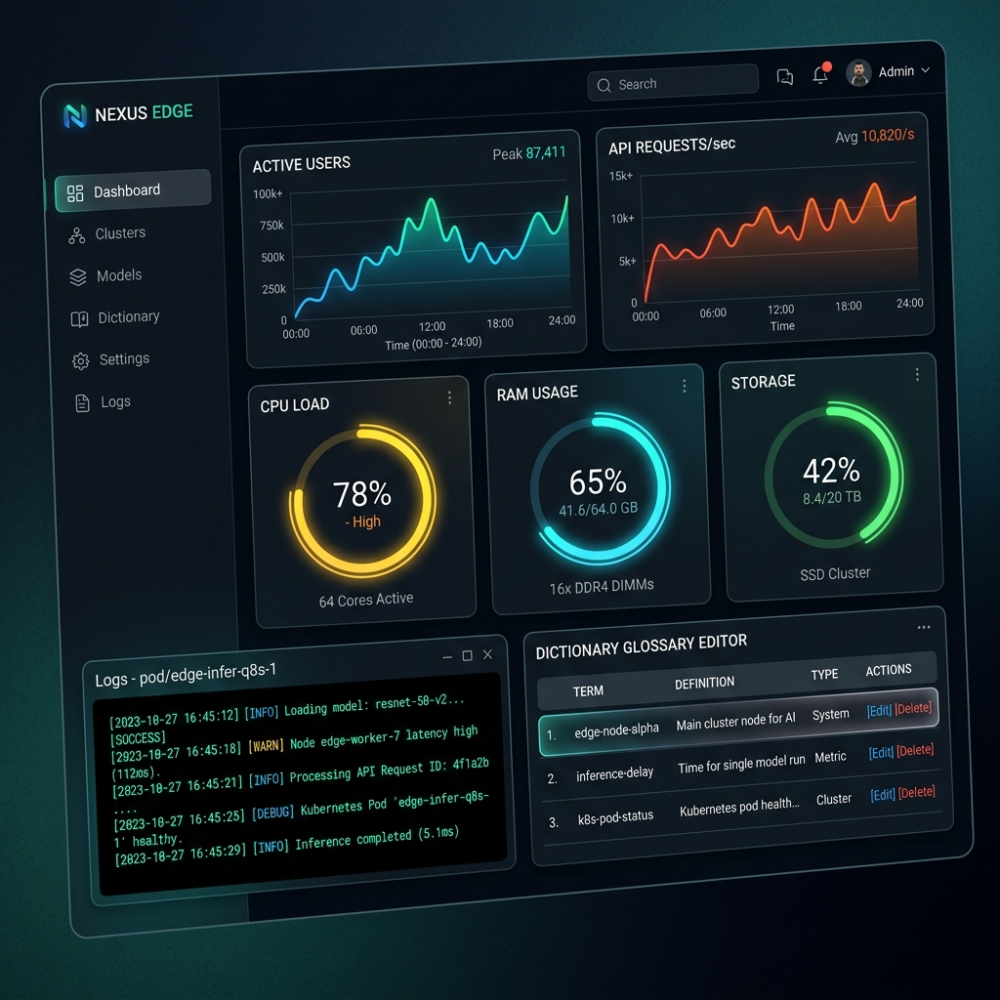

# ⚙️ 07. 운영 관리, 검증 테스트 및 배포 가이드 (Operations & Deployment Guide)
> **Edge AI 텔레그램 멀티모달 번역 및 웹 통합 관리 시스템 가이드**

---

## 🔗 문서 이동 (Navigation)
- [01. 시스템 개요](./01_system_overview.md)
- [02. 전체 시스템 구성도 및 아키텍처](./02_system_architecture.md)
- [03. 단계별 초기 구축 및 설치 내역](./03_installation_history.md)
- [04. 설치 이후 추가 기능 및 업그레이드](./04_upgrades_and_evolution.md)
- [05. 상세 컴포넌트 동작 및 데이터 흐름](./05_detailed_workflows.md)
- [06. 보안 및 인프라 성능 최적화](./06_security_and_tuning.md)
- **[07. 운영 관리, 검증 테스트 및 배포 가이드](./07_operations_and_deployment.md)**

---

## 1. 무중단 통합 배포 가이드 (`apply_all.sh`)

새로운 코드를 적용하거나 설정을 수정했을 때, 아래의 단일 스크립트를 통해 안전하고 신속하게 쿠버네티스 서비스들을 재배포할 수 있습니다.

```bash
#!/usr/bin/env bash
# ~/apply_all.sh
set -e

# 1. Edge AI Engine 이미지 빌드 & K3s 레지스트리 임포트
cd ~/edge-ai-engine
docker build -t edge-ai-engine:latest .
docker save edge-ai-engine:latest | sudo k3s ctr images import -

# 2. Web Dashboard 이미지 빌드 & K3s 임포트
cd ~/web-dashboard
docker build -t web-dashboard:latest .
docker save web-dashboard:latest | sudo k3s ctr images import -

# 3. Telegram Bot 이미지 빌드 & K3s 임포트
cd ~/telegram-bot
docker build -t telegram-bot:latest .
docker save telegram-bot:latest | sudo k3s ctr images import -

# 4. K8s Manifest 적용 및 재기동
kubectl apply -f ~/web-dashboard/deployment.yaml
kubectl rollout restart deployment/edge-ai-engine
kubectl rollout restart deployment/web-dashboard
kubectl rollout restart deployment/telegram-bot

# 상태 검증
kubectl get pods -o wide
```

실행 방법:
```bash
chmod +x ~/apply_all.sh
~/apply_all.sh
```

---

## 2. 실시간 운영 및 웹 대시보드 관리 (Operation with Web Dashboard)

구축된 웹 대시보드 화면을 통해 관리자는 아래의 일상 작업을 GUI 상에서 편리하게 수행할 수 있습니다.



- **Pod 실시간 감사**: CPU, RAM 메트릭과 파드 상태를 모니터링하고 비정상적인 파드를 원클릭으로 격리/재기동할 수 있습니다.
- **용어 사전(Glossary) 편집**: 오번역 고유 명사 매핑 데이터를 실시간으로 등록 및 저장합니다.
- **토큰 사용량 모니터링**: 누적된 토큰 감사 로그와 호출 패턴을 즉시 확인합니다.

---

## 3. 검증 테스트 가이드 (Verification Testing)

배포 직후 시스템 정합성 판단을 위해 작성된 테스트 스크립트 실행 목록입니다.

### 3.1 엣지 AI 파이프라인 통합 테스트 (`test_all_features.py`)
- **목적**: OCR 엔진, 번역(NMT) 엔진, 음성(STT, TTS) 모듈, K8s 연결 여부를 자동 종합 진단합니다.
- **실행**:
  ```bash
  python3 ~/edge-ai-engine/test_all_features.py
  ```

### 3.2 분산 영속 토큰 로그 누적 보존 테스트 (`test_token_logs.py`)
- **목적**: 다중 요청 시 `token_audit_logs.json`이 데이터 레이스 현상 없이 원자적으로 보존되는지 검증합니다.
- **실행**:
  ```bash
  python3 ~/edge-ai-engine/test_token_logs.py
  ```

### 3.3 음성 합성 기능 테스트 (`test_tts.py`)
- **목적**: 번역문 음성 인코딩 및 재생(OGG 파일 생성 상태) 정상 동작 여부를 테스트합니다.
- **실행**:
  ```bash
  python3 ~/edge-ai-engine/test_tts.py
  ```

---

## 4. 트러블슈팅 및 장애 복구 (Troubleshooting Playbook)

### 🚨 Case 1: 텔레그램 봇이 응답하지 않음
1. K8s 상에서 텔레그램 봇 파드가 가동 중인지 로그를 조회합니다.
   ```bash
   kubectl get pods -l app=telegram-bot
   kubectl logs -f deployment/telegram-bot --tail=100
   ```
2. 만약 **Secret 토큰**이 맞지 않거나 외부 통신이 차단되었다면, 아래 명령어로 텔레그램 API 서버와 엣지 내부 네트워크 연결을 확인하십시오.
   ```bash
   kubectl exec -it deployment/telegram-bot -- ping api.telegram.org
   ```

### 🚨 Case 2: 웹 대시보드 접속 시 403 Forbidden 에러 발생
- **원인**: `BLOCK_DIRECT_IP="true"` 설정이 켜져 있으나, 승인되지 않은 도메인 주소로 우회 접근하였거나 IP로 직접 웹 주소를 친 경우 발생합니다.
- **해결**: DNS(`/etc/hosts`)에 `edgeai.local` 도메인을 등록하여 접속하거나, `web-dashboard/deployment.yaml` 내의 `BLOCK_DIRECT_IP` 환경 변수 값을 `false`로 임시 조치한 후 배포하십시오.

### 🚨 Case 3: 호스트 SSH 포트 접속 제한
- **원인**: SSH 접속 비밀번호를 10분 내 5회 이상 실수하여 Fail2ban 방화벽 차단 테이블에 해당 호스트 IP가 밴된 상태입니다.
- **해결**: 콘솔 포트 또는 인트라넷 망 내 승인 PC에서 아래 명령어를 실행하여 밴된 IP를 수동으로 해제합니다.
   ```bash
   sudo fail2ban-client set sshd unbanip <차단된_클라이언트_IP>
   ```
