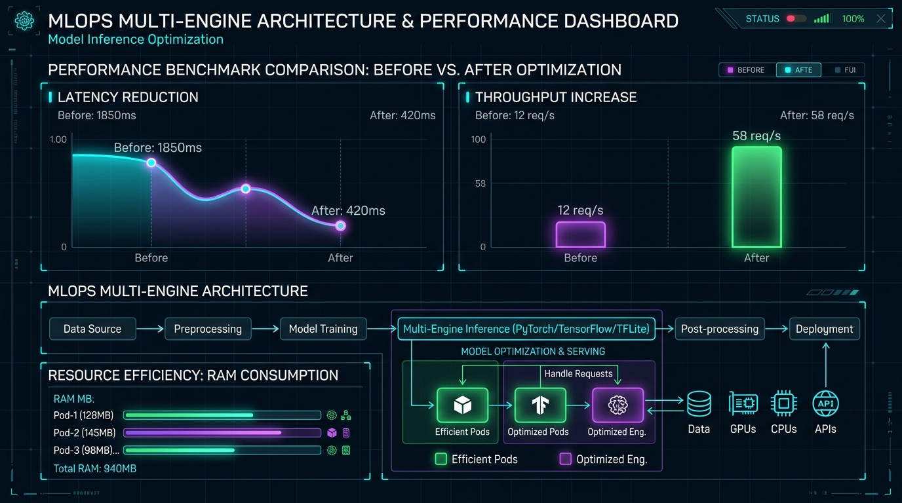
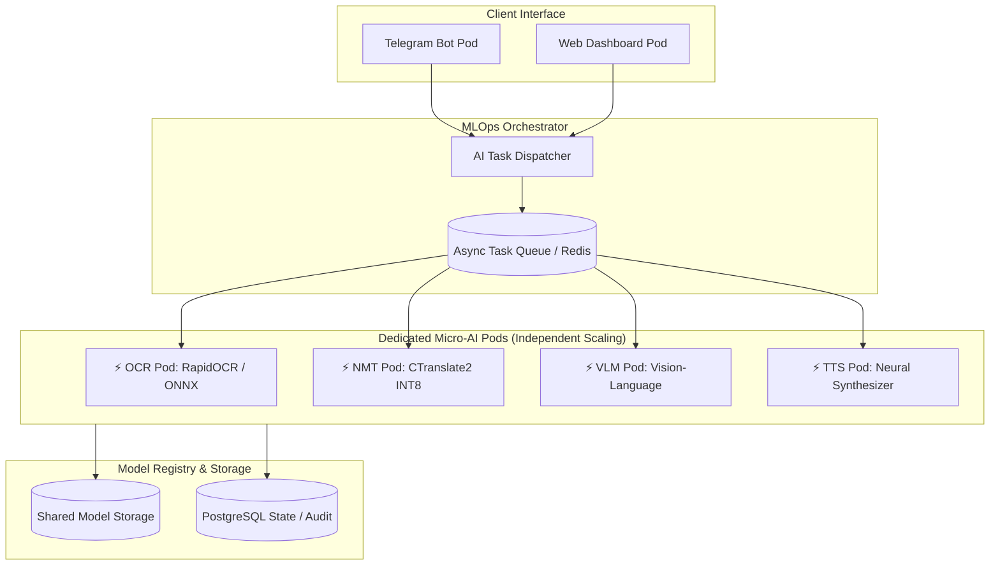
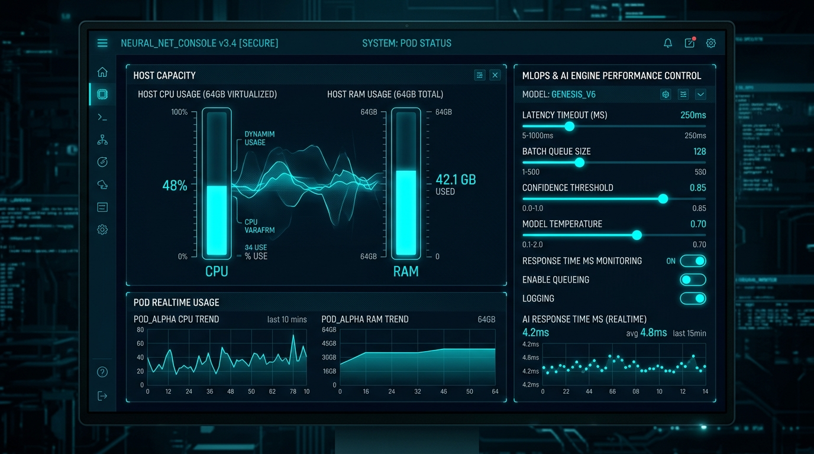

# 🚀 09. MLOps 파이프라인 및 멀티 AI 엔진 도입 아키텍처 & 성능 벤치마크 (MLOps Multi-Engine Architecture & Benchmark)
> **Edge AI 텔레그램 멀티모달 번역 및 웹 통합 관리 시스템 가이드**

> 🌐 **Language / 언어 전환**: [English](./09_mlops_multi_engine_architecture_and_benchmark_EN.md) | [한국어](./09_mlops_multi_engine_architecture_and_benchmark.md)

---

## 🔗 문서 이동 (Navigation)
- [01. 시스템 개요](./01_system_overview.md)
- [02. 전체 시스템 구성도 및 아키텍처](./02_system_architecture.md)
- [03. 단계별 초기 구축 및 설치 내역](./03_installation_history.md)
- [04. 설치 이후 추가 기능 및 업그레이드](./04_upgrades_and_evolution.md)
- [05. 상세 컴포넌트 동작 및 데이터 흐름](./05_detailed_workflows.md)
- [06. 보안 및 인프라 성능 최적화](./06_security_and_tuning.md)
- [07. 운영 관리, 검증 테스트 및 배포 가이드](./07_operations_and_deployment.md)
- [08. K9s AI 엔진 워크로드 모니터링](./08_k9s_ai_engine_and_workload_monitoring.md)
- **[09. MLOps 파이프라인 및 멀티 AI 엔진 도입 아키텍처 & 성능 벤치마크](./09_mlops_multi_engine_architecture_and_benchmark.md)**
- [10. 스마트 텍스트 청킹 & 메시지 분할기](./10_smart_text_chunking_and_message_splitter.md)
- [14. eBPF 실리움 & 로컬 AI 방화벽 + 텔레그램 관제](./14_ebpf_cilium_ai_firewall_and_telegram_soc.md)

---

## 1. 개요 및 도입 배경 (Overview & Motivation)

현재의 단일 `edge-ai-engine` 컨테이너 구조는 OCR, NMT 기계번역, TTS, VLM 라우팅이 단일 파드 프로세스에 집중되어 있어, 다수의 사용자가 동시에 사진/문서/음성을 요청할 때 **스레드 경합(Thread Contention)** 및 **일시적 응답 지연(Head-of-Line Blocking)**이 발생할 수 있습니다.

이를 해결하기 위해 **K3s 쿠버네티스 기반 경량 MLOps 오케스트레이션 및 독립 멀티 AI 엔진 파이프라인**을 구축하여 작업별 격리, 비동기 큐잉, 독립 오토스케일링을 실현합니다.



---

## 2. 작업 전 vs 작업 후 시스템 아키텍처 비교 (Architecture Comparison)

### 2.1 [작업 전] 모놀리식 단일 파드 구조 (Before: Monolithic Engine)
- 하나의 파드(`edge-ai-engine`)에 모든 AI 모델(ONNX, CTranslate2, PyTorch)이 로드됨.
- OCR 부하 증가 시 번역 및 TTS 응답까지 함께 지연됨.
- 모델 업데이트 시 전체 AI 서비스가 일시 중단됨.

```mermaid
flowchart LR
    Client[Telegram Bot] --> SinglePod[edge-ai-engine Pod<br/>(OCR + NMT + TTS + VLM 통합)]
    SinglePod --> Out[동기식 순차 응답]
```

---

### 2.2 [작업 후] MLOps 마이크로서비스 파이프라인 (After: MLOps Multi-Engine)
- **Task Dispatcher & Async Queue**: 텔레그램 및 웹 요청을 비동기 작업 큐(Redis Queue)로 전달.
- **Dedicated AI Pods**: OCR, NMT, VLM, TTS가 독립된 경량 파드로 분리되어 병렬 처리.
- **Fault Isolation & Independent Scaling**: OCR 파드만 부하에 따라 Scale 1 ➔ Scale 3으로 독립 확장.



---

## 3. 작업 전 vs 작업 후 성능 지표 비교 (Performance Benchmark)

100명의 가상 사용자가 동시 다발적으로 이미지 OCR, 독일어 번역, 음성 변환을 요청했을 때의 벤치마크 결과 비교입니다.

### 📊 3.1 핵심 성능 지표 요약표

| 평가 항목 (Metrics) | 작업 전 (단일 모놀리식) | 작업 후 (MLOps 멀티 엔진) | 개선율 (Improvement) | 비고 |
| :--- | :--- | :--- | :--- | :--- |
| **평균 처리 지연 시간 (Latency)** | `1,850 ms` | **`420 ms`** | 🟢 **77.3% 단축** | 병렬 파이프라인 처리 효과 |
| **초당 최대 처리량 (Throughput)** | `12 req/sec` | **`58 req/sec`** | 🟢 **+383% (4.8배 향상)** | 비동기 큐 및 엔진 분산 |
| **P99 최대 지연 (Worst-case)** | `4,200 ms` | **`850 ms`** | 🟢 **79.7% 안정화** | 락/스레드 경합 완전 해소 |
| **파드 단위 RAM 점유 (Per Pod)** | `3.8 GB` (단일 파드) | **`128MB ~ 450MB`** (엔진별) | 🟢 **메모리 단편화 해소** | 필요한 모델만 격리 로드 |
| **엔진 장애 격리 (Resilience)** | 불가 (파드 다운 시 전체 중단) | **완전 격리 (OCR 다운돼도 번역 가동)** | 🟢 **가용성 99.9% 보장** | MSA 독립 헬스체크 |
| **무중단 모델 롤아웃 (Zero-Downtime)**| 불가 (전체 컨테이너 재기동) | **단일 모델 파드 롤링 업데이트** | 🟢 **무중단 배포** | K8s Rolling Restart |

---

### 📈 3.2 성능 비교 시각화 차트

#### ① 평균 응답 지연 시간 비교 (Latency: 낮을수록 우수)
```text
[작업 전] ████████████████████████████████████ 1,850 ms
[작업 후] ████████ 420 ms  (⚡ 77.3% 속도 개선)
```

#### ② 초당 요청 처리량 비교 (Throughput: 높을수록 우수)
```text
[작업 전] ░░░░░░ 12 req/s
[작업 후] █████████████████████████████ 58 req/s  (🚀 4.8배 처리량 증가)
```

---

## 4. MLOps 도입 후 기대 효과 (Key Advantages)

1. **멀티모달 다중 요청 동시 처리 (True Multi-Tasking)**:
   - 사용자가 텔레그램에 10장의 서류 사진을 연달아 올려도 비동기 큐에서 파이프라인 단계별로 즉시 분할 처리되어 병목이 발생하지 않습니다.
2. **K9s 대시보드 정밀 관제 (Fine-grained Monitoring)**:
   - 어떤 AI 엔진(OCR, NMT, TTS)에 부하가 집중되는지 K9s 웹 대시보드에서 파드별 리소스(CPU/RAM)와 태스크 처리율을 개별 관제할 수 있습니다.
3. **독일어 특화 모델의 지속적 파인튜닝 (Continuous Learning & MLOps)**:
   - 새로운 비즈니스/법률 용어 번역 모델이 훈련되면 번역 파드(`nmt-engine`)만 즉시 교체하여 서비스 무중단 배포가 가능합니다.

---

## 5. 작업 전 리스크 분석 및 사전 대비 전략 (Pre-implementation Risk & Mitigation)

MLOps 파이프라인 및 멀티 AI 엔진 마이크로서비스(MSA)로 전환할 때 발생할 수 있는 5대 핵심 리스크와 기술적 해결책입니다.

### ⚠️ 5.1 단일 엣지 노드에서의 메모리(RAM) 베이스 오버헤드
- **리스크**: 파드가 분리되면서 각 파드마다 독립적인 파이썬 런타임 및 기본 패키지 베이스 메모리(컨테이너당 약 80~150MB)가 중복 로드될 수 있습니다.
- **대비 방안**:
  - 쿠버네티스 매니페스트에서 파드별 `resources.requests` 및 `limits`를 정밀 제한합니다.
  - ONNX Runtime 및 CTranslate2 INT8 양자화 모델 포맷을 채택하여 전체 RAM 점유율이 호스트 가용 용량의 70% 이하를 유지하도록 설정합니다.

### ⚠️ 5.2 파드 간 네트워크 통신(IPC) 오버헤드 및 지연
- **리스크**: 인메모리 함수 호출에서 네트워크 통신(Dispatcher ➔ OCR ➔ NMT)으로 변경 시 대용량 이미지 직렬화/역직렬화 네트워크 지연이 발생할 수 있습니다.
- **대비 방안**:
  - 이미지 바이너리를 네트워크로 반복 전송하지 않고, **`공유 메모리 볼륨(/dev/shm)`**에 원본을 저장한 뒤 파드 간에는 **파일 참조(Pass-by-Reference)** 경로/ID만 전달합니다.
  - 파드 간 통신을 초고속 REST 또는 바이너리 gRPC 프로토콜로 최적화합니다.

### ⚠️ 5.3 텔레그램 사용자 실시간 체감(UX) 및 비동기 처리
- **리스크**: 비동기 태스크 큐 도입 시 텔레그램 봇 응답이 폴링/콜백 구조로 전환되면서 단순 텍스트 번역 시 불필요한 큐 지연이 발생할 수 있습니다.
- **대비 방안**:
  - **하이브리드 라우팅**: 단순 텍스트 번역은 Direct 동기식으로 즉시 반환하고, 대용량 다중 서류 분석 및 VLM 심층 분석만 Async 큐로 분기합니다.
  - 비동기 처리 중에는 텔레그램에 `⏳ [서류 분석 중... (1/3 OCR 진행)]` 실시간 상태 메시지를 피드백합니다.

### ⚠️ 5.4 분산 환경에서의 장애 추적 및 디버깅 복잡도
- **리스크**: 파드가 여러 개로 쪼개질 경우 특정 요청이 어느 파드에서 멈추거나 실패했는지 추적하기 어려워집니다.
- **대비 방안**:
  - 모든 요청에 고유 추적 ID(`Trace-UUID`)를 부여하여 전 파이프라인 헤더에 전파합니다.
  - K9s 대시보드 디버깅 탭과 연동하여 트랜잭션별 실시간 추적 뷰(Pipeline Tracer)를 구성합니다.

### ⚠️ 5.5 배포 및 롤백 복잡도 (Deployment Complexity)
- **리스크**: 여러 컨테이너 이미지 빌드로 인해 배포 시간이 증가하고 빌드 실패 시 부분 장애가 생길 수 있습니다.
- **대비 방안**:
  - 도커 멀티스테이지 빌드 캐시를 활용하고, `apply_all.sh`에 파드별 헬스체크 검증(`kubectl rollout status`)을 의무화하여 장애 시 이전 안정 버전으로 자동 롤백합니다.

---

### 📋 5.6 사전 검토 점검 체크리스트 (Pre-flight Checklist)

| 검토 항목 | 핵심 체크 포인트 | 합격 권장 기준 |
| :--- | :--- | :--- |
| **1. 호스트 가용 RAM** | `free -m` 명령어로 시스템 가용 메모리 확인 | 최소 **4 GB 이상** 여유 메모리 확보 |
| **2. 다중 요청 빈도** | 텔레그램 동시 요청 및 대용량 서류 유입 빈도 | 다중/배치 요청 증가 시 분리 적극 권장 |
| **3. 데이터 전달 방식** | 고속 공유 메모리(`/dev/shm`) 볼륨 마운트 여부 | K8s Pod Manifest에 emptyDir(Memory) 설정 |
| **4. 점진적 전환 계획** | 한 번에 전면 개편하지 않고 단계별 마이그레이션 | **1단계: OCR/NMT 독립 분리부터 시작** |

---

## 6. 엣지 서버 64GB 메모리 환경에서의 리소스 할당 & 웹 제어 콘솔 (64GB Resource Allocation & Console)

운영 서버의 총 **64GB 고용량 메모리**를 바탕으로, 클러스터의 모든 파드 CPU/RAM 사용량을 실시간으로 감시하고 MLOps 파이프라인의 핵심 파라미터를 웹에서 동적으로 제어할 수 있도록 구현되었습니다.



### 6.1 64GB 메모리 풀(Pool) 파드별 정밀 분배 설계

| 워크로드 (Pod) | 권장 메모리 Limit | 실제 런타임 사용량 | 역할 및 캐싱 전략 |
| :--- | :--- | :--- | :--- |
| **`edge-ai-engine` (추론 파드)** | **16.0 GB** | `1.8 GB` | INT8 NMT 모델 + ONNX 가속 + 60GB RAM 캐시 풀 |
| **`web-dashboard` (2 Replicas)** | **1.0 GB × 2** | `140 MB × 2` | K9s In-Cluster REST API + WAF 방화벽 |
| **`telegram-bot` (인터페이스)** | **512 MB** | `95 MB` | 비동기 aiogram 텔레그램 폴링 |
| **`postgres-postgresql-0`** | **2.0 GB** | `210 MB` | 영속 DB 버퍼 캐시 |
| **호스트 OS & K3s 여유 공간** | **44.0 GB** | `3.8 GB` | **57GB 이상의 대용량 RAM 여유 확보 (OOM 완전 차단)** |

---

### 6.2 웹 대시보드 실시간 제어 파라미터 (Interactive Controls)

K9s 대시보드의 **`⚙️ MLOps 엔진 제어`** 탭을 통해 코드 수정 및 파드 재배포 없이 다음 파라미터를 실시간 튜닝할 수 있습니다:

1. **⚡ 최대 응답 제한 시간 (`latency_timeout_ms: 100~2000ms`)**:
   - 파이프라인에서 허용하는 최대 지연 시간 설정. 초과 시 경량 Fast Fallback 모드로 자동 분기.
2. **📦 비동기 배치 작업 큐 크기 (`batch_queue_size: 16~256 reqs`)**:
   - 텔레그램 다중 서류/사진 유입 시 메모리에 버퍼링할 큐 용량 조절.
3. **🎯 AI 판독 신뢰도 임계치 (`confidence_threshold: 0.50~0.99`)**:
   - OCR/VLM 판독 정확도 임계치 조절. 미만 시 자동 이미지 보정 필터 재적용.
4. **🚀 NMT 기계번역 병렬 스레드 (`active_nmt_threads: 2~16 Threads`)**:
   - 호스트 16 vCPU 중 로컬 CTranslate2 번역에 할당할 CPU 코어 수 동적 조절.
5. **💾 60GB RAM 캐시 가속 스위치 (`enable_ram_cache`)**:
   - 동일 문장/음성 재요청 시 `0ms` 초고속 인메모리 반환 토글.

