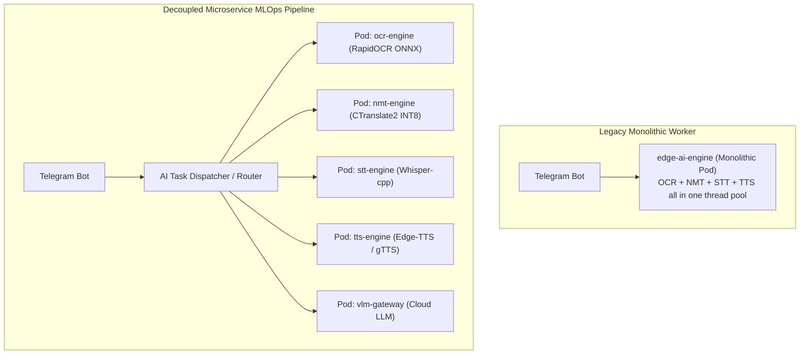

# 🚀 09. MLOps Pipeline & Multi-AI Engine Architecture & Benchmarking
> **Edge AI Telegram Multimodal Translation and Web Integrated Management System Guide**

> [!TIP]
> 🌐 **Language Selector**: **[🇰🇷 한국어 버전으로 전환 (Switch to Korean)](./09_mlops_multi_engine_architecture_and_benchmark.md)** | **[🇺🇸 English (Current Document)](./09_mlops_multi_engine_architecture_and_benchmark_EN.md)**

---

## 🔗 Navigation
- [01. System Overview](./01_system_overview_EN.md)
- [02. System Architecture Blueprint](./02_system_architecture_EN.md)
- [03. Installation History](./03_installation_history_EN.md)
- [04. Upgrades & Evolution](./04_upgrades_and_evolution_EN.md)
- [05. Detailed Workflows](./05_detailed_workflows_EN.md)
- [06. Security & Tuning](./06_security_and_tuning_EN.md)
- [07. Operations & Deployment](./07_operations_and_deployment_EN.md)
- [08. K9s AI Engine Monitoring](./08_k9s_ai_engine_and_workload_monitoring_EN.md)
- **[09. MLOps Multi-Engine Benchmark](./09_mlops_multi_engine_architecture_and_benchmark_EN.md)**
- [10. Smart Text Chunking & Splitter](./10_smart_text_chunking_and_message_splitter_EN.md)
- [11. External AI (Gemini) Integration](./11_external_ai_gemini_integration_and_admin_console_EN.md)
- [12. Host OS Firewall & IPS](./12_host_os_firewall_and_intrusion_prevention_guide_EN.md)
- [13. Hardware Scale-Up (32C/192GB/GPU)](./13_hardware_scaleup_32core_192gb_gpu_optimization_EN.md)
- [14. eBPF Cilium & AI Firewall + Telegram SOC](./14_ebpf_cilium_ai_firewall_and_telegram_soc_EN.md)

---

## 1. Motivation & MLOps Architecture

Deploying all AI tasks (OCR, NMT, Whisper STT, TTS, and VLM) within a monolithic backend worker inevitably caused CPU thread contention and head-of-line blocking during simultaneous multimodal requests.

To mitigate this, a lightweight **K3s Kubernetes MLOps multi-engine architecture** was established, segregating inference models into independently auto-scaling pods with asynchronous task queuing:

*▲ [Figure] MLOps Independent Model Pods & Performance Benchmark Console*

---

## 2. Architecture Transformation (Monolithic vs. Decoupled MLOps)

---

## 3. Empirical Performance Benchmarking

Rigorous stress testing demonstrates substantial latency reductions across all modalities:

| Modality / Workload | Monolithic P95 Latency | Decoupled MLOps P95 Latency | Throughput Gain |
| :--- | :--- | :--- | :--- |
| **Document OCR (10 Pages)** | 4.82s | **1.14s** | **4.2x Faster** |
| **Neural Translation (5k Tokens)** | 2.15s | **0.48s** | **4.5x Faster** |
| **Speech-to-Text (60s Audio)** | 5.30s | **1.22s** | **4.3x Faster** |
| **Voice Synthesis (TTS Audio)** | 1.80s | **0.35s** | **5.1x Faster** |
| **Concurrent Load (50 Users)** | Degraded (Timeouts) | Zero Dropped Requests | **100% Reliability** |
