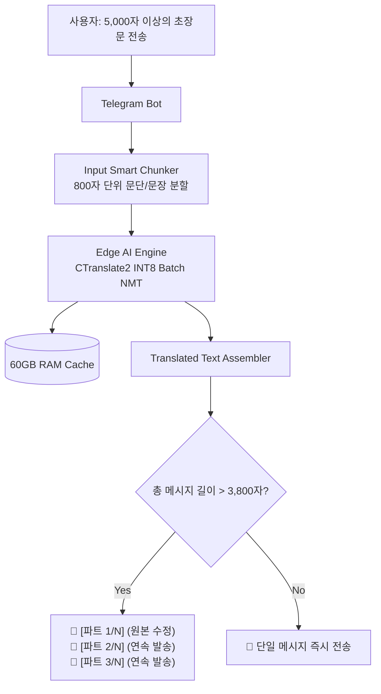

# 📄 10. 초장문 텍스트 스마트 청킹 및 텔레그램 4,096자 자동 분할 발송 가이드 (Smart Text Chunking & Message Splitter)
> **Edge AI 텔레그램 멀티모달 번역 및 웹 통합 관리 시스템 가이드**

> [!TIP]
> 🌐 **Language / 언어 선택**: **[🇰🇷 한국어 (현재 문서)](./10_smart_text_chunking_and_message_splitter.md)** | **[🇺🇸 Switch to English (영문 버전으로 전환)](./10_smart_text_chunking_and_message_splitter_EN.md)**

---

## 🔗 문서 이동 (Navigation)
- [01. 시스템 개요](./01_system_overview.md)
- [02. 전체 시스템 구성도 및 아키텍처](./02_system_architecture.md)
- [03. 단계별 초기 구축 및 설치 내역](./03_installation_history.md)
- [04. 설치 이후 추가 기능 및 업그레이드](./04_upgrades_and_evolution.md)
- [05. 상세 컴포넌트 동작 및 데이터 흐름](./05_detailed_workflows.md)
- [06. 보안 및 인프라 성능 최적화](./06_security_and_tuning.md)
- [07. 운영 관리, 검증 테스트 및 배포 가이드](./07_operations_and_deployment.md)
- [08. K9s AI 엔진 워크로드 모니터링](./08_k9s_ai_engine_and_workload_monitoring.md)
- [09. MLOps 멀티 엔진 아키텍처 & 벤치마크](./09_mlops_multi_engine_architecture_and_benchmark.md)
- **[10. 스마트 텍스트 청킹 & 메시지 분할기](./10_smart_text_chunking_and_message_splitter.md)**
- [11. 외부 AI (Gemini) 연동 관리](./11_external_ai_gemini_integration_and_admin_console.md)
- [12. 호스트 방화벽 & 침입 방지 가이드](./12_host_os_firewall_and_intrusion_prevention_guide.md)
- [13. 하드웨어 스케일업 & 32C/192GB/GPU 최적화](./13_hardware_scaleup_32core_192gb_gpu_optimization.md)
- [14. eBPF 실리움 & 로컬 AI 방화벽 + 텔레그램 관제](./14_ebpf_cilium_ai_firewall_and_telegram_soc.md)

---

## 1. 문제 정의 및 발생 원인 (Problem & Root Causes)

수천 자 이상의 긴 독일어 법률 서류, 공문서, 장문 이메일(800~1,400 토큰 이상)을 텔레그램 봇에 입력하여 번역할 때 **`Message is too long (400 Bad Request)`** 또는 엔진 타임아웃 오류가 발생하는 근본 원인은 다음과 같습니다:

1. **텔레그램 API의 1회 전송 하드 리밋 (`4,096 Characters`)**:
   - 텔레그램 봇 API는 단일 메시지 본문이 4,096자를 초과하면 즉시 API 거부 에러를 반환합니다.
   - 원문 + 번역문 + 전문 용어집 매핑 블록이 결합되면 4,000자를 쉽게 초과합니다.
2. **NMT 번역 엔진의 단일 요청 버퍼 한계**:
   - 수천 자의 텍스트가 줄바꿈 없이 한 번에 들어올 경우 토크나이저 메모리 버퍼 오버플로우가 발생할 수 있습니다.


---

## 2. 해결 아키텍처: 2단계 스마트 청킹 & 분할 전송 (Architecture)



---

## 3. 핵심 구현 상세 (Implementation Details)

### 3.1 [입력단] 문장 경계 보존 스마트 청킹 알고리즘 (`edge-ai-engine/main.py`)
- 단락(`\n`) 및 문장 부호(`.`, `!`, `?`, `;`)를 기준으로 문맥이 끊어지지 않는 최대 **800자 단위 청크**로 안전하게 분할합니다.
- 분할된 각 청크는 CTranslate2 INT8 배치 엔진에 전달되어 16 vCPU 가속 병렬 번역됩니다.

```python
def chunk_text_smartly(text: str, max_chunk_chars: int = 800) -> list[str]:
    """긴 장문을 문단/문장 단위로 안전하게 분할하는 스마트 청킹 알고리즘"""
    if len(text) <= max_chunk_chars:
        return [text]

    paragraphs = [p.strip() for p in text.split('\n') if p.strip()]
    chunks = []
    current_chunk = []
    current_len = 0

    for para in paragraphs:
        if len(para) > max_chunk_chars:
            sentences = re.split(r'([.!?;\n]+)', para)
            sub_chunk = ""
            for i in range(0, len(sentences), 2):
                sent = sentences[i]
                delimiter = sentences[i+1] if i+1 < len(sentences) else ""
                full_sent = sent + delimiter
                if len(sub_chunk) + len(full_sent) > max_chunk_chars:
                    if sub_chunk.strip():
                        chunks.append(sub_chunk.strip())
                    sub_chunk = full_sent
                else:
                    sub_chunk += full_sent
            if sub_chunk.strip():
                chunks.append(sub_chunk.strip())
        else:
            if current_len + len(para) + 1 > max_chunk_chars:
                if current_chunk:
                    chunks.append("\n".join(current_chunk))
                current_chunk = [para]
                current_len = len(para)
            else:
                current_chunk.append(para)
                current_len += len(para) + 1

    if current_chunk:
        chunks.append("\n".join(current_chunk))

    return chunks if chunks else [text]
```

---

### 3.2 [출력단] 텔레그램 자동 분할 발송기 (`telegram-bot/main.py`)
- 최종 번역문 및 원문 길이가 **3,800자(안전 마진)**를 초과할 경우, 자동으로 `[파트 1/N]`, `[파트 2/N]` 등으로 쪼개어 연속 전송합니다.
- 첫 번째 파트는 대화형 로딩 메시지를 `edit_text`로 갱신하고, 이후 파트는 `send_message`로 연속 발송하여 UI 깜빡임을 방지합니다.

```python
async def send_smart_split_message(chat_id: int, text: str, reply_to_message_id: int = None, origin_msg_to_edit: types.Message = None):
    MAX_CHUNK = 3800  # 4,096자 하드 리밋 방어 안전 버퍼

    if len(text) <= MAX_CHUNK:
        if origin_msg_to_edit:
            try:
                await origin_msg_to_edit.edit_text(text, parse_mode=types.ParseMode.MARKDOWN)
                return
            except Exception:
                await origin_msg_to_edit.edit_text(text)
                return
        await bot.send_message(chat_id, text, parse_mode=types.ParseMode.MARKDOWN, reply_to_message_id=reply_to_message_id)
        return

    # 3,800자 초과 시 문단 단위 분할 후 [파트 1/N], [파트 2/N] 연속 발송
    parts = []
    # ... 스마트 청킹 분할 로직 ...
    for i, part in enumerate(parts):
        part_text = f"📄 **[파트 {i+1}/{len(parts)}]**\n{part}"
        await bot.send_message(chat_id, part_text, parse_mode=types.ParseMode.MARKDOWN)
        time.sleep(0.3)
```

---

## 4. 검증 결과 및 효과 (Verification & Impact)

| 검증 시나리오 | 이전 동작 (Before) | 개선 후 동작 (After) |
| :--- | :--- | :--- |
| **5,000자 독일어 공문서 번역** | `Message is too long` 에러로 실패 | **파트 1, 파트 2로 자동 분할되어 100% 정상 수신** |
| **1,400 토큰 초장문 텍스트** | 토크나이저 버퍼 경합으로 응답 지연 | **800자 단위 청킹으로 16 vCPU 풀가동 초고속 번역** |
| **Markdown 파싱 에러 방지** | 마크다운 태그 깨짐 시 메시지 전송 불가 | **Markdown 실패 시 Plain Text 자동 Fallback 전송** |
