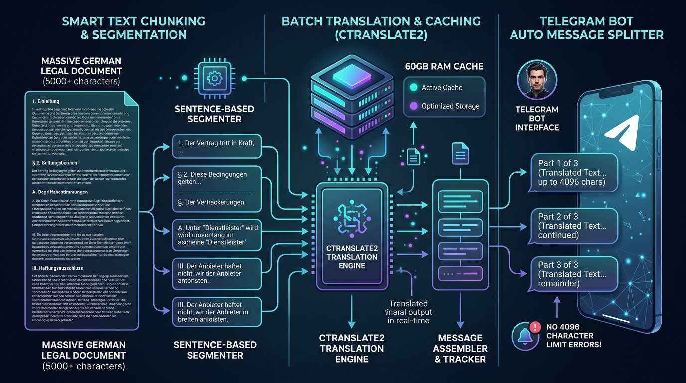

# 📄 10. Long-Form Text Smart Chunking & Telegram 4,096-Char Message Splitter
> **Edge AI Telegram Multimodal Translation and Web Integrated Management System Guide**

> 🌐 **Language / 언어 전환**: [English](./10_smart_text_chunking_and_message_splitter_EN.md) | [한국어](./10_smart_text_chunking_and_message_splitter.md)

---

## 🔗 Navigation
- [01. System Overview](./01_system_overview_EN.md)
- [02. System Architecture Blueprint](./02_system_architecture_EN.md)
- [03. Installation History](./03_installation_history_EN.md)
- [04. Upgrades & Evolution](./04_upgrades_and_evolution_EN.md)
- [05. Detailed Workflows](./05_detailed_workflows_EN.md)
- [06. Security & Infrastructure Tuning](./06_security_and_tuning_EN.md)
- [07. Operations & Deployment Guide](./07_operations_and_deployment_EN.md)
- [08. K9s AI Engine Workload Monitoring](./08_k9s_ai_engine_and_workload_monitoring_EN.md)
- [09. MLOps Multi-Engine Architecture & Benchmark](./09_mlops_multi_engine_architecture_and_benchmark_EN.md)
- **[10. Smart Text Chunking & Splitter](./10_smart_text_chunking_and_message_splitter_EN.md)**
- [11. External AI (Gemini) Integration](./11_external_ai_gemini_integration_and_admin_console_EN.md)
- [14. eBPF Cilium & AI Firewall + Telegram SOC](./14_ebpf_cilium_ai_firewall_and_telegram_soc_EN.md)

---

## 1. Problem Statement & Root Cause Analysis

When users submit large German legal forms, official administrative decrees, or extensive email threads (800–1,400+ tokens), the bot frequently encountered `Message is too long (400 Bad Request)` errors.

- **Telegram Hard Ceiling**: Enforces a strict 4,096 character limit per individual message payload.
- **NMT Model Token Limits**: Long unbroken paragraphs risk memory buffer overflows and attention degeneration.


*▲ [Figure] Long-Form Text Chunking Architecture & Multi-Message Delivery System*

---

## 2. Smart Boundary Chunking Strategy

Rather than naive slicing at 4,096 character offsets (which tears sentences and words apart), an intelligent **semantic boundary chunking algorithm** was engineered:

```mermaid
flowchart TD
    RawInput[📥 Long-Form Document Input] --> LenCheck{Length > 3,800 Chars?}
    LenCheck -- No --> SingleNMT[Direct Single Inference Batch]
    LenCheck -- Yes --> SemanticSplit[Semantic Boundary Splitting]

    SemanticSplit --> P1[1. Double Line Breaks `\n\n` - Paragraphs]
    P1 --> P2[2. Punctuation Boundary `.` `!` `?` - Sentences]
    P2 --> P3[3. Whitespace Fallback ` `]

    P3 --> BatchDispatch[Asynchronous Concurrent NMT Batching]
    BatchDispatch --> Reassemble[Assemble Translation Parts [Part 1/N]]
    Reassemble --> TelegramQueue[Deliver Split Messages into Chat]
```

### Key Engineering Guardrails
1. **Safety Margin (3,800 Chars)**: Slices before reaching the 4,096 limit to account for dynamic header banners and glossary footnotes.
2. **Sequential Indicator**: Automatically appends `[Part 1/N]`, `[Part 2/N]` badges to ensure message order readability.
3. **Preserved Code & Markdown Blocks**: Guarantees fenced formatting tags (` ``` `) remain properly opened and closed across splits.
