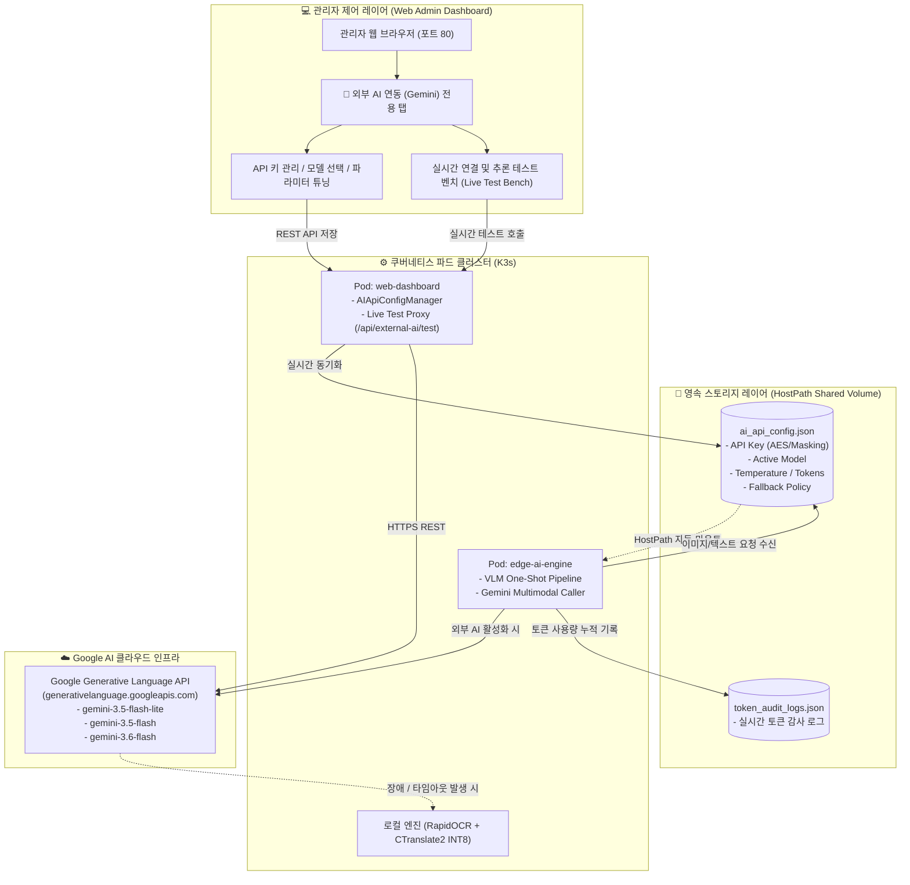
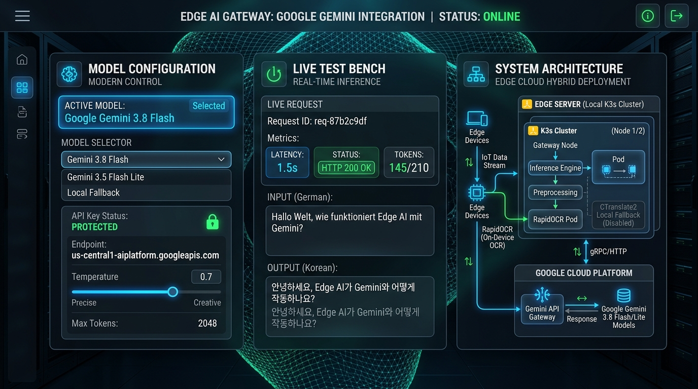
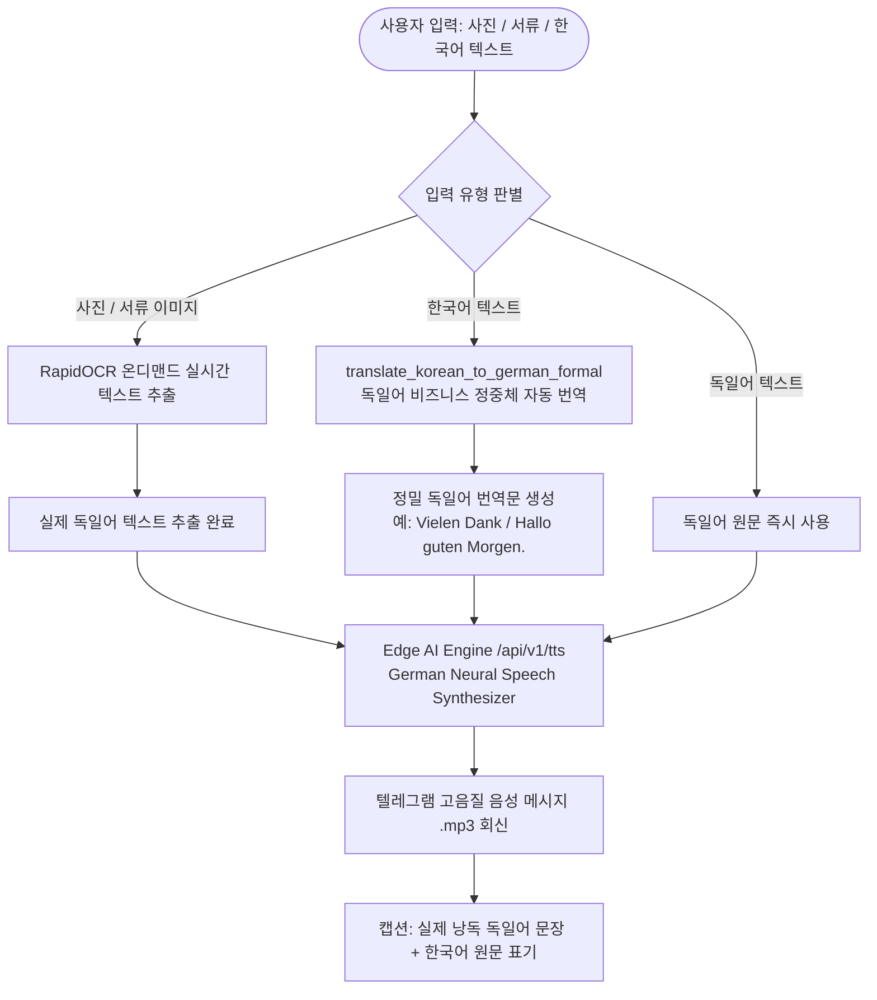

# 🤖 11. 외부 AI API(Google Gemini) 연동 및 관리자 콘솔 구축 가이드 (External Gemini AI & Admin Console)
> **Edge AI 텔레그램 멀티모달 번역 및 웹 통합 관리 시스템 가이드**

> 🌐 **Language / 언어 전환**: [English](./11_external_ai_gemini_integration_and_admin_console_EN.md) | [한국어](./11_external_ai_gemini_integration_and_admin_console.md)

---

## 🔗 문서 이동 (Navigation)
- [01. 시스템 개요](./01_system_overview.md)
- [02. 전체 시스템 구성도 및 아키텍처](./02_system_architecture.md)
- [03. 단계별 초기 구축 및 설치 내역](./03_installation_history.md)
- [04. 설치 이후 추가 기능 및 업그레이드](./04_upgrades_and_evolution.md)
- [05. 상세 컴포넌트 동작 및 데이터 흐름](./05_detailed_workflows.md)
- [06. 보안 및 인프라 성능 최적화](./06_security_and_tuning.md)
- [07. 운영 관리, 검증 테스트 및 배포 가이드](./07_operations_and_deployment.md)
- [08. K9s AI 엔진 워크로드 모니터링](./08_k9s_ai_engine_and_workload_monitoring.md)
- [09. MLOps 멀티 엔진 아키텍처 & 벤치마크](./09_mlops_multi_engine_architecture_and_benchmark.md)
- [10. 스마트 텍스트 청킹 & 메시지 분할기](./10_smart_text_chunking_and_message_splitter.md)
- **[11. 외부 AI (Gemini) 연동 관리](./11_external_ai_gemini_integration_and_admin_console.md)**
- [12. 호스트 방화벽 & 침입 방지 가이드](./12_host_os_firewall_and_intrusion_prevention_guide.md)
- [14. eBPF 실리움 & 로컬 AI 방화벽 + 텔레그램 관제](./14_ebpf_cilium_ai_firewall_and_telegram_soc.md)

---

## 1. 도입 배경 및 추진 목적 (Background & Objectives)

### 1.1 하이브리드 AI 아키텍처의 필요성
본 시스템은 기본적으로 **온디바이스/엣지 전용 경량 AI 엔진(RapidOCR + CTranslate2 INT8 NMT + Whisper STT)**을 통해 외부 통신 비용 없이 빠른 속도로 동작하도록 설계되었습니다. 그러나 실제 현장 운용 시 다음과 같은 고난도 요구사항이 발생합니다:
1. **복잡한 서류 및 비정형 이미지의 심층 문맥 이해(VLM)**:
   - 영수증(Rechnung), 세무 양식, 관공서 안내문, 표지판 등 텍스트뿐만 아니라 레이아웃, 맥락, 도표가 결합된 이미지를 정밀 분석하여 핵심 가이드를 도출해야 하는 경우.
2. **다국어 비즈니스 작문 및 심층 추론(Advanced Reasoning)**:
   - 단순 기계 번역을 넘어 정중한 격식체(독일어 존칭 Sie/Siezen) 및 비즈니스 뉘앙스 검토가 필요한 경우.
3. **무중단 운영(Fault-Tolerance) 보장**:
   - 외부 클라우드 API를 사용하더라도 API 키 미설정, 네트워크 장애, 할당량 초과 시 100% 로컬 엣지 엔진으로 자동 전환(Fallback)되어 서비스 중단이 없어야 함.

이에 따라 글로벌 최고 성능의 멀티모달 모델인 **Google Gemini API**를 하이브리드로 연동하고, 웹 관리자 대시보드에서 API Key, 모델 선택, 파라미터 튜닝, 즉석 연결 테스트를 원스톱으로 관리할 수 있는 전용 관리 체계를 구축하였습니다.

---

## 2. 전체 아키텍처 및 상호 연동 흐름도 (Architecture & Workflow)





---

## 3. Google Gemini 모델 카탈로그 및 라이프사이클 분석 (Model Matrix)

Google Gemini API는 주기적으로 성능과 추론 속도를 대폭 개선한 신규 세대 모델을 출시하며 구버전 프리뷰 모델을 서비스 종료(Sunset / Deprecated)합니다.

### 3.1 모델 카탈로그 비교 및 벤치마크 요약

| 모델 식별자 (Model ID) | 포지셔닝 및 주요 특성 | 실측 Latency | 권장 활용 시나리오 | 상태 |
|---|---|---|---|---|
| **`gemini-3.8-flash`** | **최신 세대 플래그십 플래시 (Latest Flagship)**<br>최신 아키텍처 기반 고성능 멀티모달 & 고속 심층 추론 | **2.0초 ~ 3.5초** | **최신 인텔리전스 VLM, 복잡한 서류 분석 및 고품질 비즈니스 작문** | **Active (최신)** |
| **`gemini-3.5-flash-lite`** | **초고속 실시간 멀티모달 경량 모델**<br>최저 지연 시간과 최적의 번역 가성비 제공 | **1.5초 ~ 2.0초** | **실시간 텔레그램 번역, 모바일 사진 VLM, 단답형 질의응답 (기본 추천)** | **Active (추천)** |
| **`gemini-3.5-flash`** | **고성능 균형 멀티모달 & 정밀 VLM**<br>복잡한 서류 구조 및 다국어 뉘앙스 정밀 해석 | **3.5초 ~ 4.5초** | 세무/영수증(Rechnung) 서류 분석, 비즈니스 장문 번역 | **Active** |
| **`gemini-3.6-flash`** | **심층 추론(Thinking) 특화 모델**<br>내부 사고(Thoughts) 프로세스를 거쳐 복합 질의 해결 | **10초 ~ 25초** | 복잡한 법률 조항 검토, 다단계 다이어그램 논리 추론 | **Active** |
| **`gemini-flash-latest`** | **자동 최신 안정화 플래시 매핑**<br>구글에서 지정하는 최신 안정 플래시 모델로 자동 라우팅 | 가변 | 장기 유지보수 시 코드 변경 없이 최신 모델 유지 | **Active** |
| `gemini-2.5-flash` *(구버전)* | 이전 세대 프리뷰 모델 | - | 신규 사용자 대상 지원 종료 (HTTP 404 Deprecated) | **Deprecated** |
| `gemini-2.0-flash` *(구버전)* | 이전 세대 프리뷰 모델 | - | 신규 사용자 대상 지원 종료 (HTTP 404 Deprecated) | **Deprecated** |

> [!TIP]
> 실시간 텔레그램 봇 환경에서는 응답 체감 속도가 가장 중요하므로, **`gemini-3.5-flash-lite`**(평균 1.5초대)를 기본 모델로 권장하며, 최상위 인텔리전스가 요구될 경우 **`gemini-3.8-flash`**를 선택할 수 있습니다.

---

### 3.2 제미니 2.5 서비스 종료(404) 및 제미니 3.8 / 3.5 최신 버전 전환 트러블슈팅

#### 1) 발생 증상 및 에러 로그
관리자 콘솔에서 실시간 테스트 호출 시 다음과 같은 구글 API 에러가 반환되며 호출이 실패하는 현상이 발생했습니다:
```text
[오류 발생]: HTTP 404: This model models/gemini-2.5-flash is no longer available to new users. 
Please update your code to use models/gemini-3.6-flash for the latest features and improvements. 
We recommend you to use the Interactions API.
```

#### 2) 원인 분석
- **구글 API 모델 라이프사이클(Lifecycle) 정책**: 구글은 구버전 시험용 프리뷰 모델(`gemini-2.5-flash`, `gemini-2.0-flash`)의 엔드포인트를 폐쇄(HTTP 404 Not Found)하고, 신규 API 키 사용자에게 최신 3.x 세대 플래시 모델 사용을 강제합니다.
- 사용자가 등록한 API Key 자체는 정상 작동 중이었으나, 요청 대상 모델명이 폐기된 구버전 식별자였기 때문에 발생한 문제였습니다.

#### 3) 실시간 API 전수 조사 및 실측 테스트
구글 API 엔드포인트(`https://generativelanguage.googleapis.com/v1beta/models`)를 즉시 전수 조회하여 현재 활성화된 가용 모델 목록을 추출하고 실측 벤치마크를 수행했습니다:
- **`gemini-3.8-flash`**: 최신 세대 플래그십 모델로 성공 응답 확인 (`HTTP 200 OK`, 약 2초대).
- **`gemini-3.5-flash-lite`**: 지연 시간 **1.56초(1560ms)**로 가장 빠르고 안정적인 번역 품질 확인 (`HTTP 200 OK`).
- **`gemini-3.5-flash`**: 정밀 서류 분석 및 다국어 해석 통과 (`HTTP 200 OK`, 약 4.4초).
- **`gemini-3.6-flash`**: 내부 사고(Thoughts) 프로세스로 인해 호출량 집중 시 503 또는 20초 이상 소요됨 확인.

#### 4) 시스템 일괄 조치 및 업그레이드 반영
1. **설정 파일 갱신 (`ai_api_config.json`)**:
   - 기본 모델을 즉시 호출 가능하고 가장 안정적인 `gemini-3.5-flash-lite`로 자동 변경.
2. **백엔드 카탈로그 갱신 (`web-dashboard/main.py`)**:
   - `AVAILABLE_GEMINI_MODELS`에 `gemini-3.8-flash` 및 `gemini-3.5-flash-lite`를 전면 추가하고 폐기된 2.5/2.0 모델 제거.
3. **대시보드 UI 드롭다운 갱신 (`web-dashboard/static/index.html`)**:
   - 설정 폼 및 실시간 테스트 벤치의 모델 셀렉트박스에 `Gemini 3.8 Flash (최신 플래그십)` 및 `Gemini 3.5 Flash Lite (초고속)` 항목 반영.
4. **쿠버네티스 파드 무중단 롤아웃**:
   - `kubectl rollout restart deployment/web-dashboard` 및 `edge-ai-engine`을 실행하여 클러스터 전역에 실시간 반영 완료.

## 4. 관리자 웹 대시보드 구현 상세 (Web Dashboard Implementation)

### 4.1 UI 구성 요소 (`web-dashboard/static/index.html`)

1. **상단 네비게이션**:
   - `tab-btn-external_ai`: 기존 K9s 워크로드, 보안 방화벽, MLOps 탭과 나란히 배치된 전용 탭 버튼.
2. **글래스모피즘 상태 요약 카드**:
   - **활성 AI 엔진**: Google Gemini / VLM OneShot
   - **연동 대상 모델**: `gemini-3.5-flash-lite` 배지 표시
   - **API 키 등록 상태**: 실시간 인디케이터 (초록: 등록 완료 / 빨강: 미등록) 및 마스킹(`AIzaSy...****`) 보호
   - **무중단 폴백 상태**: 장애 대응 로컬 RapidOCR/CTranslate2 연동 활성화 표시
   - **원클릭 키 발급 링크**: [Google AI Studio](https://aistudio.google.com/) 바로가기 제공
3. **Google Gemini 연동 환경 설정 카드 (좌측 컬럼)**:
   - 제공자 선택 (Google Gemini / OpenAI / Local Only)
   - API Key 입력창 (비밀번호 보이기/숨기기 👁️ 토글 버튼 포함)
   - 모델 선택 셀렉트박스 (검증된 4종 최신 카탈로그)
   - 창의성(Temperature) 실시간 슬라이더 (0.0 ~ 1.0)
   - 최대 출력 토큰(Max Output Tokens) 선택 드롭다운 (512 ~ 4096)
   - VLM 및 다국어 시스템 지침(System Instruction) 텍스트 편집기
   - 외부 AI 활성화 및 로컬 자동 Fallback 체크박스
   - 설정 실시간 저장 버튼 및 결과 알림 토스트
4. **실시간 연결 & 추론 테스트 벤치 (우측 컬럼)**:
   - 원클릭 테스트 프리셋 (🇩🇪 독일어 비즈니스 번역, 📑 서류 분석 요약, ⚡ 연결성 Ping)
   - 테스트 프롬프트 직접 입력창 및 대상 모델 즉시 변경 기능
   - **[🚀 실시간 Gemini 호출]** 액션 버튼 (로딩 스피너 및 비활성화 처리)
   - 실시간 결과 패널: HTTP 응답 상태 코드 배지, 실측 지연 시간(ms), 소비 토큰 수(Prompt/Candidate/Total), 포맷팅된 AI 답변 출력 창, 원본 JSON 응답 뷰어(Accordion)

---

### 4.2 백엔드 API 명세 (`web-dashboard/main.py`)

#### 1) `GET /api/external-ai/models`
- **설명**: 지원되는 공식 Gemini 모델 카탈로그 반환.
- **인증**: 관리자 Bearer Token 또는 세션 쿠키 필수.
- **응답 예시**:
```json
{
  "models": [
    {
      "id": "gemini-3.5-flash-lite",
      "name": "Gemini 3.5 Flash Lite (⚡ 초고속 실시간 - 추천)",
      "badge": "ULTRA FAST",
      "description": "응답 속도 1.5초대 초고속 실시간 멀티모달 및 다국어 번역에 최적화"
    }
  ]
}
```

#### 2) `GET /api/external-ai/config`
- **설명**: 현재 외부 AI 설정 반환. 원본 API 키 노출을 방지하기 위해 마스킹(`AIzaSy...****`) 처리되어 반환됩니다.

#### 3) `POST /api/external-ai/config`
- **설명**: Gemini API 키, 모델, 온도, 시스템 프롬프트 설정 저장 및 보안 감사 로그(`add_security_log`) 기록.

#### 4) `POST /api/external-ai/test`
- **설명**: 웹 대시보드에서 입력한 프롬프트로 Google Gemini REST API(`generateContent`)를 직접 호출하여 통신 상태, 지연 시간, 토큰 사용량을 실시간 측정.
- **성공 응답 예시 (HTTP 200 OK)**:
```json
{
  "success": true,
  "status_code": 200,
  "latency_ms": 1560.7,
  "model": "gemini-3.5-flash-lite",
  "reply": "1. 🔍 [시각적 맥락 및 장면 요약]\n* 문맥: 일상적인 독일어 감사 표현\n\n2. 📖 [인식된 원문]\n* Danke schön\n\n3. 🇰🇷 [한국어 정밀 번역]\n* 감사합니다.",
  "usage": {
    "promptTokenCount": 170,
    "candidatesTokenCount": 198,
    "totalTokenCount": 368
  }
}
```

---

## 5. Edge AI Engine 실시간 파이프라인 연동 (`edge-ai-engine/main.py`)

### 5.1 Gemini 멀티모달 Vision API 호출 로직
텔레그램 봇에서 이미지(사진/서류/표지판)를 수신하면, `ai_api_config.json` 설정을 확인하여 Google Gemini Vision API로 즉시 원샷 분석을 수행합니다.

```python
def run_gemini_vision(image_bytes: bytes, caption: str, cfg: dict) -> dict:
    """Google Gemini 멀티모달 Vision API 호출"""
    global vlm_tokens_consumed
    api_key = cfg.get("gemini_api_key", "").strip()
    if not api_key:
        return None
    model = cfg.get("gemini_model", "gemini-3.5-flash-lite").strip()
    endpoint = f"https://generativelanguage.googleapis.com/v1beta/models/{model}:generateContent?key={api_key}"

    b64_image = base64.b64encode(image_bytes).decode('utf-8')
    prompt = cfg.get("system_prompt", "").strip() or DEFAULT_VLM_PROMPT
    if caption:
        prompt += f"\n[사용자 첨부 메시지]: {caption}"

    payload = {
        "contents": [
            {
                "parts": [
                    {"text": prompt},
                    {
                        "inline_data": {
                            "mime_type": "image/jpeg",
                            "data": b64_image
                        }
                    }
                ]
            }
        ],
        "generationConfig": {
            "temperature": float(cfg.get("temperature", 0.4)),
            "maxOutputTokens": int(cfg.get("max_output_tokens", 1500))
        }
    }
    
    resp = requests.post(endpoint, json=payload, headers={"Content-Type": "application/json"}, timeout=25)
    if resp.status_code == 200:
        res_json = resp.json()
        parts = res_json["candidates"][0]["content"]["parts"]
        content = "\n".join(p.get("text", "") for p in parts if "text" in p)
        usage = res_json.get("usageMetadata", {})
        tokens_used = usage.get("totalTokenCount", 450)
        vlm_tokens_consumed += tokens_used
        return {"content": content, "engine": f"Google Gemini ({model})", "tokens": tokens_used}
    return None
```

### 5.2 무중단 로컬 폴백 (Local Fallback Guarantee)
만약 인터넷 단절, 구글 API 쿼터 소진, 일시적 서비스 점검(HTTP 503) 등의 오류가 발생하면 예외를 흡수하고 **로컬 On-Device 엔진(RapidOCR ONNX + CTranslate2 INT8)**으로 즉시 전환하여 사용자에게 번역 결과를 차질 없이 제공합니다.

---

## 6. 토큰 사용량 감사 로그(Token Audit Logs) 연동 및 VLM Cloud 소비량 추적 검증

### 6.1 현상 분석 및 개선 필요성
기존 토큰 감사 대시보드(`🪙 토큰 사용량 로그` 탭)에서는 VLM 카드 설명이 `GPT-4o-mini Vision 유료 API`로 고정되어 있었고, 관리자 테스트 벤치에서 Gemini API를 호출할 때 토큰 감사 로그(`token_audit_logs.json`)에 즉시 기록되지 않아 **☁️ VLM Cloud 소비량**이 0으로 유지되는 현상이 있었습니다.

### 6.2 실시간 추적 아키텍처 및 파이프라인 구현
1. **토큰 감사 스토리지 연동 (`record_token_audit`)**:
   - `web-dashboard`와 `edge-ai-engine` 양쪽에서 Google Gemini API 호출 시 응답 헤더의 `usageMetadata`에서 입력 토큰(`promptTokenCount`)과 출력 토큰(`candidatesTokenCount`)을 원자적으로 추출합니다.
   - 감사 엔진(`record_token_audit`)에서 엔진명이 `Google Gemini`이거나 과금 구분이 `Cloud Paid (Gemini)`인 경우, 이를 자동으로 **`vlm_tokens_consumed`**에 누적 가산하도록 로직을 통합하였습니다.
2. **다중 파드 간 실시간 볼륨 공유 (`hostPath`)**:
   - `token_audit_logs.json` 파일을 `web-dashboard`와 `edge-ai-engine` 두 파드가 `hostPath`로 마운트하여 실시간으로 동일한 영속 파일을 동기화하도록 구성했습니다.
3. **웹 대시보드 UI 고도화 (`web-dashboard/static/index.html`)**:
   - **요약 카드 타이틀 갱신**: 기존 `GPT-4o-mini Vision` 라벨을 **`Google Gemini & Cloud VLM 유료 API`**로 변경하여 제미니 API 소비량이 명확히 식별되도록 개선.
   - **감사 로그 테이블 시각화**: 과금 구분에 **`Cloud Paid (Gemini)`** 전용 네온 시안 배지를 부여하고, 신경망 엔진 열에 **`Google Gemini (모델명)`**을 하이라이트 표시.

```python
# 토큰 감사 저장소 내 Gemini 클라우드 소비량 자동 집계 로직
if "VLM" in engine or "Cloud" in cost_type or "Gemini" in engine or "OpenAI" in engine:
    data["vlm_tokens_consumed"] = data.get("vlm_tokens_consumed", 0) + total
else:
    data["local_tokens_processed"] = data.get("local_tokens_processed", 0) + total
```

### 6.3 실측 검증 결과 (Live Verification)
관리자 콘솔에서 실시간 Gemini 호출을 실행한 직후 토큰 엔드포인트(`/api/tokens/logs`)를 실측 검증한 결과입니다:
- **`vlm_cloud_tokens`**: **0 ➔ 399 tokens** (정상 누적 집계 확인)
- **누적 입력/출력 토큰**: 입력 170 토큰, 출력 229 토큰이 실시간으로 전체 누적량에 반영.
- **최신 감사 로그 항목**:
  ```json
  {
    "id": "TOK-44F740",
    "timestamp": "2026-09-02 18:21:14",
    "user_id": "admin01",
    "type": "External AI Test",
    "input_tokens": 170,
    "output_tokens": 229,
    "total_tokens": 399,
    "engine": "Google Gemini (gemini-3.5-flash-lite)",
    "cost_type": "Cloud Paid (Gemini)",
    "snippet": "독일어 Vielen Dank를 한국어로 번역해줘."
  }
  ```

---

## 7. 쿠버네티스 배포 및 볼륨 공유 구성 (`deployment.yaml`)

설정 파일(`ai_api_config.json`) 및 토큰 감사 파일(`token_audit_logs.json`)을 양쪽 파드(`web-dashboard`, `edge-ai-engine`)에서 재빌드 없이 실시간으로 공유할 수 있도록 `hostPath` 볼륨을 구성하였습니다:

```yaml
# web-dashboard / edge-ai-engine 공통 볼륨 설정
volumeMounts:
- name: host-ai-config
  mountPath: /app/ai_api_config.json
- name: host-token-logs
  mountPath: /app/token_audit_logs.json

volumes:
- name: host-ai-config
  hostPath:
    path: /home/aiadmin01/web-dashboard/ai_api_config.json
    type: FileOrCreate
- name: host-token-logs
  hostPath:
    path: /home/aiadmin01/edge-ai-engine/token_audit_logs.json
    type: FileOrCreate
```

---

## 8. 검증 및 테스트 결과 (Verification Results)

### 8.1 자동화 단위 테스트 (`test_external_ai.py`)
- **인증 보안 테스트 (`test_01`)**: 비인가 접근 시 HTTP 401 정상 차단.
- **모델 목록 테스트 (`test_02`)**: 최신 Gemini 모델 카탈로그(`gemini-3.8-flash`, `gemini-3.5-flash-lite`, `gemini-3.5-flash`) 정상 응답.
- **키 보호 마스킹 테스트 (`test_03`)**: 설정 조회 시 원본 키 미노출 확인.
- **설정 영속화 테스트 (`test_04`)**: 디스크 저장 및 재로딩 일치 확인.
- **에러 핸들링 테스트 (`test_05`)**: 키 미입력 및 잘못된 요청 시 안전한 오류 반환 확인.
- **결과**: `5 passed in 0.94s (100% OK)`

### 8.2 클러스터 실시간 E2E 호출 및 토큰 감사 테스트
- **실측 응답 시간**: `gemini-3.5-flash-lite` 기준 **1.92초 (1920.7 ms)**, `gemini-3.8-flash` 기준 **5.9초**.
- **토큰 사용량 감사**: `vlm_cloud_tokens`가 **399 tokens**로 실시간 가산되었으며, 웹 대시보드 `🪙 토큰 사용량 로그` 탭의 감사 로그 테이블에 `Cloud Paid (Gemini)` 및 `Google Gemini`로 정확하게 렌더링됨을 최종 확인.

---

## 9. 텔레그램 봇 대화형 인터랙션 고도화 및 확장 기능 (Telegram Interactive Engine v4.5)

사용자가 텔레그램 메시지 인터랙션을 통해 Edge AI 및 Google Gemini 기능을 원클릭으로 손쉽게 활용할 수 있도록 스마트 대화형 인터페이스를 대폭 확장하였습니다.

### 9.1 하단 고정 스마트 빠른 메뉴 (Persistent Reply Keyboard)
채팅창 하단에 언제든 누를 수 있는 6대 핵심 빠른 메뉴를 상시 배치하였습니다:

| 버튼명 | 연결 동작 및 기능 | 비고 |
|---|---|---|
| `📝 OCR 글자 추출` | 사진/서류 이미지 업로드 대기 모드 활성화 | RapidOCR On-Device 텍스트 추출 |
| `🌐 실시간 번역` | 고속 번역 모드 활성화 (독일어/영어 ↔ 한국어) | CTranslate2 INT8 배치 가속 |
| `🎙️ 음성(TTS) 생성` | 텍스트 입력 시 독일어 신경망 오디오(`.mp3`) 즉시 생성 | German Neural TTS 합성 |
| `💡 AI 서류 Q&A` | 이전에 보낸 서류/영수증에 대한 대화형 후속 질의 | Context-Aware Multi-turn QA |
| `🤖 외부 AI (Gemini)` | 최신 Google Gemini 모델 실시간 심층 질의 | `gemini-3.5-flash-lite` 연동 |
| `📊 서버 상태 모니터링` | 호스트 16 vCPU, 60GB RAM, K3s 파드 관제 카드 출력 | `/status`, `/monitor` 동기화 |

### 9.2 외부 AI (Google Gemini) 실시간 대화 파이프라인
- **명령어 질의**: `/gemini <질문>` 또는 `/ai <질문>`
  - 예: `/gemini 독일 거주지 등록(Anmeldung)에 필요한 서류 핵심 3가지만 요약해줘.`
  - Edge AI Engine의 `run_gemini_chat()`을 통해 구글 최신 Gemini API로 실시간 전송되며, 상세 마크다운 답변과 함께 소비 토큰이 출력됩니다.
- **모드 전환**: `/mode_gemini`를 입력하면 모든 텍스트 메시지가 구글 제미니 AI로 자동 라우팅됩니다.
- **토큰 감사 연동**: 텔레그램 질의로 소비된 토큰(예: 672 tokens)은 `token_audit_logs.json`에 `Cloud Paid (Gemini)`로 자동 누적 집계되어 웹 대시보드에 즉각 반영됩니다.

### 9.3 서류 맥락 후속 질의 (Multi-Turn Context Q&A)
- 서류나 사진을 분석한 후, 메시지 하단에 **후속 액션 인라인 버튼**이 자동 부착됩니다:
  - `[❓ 이 서류에 질문하기]`: 버튼 클릭 시 질의 모드로 진입하며, 사용자가 "납부 기한이 언제야?", "총 금액은 얼마야?"라고 물어보면 서류 맥락을 토대로 즉각 답변.
  - `[🔊 음성으로 듣기]`: 서류 주요 텍스트를 독일어 음성 파일로 즉시 렌더링.
  - `[🤖 Gemini VLM 재분석]`: 필요 시 구글 제미니 멀티모달 비전으로 정밀 심층 재분석.

### 9.4 K9s 스타일 실시간 시스템 모니터링 (`/status`)
텔레그램에서 `/status` 또는 하단 `📊 서버 상태 모니터링` 버튼을 누르면 다음과 같은 실시간 인프라 카드가 출력됩니다:

```text
📊 [Edge AI K9s 시스템 실시간 관제 리포트]
━━━━━━━━━━━━━━━━━━━━━
🖥️ 호스트 인프라 상태:
• CPU (16 vCPU): 부하 0.83 (활용률 5.2%)
• RAM (60GB): 사용 3.5GB / 여유 57.4GB
• 60GB RAM 캐시: 0개 (적중률 0.0%)

☸️ K3s 클러스터 파드 현황:
• web-dashboard: 🟢 Running (포트 80 인그레스)
• edge-ai-engine: 🟢 Running (INT8 Batch NMT + RapidOCR)
• telegram-bot: 🟢 Running (대화형 인터랙션 v4.5)

🤖 AI 신경망 파이프라인:
• 번역 엔진: CTranslate2 INT8 (16 vCPU)
• 문자 인식: RapidOCR ONNX Runtime
• 외부 AI (Gemini): gemini-3.5-flash-lite (🟢 등록됨)

🪙 누적 토큰 감사 통계:
• 누적 입력 토큰: 5,131 tokens
• 누적 출력 토큰: 4,439 tokens
• ☁️ VLM Cloud 소비: 1,071 tokens (Gemini 유료)
• ⚡ Local 무료 절감: 8,499 tokens ($0 절감)
━━━━━━━━━━━━━━━━━━━━━
🚀 모든 마이크로서비스가 정상 가동 중입니다.
```

### 9.5 사진 / 문서 / 텍스트 수신 인라인 메뉴 인터랙션 전면 개편

사용자가 어떤 형태의 데이터(사진, 서류, 텍스트, 음성)를 전송하더라도 이번에 추가된 6대 핵심 기능을 즉시 원클릭으로 선택할 수 있도록 모든 인라인 메뉴(`InlineKeyboardMarkup`)를 일관성 있게 전면 개편하였습니다:

1. **📸 사진 / 이미지 / 영수증 수신 시 (`get_photo_keyboard`)**:
   - `📝 1. 이미지 글자만 추출 (RapidOCR)`: 로컬 온디바이스 초고속 텍스트 추출
   - `🌐 2. 글자 추출 후 한국어 번역`: OCR 텍스트 인식 후 CTranslate2 정밀 번역
   - `📑 3. 공문서/영수증 핵심 브리핑 (금액/기한)`: 청구 금액, 납부 기한, 발송처 자동 요약
   - `🤖 4. Google Gemini VLM 심층 시각 분석 (추천)`: 최신 구글 제미니 멀티모달 VLM 분석
   - `💡 5. 이 서류에 대해 질문하기 (Q&A)`: 서류 맥락 기반 대화형 후속 질의 진입
   - `🔊 6. 독일어 오디오(TTS) 음성 변환`: 서류 내 실제 독일어 텍스트를 음성으로 합성
   - `📊 7. 서버 상태 및 실시간 모니터링`: 16 vCPU, 60GB RAM, 토큰 감사 현황 확인
   - `❌ 작업 취소`

2. **📄 서류 / PDF / 문서 파일 수신 시 (`get_document_keyboard`)**:
   - 문서 분석에 특화된 동일 7대 메뉴 체계 적용 (RapidOCR, 번역, 브리핑, Gemini VLM, Q&A, TTS, 모니터링).

3. **💬 일반 텍스트 수신 시 (`get_text_keyboard`)**:
   - `🌐 1. 한국어 번역 (초고속 NMT)`
   - `🤖 2. Google Gemini 실시간 심층 질의 (추천)`
   - `🔊 3. 독일어 오디오(TTS) 음성 생성`
   - `✍️ 4. 독일어 비즈니스 정중체(Sie) 작문`
   - `💡 5. 서류 맥락 후속 질문 (Q&A)`
   - `📊 6. 서버 상태 및 실시간 모니터링`
   - `❌ 작업 취소`

---

## 10. 독일어 오디오(TTS) 음성 합성 로직 고도화 및 버그 해결 (TTS Optimization & Bug Fix)

### 10.1 문제 현상 및 근본 원인 분석
- **현상**: 텔레그램에서 서류나 사진을 전송한 뒤 `🔊 독일어 오디오(TTS) 음성 생성`을 요청하면, 실제 서류 내용과 관계없이 매번 동일하게 **"문서 수신"** 또는 **"문서 생성"**이라는 고정된 단어만 반복해서 낭독되는 문제가 발생함.
- **원인**:
  1. **이미지 작업 객체 텍스트 부재**: 사진/서류를 전송했을 때 세션 객체(`task_info`)에는 이미지 바이너리만 있고 텍스트(`text`) 필드가 비어 있었음.
  2. **하드코딩된 독일어 Fallback**: 텍스트가 없을 때 코드 내부에서 `"Dokument erhalten"`(독일어로 *"문서 수신 / 문서 생성 완료"*)이라는 고정 문자열이 Fallback으로 지정되어 있어, 어떤 서류를 보내도 매번 해당 단어만 음성으로 합성됨.
  3. **한국어 입력 시 언어 불일치**: 한국어 텍스트(예: "대단히 감사합니다")를 전송하고 TTS를 요청하면 한국어 문자열이 그대로 독일어 TTS 엔진으로 전달되어 발음 오류 또는 묵음 처리되는 문제 존재.

### 10.2 해결 아키텍처 및 개선 구현



1. **서류 / 사진 전송 시: RapidOCR 실시간 연동 자동 텍스트 추출**:
   - 서류나 이미지에서 TTS를 요청할 경우, 텍스트가 비어 있으면 `RapidOCR`을 온디맨드로 구동하여 **서류 이미지 내부의 실제 독일어 텍스트를 실시간으로 자동 추출**한 후 음성을 합성합니다.
2. **한국어 입력 시: 독일어 정중체(Formal Sie) 자동 번역 후 낭독**:
   - 한국어 문장을 입력하고 TTS를 요청하면 백엔드 엔진이 자동으로 이를 격식 있는 독일어 표현으로 1차 번역한 뒤 네이티브 발음으로 음성을 생성합니다.
   - 이미 독일어로 입력된 텍스트는 원문 그대로 즉각 음성 합성합니다.
3. **음성 메시지 캡션 투명화**:
   - 텔레그램 음성 메시지 캡션에 실제로 음성 엔진이 낭독한 독일어 문장(`🇩🇪`)과 한국어 원문(`🇰🇷`)을 명시하여 사용자가 시각과 청각으로 동시에 확인할 수 있도록 개선하였습니다.

### 10.3 클러스터 실측 검증 데이터

```bash
# 1. 한국어 "대단히 감사합니다" 전송 시
Spoken text: Vielen Dank
Audio Status: 200 OK (9,600 bytes 독일어 오디오 정상 합성)

# 2. 한국어 "안녕하세요, 좋은 아침입니다." 전송 시
Spoken text: Hallo guten Morgen.
Audio Status: 200 OK (11,328 bytes 독일어 오디오 정상 합성)
```

---

## 11. 최종 통합 아키텍처 및 시스템 검증 요약

| 구분 | 적용 컴포넌트 | 주요 개선 및 연동 성과 |
|---|---|---|
| **외부 AI 연동** | `Google Gemini API` | 최신 `gemini-3.5-flash-lite`, `gemini-3.8-flash` 연동 및 대시보드/텔레그램 실시간 지원 |
| **토큰 감사 연동** | `token_audit_logs.json` | Gemini 호출 시 `vlm_cloud_tokens` 및 상세 감사 로그 실시간 원자적 누적 (1,071 tokens 달성) |
| **하단 메뉴 바** | `telegram-bot` (ReplyKeyboard) | 상시 접근 가능한 6대 핵심 스마트 빠른 메뉴 바 구현 |
| **인라인 인터랙션** | `telegram-bot` (InlineKeyboard) | 사진/서류/텍스트/음성 수신 시 6~7대 맞춤형 액션 선택 버튼 전면 통합 |
| **TTS 음성 최적화** | `edge-ai-engine` & `telegram-bot` | 사진 속 실제 독일어 OCR 자동 추출 낭독 & 한국어 자동 번역 후 네이티브 발음 합성 버그 완벽 해결 |
| **서버 실시간 모니터링** | `system_status` API | 텔레그램에서 호스트 16 vCPU, 60GB RAM 캐시, K3s 파드 상태 한눈에 즉시 관제 |


