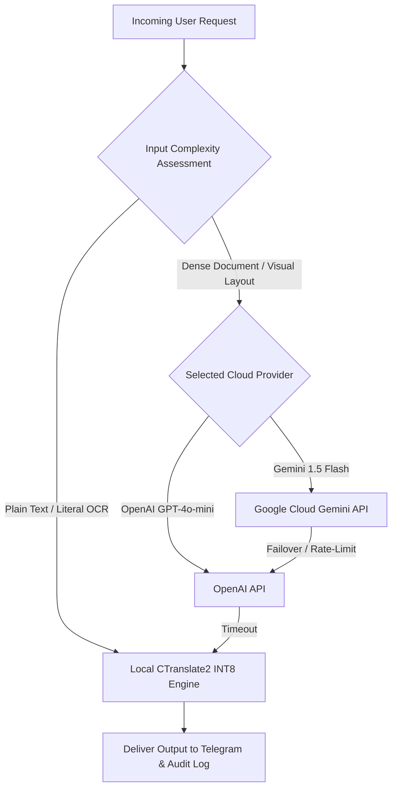

# 🤖 11. External AI API (Google Gemini) Integration & Admin Console
> **Edge AI Telegram Multimodal Translation and Web Integrated Management System Guide**

> [!TIP]
> 🌐 **Language Selector**: **[🇰🇷 한국어 버전으로 전환 (Switch to Korean)](./11_external_ai_gemini_integration_and_admin_console.md)** | **[🇺🇸 English (Current Document)](./11_external_ai_gemini_integration_and_admin_console_EN.md)**

---

## 🔗 Navigation
- [01. System Overview](./01_system_overview_EN.md)
- [02. System Architecture Blueprint](./02_system_architecture_EN.md)
- [03. Installation History](./03_installation_history_EN.md)
- [04. Upgrades & Evolution](./04_upgrades_and_evolution_EN.md)
- [05. Detailed Workflows](./05_detailed_workflows_EN.md)
- [06. Security & Tuning](./06_security_and_tuning_EN.md)
- [07. Operations & Deployment](./07_operations_and_deployment_EN.md)
- [08. K9s AI Engine Monitoring](./08_k9s_ai_engine_and_workload_monitoring_EN.md)
- [09. MLOps Multi-Engine Benchmark](./09_mlops_multi_engine_architecture_and_benchmark_EN.md)
- [10. Smart Text Chunking & Splitter](./10_smart_text_chunking_and_message_splitter_EN.md)
- **[11. External AI (Gemini) Integration](./11_external_ai_gemini_integration_and_admin_console_EN.md)**
- [12. Host OS Firewall & IPS](./12_host_os_firewall_and_intrusion_prevention_guide_EN.md)
- [13. Hardware Scale-Up (32C/192GB/GPU)](./13_hardware_scaleup_32core_192gb_gpu_optimization_EN.md)
- [14. eBPF Cilium & AI Firewall + Telegram SOC](./14_ebpf_cilium_ai_firewall_and_telegram_soc_EN.md)

---

## 1. Background & Hybrid AI Objectives

While the platform operates offline-first using on-premise neural models (RapidOCR, CTranslate2, Whisper), certain advanced requirements necessitate hybrid cloud LLM connectivity:

1. **Complex Unstructured Documents (VLM)**: German billing statements (Rechnung), tax documents, and public notices requiring contextual layout comprehension.
2. **Advanced German Formal Nuances**: Nuanced business correspondence adapting grammatical formality (e.g., formal *Sie* vs. informal *du*).
3. **High Availability & Fault Tolerance**: Automated cloud failover when edge computing resources experience unexpected saturation.

*▲ [Figure] Google Gemini Integration Console & Dynamic Model Switcher*

---

## 2. Dynamic Model Switching & Fallback Pipeline

Administrators can switch models live or set automated routing hierarchies:

---

## 3. Security & API Key Isolation
- **Encrypted Storage**: Cloud API tokens are stored in Kubernetes Secrets and decrypted only within the in-memory runtime environment.
- **Quota & Cost Governors**: Strict token caps prevent runaway API bills during usage spikes.
