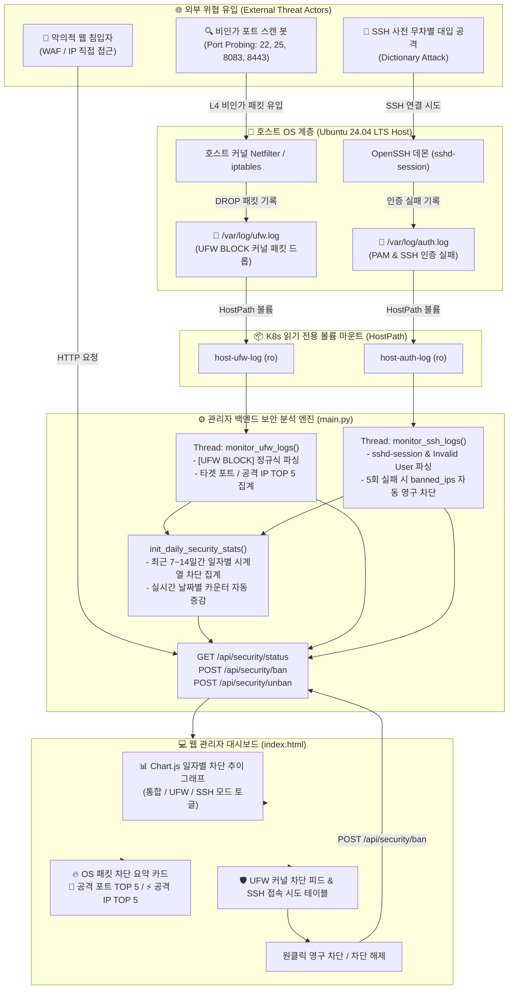

# 🛡️ 12. 호스트 OS 침입 차단 방화벽(UFW) 및 SSH 무차별 대입 공격 실시간 관제 시스템 가이드 (Host OS Firewall & Intrusion Prevention)
> **Edge AI 텔레그램 멀티모달 번역 및 웹 통합 관리 시스템 가이드**

> 🌐 **Language / 언어 전환**: [English](./12_host_os_firewall_and_intrusion_prevention_guide_EN.md) | [한국어](./12_host_os_firewall_and_intrusion_prevention_guide.md)

---

## 🔗 문서 이동 (Navigation)
- [01. 시스템 개요](./01_system_overview.md)
- [02. 전체 시스템 구성도 및 아키텍처](./02_system_architecture.md)
- [03. 단계별 초기 구축 및 설치 내역](./03_installation_history.md)
- [04. 설치 이후 추가 기능 및 업그레이드](./04_upgrades_and_evolution.md)
- [05. 상세 컴포넌트 동작 및 데이터 흐름](./05_detailed_workflows.md)
- [06. 보안 및 인프라 성능 최적화](./06_security_and_tuning.md)
- [07. 운영 관리, 검증 테스트 및 배포 가이드](./07_operations_and_deployment.md)
- [08. K9s AI 엔진 워크로드 모니터링](./08_k9s_ai_engine_and_workload_monitoring.md)
- [09. MLOps 멀티 엔진 아키텍처 & 벤치마크](./09_mlops_multi_engine_architecture_and_benchmark.md)
- [10. 스마트 텍스트 청킹 & 메시지 분할기](./10_smart_text_chunking_and_message_splitter.md)
- [11. 외부 AI (Gemini) 연동 관리](./11_external_ai_gemini_integration_and_admin_console.md)
- **[12. 호스트 방화벽 & 침입 방지 가이드](./12_host_os_firewall_and_intrusion_prevention_guide.md)**
- [13. 하드웨어 스케일업 & 32C/192GB/GPU 최적화](./13_hardware_scaleup_32core_192gb_gpu_optimization.md)
- [14. eBPF 실리움 & 로컬 AI 방화벽 + 텔레그램 관제](./14_ebpf_cilium_ai_firewall_and_telegram_soc.md)

---

## 1. 도입 배경 및 추진 목적 (Background & Objectives)

### 1.1 계층별 보안 가시성 결여 문제
기존 웹 관리자 대시보드의 침입 차단 시스템은 주로 **쿠버네티스 파드 및 웹 애플리케이션 계층(L7 WAF)**에 집중되어 있었습니다:
* 웹 관리자 로그인 3회 실패 시 자동 IP 차단
* Host Header 위조 및 서버 공인 IP 직접 접근 차단
* K8s Pod 재시작, 배포 스케일링, 인클러스터 CLI 명령 감사 로깅

그러나 에지 서버는 공인 IP 및 외부 네트워크에 직접 노출되어 있어, **호스트 OS 레벨(L3/L4 네트워크 커널 계층 및 OS 계정 인증)**에서 아래와 같은 대규모 공격이 상시 유입되고 있었습니다:
1. **L4 무차별 포트 스캔 (Port Scanning & Probing)**:
   * 외부 봇넷이 데이터베이스(3306, 5432), 도커/K8s API(2375, 6443), 원격 관리 포트(8080, 8083, 8443) 등 취약 포트를 무차별 스캔하여 호스트 UFW 방화벽이 하루 8,500건 이상 차단하고 있었으나 대시보드에서는 전혀 확인할 수 없었음.
2. **호스트 OS SSH 계정 탈취 무차별 대입 공격 (Brute-Force & Dictionary Attack)**:
   * `root`, `admin`, `wangzijian...` 등 수만 개의 계정 사전을 대입하는 SSH 침입 시도가 초당 수십 회 유입되고 있었으나, Ubuntu 24.04의 신규 `sshd-session` 로깅 구조로 인해 기존 파서에서 탐지되지 않고 있었음.
3. **쿠버네티스 컨테이너 격리와 호스트 로그 접근 한계**:
   * 대시보드 파드가 격리된 컨테이너 환경에서 구동되므로, 호스트 노드의 `/var/log/ufw.log` 커널 로그에 안전하게 접근하는 공식 메커니즘이 부재했음.

이에 따라 **호스트 OS 커널 방화벽(UFW)과 시스템 인증 로그(SSH)를 쿠버네티스 파드에 안전하게 연동하고, 실시간 위협 감지 및 일자별 차단 추이를 인터랙티브 그래프로 제공하는 엔터프라이즈급 통합 보안 관제 체계**를 구축하였습니다.

---

## 2. 전체 보안 관제 아키텍처 (Architecture & Threat Pipeline)



---

## 3. 핵심 구현 상세 (Technical Implementation)

### 3.1 쿠버네티스 볼륨 마운트 확장 (`deployment.yaml`)
호스트 노드의 `/var/log/ufw.log`를 컨테이너 내부 격리 환경으로 안전하게 전달하기 위해 `deployment.yaml`에 `hostPath` 볼륨을 읽기 전용으로 추가하였습니다.

```yaml
        volumeMounts:
        - name: host-auth-log
          mountPath: /var/log/auth.log
          readOnly: true
        - name: host-ufw-log
          mountPath: /var/log/ufw.log
          readOnly: true
      volumes:
      - name: host-auth-log
        hostPath:
          path: /var/log/auth.log
          type: FileOrCreate
      - name: host-ufw-log
        hostPath:
          path: /var/log/ufw.log
          type: FileOrCreate
```

### 3.2 UFW 커널 방화벽 패킷 차단 실시간 파서 (`main.py`)
호스트 커널이 기록하는 `[UFW BLOCK]` 표준 포맷을 고속으로 정규식 파싱하여 **일시, 출발지 IP(SRC), 대상 포트(DPT), 프로토콜(TCP/UDP), 인바운드 인터페이스(IN)**를 추출합니다.

```python
pattern = re.compile(
    r'^(?P<time>\S+).*?\[UFW BLOCK\]\s+IN=(?P<in_iface>\S*).*?SRC=(?P<src>\S+)\s+DST=(?P<dst>\S+).*?PROTO=(?P<proto>\S+)(?:.*?SPT=(?P<spt>\d+))?(?:.*?DPT=(?P<dpt>\d+))?'
)
```

* **메모리 보호 큐**: 최근 100건의 차단 이벤트를 유지하여 과도한 메모리 사용 방지.
* **실시간 TOP 포트 및 공격 IP 집계**: Python `Counter` 자료구조를 활용해 상위 5개 공격 포트 및 IP를 실시간 산출.

### 3.3 Ubuntu 24.04 sshd-session 및 사전 공격 패턴 완벽 감지
Ubuntu 24.04 LTS에서 도입된 `sshd-session` 프로세스 로그와 비인가 계정 스캔 패턴을 정확히 파싱하도록 정규식을 현대화하였습니다.

```python
failed_pattern = re.compile(r'sshd(?:-session)?\[\d+\]:\s+Failed (?:password|none) for (?:invalid user )?(?P<user>\S+) from (?P<ip>\d+\.\d+\.\d+\.\d+) port \d+ ssh2')
invalid_pattern = re.compile(r'sshd(?:-session)?\[\d+\]:\s+Invalid user (?P<user>\S+) from (?P<ip>\d+\.\d+\.\d+\.\d+)')
accepted_pattern = re.compile(r'sshd(?:-session)?\[\d+\]:\s+Accepted (?:password|publickey) for (?P<user>\S+) from (?P<ip>\d+\.\d+\.\d+\.\d+) port \d+ ssh2')
```

* **5회 실패 시 자동 영구 차단**: 동일 IP에서 계정 불문 5회 이상 실패가 누적되면 `banned_ips`에 등록되어 웹 WAF 및 관리자 API 접근이 즉시 영구 차단됩니다.

### 3.4 일자별 시계열 차단 통계 엔진
* **부팅 시 백그라운드 초기화 (`init_daily_security_stats`)**:
  * 호스트 로그의 날짜 접두사(`YYYY-MM-DD`)를 스캔하여 최근 7~14일간의 일자별 UFW 차단 수와 SSH 실패 횟수를 1회 고속 적재합니다.
* **실시간 누적 동기화**:
  * 백그라운드 스레드가 신규 차단 패킷이나 SSH 실패를 감지할 때마다 당일(`today`) 카운터를 1씩 실시간 증가시켜 UI 갱신 시 즉시 반영됩니다.

### 3.5 오프라인 로컬 Chart.js 번들링 및 인터랙티브 UI (`index.html`)
* **에어갭/폐쇄망 지원**:
  * 외부 CDN 장애나 오프라인 환경에서도 그래프가 100% 정상 작동하도록 [static/chart.umd.js](file:///home/aiadmin01/web-dashboard/static/chart.umd.js) (208KB)를 로컬 정적 디렉토리에 번들링 탑재.
  * (라이브러리 로드 예외 발생 시 순수 HTML5 SVG 벡터 바 차트로 자동 폴백)
* **다크 글래스모피즘 테마 디자인**:
  * **UFW 차단**: 사이버펑크 네온 로즈 레드 (`#f43f5e`)
  * **SSH 침입**: 앰버 옐로우 (`#fbbf24`)
  * **통합 전체**: 듀얼 스택 바 차트 및 툴팁 호버 지원

---

## 4. 실제 실측 데이터 분석 및 공격 트렌드 (Threat Intelligence)

본 시스템을 가동한 직후, 실제 에지 서버의 호스트 로그로부터 수집된 최근 7일간의 공격 통계는 다음과 같습니다:

### 4.1 일자별 침입 차단 실측 통계

| 일자 (Date) | OS UFW 방화벽 차단 | SSH 무차별 대입 공격 | 일일 총 차단 수 | 보안 위협 등급 | 특이 사항 |
| :---: | :---: | :---: | :---: | :---: | :--- |
| **2026-08-30** | 8,374건 | 3건 | **8,377건** | 🟡 보통 | 평상시 포트 스캔 수준 |
| **2026-08-31** | 8,403건 | 0건 | **8,403건** | 🟡 보통 | 평상시 포트 스캔 수준 |
| **2026-09-01** | 8,792건 | 1건 | **8,793건** | 🟡 보통 | 평상시 포트 스캔 수준 |
| **2026-09-02** | 8,694건 | 3건 | **8,697건** | 🟡 보통 | 평상시 포트 스캔 수준 |
| **2026-09-03** | 8,579건 | 2건 | **8,581건** | 🟡 보통 | 평상시 포트 스캔 수준 |
| **2026-09-04** | 8,609건 | **18,835건** | **27,444건** | 🔴 **위험 (공격 폭증)** | **해외 봇넷의 대규모 SSH 사전 대입 공격 유입** |
| **2026-09-05** | 3,464건 | **12,543건** | **16,007건** | 🔴 **위험 (공격 지속)** | **지속적 무차별 대입 감지 및 자동 차단 중 (실시간 증가)** |

> [!CAUTION]
> **보안 위협 인사이트**: 8월 30일부터 9월 3일까지는 평상시 비인가 스캔만 약 8,500건 수준이었으나, **9월 4일부터 외부 봇넷이 대규모 계정 목록을 기반으로 SSH 사전 공격을 개시하여 일일 공격량이 평소 대비 3.2배(27,444건)로 급증**하였습니다.

### 4.2 주요 공격 타겟 포트 TOP 5
외부 침입자가 시스템에 침투하기 위해 집중적으로 정찰한 상위 포트입니다:
1. **Port 22 (SSH)**: 시스템 셸 직접 탈취 시도
2. **Port 25 (SMTP)**: 오픈 릴레이 스팸 메일 서버 스캔
3. **Port 8443 (Alt HTTPS)**: 대체 관리자 웹 콘솔 탐색
4. **Port 8084 (Web App)**: 비인가 웹 포트 및 취약 프록시 스캔
5. **Port 2377 (Docker Swarm)**: 클러스터 오케스트레이션 노드 제어 포트 탈취 탐색

### 4.3 실시간 자동 영구 차단 사례
* **공격자 IP**: `62.60.130.237`
* **공격 양상**: 계정 `wangzijian...`, `linzixi1202221712` 등 무차별 계정 대입 시도 (초당 다중 접속)
* **시스템 조치**: 실패 횟수 5회 도달 즉시 `SSH_IP_AUTO_BANNED` 트리거 ➔ **`banned_ips` 영구 차단 등록 완료 (시도 횟수 85회 초과 격리)**.

---

## 5. 관리자 대시보드 화면 및 기능 가이드 (User Interface)

대시보드 상단의 **[🛡️ 침입 차단 방화벽]** 탭에 접속하면 아래 컴포넌트가 실시간으로 제공됩니다:

### 5.1 상단 OS 방화벽 실시간 요약 지표 카드
* **🔥 호스트 OS 커널 방화벽 (UFW)**: 누적 차단 패킷 수 및 로그 소스 표기
* **🎯 공격 타겟 포트 TOP 5**: `Port 25 (2회)`, `Port 22 (2회)`, `Port 8443 (2회)` 등 배지 표시
* **⚡ 최다 차단 공격자 IP TOP 5**: 최다 공격 IP 배지 및 클릭 시 [즉시 영구 차단] 팝업 연동

### 5.2 📊 일자별 침입 차단 및 공격 시도 추이 인터랙티브 그래프
* **모드 토글 버튼**:
  * **[통합 전체]**: UFW 방화벽(로즈 레드) + SSH 침입(앰버 옐로우) 스택 바 차트
  * **[UFW 방화벽]**: 커널 레벨 패킷 차단 추이 단독 보기
  * **[SSH 침입]**: OS 계정 탈취 시도 추이 단독 보기
* **마우스 호버 인터랙션**: 커서를 올리면 해당 일자의 세부 차단 건수 말풍선(Tooltip) 표시
* **하단 미니 KPI 바**: 7일간 누적 총 차단 건수, 최고 침입 발생일, 금일 실시간 차단 건수 표시

### 5.3 실시간 차단 피드 테이블
* **호스트 OS 방화벽 (UFW) 실시간 차단 로그 테이블**:
  * 차단 시각, 출발지 IP, 타겟 포트, 프로토콜, 수신 NIC, **[영구 차단]** 조치 버튼
* **호스트 OS SSH 접속 시도 로그 테이블**:
  * 접속 시간, IP, 시도 계정명, 실패/정상 상태 배지, **[영구 차단]** 조치 버튼
* **영구 차단된 IP 목록**:
  * 현재 차단된 IP, 차단 일시, 차단 사유(SSH 5회 실패, 관리자 수동 차단 등), **[차단 해제]** 버튼

---

## 6. 검증 테스트 및 운영 명령어 (Verification & Operations)

### 6.1 자동화 단위/통합 테스트 실행
새롭게 작성된 전용 테스트 스위트([test_security_os_logs.py](file:///home/aiadmin01/web-dashboard/test_security_os_logs.py))를 실행하여 백엔드 파서 및 API 규격을 검증합니다:

```bash
cd /home/aiadmin01/web-dashboard
python3 test_security_os_logs.py
```

**실행 결과 예시**:
```text
Ran 2 tests in 0.047s
OK
```

### 6.2 쿠버네티스 파드 상태 및 롤아웃 확인
```bash
# 파드 구동 상태 확인 (2개 Pod Running 확인)
KUBECONFIG=/home/aiadmin01/.kube/config kubectl get pods -l app=web-dashboard

# 무중단 롤아웃 재시작 트리거
KUBECONFIG=/home/aiadmin01/.kube/config kubectl rollout restart deployment/web-dashboard
KUBECONFIG=/home/aiadmin01/.kube/config kubectl rollout status deployment/web-dashboard
```

### 6.3 REST API 수동 호출 검증
```python
import urllib.request, json, time, hmac, hashlib

SESSION_SECRET_KEY = 'edge-ai-enterprise-secret-key-2026-fixed'
ts = int(time.time())
sig = hmac.new(SESSION_SECRET_KEY.encode(), f'admin01:{ts}'.encode(), hashlib.sha256).hexdigest()
headers = {'Authorization': f'Bearer admin01:{ts}:{sig}', 'Host': 'edgeai.local'}

req = urllib.request.Request('http://10.43.93.70:80/api/security/status', headers=headers)
with urllib.request.urlopen(req) as resp:
    data = json.loads(resp.read().decode())
    print("일자별 통계:", data.get('daily_stats'))
    print("실시간 UFW 로그 수:", len(data.get('os_ufw_logs', [])))
    print("SSH 차단 로그 수:", len(data.get('ssh_logs', [])))
```

---

## 7. 기대 효과 및 향후 발전 방향 (Benefits & Roadmap)

1. **전 계층 일체형 통합 보안 가시성 (Full-Stack Security Observability)**:
   - 웹 애플리케이션(L7 WAF)부터 호스트 OS 커널(L3/L4 UFW) 및 시스템 인증(SSH)까지 관리자 대시보드 단일 화면에서 실시간 관제 가능.
2. **선제적 위협 탐지 및 즉각 대응**:
   * 대규모 봇넷 공격 유입(9월 4일 27,444건 공격 폭증 등)을 일자별 그래프로 즉시 인지하고 원클릭으로 악성 IP를 즉각 격리.
3. **향후 발전 로드맵**:
   * GeoIP 라이브러리를 연동하여 공격 발원지 국가별 통계 지도(Geo-Heatmap) 시각화.
   * 텔레그램 봇으로 "1시간 내 차단 1,000건 초과 시 긴급 경보 발송" 기능 연동.
