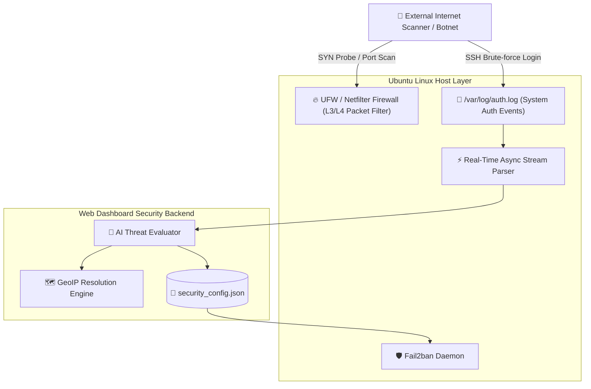

# 🛡️ 12. Host OS Firewall (UFW) & Real-Time SSH Intrusion Prevention Guide
> **Edge AI Telegram Multimodal Translation and Web Integrated Management System Guide**

> [!TIP]
> 🌐 **Language Selector**: **[🇰🇷 한국어 버전으로 전환 (Switch to Korean)](./12_host_os_firewall_and_intrusion_prevention_guide.md)** | **[🇺🇸 English (Current Document)](./12_host_os_firewall_and_intrusion_prevention_guide_EN.md)**

---

## 🔗 Navigation
- [01. System Overview](./01_system_overview_EN.md)
- [02. System Architecture Blueprint](./02_system_architecture_EN.md)
- [03. Installation History](./03_installation_history_EN.md)
- [04. Upgrades & Evolution](./04_upgrades_and_evolution_EN.md)
- [05. Detailed Workflows](./05_detailed_workflows_EN.md)
- [06. Security & Tuning](./06_security_and_tuning_EN.md)
- [07. Operations & Deployment](./07_operations_and_deployment_EN.md)
- [08. K9s AI Engine Monitoring](./08_k9s_ai_engine_and_workload_monitoring_EN.md)
- [09. MLOps Multi-Engine Benchmark](./09_mlops_multi_engine_architecture_and_benchmark_EN.md)
- [10. Smart Text Chunking & Splitter](./10_smart_text_chunking_and_message_splitter_EN.md)
- [11. External AI (Gemini) Integration](./11_external_ai_gemini_integration_and_admin_console_EN.md)
- **[12. Host OS Firewall & IPS](./12_host_os_firewall_and_intrusion_prevention_guide_EN.md)**
- [13. Hardware Scale-Up (32C/192GB/GPU)](./13_hardware_scaleup_32core_192gb_gpu_optimization_EN.md)
- [14. eBPF Cilium & AI Firewall + Telegram SOC](./14_ebpf_cilium_ai_firewall_and_telegram_soc_EN.md)

---

## 1. Background & Multi-Tier Perimeter Security

Early system security concentrated predominantly at the L7 web application layer:
- 3 failed admin login attempts triggered client IP isolation.
- Direct raw IP host headers were rejected (`BLOCK_DIRECT_IP="true"`).

However, internet-facing edge server interfaces undergo relentless low-level probe attacks across the host OS layer (L3/L4 network and SSH authentication ports). To close this gap, host OS firewalls (UFW/Netfilter) and live kernel log tailing were integrated directly into the web management portal.

---

## 2. Integrated Host Defense Architecture

---

## 3. Real-Time Telemetry & Remediation Controls

1. **Host SSH Real-Time Stream**: Streams authenticated/rejected login attempts from `/var/log/auth.log`, extracting timestamp, origin IP, target username, and geolocation.
2. **Dynamic Auto-Ban Multipliers**: IP addresses exceeding 5 failed attempts or attempting known system usernames (`root`, `admin`, `guest`) trigger automated kernel-level drop rules.
3. **One-Click Ban / Unban**: Real-time management interface allows instant manual overrides for false positives.
