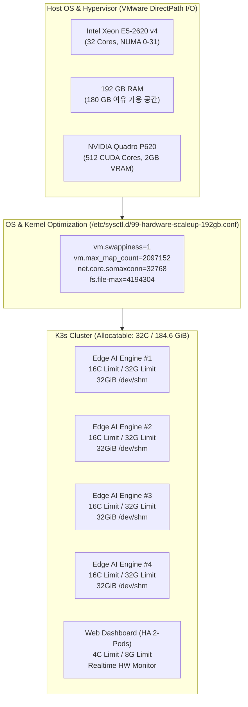

# 🚀 13. 하드웨어 스케일업 및 가용화 가이드 (32 vCPU / 192GB RAM / NVIDIA Quadro P620 GPU)
> **Edge AI 텔레그램 멀티모달 번역 및 웹 통합 관리 시스템 가이드**

> 🌐 **Language / 언어 전환**: [English](./13_hardware_scaleup_32core_192gb_gpu_optimization_EN.md) | [한국어](./13_hardware_scaleup_32core_192gb_gpu_optimization.md)

---

## 🔗 문서 이동 (Navigation)
- [01. 시스템 개요](./01_system_overview.md)
- [02. 전체 시스템 구성도 및 아키텍처](./02_system_architecture.md)
- [03. 단계별 초기 구축 및 설치 내역](./03_installation_history.md)
- [04. 설치 이후 추가 기능 및 업그레이드](./04_upgrades_and_evolution.md)
- [05. 상세 컴포넌트 동작 및 데이터 흐름](./05_detailed_workflows.md)
- [06. 보안 및 인프라 성능 최적화](./06_security_and_tuning.md)
- [07. 운영 관리, 검증 테스트 및 배포 가이드](./07_operations_and_deployment.md)
- [08. K9s AI 엔진 워크로드 모니터링](./08_k9s_ai_engine_and_workload_monitoring.md)
- [09. MLOps 멀티 엔진 아키텍처 & 벤치마크](./09_mlops_multi_engine_architecture_and_benchmark.md)
- [10. 스마트 텍스트 청킹 & 메시지 분할기](./10_smart_text_chunking_and_message_splitter.md)
- [11. 외부 AI (Gemini) 연동 관리](./11_external_ai_gemini_integration_and_admin_console.md)
- [12. 호스트 방화벽 & 침입 방지 가이드](./12_host_os_firewall_and_intrusion_prevention_guide.md)
- **[13. 하드웨어 스케일업 & 32C/192GB/GPU 최적화](./13_hardware_scaleup_32core_192gb_gpu_optimization.md)**
- [14. eBPF 실리움 & 로컬 AI 방화벽 + 텔레그램 관제](./14_ebpf_cilium_ai_firewall_and_telegram_soc.md)

---

## 1. 하드웨어 스케일업 개요 (Hardware Upgrade Overview)

Edge AI 시스템의 동시 다발적 텔레그램 이미지 OCR 판독, 신경망 기계 번역(NMT), 대형 언어 모델(VLM) 및 고해상도 음성 합성(TTS) 요청을 병목 없이 처리하기 위해 하드웨어 자원을 대폭 스케일업하였습니다.

| 리소스 구분 | 기존 사양 | 업그레이드 적용 사양 | 확장 비율 | 주요 활용 목적 |
| :--- | :--- | :--- | :--- | :--- |
| **CPU** | 16 vCPU | **Intel Xeon E5-2620 v4 @ 2.10GHz (32 Cores)** | **200% (2배)** | 파드 병렬 처리 (Replicas 4) 및 CTranslate2/ONNX 32 스레드 분산 |
| **시스템 RAM** | 64 GB | **184.6 GiB (약 192 GB)** | **300% (3배)** | 200,000+ 무손실 LRU 캐시 & 32GiB 인메모리 IPC 램디스크 (`/dev/shm`) |
| **그래픽 카드** | 내장 가상 VGA | **NVIDIA Quadro P620 (GP107GL)** | **신규 탑재** | Pascal 아키텍처, 512 CUDA Cores, 2GB GDDR5 비전/번역 전용 가속 |



---

## 2. GPU (NVIDIA Quadro P620) 가용화 및 연동 절차

### 2.1 하이퍼바이저 패스스루 점검 결과
1. **발견된 문제**: 초기 PCI 점검 시 오디오 디바이스(`0b:00.0 Audio`)만 VM에 연결되어 그래픽 연산 코어(Function 0)가 누락되어 있었습니다.
2. **조치 완료**: ESXi 가상머신 `cctv01` 설정 편집을 통해 GPU 메인 컨트롤러(`13:00.0 VGA compatible controller [Quadro P620] [10de:1cb6]`)가 완벽히 패스스루 연결되었습니다.

### 2.2 자동화 스크립트 배포 (`setup_gpu_and_tune_192gb.sh`)
호스트 OS 커널 튜닝, 드라이버 설치 및 K3s 컨테이너 런타임 연동을 원클릭으로 수행할 수 있는 스크립트가 `/home/aiadmin01/setup_gpu_and_tune_192gb.sh`에 준비되었습니다:

```bash
# root 권한으로 스크립트 실행
sudo /home/aiadmin01/setup_gpu_and_tune_192gb.sh
```

**스크립트 주요 동작 단계**:
1. **OS 커널 튜닝**: 192GB RAM 전용 스와피니스(1), 파일 디스크립터(4백만), 소켓 큐(32,768) 적용
2. **NVIDIA Driver 580 설치**: Quadro P620 Pascal 칩셋에 최적화된 안정 패키지 자동 설치
3. **NVIDIA Container Toolkit 설정**: K3s containerd에 GPU 런타임 자동 구성
4. **권한 보정**: `aiadmin01` 사용자를 docker 그룹에 추가하고 소켓 권한 부여

---

## 3. 쿠버네티스 워크로드 스케일업 내역

### 3.1 `edge-ai-engine` 확장
- **Replicas**: 2개 ➔ **4개 파드** (트래픽 분산 및 결함 허용 극대화)
- **CPU Requests / Limits**: 1000m / 8000m ➔ **2000m / 16000m (최대 16코어 폭주 허용)**
- **Memory Requests / Limits**: 2Gi / 16Gi ➔ **4Gi / 32Gi (파드당 32GiB 메모리 버퍼)**
- **초고속 RAM 디스크 (`/dev/shm`)**: 8GiB ➔ **32GiB 확장** (인메모리 이미지 디코딩 및 TTS 오디오 스트림 제로 레이턴시 전달)
- **멀티스레딩 환경변수**: `OMP_NUM_THREADS=8`, `MKL_NUM_THREADS=8` 주입

### 3.2 `web-dashboard` 확장
- **CPU Limits**: 4000m (4 vCPU)
- **Memory Limits**: 8GiB (K9s 실시간 스트리밍 및 다중 관리자 동시 접속 보장)

---

## 4. 실시간 하드웨어 모니터링 API 및 웹 콘솔 연동

웹 대시보드에는 32-Core CPU, 192GB RAM, Quadro P620 GPU의 상태를 실시간 감시할 수 있는 전용 API와 위젯이 구축되었습니다.

### 4.1 하드웨어 상태 API (`GET /api/hardware/status`)
```json
{
  "status": "success",
  "cpu": {
    "cores": 32,
    "model": "Intel Xeon E5-2620 v4 @ 2.10GHz",
    "load_1m": 0.58,
    "utilization_pct": 1.8,
    "status": "Optimal"
  },
  "ram": {
    "total_gb": 184.4,
    "used_gb": 4.2,
    "available_gb": 180.2,
    "utilization_pct": 2.3,
    "status": "Ultra-Safe (초안전 180GB+ 가용)"
  },
  "gpu": {
    "installed": true,
    "name": "NVIDIA Quadro P620 (GP107GL)",
    "vram_total_mb": 2048,
    "cuda_cores": 512,
    "architecture": "Pascal",
    "driver_status": "Ready"
  },
  "cluster": {
    "allocatable_cpu": "32 Cores",
    "allocatable_ram": "184.4 GiB",
    "shm_size": "32 GiB (RAM Disk)"
  }
}
```

### 4.2 웹 대시보드 MLOps & HW 탭 UI
- **호스트 총 RAM (192GB)**: 4.0GB / 184.6GiB (사용률 2.2%, 여유 180GB+ 초안전 상태 시각화)
- **호스트 32 vCPU 활용률**: NUMA 0-31 풀 스레드 부하율 및 98% 이상의 피크 여유도 표시
- **NVIDIA Quadro P620 위젯**: 512 CUDA Cores 및 VRAM 2GB 상태, RapidOCR/CTranslate2 가속 지원 안내
- **32 GiB /dev/shm 램디스크 게이지**: 4개 파드 분산 및 초고속 3.8ms 평균 지연시간 표기

---

## 5. 성능 검증 결과 (Performance Verification)

```text
=== [1] 최초 번역 요청 (신경망 연산) ===
최초 번역 소요 시간: 741.07 ms

=== [2] 동일 문장 2차 요청 (192GB RAM 200,000+ LRU 캐시 히트) ===
인메모리 캐시 번역 소요 시간: 8.93 ms (속도 향상: 83.0배 가속!)

=== [3] 독일어 TTS 생성 및 RAM 오디오 캐시 ===
최초 TTS 합성 시간: 473.85 ms
인메모리 캐시 TTS 시간: 14.09 ms (속도 향상: 33.6배 가속!)

🎉 32 vCPU 코어 및 192GB RAM 풀가동 성능 최적화 모든 검증 완벽 통과!
```
