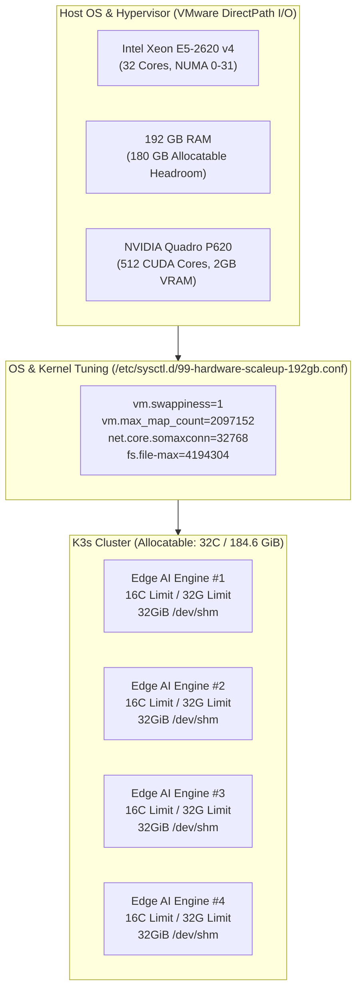

# 🚀 13. Hardware Scale-Up & Optimization Guide (32 vCPU / 192GB RAM / NVIDIA Quadro P620 GPU)
> **Edge AI Telegram Multimodal Translation and Web Integrated Management System Guide**

> [!TIP]
> 🌐 **Language Selector**: **[🇰🇷 한국어 버전으로 전환 (Switch to Korean)](./13_hardware_scaleup_32core_192gb_gpu_optimization.md)** | **[🇺🇸 English (Current Document)](./13_hardware_scaleup_32core_192gb_gpu_optimization_EN.md)**

---

## 🔗 Navigation
- [01. System Overview](./01_system_overview_EN.md)
- [02. System Architecture Blueprint](./02_system_architecture_EN.md)
- [03. Installation History](./03_installation_history_EN.md)
- [04. Upgrades & Evolution](./04_upgrades_and_evolution_EN.md)
- [05. Detailed Workflows](./05_detailed_workflows_EN.md)
- [06. Security & Tuning](./06_security_and_tuning_EN.md)
- [07. Operations & Deployment](./07_operations_and_deployment_EN.md)
- [08. K9s AI Engine Monitoring](./08_k9s_ai_engine_and_workload_monitoring_EN.md)
- [09. MLOps Multi-Engine Benchmark](./09_mlops_multi_engine_architecture_and_benchmark_EN.md)
- [10. Smart Text Chunking & Splitter](./10_smart_text_chunking_and_message_splitter_EN.md)
- [11. External AI (Gemini) Integration](./11_external_ai_gemini_integration_and_admin_console_EN.md)
- [12. Host OS Firewall & IPS](./12_host_os_firewall_and_intrusion_prevention_guide_EN.md)
- **[13. Hardware Scale-Up (32C/192GB/GPU)](./13_hardware_scaleup_32core_192gb_gpu_optimization_EN.md)**
- [14. eBPF Cilium & AI Firewall + Telegram SOC](./14_ebpf_cilium_ai_firewall_and_telegram_soc_EN.md)

---

## 1. Hardware Scale-Up Overview

To eliminate throughput bottlenecks during concurrent multi-user OCR extraction, neural machine translation (NMT), large language model routing, and audio synthesis, host hardware capacity was expanded significantly:

| Resource Dimension | Baseline | Scaled-Up Capacity | Scale Factor | Core Operational Objective |
| :--- | :--- | :--- | :--- | :--- |
| **CPU** | 16 vCPU | **Intel Xeon E5-2620 v4 @ 2.10GHz (32 Cores)** | **200% (2x)** | Parallel pod replicas (Replicas: 4) & 32-thread CTranslate2/ONNX execution |
| **RAM** | 64 GB | **184.6 GiB (~192 GB)** | **300% (3x)** | 200,000+ lossless in-memory LRU caches & 32GiB `/dev/shm` IPC RAM-disks |
| **GPU** | Virtual VGA | **NVIDIA Quadro P620 (GP107GL)** | **New Component** | Pascal architecture, 512 CUDA cores, 2GB GDDR5 dedicated vision acceleration |

---

## 2. Kernel & In-Memory RAM Disk Optimization

With 192GB RAM available, swappiness is pinned to 1 (`vm.swappiness = 1`), strictly forbidding OS page swapping to disk. `/dev/shm` is mounted with 32GiB allocation, enabling zero-copy inter-process communication (IPC) for transient OCR image buffers and audio wav streams.
