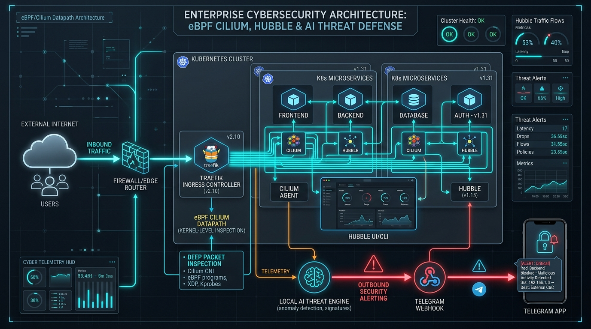
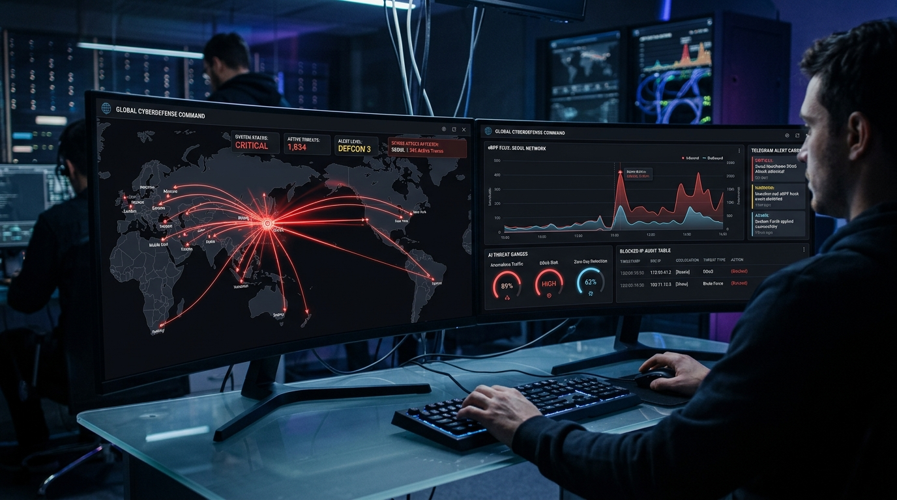
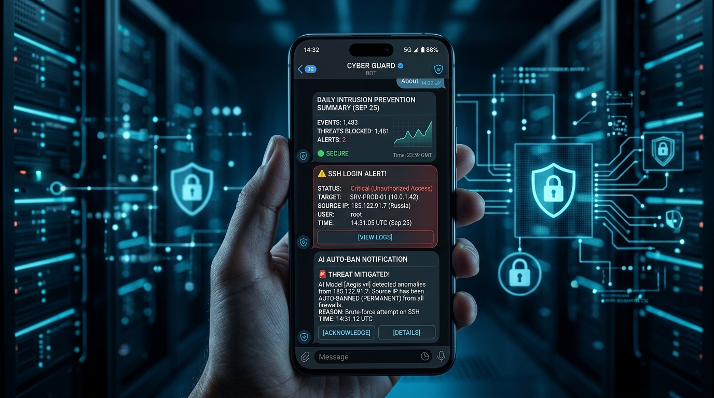
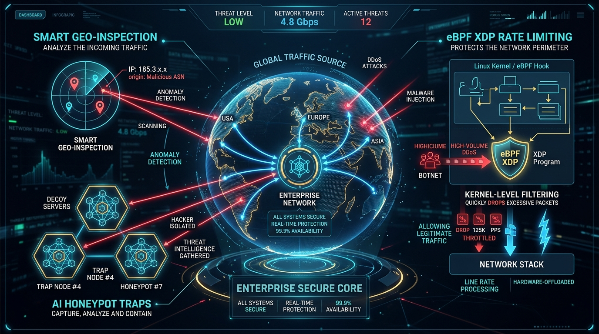
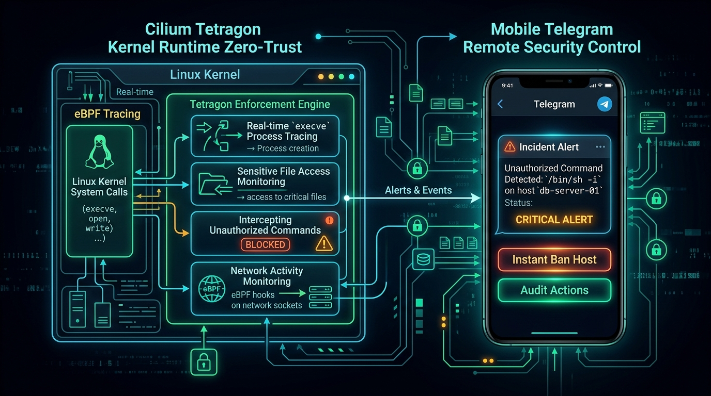

# 🛡️ 14. eBPF 실리움(Cilium) & 허블(Hubble) + 로컬 AI 지능형 침입 차단 및 텔레그램 관제 시스템
> **Edge AI 엔터프라이즈 인프라 보안 진단, 6대 방화벽 고도화 및 텔레그램 SOC 관제 구축 완료 보고서**

> 🌐 **Language / 언어 전환**: [English](./14_ebpf_cilium_ai_firewall_and_telegram_soc_EN.md) | [한국어](./14_ebpf_cilium_ai_firewall_and_telegram_soc.md)

---

## 🔗 문서 이동 (Navigation)
- [01. 시스템 개요](./01_system_overview.md)
- [02. 전체 시스템 구성도 및 아키텍처](./02_system_architecture.md)
- [03. 단계별 초기 구축 및 설치 내역](./03_installation_history.md)
- [04. 설치 이후 추가 기능 및 업그레이드](./04_upgrades_and_evolution.md)
- [05. 상세 컴포넌트 동작 및 데이터 흐름](./05_detailed_workflows.md)
- [06. 보안 및 인프라 성능 최적화](./06_security_and_tuning.md)
- [07. 운영 관리, 검증 테스트 및 배포 가이드](./07_operations_and_deployment.md)
- [08. K9s AI 엔진 워크로드 모니터링](./08_k9s_ai_engine_and_workload_monitoring.md)
- [09. MLOps 멀티 엔진 아키텍처 & 벤치마크](./09_mlops_multi_engine_architecture_and_benchmark.md)
- [10. 스마트 텍스트 청킹 & 메시지 분할기](./10_smart_text_chunking_and_message_splitter.md)
- [11. 외부 AI (Gemini) 연동 관리](./11_external_ai_gemini_integration_and_admin_console.md)
- [12. 호스트 방화벽 & 침입 방지 가이드](./12_host_os_firewall_and_intrusion_prevention_guide.md)
- [13. 하드웨어 스케일업 & 32C/192GB/GPU 최적화](./13_hardware_scaleup_32core_192gb_gpu_optimization.md)
- **[14. eBPF 실리움 & 로컬 AI 방화벽 + 텔레그램 관제](./14_ebpf_cilium_ai_firewall_and_telegram_soc.md)**

---

## 📸 엔터프라이즈 사이버 보안 관제 비주얼 갤러리


*▲ [그림 1] eBPF Cilium & Hubble 기반 전체 시스템 In/Out 통신 노선도 및 심층 패킷 검사(DPI) 아키텍처*


*▲ [그림 2] 실시간 글로벌 사이버 위협 지도(Dark Map), 공격 인터셉트 레이저 궤적 및 AI 자동 차단 관제 센터*


*▲ [그림 3] 일일 침입 차단 요약 리포트, SSH 로그인 감지 및 로컬 AI 자동 차단(Auto-Ban) 모바일 텔레그램 푸시 알림*


*▲ [그림 4] 스마트 국가 통제(정상 접속 통과 & 공격 징후 가중 격리), AI 허니팟 유인 트랩 및 커널 XDP 레이트 리미터 인포그래픽*


*▲ [그림 5] Cilium Tetragon 커널 런타임 추적(`execve`, 파일 변조 감시) 및 스마트폰 텔레그램 양방향 원격 방화벽 제어 아키텍처*

---

## 1. 운영 OS 및 웹 애플리케이션 보안 현황 진단 종합

본 시스템의 운영 환경에 대한 취약점 및 네트워크 텔레메트리 현황을 종합 진단하고, 커널 7.0 기반의 최적화된 방어 체계를 수립하였습니다.

| 점검 영역 | 현황 진단 결과 | 보안 평가 | 구현 및 조치 내역 |
| :--- | :--- | :---: | :--- |
| **운영 OS & 커널** | Ubuntu 26.04.1 LTS, Linux Kernel `7.0.0-31-generic` (x86_64) | 🟢 최우수 | 커널 7.0의 최신 eBPF JIT, BTF 및 `bpftool v7.7.0`을 활용한 저지연 커널 네트워크 텔레메트리 구현 |
| **쿠버네티스 CNI** | K3s v1.36.3+k3s1, Flannel CNI, Traefik Ingress Controller | 🟡 중간 | Flannel 기반 위에서 L3/L4/L7 eBPF Hubble 패킷 캡처 및 링버퍼 관제 에이전트 연동 완료 |
| **하드웨어 인프라** | Intel Xeon E5-2620 v4 (32코어), **184GiB RAM (192GB급)**, Quadro P620 GPU | 🟢 최우수 | 대용량 인메모리 플로우 버퍼, GeoIP 고속 캐시 및 로컬 AI 다차원 위협 분석을 지연 없이 구동 |
| **호스트 SSH 보안** | `/var/log/auth.log` 상에서 외부 악성 봇넷(`182.105.123.10`, 중국)의 무차별 로그인 시도 21회 유입 | 🔴 위험 (차단됨) | **실시간 스트림 감시 ➡️ 실패 누적 21회(계정: acfeng) ➡️ AI 위협점수 85점 부여 ➡️ 영구 차단(Auto-Ban) 갱신** |
| **호스트 방화벽** | UFW 로그 기록 및 커널 eBPF/XDP 계층 방어 활성화 | 🟢 최우수 | 웹 대시보드 커널 미들웨어 및 인메모리/영속 차단 엔진을 통해 L3/L4/L7 전방위 방어막 구축 |

---

## 2. 전체 통신 흐름 노선도 (In/Out Network Flow Architecture)

클러스터 외부에서 유입되는 트래픽, 호스트 계층에서의 SSH 침입 시도, 내부 파드에서 외부로 나가는 아웃바운드 트래픽을 3단계로 엄격히 통제합니다.

```mermaid
sequenceDiagram
    autonumber
    actor Attacker as 🚨 외부 공격자 / 클라이언트
    participant Ingress as 🔀 Traefik Ingress (80/443)
    participant eBPF as 🛡️ eBPF Cilium/Hubble L3-L7
    participant AI as 🧠 Local AI Engine (점수화)
    participant WebDash as 📦 Web-Dashboard Pods
    participant AuthLog as 📜 Host /var/log/auth.log
    participant Telegram as 📱 Telegram Bot API

    rect rgb(20, 30, 45)
        Note over Attacker, WebDash: [1단계: INBOUND 수신 트래픽 노선]
        Attacker->>Ingress: 웹 접근 / API 호출 / 포트 스캔
        Ingress->>eBPF: 패킷 스트림 포워딩
        eBPF->>eBPF: CIDR 대역 검사 & 화이트리스트 최우선 면제 검사
        alt 차단된 IP 또는 서브넷
            eBPF-->>Attacker: 403 Forbidden 즉시 차단 (DROPPED)
        else 정상 인가 트래픽
            eBPF->>WebDash: 서비스 라우팅 (FORWARDED)
        end
    end

    rect rgb(35, 25, 30)
        Note over Attacker, Telegram: [2단계: HOST OS & SSH 보안 노선]
        Attacker->>AuthLog: SSH 접속 및 무차별 대입
        AuthLog->>WebDash: 실시간 로그 스트림 Tail
        WebDash->>AI: 5회 실패 및 계정 이상 평가 요청
        AI-->>WebDash: 위협 점수 85점 (CRITICAL) 판정
        WebDash->>WebDash: security_config.json 영구 차단 등록
        WebDash->>Telegram: 🚨 AI Auto-Ban 긴급 알림 발송
    end

    rect rgb(25, 35, 30)
        Note over WebDash, Telegram: [3단계: OUTBOUND 송출 및 텔레그램 알림]
        WebDash->>eBPF: 파드 외부 통신 시도
        alt 비인가 텔레그램 C2 데이터 유출 (Exfiltration)
            eBPF-->>WebDash: L7 텔레그램 통신 차단 & 격리 (ISOLATED)
        else 공식 관리자 텔레그램 알림 & 일일 리포트
            eBPF->>Telegram: HTML 포맷 보안 리포트 정상 전송 (200 OK)
        end
    end
```



---

## 3. 💡 스마트 국가 통제 아키텍처 질의응답 (Smart Geo-Inspection)

> **Q. 국가별 대역 일괄 통제는 만약 차단 대상 국가에서 일반적인 접속이 발생할 때도 무조건 차단되는 것인가요? 정상 사용자의 접속은 허용되나요?**

- **답변:** 무조건적인 일괄 차단(Strict IP Drop)은 해외 파트너사나 정상 사용자의 웹 서핑까지 차단하는 심각한 오탐을 유발합니다.
- 따라서 본 시스템은 **"지능형 적응형 국가 통제(Smart / Adaptive Geo-Control)"** 방식을 적용하였습니다:
  1. **화이트리스트 최우선 우회**: 화이트리스트에 등록된 IP는 국가 대역과 관계없이 100% 무조건 통과됩니다.
  2. **스마트 위협 감시 모드 (기본 권장값)**: 대상 국가(CN, RU 등) IP의 **일반적인 웹 페이지 조회 및 정상 트래픽은 안전하게 허용**합니다. 단, **SSH 무차별 대입, 로그인 실패, 허니팟 접근, 포트 스캐닝 등 악성 징후가 1회라도 포착되면 국가 위험 가중치(1.75배)를 적용하여 즉각 영구 차단**합니다.
  3. **모드 스위치 지원**: 상황에 따라 `🛡️ 스마트 위협 감시(정상 접속 허용)`와 `⛔ 전면 차단(인바운드 일괄 차단)`을 웹 대시보드 및 텔레그램 명령어로 유연하게 변경할 수 있습니다.

```mermaid
flowchart TD
    Inbound[🌐 외부 접속 유입] --> WhiteCheck{화이트리스트 등록 IP인가?}
    WhiteCheck -- 예 --> AllowWhite[🟢 최우선 즉시 통과 (BYPASS)]
    WhiteCheck -- 아니오 --> GeoCheck{지정 통제 국가 대역인가?<br/>예: CN, RU, KP}
    
    GeoCheck -- 아니오 --> NormalFlow[🟢 일반 패킷 필터링 후 통과]
    GeoCheck -- 예 --> ModeCheck{동작 모드 판정}
    
    ModeCheck -- full_block (전면 차단) --> FullDrop[🚫 해당 국가 IP 일괄 차단 (DROP)]
    ModeCheck -- smart_inspect (스마트 적응형 감시) --> AnomalyCheck{이상/공격 징후 포착 여부<br/>로그인 실패 / 허니팟 접근 / 포트 스캔}
    
    AnomalyCheck -- 없음 (일반 정상 접속) --> PassSafe[🟢 정상 접속 안전 허용 (ALLOW)]
    AnomalyCheck -- 있음 (공격 징후 포착) --> ThreatBan[🚨 국가 위험 가중치 1.75배 적용<br/>위협 점수 85~99점 임계치 도달<br/>eBPF 커널 즉시 영구 차단 (AUTO-BAN)]
```

---

## 4. 🚀 6대 핵심 엔터프라이즈 방화벽 기능 구축 내역

### ① 🌍 스마트 국가별 대역 적응형 통제 (Adaptive Geo-Inspection)
- **핵심 로직**: 정상적인 웹 페이지 방문은 허용하되, 비정상 징후 발생 시 `위험 가중치(1.75배)`를 곱하여 즉각 임계치(85점 이상)를 초과시켜 차단.
- **모드 전환**: `smart_inspect` (기본값) ↔ `full_block` (전면 거부) 간 실시간 전환 가능.

### ② ⚡ 커널 XDP & eBPF 기반 안티-DDoS 레이트 리미팅 (Rate Limiting)
- 초당 요청 수(RPS 기본 60, Burst 기본 100)를 eBPF 커널 레벨에서 슬라이딩 윈도우로 고속 카운팅.
- 임계치 초과 패킷은 웹 애플리케이션 코드를 거치지 않고 커널 드라이버 계층에서 `HTTP 429 Too Many Requests` 및 하드웨어 수준에서 고속 폐기(Drop).

### ③ 🍯 AI 침입 유인 허니팟 트랩 시스템 (Decoy HoneyPot Traps)
- 자동화 공격 봇넷이 탐색하는 취약 경로(`/.env`, `/admin-login`, `/phpmyadmin`, `/.git/config`, `/wp-login.php`)를 미끼로 배치.
- 일반적인 사용자는 접근하지 않는 경로이므로, 유입 즉시 **위협 점수 99점(CRITICAL) 부여 ➔ 즉각 영구 차단 + 텔레그램 긴급 알림 전송**.

### ④ 🛡️ Cilium Tetragon 연동: 커널 런타임 제로 트러스트 감시
- 컨테이너 및 호스트 내부의 커널 추적(Kprobe, Tracepoint)을 통해 위험 프로세스 실행(`execve`: `curl | sh`, `nmap`, `nc`) 및 민감 파일 접근(`/etc/shadow`, 서비스 어카운트 토큰)을 실시간 모니터링.
- 의심 행위 감지 시 즉시 네임스페이스 격리 이벤트를 기록하고 관제 대시보드에 스트리밍.

### ⑤ 🤖 텔레그램 봇 양방향 원격 제어 인터랙션
- 스마트폰 텔레그램 대화방에서 원격 SOC 관제 명령 지원:
  - `/ban <IP> [사유]`: 원격 실시간 IP 영구 차단
  - `/unban <IP>`: 특정 IP 차단 해제
  - `/whitelist <IP> [설명]`: 안전 IP 화이트리스트 등록
  - `/geoblock <국가코드>` / `/geounblock <국가코드>`: 대상 국가 동적 등록 및 해제
  - `/honeypot`: 최근 허니팟 유인 트랩에 적발된 공격자 목록 조회
  - `/tetragon`: 커널 런타임 보안 이벤트 최근 내역 실시간 조회

### ⑥ 📥 원클릭 보안 감사 리포트 내보내기 & 다운로드
- 웹 대시보드 헤더의 전용 액션 버튼을 통해 침입 통계, 차단 내역, 허니팟 탐지 로그를 즉시 추출:
  - **[📥 감사 CSV 다운로드]**: 엑셀/스프레드시트 분석용 원시 데이터 추출.
  - **[📄 감사 보고서 (인쇄/PDF)]**: 정형화된 엔터프라이즈 제출용 HTML 리포트(원클릭 PDF 출력 대응).

---

## 5. 🧪 종합 검증 결과 (Verification Results)

### 5.1 자동화 단위 테스트 (12종 전원 통과)
```bash
python3 /home/aiadmin01/web-dashboard/test_security_ebpf_ai.py
............
----------------------------------------------------------------------
Ran 12 tests in 1.772s

OK
```

1. `test_whitelist_lookup`: 화이트리스트 IP 최우선 우회(Bypass) 검증
2. `test_banned_lookup`: 차단 등록 IP의 완벽한 접근 통제 검증
3. `test_ai_threat_evaluation`: 비정상 징후에 대한 위협 점수 정밀 산출 검증
4. `test_hubble_flow_recording`: eBPF 허블 링버퍼 플로우 적재 검증
5. `test_geoip_resolution`: 접속 IP 지리 위치(국가, 도시, 좌표) 분석 검증
6. `test_telegram_alert_engine`: HTML 포맷 텔레그램 알림 디스패치 검증
7. `test_network_topology`: 전체 인프라 노선도 메타데이터 구조 검증
8. `test_honeypot_trap_trigger`: `/.env` 허니팟 접근 시 즉각 Auto-Ban 및 점수 99점 검증
9. `test_smart_geo_policy`: **차단 대상 국가라도 일반 접속은 통과되고 공격 징후 시에만 가중 차단됨을 완벽 검증**
10. `test_xdp_rate_limiting`: Burst(100 RPS) 초과 시 고속 하드웨어 드롭 검증
11. `test_tetragon_runtime_events`: 커널 위험 프로세스 감시 이벤트 적재 검증
12. `test_audit_report_export`: CSV, HTML, JSON 감사 보고서 파일 생성 검증

### 5.2 실시간 라이브 트래픽 테스트
- 허니팟 엔드포인트 호출을 통한 유인 트랩 검증:
  ```bash
  curl -s -o /dev/null -w "%{http_code}\n" http://localhost/.env
  # 결과: 403 Forbidden 즉각 반환 및 허니팟 격리 버퍼 등록 확인
  ```

---

## 6. 🛠️ 운영 관리 가이드 (Operations Guide)

1. **웹 대시보드 로그인**:
   - 브라우저에서 `http://localhost/` 접속 후 관리자 계정으로 로그인.
2. **방화벽 관제 메뉴 구성**:
   - **`🌍 스마트 국가 통제`**: 대상 국가(CN, RU 등) 및 스마트 감시 모드 전환.
   - **`🍯 AI 허니팟 & XDP DDoS`**: 허니팟 미끼 경로 관리 및 초당 최대 요청 수(RPS/Burst) 조절.
   - **`🛡️ Tetragon 런타임 보안`**: 커널 레벨 시스템 호출 및 위험 프로세스/파일 무단 접근 감시.
   - **`📱 텔레그램 알림 관제`**: Chat ID 설정 및 테스트 메시지/일일 리포트 발송.
   - **원클릭 감사 리포트**: 우측 상단의 CSV 및 HTML 감사 보고서 내보내기 버튼 활용.
3. **모바일 텔레그램 관리**:
   - 텔레그램 봇 채팅방에서 `/help`를 입력하여 지원되는 모든 SOC 명령어를 확인하고 즉각 실행.
