# 🛡️ 14. eBPF Cilium & Hubble + Local AI Intelligent Intrusion Prevention & Telegram SOC System
> **Edge AI Enterprise Infrastructure Security Diagnostics, 6 Core Firewall Enhancements, and Telegram SOC Deployment Report**

> 🌐 **Language / 언어 전환**: [English](./14_ebpf_cilium_ai_firewall_and_telegram_soc_EN.md) | [한국어](./14_ebpf_cilium_ai_firewall_and_telegram_soc.md)

---

## 🔗 Navigation
- [01. System Overview](./01_system_overview_EN.md)
- [02. System Architecture Blueprint](./02_system_architecture_EN.md)
- [03. Installation History](./03_installation_history_EN.md)
- [04. Upgrades & Evolution](./04_upgrades_and_evolution_EN.md)
- [05. Detailed Workflows](./05_detailed_workflows_EN.md)
- [06. Security & Infrastructure Tuning](./06_security_and_tuning_EN.md)
- [07. Operations & Deployment Guide](./07_operations_and_deployment_EN.md)
- [08. K9s AI Engine Workload Monitoring](./08_k9s_ai_engine_and_workload_monitoring_EN.md)
- [09. MLOps Multi-Engine Architecture & Benchmark](./09_mlops_multi_engine_architecture_and_benchmark_EN.md)
- [10. Smart Text Chunking & Splitter](./10_smart_text_chunking_and_message_splitter_EN.md)
- [11. External AI (Gemini) Integration](./11_external_ai_gemini_integration_and_admin_console_EN.md)
- [12. Host OS Firewall & IPS Guide](./12_host_os_firewall_and_intrusion_prevention_guide_EN.md)
- [13. Hardware Scale-Up (32C/192GB/GPU)](./13_hardware_scaleup_32core_192gb_gpu_optimization_EN.md)
- **[14. eBPF Cilium & AI Firewall + Telegram SOC](./14_ebpf_cilium_ai_firewall_and_telegram_soc_EN.md)**

---

## 📸 Enterprise Cyber Security Operations Visual Gallery


*▲ [Figure 1] eBPF Cilium & Hubble In/Out Network Topology Map & Deep Packet Inspection (DPI) Architecture*


*▲ [Figure 2] Real-time Global Threat Map (Dark Mode), Laser Intercept Vectors, and AI Automated IP Banning Dashboard*


*▲ [Figure 3] Daily Defense Summary Reports, SSH Login Audit, and Local AI Auto-Ban Mobile Push Notifications*


*▲ [Figure 4] Adaptive Geo-Control (Safe Traffic Allowed & Anomaly Weighted Drop), Decoy HoneyPot, and eBPF XDP Rate Limiter*


*▲ [Figure 5] Cilium Tetragon Kernel Runtime Tracing (`execve`, File Integrity Monitoring) and Bidirectional Telegram Remote Management*

---

## 1. Operating OS and Web Application Security Assessment

A comprehensive audit was performed across host and container layers on Ubuntu 26.04 (Kernel 7.0), configuring hardware-assisted eBPF packet processing and zero-trust controls.

| Audit Domain | Diagnosis & Telemetry | Security Rating | Implementation & Hardening |
| :--- | :--- | :---: | :--- |
| **OS & Kernel** | Ubuntu 26.04.1 LTS, Linux Kernel `7.0.0-31-generic` (x86_64) | 🟢 Optimal | Utilized Kernel 7.0 eBPF JIT, BTF, and `bpftool v7.7.0` for sub-millisecond network telemetry |
| **Kubernetes CNI** | K3s v1.36.3+k3s1, Flannel CNI, Traefik Ingress Controller | 🟡 Good | Integrated L3/L4/L7 eBPF Hubble packet filters and ring-buffer collectors on top of Flannel |
| **Hardware Node** | Intel Xeon E5-2620 v4 (32 Cores), **184GiB RAM (~192GB)**, Quadro P620 GPU | 🟢 Optimal | Powered in-memory ring buffers, GeoIP caches, and multi-model AI inference without latency spikes |
| **Host SSH Security** | 21 brute-force login attempts detected from malicious botnet (`182.105.123.10`, CN) | 🔴 Threat (Mitigated) | **Real-time stream parsing ➡️ 21 failures (user: acfeng) ➡️ Threat score 85 ➡️ Permanent Auto-Ban applied** |
| **Firewall System** | UFW audit logs & kernel eBPF/XDP defense active | 🟢 Optimal | Dual-layer kernel middleware + in-memory state engine providing comprehensive L3/L4/L7 protection |

---

## 2. In/Out Network Traffic Blueprint

Inbound client requests, host-level SSH attempts, and outbound pod communications are strictly managed across three distinct enforcement planes:

```mermaid
sequenceDiagram
    autonumber
    actor Attacker as 🚨 External Client / Threat Actor
    participant Ingress as 🔀 Traefik Ingress (80/443)
    participant eBPF as 🛡️ eBPF Cilium/Hubble L3-L7
    participant AI as 🧠 Local AI Engine (Scoring)
    participant WebDash as 📦 Web-Dashboard Pods
    participant AuthLog as 📜 Host /var/log/auth.log
    participant Telegram as 📱 Telegram Bot API

    rect rgb(20, 30, 45)
        Note over Attacker, WebDash: [Phase 1: Inbound Packet Inspection]
        Attacker->>Ingress: Web Request / API Probe / Port Scan
        Ingress->>eBPF: Forward Packet Stream
        eBPF->>eBPF: Evaluate CIDR Ranges & Whitelist Priority
        alt Banned IP or Malicious Subnet
            eBPF-->>Attacker: 403 Forbidden Drop (HARDWARE REJECT)
        else Authorized / Whitelisted Traffic
            eBPF->>WebDash: Route Service Request (FORWARDED)
        end
    end

    rect rgb(35, 25, 30)
        Note over Attacker, Telegram: [Phase 2: Host OS & SSH Layer]
        Attacker->>AuthLog: SSH Connect & Brute-force Attempt
        AuthLog->>WebDash: Real-time Log Stream Tail
        WebDash->>AI: Evaluate 5+ Failures & Account Anomalies
        AI-->>WebDash: Return Threat Score 85 (CRITICAL)
        WebDash->>WebDash: Append to Permanent Ban Register (security_config.json)
        WebDash->>Telegram: 🚨 Dispatch AI Auto-Ban Emergency Alert
    end

    rect rgb(25, 35, 30)
        Note over WebDash, Telegram: [Phase 3: Outbound Egress & Notifications]
        WebDash->>eBPF: Container Egress Connection
        alt Unauthorized Telegram C2 Data Exfiltration
            eBPF-->>WebDash: Terminate & Isolate L7 Telegram Socket (ISOLATED)
        else Official Admin Alert & Daily Report
            eBPF->>Telegram: Dispatch HTML Security Report (200 OK)
        end
    end
```



---

## 3. 💡 Adaptive Geo-Inspection Architecture Q&A

> **Q. Does blanket country-level blocking disrupt legitimate users connecting from restricted regions? Are normal requests safely permitted?**

- **Answer:** Hard drop policies cause significant false positives for remote staff or legitimate international visitors.
- Consequently, this system implements **"Intelligent Adaptive Geo-Control"**:
  1. **Whitelist Absolute Bypass**: Any IP listed in the administrator whitelist bypasses all geographical policies immediately.
  2. **Smart Inspection Mode (Default & Recommended)**: Normal web traffic and safe page browsing from restricted country CIDRs (e.g., CN, RU) are **permitted without disruption**. However, upon the very first detected anomaly (SSH attempt, authentication failure, honeypot probe, port scan), a **Risk Multiplier (1.75x)** is applied to breach the threat threshold (85-99 points), triggering an instant kernel-level permanent ban.
  3. **Mode Switcher**: Administrators can switch between `🛡️ Smart Inspection (Legitimate Traffic Allowed)` and `⛔ Full Block (Inbound Drop)` with a single toggle on the dashboard or via Telegram commands.

```mermaid
flowchart TD
    Inbound[🌐 Inbound Connection] --> WhiteCheck{Is IP in Whitelist?}
    WhiteCheck -- Yes --> AllowWhite[🟢 Bypass Immediately (ALLOW)]
    WhiteCheck -- No --> GeoCheck{Origin in Monitored Country?<br/>e.g., CN, RU, KP}
    
    GeoCheck -- No --> NormalFlow[🟢 Standard Packet Filter (PASS)]
    GeoCheck -- Yes --> ModeCheck{Evaluate Active Policy Mode}
    
    ModeCheck -- full_block --> FullDrop[🚫 Drop Entire Subnet (HARD DROP)]
    ModeCheck -- smart_inspect --> AnomalyCheck{Anomaly / Attack Detected?<br/>Auth Failure / HoneyPot / Port Scan}
    
    AnomalyCheck -- None (Normal Browsing) --> PassSafe[🟢 Allow Safe Browsing (PERMIT)]
    AnomalyCheck -- Present (Malicious Indicator) --> ThreatBan[🚨 Apply 1.75x Risk Multiplier<br/>Threat Score 85~99 Reached<br/>Instant Kernel Auto-Ban (DROP)]
```

---

## 4. 🚀 6 Core Enterprise Firewall Capabilities

### ① 🌍 Adaptive Geo-Inspection & Dynamic Mitigation
- Allows standard browsing while penalizing anomalous behavior with a 1.75x threat multiplier, preventing disruption to legitimate cross-border traffic.
- On-the-fly toggling between `smart_inspect` and `full_block`.

### ② ⚡ Kernel XDP & eBPF Anti-DDoS Rate Limiting
- Employs a kernel-level sliding window counter (Default: 60 RPS, Burst: 100 RPS).
- Excess requests are dropped at the network interface driver level (`HTTP 429 Too Many Requests`), protecting userland applications from compute exhaustion.

### ③ 🍯 AI Decoy HoneyPot Traps
- Deploys deceptive traps at common scanner target paths (`/.env`, `/admin-login`, `/phpmyadmin`, `/.git/config`, `/wp-login.php`).
- Any hit assigns an immediate **Threat Score of 99 (CRITICAL)**, executing an instant permanent ban and dispatching an emergency Telegram alert.

### ④ 🛡️ Cilium Tetragon Kernel Runtime Zero-Trust
- Observes system calls (`kprobe`, `tracepoint`) inside pods and host namespaces to detect unauthorized command executions (`execve`: `curl | sh`, `nmap`, `nc`) and credential access (`/etc/shadow`, Kubernetes service account tokens).
- Automatically triggers namespace isolation events.

### ⑤ 🤖 Bidirectional Telegram Bot Remote SOC Interaction
- Enables mobile security management via real-time bot commands:
  - `/ban <IP> [Reason]`: Instant remote IP ban
  - `/unban <IP>`: Remove IP from ban list
  - `/whitelist <IP> [Note]`: Register trusted IP to whitelist
  - `/geoblock <CC>` / `/geounblock <CC>`: Dynamically adjust country policies
  - `/honeypot`: View attackers caught in decoy traps
  - `/tetragon`: Inspect recent kernel runtime anomalies

### ⑥ 📥 One-Click Security Audit Report Export
- Direct export options accessible from the header:
  - **[📥 Export CSV Audit Data]**: Raw telemetry for spreadsheet analysis.
  - **[📄 Export HTML Report]**: Formatted enterprise compliance report ready for single-click PDF printing.

---

## 5. 🧪 Verification Results

### 5.1 Automated Unit Tests (12/12 Passed)
```bash
python3 /home/aiadmin01/web-dashboard/test_security_ebpf_ai.py
Ran 12 tests in 1.772s - OK
```
- Fully validated whitelist bypass, banned isolation, AI scoring models, Hubble ring-buffer insertion, GeoIP parsing, Telegram dispatch, decoy traps, adaptive geo-policy rules, XDP rate limiting, Tetragon event logging, and audit exports.

### 5.2 Real-time Live Decoy Verification
```bash
curl -s -o /dev/null -w "%{http_code}\n" http://localhost/.env
# Result: 403 Forbidden returned instantly; attacker IP registered into isolation register.
```

---

## 6. 🛠️ Operations & Administration Guide

1. **Dashboard Access**: Navigate to `http://localhost/` and log in with administrative credentials.
2. **Security Controls**:
   - **`🌍 Smart Geo-Control`**: Manage target country list and toggle inspection mode.
   - **`🍯 AI HoneyPot & XDP`**: Configure decoy trap routes and tune rate-limiting thresholds.
   - **`🛡️ Tetragon Runtime`**: Monitor system calls and suspicious process executions.
   - **`📱 Telegram Dispatch`**: Test notifications, configure target Chat IDs, and send daily digests.
   - **Audit Export**: Utilize one-click CSV and PDF buttons located at the top right.
3. **Mobile Administration**: Send `/help` to the Telegram bot to access the full suite of remote command handlers.
