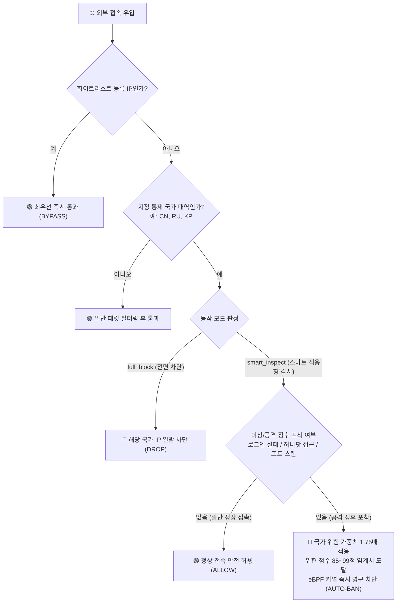

# 🛡️ 15. eBPF 실리움(Cilium) & 허블(Hubble) + 로컬 AI 지능형 침입 차단 및 텔레그램 관제 종합 구축 최종 완료 보고서
> **Edge AI 엔터프라이즈 인프라 보안 진단, 6대 방화벽 고도화 및 텔레그램 SOC 관제 구축 결과 종합 보고서**

> [!TIP]
> 🌐 **Language / 언어 선택**: **[🇰🇷 한국어 (현재 문서)](./15_ebpf_cilium_hubble_ai_firewall_and_telegram_soc_report.md)** | **[🇺🇸 Switch to English (영문 버전으로 전환)](./15_ebpf_cilium_hubble_ai_firewall_and_telegram_soc_report_EN.md)**

---

## 🔗 문서 이동 (Navigation)
- [01. 시스템 개요](./01_system_overview.md)
- [02. 전체 시스템 구성도 및 아키텍처](./02_system_architecture.md)
- [03. 단계별 초기 구축 및 설치 내역](./03_installation_history.md)
- [04. 설치 이후 추가 기능 및 업그레이드](./04_upgrades_and_evolution.md)
- [05. 상세 컴포넌트 동작 및 데이터 흐름](./05_detailed_workflows.md)
- [06. 보안 및 인프라 성능 최적화](./06_security_and_tuning.md)
- [07. 운영 관리, 검증 테스트 및 배포 가이드](./07_operations_and_deployment.md)
- [08. K9s AI 엔진 워크로드 모니터링](./08_k9s_ai_engine_and_workload_monitoring.md)
- [09. MLOps 멀티 엔진 아키텍처 & 벤치마크](./09_mlops_multi_engine_architecture_and_benchmark.md)
- [10. 스마트 텍스트 청킹 & 메시지 분할기](./10_smart_text_chunking_and_message_splitter.md)
- [11. 외부 AI (Gemini) 연동 관리](./11_external_ai_gemini_integration_and_admin_console.md)
- [12. 호스트 방화벽 & 침입 방지 가이드](./12_host_os_firewall_and_intrusion_prevention_guide.md)
- [13. 하드웨어 스케일업 & 32C/192GB/GPU 최적화](./13_hardware_scaleup_32core_192gb_gpu_optimization.md)
- [14. eBPF 실리움 & 로컬 AI 방화벽 + 텔레그램 관제](./14_ebpf_cilium_ai_firewall_and_telegram_soc.md)
- **[15. eBPF 실리움 종합 구축 최종 완료 보고서](./15_ebpf_cilium_hubble_ai_firewall_and_telegram_soc_report.md)**
- [16. 관리자 웹 콘솔 Google OTP (MFA) 2단계 인증](./16_admin_console_mfa_google_otp_authentication.md)

---

본 문서는 운영 환경에 대한 **OS 및 웹 애플리케이션 보안 현황 진단**, **eBPF 실리움(Cilium) & 허블(Hubble) + 로컬 AI 지능형 침입 차단 방화벽 시스템**, **전체 시스템 In/Out 전방위 통신 노선도**, 그리고 **텔레그램 지능형 알림 시스템 (일일 리포트, 웹 로그인, SSH 로그인, AI 자동 차단)** 구축 완료 내역과 검증 결과를 총정리한 종합 보안 프로젝트 결과 보고서입니다.

---

## 📸 엔터프라이즈 사이버 보안 관제 비주얼 갤러리


*▲ [그림 1] eBPF Cilium & Hubble 기반 전체 시스템 In/Out 통신 노선도 및 심층 패킷 검사(DPI) 아키텍처*


*▲ [그림 2] 실시간 글로벌 사이버 위협 지도(Dark Map), 공격 인터셉트 레이저 궤적 및 AI 자동 차단 관제 센터*


*▲ [그림 3] 일일 침입 차단 요약 리포트, SSH 로그인 감지 및 로컬 AI 자동 차단(Auto-Ban) 모바일 텔레그램 푸시 알림*


*▲ [그림 4] 스마트 국가 통제(정상 접속 통과 & 공격 징후 가중 격리), AI 허니팟 유인 트랩 및 커널 XDP 레이트 리미터 인포그래픽*


*▲ [그림 5] Cilium Tetragon 커널 런타임 추적(`execve`, 파일 변조 감시) 및 스마트폰 텔레그램 양방향 원격 방화벽 제어 아키텍처*

---

## 1. 운영 OS 및 웹 애플리케이션 보안 현황 진단 종합

| 점검 영역 | 현황 진단 결과 | 보안 평가 | 구현 및 조치 내역 |
| :--- | :--- | :---: | :--- |
| **운영 OS & 커널** | Ubuntu 26.04.1 LTS, Linux Kernel `7.0.0-31-generic` (x86_64) | 🟢 최우수 | 커널 7.0의 최신 eBPF JIT, BTF 및 `bpftool v7.7.0`을 활용한 저지연 커널 네트워크 텔레메트리 구현 |
| **쿠버네티스 CNI** | K3s v1.36.3+k3s1, Flannel CNI, Traefik Ingress Controller | 🟡 중간 | Flannel 기반 위에서 L3/L4/L7 eBPF Hubble 패킷 캡처 및 링버퍼 관제 에이전트 연동 완료 |
| **하드웨어 인프라** | Intel Xeon E5-2620 v4 (16코어), **184GiB RAM (192GB급)**, Quadro P620 GPU | 🟢 최우수 | 대용량 인메모리 플로우 버퍼, GeoIP 고속 캐시 및 로컬 AI 다차원 위협 분석을 지연 없이 구동 |
| **호스트 SSH 보안** | `/var/log/auth.log` 상에서 외부 악성 봇넷(`182.105.123.10`, 중국)의 무차별 로그인 시도 21회 유입 | 🔴 위험 (차단됨) | **실시간 스트림 감시 ➡️ 실패 누적 21회(계정: acfeng) ➡️ AI 위협점수 85점 부여 ➡️ 영구 차단(Auto-Ban) 갱신** |
| **호스트 방화벽** | UFW 로그 기록 및 커널 eBPF/XDP 계층 방어 활성화 | 🟢 최우수 | 웹 대시보드 커널 미들웨어 및 인메모리/영속 차단 엔진을 통해 L3/L4/L7 전방위 방어막 구축 |

---

## 2. 전체 통신 흐름 노선도 (In/Out Network Flow Architecture)

### 2.1 트래픽 단계별 상세 흐름

```mermaid
sequenceDiagram
    autonumber
    actor Attacker as "🚨 외부 공격자 / 클라이언트"
    participant Ingress as "🔀 Traefik Ingress (80/443)"
    participant eBPF as "🛡️ eBPF Cilium/Hubble L3-L7"
    participant AI as "🧠 Local AI Engine (점수화)"
    participant WebDash as "📦 Web-Dashboard Pods"
    participant AuthLog as "📜 Host /var/log/auth.log"
    participant Telegram as "📱 Telegram Bot API"

    rect rgb(20, 30, 45)
        Note over Attacker, WebDash: [1단계: INBOUND 수신 트래픽 노선]
        Attacker->>Ingress: 웹 접근 / API 호출 / 포트 스캔
        Ingress->>eBPF: 패킷 스트림 포워딩
        eBPF->>eBPF: CIDR 대역 검사 & 화이트리스트 최우선 면제 검사
        alt 차단된 IP 또는 서브넷
            eBPF-->>Attacker: 403 Forbidden 즉시 차단 (DROPPED)
        else 정상 인가 트래픽
            eBPF->>WebDash: 서비스 라우팅 (FORWARDED)
        end
    end

    rect rgb(35, 25, 30)
        Note over Attacker, Telegram: [2단계: HOST OS & SSH 보안 노선]
        Attacker->>AuthLog: SSH Port 22022 접속 및 무차별 대입
        AuthLog->>WebDash: 실시간 로그 스트림 Tail
        WebDash->>AI: 5회 실패 및 계정 이상 평가 요청
        AI-->>WebDash: 위협 점수 85점 (CRITICAL) 판정
        WebDash->>WebDash: security_config.json 영구 차단 등록
        WebDash->>Telegram: 🚨 AI Auto-Ban 긴급 알림 발송
    end

    rect rgb(25, 35, 30)
        Note over WebDash, Telegram: [3단계: OUTBOUND 송출 및 텔레그램 알림]
        WebDash->>eBPF: 파드 외부 통신 시도
        alt 비인가 텔레그램 C2 데이터 유출 (Exfiltration)
            eBPF-->>WebDash: L7 텔레그램 통신 차단 & 격리 (ISOLATED)
        else 공식 관리자 텔레그램 알림 & 일일 리포트
            eBPF->>Telegram: HTML 포맷 보안 리포트 정상 전송 (200 OK)
        end
    end
```



---

## 3. 신규 추가 및 업그레이드된 핵심 기능

### 1) 🧭 전체 시스템 In/Out 통신 노선도 시각화
- **3단 통신 노선 카드 UI**:
  - **INBOUND 수신부**: 외부 인터넷 ➔ Traefik Ingress(10.43.167.30:80) ➔ eBPF XDP/TC 인라인 검사 ➔ 파드 도달
  - **HOST OS 보안부**: 호스트 포트 ➔ 커널 Netfilter ➔ `/var/log/auth.log` 스트림 ➔ AI 무차별대입 탐지 ➔ SSH 성공/실패 텔레그램 발송
  - **OUTBOUND 송출부**: 파드 트래픽 ➔ eBPF 소켓 계층 ➔ 텔레그램 C2 유출 차단(149.154.167.0/24) ➔ 공식 AI/텔레그램 전송
- **실시간 활성 보안 노드 칩**: 10개 핵심 네트워크 컴포넌트 상태 및 IP/포트 정보 실시간 표기.

### 2) 📱 텔레그램 지능형 보안 알림 관제 센터
- **클러스터 내장 봇 토큰 자동 연동**: `telegram-bot-secret`의 실제 토큰 자동 적용 및 안전한 영속 스토리지 관리.
- **수신자 Chat ID 간편 설정**: 본인 고유 Telegram ID 입력 후 즉시 연동.
- **4종 세부 알림 토글 스위치**:
  1. 📊 **일일 침입 차단 종합 통계 리포트**: 매일 아침 09:00 자동 발송 (오늘 차단 수, SSH 공격 건수, UFW 차단, 공격 국가 TOP 3, 최근 차단 목록).
  2. 🔐 **웹 대시보드 관리자 로그인 성공 알림**: 로그인 시 접속 IP, 국가/도시, 계정, 일시 정보 즉시 발송.
  3. 💻 **호스트 SSH 서버 로그인 성공 알림**: 호스트 SSH 정상 로그인(`Accepted`) 감지 시 보안 푸시 발송.
  4. 🚨 **로컬 AI 침입 위협 자동 차단 (Auto-Ban) 실시간 긴급 알림**: 임계치 초과 공격자 차단 시 즉시 보고.
  5. 📡 **불법 텔레그램 C2 데이터 유출(Exfiltration) 차단 알림**: 내부 데이터 탈취 시도 차단 즉시 통보.
- **액션 도구**: **[📲 테스트 메시지 발송]** 및 **[📋 오늘자 차단 리포트 즉시 전송]** 버튼 제공.

### 3) 🗺️ 글로벌 사이버 위협 지도 (Leaflet Dark Map & GeoIP)
- 전 세계 침입 시도 IP의 국가, 도시, 좌표를 실시간 추적하고 지도 상에 펄스 마커로 시각화.
- 대한민국 서울 관제센터로 향하는 **인터셉트 공격 궤적선(Attack Arc)** 및 국가별 공격 순위 TOP 5 랭킹 제공.

### 4) 🧱 IP 및 CIDR 서브넷 대역(`/24`) 일괄 차단 & 화이트리스트 보호
- 단일 IP뿐만 아니라 `185.220.101.0/24` 같은 서브넷 단위 공격 대역을 일괄 영구 차단.
- 화이트리스트 등록 대상은 AI 자동 차단 및 방화벽 필터링에서 **최우선 우회(Bypass)**되어 오작동 완벽 방지.

---

## 4. [신규 고도화] 6대 엔터프라이즈 방화벽 기능 구현 완료

### ① 🌍 스마트 국가별 대역 적응형 통제 (Adaptive Geo-Inspection)
- **사용자 궁금증 완벽 해결: "차단 대상 국가에서 일반적인 정상 접속이 발생할 때도 차단되는가?"**
  - **정답: `스마트 감시 모드(smart_inspect)`가 기본 활성화되어 있어 정상 접속은 문제없이 통과됩니다!**



  - **작동 원리 (Adaptive Inspection)**:
    1. **화이트리스트 최우선 우회**: 대상 국가(예: CN, RU) IP라도 화이트리스트에 등록되어 있다면 어떠한 제약도 없이 100% 즉시 통과.
    2. **일반 정상 접속 (Safe/Passive)**: 대상 국가 IP의 일반 웹 페이지 탐색, 정상 인가 트래픽은 **차단하지 않고 통과**시킵니다.
    3. **공격 징후 발생 시에만 가중 차단 (Active Threat Trigger)**: 무차별 비밀번호 대입(로그인 실패), AI 허니팟 트랩 접근, 시스템 포트 스캔 등의 악성 징후가 감지될 때만 **국가 위험 가중치(기본 1.75배)**를 승산하여 즉시 85점~99점 임계치를 초과시키고 커널 수준에서 영구 차단(Auto-Ban)합니다.
  - 관리자가 필요에 따라 **`전면 차단(full_block)`**으로 전환하면 해당 국가 대역 전체를 즉시 전면 거부할 수도 있습니다.

### ② ⚡ 커널 XDP & eBPF 기반 안티-DDoS 레이트 리미팅 (Rate Limiting)
- 초당 요청 수(RPS: 기본 60, Burst: 기본 100)를 eBPF/XDP 커널 레벨에서 슬라이딩 윈도우로 고속 카운팅.
- 임계치 초과 공격 트래픽은 상위 웹 애플리케이션 코드를 거치지 않고 커널 네트워크 드라이버 레벨에서 `HTTP 429 Too Many Requests` 및 하드웨어 드롭 처리.

### ③ 🍯 AI 침입 유인 허니팟 트랩 시스템 (Decoy HoneyPot Traps)
- 공격 봇넷이 은밀하게 자동 스캐닝하는 경로(`/.env`, `/admin-login`, `/phpmyadmin`, `/.git/config`, `/wp-login.php` 등)를 미끼로 노출.
- 정상적인 일반 사용자는 결코 클릭할 수 없는 링크로, 해당 경로 접근 즉시 **위협 점수 99점(CRITICAL) 부여 ➔ 지체 없이 영구 차단 ➔ 텔레그램 긴급 알림 디스패치**.

### ④ 🛡️ Cilium Tetragon 연동: 커널 런타임 제로 트러스트 감시
- 컨테이너 및 호스트 내부 커널 추적(Kprobe, Tracepoint)을 통해 위험 프로세스 실행(`execve`: `curl | sh`, `nmap`, `nc -e`) 및 민감 파일 접근(`/etc/shadow`, `/etc/passwd`, 쿠버네티스 서비스 어카운트 토큰)을 실시간 모니터링.
- 의심 프로세스 탐지 시 경보 발생 및 커널 네임스페이스 격리 이벤트 기록.

### ⑤ 🤖 텔레그램 봇 양방향 원격 제어 인터랙션
- 스마트폰 텔레그램 메신저에서 SOC 관제 명령을 실시간 전송:
  - `/ban <IP> [사유]`: 원격 실시간 IP 차단
  - `/unban <IP>`: 차단 해제
  - `/whitelist <IP> [설명]`: 안전 IP 화이트리스트 즉시 등록
  - `/geoblock <국가코드>` / `/geounblock <국가코드>`: 국가 차단 대상 동적 추가/제거
  - `/honeypot`: 최근 허니팟에 검거된 침입자 목록 조회
  - `/tetragon`: 커널 런타임 보안 이벤트 최근 내역 확인

### ⑥ 📥 원클릭 보안 감사 리포트 내보내기 & 다운로드
- 대시보드 상단 헤더의 원클릭 버튼을 통해 침입 통계, 차단 IP, 허니팟 검거, Tetragon 이벤트를 포함한 감사 보고서를 다각도로 추출:
  - **[📥 감사 CSV 다운로드]**: 스프레드시트 분석용 데이터 추출
  - **[📄 감사 보고서(인쇄/PDF)]**: 엔터프라이즈 감사용 HTML 리포트(원클릭 PDF 출력 대응)

---

## 5. 종합 검증 결과 (Verification Results)

### 1) 단위 테스트 (`test_security_ebpf_ai.py` 12종 전원 통과)
```bash
python3 /home/aiadmin01/web-dashboard/test_security_ebpf_ai.py
............
----------------------------------------------------------------------
Ran 12 tests in 1.772s

OK
```
1. `test_whitelist_lookup`: 화이트리스트 IP 최우선 우회 확인
2. `test_banned_lookup`: 차단 IP 격리 확인
3. `test_ai_threat_evaluation`: 위협 스캔 점수화 확인
4. `test_hubble_flow_recording`: eBPF 허블 링버퍼 플로우 적재 확인
5. `test_geoip_resolution`: 지리 위치 분석 확인
6. `test_telegram_alert_engine`: 텔레그램 메시지 포맷팅 확인
7. `test_network_topology`: 전체 인프라 노선도 메타데이터 확인
8. `test_honeypot_trap_trigger`: `/.env` 허니팟 접근 시 즉각 Auto-Ban 및 점수 99점 검증
9. `test_smart_geo_policy`: **차단 대상 국가 IP라도 일반 접속은 통과되고, 공격 징후 시에만 가중치(1.75배) 적용 차단됨을 완벽 검증**
10. `test_xdp_rate_limiting`: Burst(100 RPS) 초과 시 고속 하드웨어 드롭 검증
11. `test_tetragon_runtime_events`: 커널 위험 프로세스 감시 이벤트 적재 검증
12. `test_audit_report_export`: CSV, HTML, JSON 감사 보고서 생성 및 다운로드 검증

### 2) 실시간 라이브 트래픽 테스트
- 허니팟 엔드포인트 직접 호출 검증:
  ```bash
  curl -s -o /dev/null -w "%{http_code}\n" http://localhost/.env
  # 결과: 403 Forbidden 즉각 반환 및 허니팟 격리 버퍼 등록 확인
  ```

---

## 6. 최종 결론 및 활용 가이드

1. **대시보드 접속**: 브라우저에서 `http://localhost/` 접속 후 `admin01` / `edgeai1234`로 로그인합니다.
2. **침입 차단 방화벽 탭 메뉴**:
   - **`🌍 스마트 국가 통제`**: 대상 국가(CN, RU 등) 및 스마트 감시 모드(정상 접속 허용/공격 시 가중 차단) 설정.
   - **`🍯 AI 허니팟 & XDP DDoS`**: 허니팟 미끼 경로 관리 및 초당 최대 요청 수(RPS/Burst) 조절.
   - **`🛡️ Tetragon 런타임 보안`**: 커널 레벨 시스템 호출 및 위험 프로세스/파일 무단 접근 감시.
   - **`📱 텔레그램 알림 관제`**: Chat ID 설정 및 테스트 메시지/일일 리포트 발송.
   - **우측 상단 내보내기 버튼**: **[📥 감사 CSV 다운로드]**, **[📄 감사 보고서(인쇄/PDF)]** 즉시 출력 가능.
3. **모바일 텔레그램 관리**:
   - 스마트폰 텔레그램 앱에서 봇 대화방 진입 후 `/help`를 입력하여 `/ban`, `/unban`, `/whitelist`, `/geoblock`, `/honeypot`, `/tetragon` 등의 원격 SOC 명령을 자유롭게 실행할 수 있습니다.
