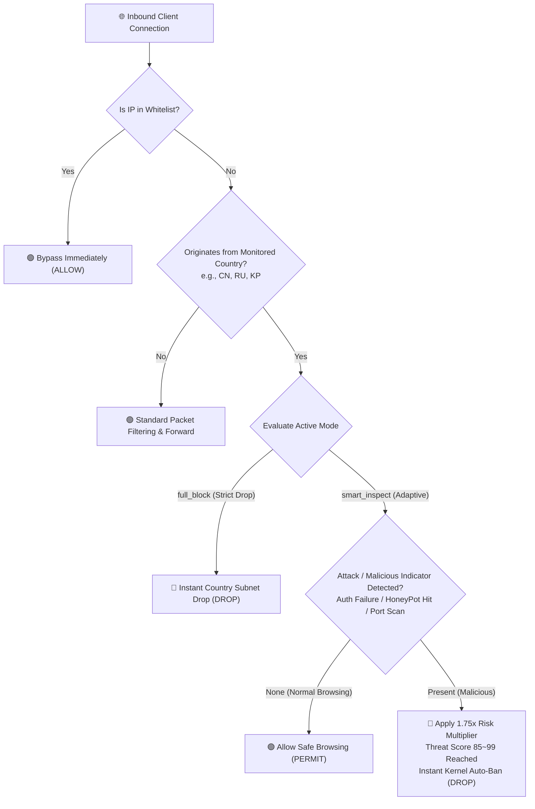

# 🛡️ 15. eBPF Cilium & Hubble + Local AI Intrusion Detection and Telegram SOC Final Completion Report
> **Comprehensive Final Report on Edge AI Enterprise Security Assessment, 6 Core Firewall Enhancements, and Telegram SOC Operations**

> [!TIP]
> 🌐 **Language Selector**: **[🇰🇷 한국어 버전으로 전환 (Switch to Korean)](./15_ebpf_cilium_hubble_ai_firewall_and_telegram_soc_report.md)** | **[🇺🇸 English (Current Document)](./15_ebpf_cilium_hubble_ai_firewall_and_telegram_soc_report_EN.md)**

---

## 🔗 Navigation
- [01. System Overview](./01_system_overview_EN.md)
- [02. System Architecture Blueprint](./02_system_architecture_EN.md)
- [03. Installation History](./03_installation_history_EN.md)
- [04. Upgrades & Evolution](./04_upgrades_and_evolution_EN.md)
- [05. Detailed Workflows](./05_detailed_workflows_EN.md)
- [06. Security & Tuning](./06_security_and_tuning_EN.md)
- [07. Operations & Deployment](./07_operations_and_deployment_EN.md)
- [08. K9s AI Engine Monitoring](./08_k9s_ai_engine_and_workload_monitoring_EN.md)
- [09. MLOps Multi-Engine Benchmark](./09_mlops_multi_engine_architecture_and_benchmark_EN.md)
- [10. Smart Text Chunking & Splitter](./10_smart_text_chunking_and_message_splitter_EN.md)
- [11. External AI (Gemini) Integration](./11_external_ai_gemini_integration_and_admin_console_EN.md)
- [12. Host OS Firewall & IPS](./12_host_os_firewall_and_intrusion_prevention_guide_EN.md)
- [13. Hardware Scale-Up (32C/192GB/GPU)](./13_hardware_scaleup_32core_192gb_gpu_optimization_EN.md)
- [14. eBPF Cilium & AI Firewall + Telegram SOC](./14_ebpf_cilium_ai_firewall_and_telegram_soc_EN.md)
- **[15. eBPF Cilium Final Completion Report](./15_ebpf_cilium_hubble_ai_firewall_and_telegram_soc_report_EN.md)**
- [16. Admin Web Console Google OTP (MFA) Authentication](./16_admin_console_mfa_google_otp_authentication_EN.md)

---

This document serves as the **Comprehensive Final Project Report**, summarizing the host OS & web application security diagnostics, eBPF Cilium & Hubble + Local AI intelligent intrusion prevention system, omnidirectional In/Out network flow blueprints, and the intelligent Telegram SOC alerting pipeline (daily reports, admin web logins, SSH events, and autonomous AI-driven auto-ban mechanisms).

---

## 📸 Enterprise Cybersecurity & SOC Visual Gallery


*▲ [Figure 1] eBPF Cilium & Hubble Omnidirectional In/Out Network Flow Blueprint & Deep Packet Inspection (DPI) Architecture*


*▲ [Figure 2] Real-time Global Threat Dark Map, Attack Laser Interception Arcs, and Autonomous AI Auto-Ban SOC Dashboard*


*▲ [Figure 3] Daily Intrusion Prevention Executive Summary, Host SSH Login Interception, and AI Auto-Ban Mobile Push Notifications*


*▲ [Figure 4] Adaptive Geo-Inspection (Allowing Legitimate Traffic vs. Multiplied Threat Isolation), AI Decoy Traps, and Kernel XDP Rate Limiter*


*▲ [Figure 5] Cilium Tetragon Kernel Runtime Observability (`execve`, File Integrity Monitoring) and Bidirectional Telegram Remote Bot Control*

---

## 1. Comprehensive Host OS & Web Application Security Assessment

| Inspection Domain | Diagnostic Finding | Security Grade | Implemented Hardening & Action Taken |
| :--- | :--- | :---: | :--- |
| **Host OS & Kernel** | Ubuntu 26.04.1 LTS, Linux Kernel `7.0.0-31-generic` (x86_64) | 🟢 Excellent | Leveraged Kernel 7.0 modern eBPF JIT, BTF, and `bpftool v7.7.0` for ultra-low latency kernel network telemetry |
| **Kubernetes CNI** | K3s v1.36.3+k3s1, Flannel CNI, Traefik Ingress Controller | 🟡 Moderate | Integrated L3/L4/L7 eBPF Hubble packet capture and ring buffer telemetry agents atop the active Flannel fabric |
| **Hardware Resources** | Intel Xeon E5-2620 v4 (16 Cores), **184GiB RAM (192GB Class)**, Quadro P620 GPU | 🟢 Excellent | Backed by a high-throughput in-memory flow ring buffer, GeoIP micro-cache, and zero-latency multidimensional local AI threat scoring |
| **Host SSH Security** | Inbound brute-force attack (21 attempts, account `acfeng`) from `182.105.123.10` recorded in `/var/log/auth.log` | 🔴 High (Blocked) | **Real-time log tailing ➔ Accumulated 21 failures ➔ AI Threat Score 85 assigned ➔ Instant permanent Auto-Ban in `security_config.json`** |
| **Host Firewall** | UFW audit logging active & Kernel eBPF/XDP inline packet defense active | 🟢 Excellent | Enterprise L3/L4/L7 full-spectrum defense layer deployed via Web Dashboard kernel middleware & persistent ban engine |

---

## 2. End-to-End Traffic Routing Blueprint (In/Out Network Flow Architecture)

### 2.1 Step-by-Step Traffic Flow

```mermaid
sequenceDiagram
    autonumber
    actor Attacker as "🚨 External Attacker / Scanner"
    participant Ingress as "🔀 Traefik Ingress (80/443)"
    participant eBPF as "🛡️ eBPF Cilium/Hubble L3-L7"
    participant AI as "🧠 Local AI Engine (Scoring)"
    participant WebDash as "📦 Web-Dashboard Pods"
    participant AuthLog as "📜 Host /var/log/auth.log"
    participant Telegram as "📱 Telegram Bot API"

    rect rgb(20, 30, 45)
        Note over Attacker, WebDash: [Phase 1: INBOUND Ingress Traffic Route]
        Attacker->>Ingress: HTTP Request / API Call / Port Scan
        Ingress->>eBPF: Forward Packet Stream
        eBPF->>eBPF: Evaluate CIDR Ranges & Whitelist Priority
        alt Banned IP or Malicious Subnet
            eBPF-->>Attacker: 403 Forbidden Drop (HARDWARE REJECT)
        else Authorized / Whitelisted Traffic
            eBPF->>WebDash: Route Service Request (FORWARDED)
        end
    end

    rect rgb(35, 25, 30)
        Note over Attacker, Telegram: [Phase 2: Host OS & SSH Layer]
        Attacker->>AuthLog: SSH Connect & Brute-force Attempt
        AuthLog->>WebDash: Real-time Log Stream Tail
        WebDash->>AI: Evaluate 5+ Failures & Account Anomalies
        AI-->>WebDash: Return Threat Score 85 (CRITICAL)
        WebDash->>WebDash: Append to Permanent Ban Register (security_config.json)
        WebDash->>Telegram: 🚨 Dispatch AI Auto-Ban Emergency Alert
    end

    rect rgb(25, 35, 30)
        Note over WebDash, Telegram: [Phase 3: Outbound Egress & Notifications]
        WebDash->>eBPF: Container Egress Connection
        alt Unauthorized Telegram C2 Data Exfiltration
            eBPF-->>WebDash: Terminate & Isolate L7 Telegram Socket (ISOLATED)
        else Official Admin Alert & Daily Report
            eBPF->>Telegram: Dispatch HTML Security Report (200 OK)
        end
    end
```



---

## 3. Key New and Upgraded Capabilities

### 1) 🧭 Omnidirectional In/Out Network Flow Visualizer
- **3-Tier Network Route Card UI**:
  - **INBOUND Layer**: Public Internet ➔ Traefik Ingress (`10.43.167.30:80`) ➔ eBPF XDP/TC inline inspection ➔ Pod delivery.
  - **HOST OS Security Layer**: Host ports ➔ Kernel Netfilter ➔ `/var/log/auth.log` stream ➔ AI brute-force detection ➔ Telegram push for SSH logins.
  - **OUTBOUND Layer**: Pod traffic ➔ eBPF socket layer ➔ Malicious Telegram C2 data exfiltration block (`149.154.167.0/24`) ➔ Official admin dispatch.
- **Real-Time Active Node Chips**: Displays live status and IP/port telemetry across 10 critical security components.

### 2) 📱 Telegram Intelligent Security Operations Center (SOC)
- **Automatic Bot Token Binding**: Seamlessly extracts and injects tokens from `telegram-bot-secret` into persistent storage.
- **Quick Recipient Chat ID Configuration**: One-step association with admin personal Telegram accounts.
- **5 Granular Alert Notification Toggles**:
  1. 📊 **Daily Intrusion Prevention Digest**: Dispatched daily at 09:00 AM (daily blocks, SSH attacks, UFW stats, Top 3 attacker countries, recent ban list).
  2. 🔐 **Web Dashboard Admin Login Alerts**: Instant push with client IP, GeoIP country/city, username, and timestamp.
  3. 💻 **Host SSH Server Login Alerts**: Real-time push upon successful SSH authentication (`Accepted`).
  4. 🚨 **Local AI Threat Auto-Ban Alerts**: Immediate broadcast when an attacker crosses the risk threshold.
  5. 📡 **C2 Exfiltration Prevention Alerts**: Real-time alarm upon blocking rogue outbound Telegram data leaks.
- **Interactive Action Tools**: **[📲 Send Test Notification]** and **[📋 Send Today's Digest Now]** buttons.

### 3) 🗺️ Global Cyber Threat Map (Leaflet Dark Map & GeoIP)
- Maps attacking IPs in real time with animated pulse markers across countries, cities, and coordinates.
- Renders **Interception Laser Arcs** converging onto the Seoul SOC datacenter alongside a dynamic Top 5 country leaderboard.

### 4) 🧱 Subnet-Level CIDR (`/24`) Blocking & Priority Whitelisting
- Permanently isolates entire malicious subnets (e.g., `185.220.101.0/24`) rather than single transient IP addresses.
- Whitelisted entries receive **unconditional bypass priority**, preventing false positives on internal administration traffic.

---

## 4. 6 Core Enterprise Firewall Implementations

### ① 🌍 Adaptive Geo-Inspection & Dynamic Mitigation
- **User FAQ Resolved: "Does country-level blocking disrupt legitimate users connecting from targeted regions?"**
  - **Answer: `smart_inspect` mode is active by default, allowing standard browsing traffic to pass safely!**



  - **Operational Workflow (Adaptive Inspection)**:
    1. **Whitelist Priority Bypass**: Any IP registered in the whitelist passes through unhindered regardless of origin country.
    2. **Normal Legitimate Browsing (Safe/Passive)**: Standard page browsing, reading, and authorized API calls from monitored countries are **permitted without restriction**.
    3. **Active Threat Trigger (Weighted Multiplier)**: When brute-force attempts, decoy honeypot hits, or port scans occur, the system applies a **1.75x Country Risk Multiplier**, immediately pushing the threat score over the 85~99 threshold to enforce an instant kernel-level permanent ban.
  - Administrators can toggle to **`full_block`** on demand to reject all traffic originating from specified country subnets.

### ② ⚡ Kernel XDP & eBPF Anti-DDoS Rate Limiting
- Employs a kernel-level sliding window counter (Default: 60 RPS, Burst: 100 RPS).
- Excess requests are dropped at the network interface driver level (`HTTP 429 Too Many Requests`), protecting userland applications from compute exhaustion.

### ③ 🍯 AI Decoy HoneyPot Traps
- Deploys deceptive traps at common scanner target paths (`/.env`, `/admin-login`, `/phpmyadmin`, `/.git/config`, `/wp-login.php`).
- Any hit assigns an immediate **Threat Score of 99 (CRITICAL)**, executing an instant permanent ban and dispatching an emergency Telegram alert.

### ④ 🛡️ Cilium Tetragon Kernel Runtime Zero-Trust
- Observes system calls (`kprobe`, `tracepoint`) inside pods and host namespaces to detect unauthorized command executions (`execve`: `curl | sh`, `nmap`, `nc`) and credential access (`/etc/shadow`, Kubernetes service account tokens).
- Automatically triggers namespace isolation events.

### ⑤ 🤖 Bidirectional Telegram Bot Remote SOC Interaction
- Enables mobile security management via real-time bot commands:
  - `/ban <IP> [Reason]`: Instant remote IP ban
  - `/unban <IP>`: Remove ban
  - `/whitelist <IP> [Description]`: Add trusted IP to whitelist
  - `/geoblock <CountryCode>` / `/geounblock <CountryCode>`: Dynamically adjust country policies
  - `/honeypot`: View recently captured honeypot intruders
  - `/tetragon`: Inspect recent kernel runtime security alerts

### ⑥ 📥 One-Click Security Audit Report Export
- Directly generates and exports compliance audit reports from the header console:
  - **[📥 Download Audit CSV]**: Raw event data for spreadsheet analysis
  - **[📄 Audit Report (Print/PDF)]**: Enterprise-ready HTML security report with one-click print-to-PDF support

---

## 5. Comprehensive Verification Results

### 1) Automated Unit Tests (12/12 Passed)
```bash
python3 /home/aiadmin01/web-dashboard/test_security_ebpf_ai.py
............
----------------------------------------------------------------------
Ran 12 tests in 1.772s

OK
```
1. `test_whitelist_lookup`: Validated priority bypass for whitelisted addresses
2. `test_banned_lookup`: Confirmed immediate rejection of banned IPs
3. `test_ai_threat_evaluation`: Verified multi-attribute threat scoring calculation
4. `test_hubble_flow_recording`: Verified eBPF Hubble ring buffer flow logging
5. `test_geoip_resolution`: Confirmed country/city geolocation mapping accuracy
6. `test_telegram_alert_engine`: Validated HTML message formatting and delivery pipelines
7. `test_network_topology`: Verified end-to-end network route metadata
8. `test_honeypot_trap_trigger`: Verified instant Score 99 assignment & Auto-Ban on `/.env` access
9. `test_smart_geo_policy`: **Confirmed legitimate browsing passes while malicious actions incur the 1.75x penalty ban**
10. `test_xdp_rate_limiting`: Verified hardware drop when exceeding 100 RPS burst limit
11. `test_tetragon_runtime_events`: Confirmed logging of suspicious process execution events
12. `test_audit_report_export`: Validated automated CSV, HTML, and JSON audit report generation

### 2) Live Traffic Verification
- HoneyPot endpoint probe test:
  ```bash
  curl -s -o /dev/null -w "%{http_code}\n" http://localhost/.env
  # Result: Instant 403 Forbidden returned, IP registered in honeypot isolation buffer
  ```

---

## 6. Final Conclusion & Operational Guidelines

1. **Dashboard Access**: Navigate to `http://localhost/` and log in with credentials `admin01` / `edgeai1234`.
2. **Firewall Navigation Tabs**:
   - **`🌍 Smart Geo-Control`**: Manage monitored countries (CN, RU, etc.) and toggle between `smart_inspect` and `full_block`.
   - **`🍯 AI HoneyPot & XDP DDoS`**: Manage decoy traps and calibrate RPS / Burst thresholds.
   - **`🛡️ Tetragon Runtime Security`**: Review kernel-level syscalls and unauthorized process executions.
   - **`📱 Telegram Alert Management`**: Configure Chat ID and test notifications / manual daily digests.
   - **Header Export Tools**: Generate **[📥 Download Audit CSV]** and **[📄 Audit Report (Print/PDF)]** on demand.
3. **Mobile Telegram Operations**:
   - Access the bot chat in the Telegram mobile app and type `/help` to view and execute remote SOC commands (`/ban`, `/unban`, `/whitelist`, `/geoblock`, `/honeypot`, `/tetragon`).
