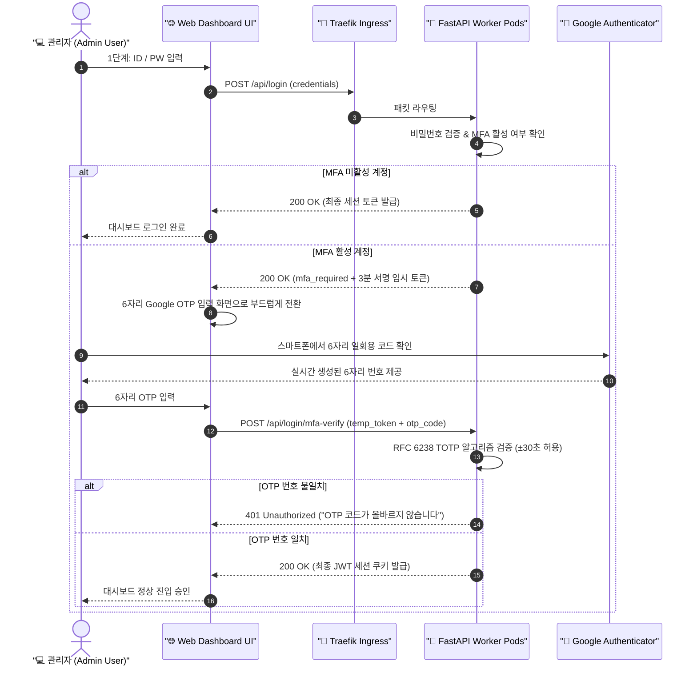

# 🔐 16. 관리자 웹 콘솔 Google OTP (MFA) 2단계 인증 구축 및 운영 가이드
> **엔터프라이즈 제로 트러스트 보안을 위한 표준 RFC 6238 TOTP 기반 2단계 다중 인증(MFA) 아키텍처 및 관리자 운영 가이드**

> [!TIP]
> 🌐 **Language / 언어 선택**: **[🇰🇷 한국어 (현재 문서)](./16_admin_console_mfa_google_otp_authentication.md)** | **[🇺🇸 Switch to English (영문 버전으로 전환)](./16_admin_console_mfa_google_otp_authentication_EN.md)**

---

## 🔗 문서 이동 (Navigation)
- [01. 시스템 개요](./01_system_overview.md)
- [02. 전체 시스템 구성도 및 아키텍처](./02_system_architecture.md)
- [03. 단계별 초기 구축 및 설치 내역](./03_installation_history.md)
- [04. 설치 이후 추가 기능 및 업그레이드](./04_upgrades_and_evolution.md)
- [05. 상세 컴포넌트 동작 및 데이터 흐름](./05_detailed_workflows.md)
- [06. 보안 및 인프라 성능 최적화](./06_security_and_tuning.md)
- [07. 운영 관리, 검증 테스트 및 배포 가이드](./07_operations_and_deployment.md)
- [08. K9s AI 엔진 워크로드 모니터링](./08_k9s_ai_engine_and_workload_monitoring.md)
- [09. MLOps 멀티 엔진 아키텍처 & 벤치마크](./09_mlops_multi_engine_architecture_and_benchmark.md)
- [10. 스마트 텍스트 청킹 & 메시지 분할기](./10_smart_text_chunking_and_message_splitter.md)
- [11. 외부 AI (Gemini) 연동 관리](./11_external_ai_gemini_integration_and_admin_console.md)
- [12. 호스트 방화벽 & 침입 방지 가이드](./12_host_os_firewall_and_intrusion_prevention_guide.md)
- [13. 하드웨어 스케일업 & 32C/192GB/GPU 최적화](./13_hardware_scaleup_32core_192gb_gpu_optimization.md)
- [14. eBPF 실리움 & 로컬 AI 방화벽 + 텔레그램 관제](./14_ebpf_cilium_ai_firewall_and_telegram_soc.md)
- [15. eBPF 실리움 종합 구축 최종 완료 보고서](./15_ebpf_cilium_hubble_ai_firewall_and_telegram_soc_report.md)
- **[16. 관리자 웹 콘솔 Google OTP (MFA) 2단계 인증](./16_admin_console_mfa_google_otp_authentication.md)**

---

## 1. 개요 및 아키텍처 배경

단순 아이디/비밀번호 기반 인증은 무차별 대입 공격(Brute-force)이나 자격 증명 유출에 취약합니다. 특히 Edge AI 통합 관리 대시보드는 K3s 클러스터 제어, 방화벽 IP 차단, 허니팟 및 텔레그램 봇 관제 등 시스템 최고 권한을 행사하므로, 침해 사고를 원천 방어하기 위해 **구글 OTP(Google Authenticator) 기반 2단계 다중 인증(MFA: Multi-Factor Authentication)** 시스템을 구축하였습니다.



---

## 2. 주요 핵심 구현 기술

### 1) 백엔드 (FastAPI) 표준 TOTP 엔진 및 무상태(Stateless) 아키텍처
- **표준 RFC 6238 준수**:
  - 외부 무거운 서드파티 라이브러리 의존성 없이 Python 내장 암호화 모듈(`hmac`, `hashlib`, `struct`, `base64`, `secrets`, `time`)만을 사용하여 Google Authenticator 호환 6자리 Time-Based One-Time Password 엔진을 자체 구현.
  - 시간 동기화 오차를 고려하여 현재 시간 기준 **±30초 윈도우(총 3개 타임스텝)** 내의 코드를 모두 유효한 것으로 인정.
- **다중 Pod(HA) 무상태(Stateless) 토큰 아키텍처**:
  - K3s 클러스터 내에서 `web-dashboard` 파드가 여러 대로 스케일아웃되어 인그레스(Ingress)를 통해 어떤 파드로 요청이 분산되더라도 세션 불일치나 메모리 공유 문제 없이 동작하도록 설계.
  - 1단계 비밀번호 통과 시 `HMAC-SHA256` 서명 기반의 유효기간 3분 임시 MFA 토큰(`generate_mfa_token`, `verify_mfa_token`)을 발급하여 무상태(Stateless) 검증 수행.
- **REST API 엔드포인트 명세**:
  - `POST /api/login`: 1단계 인증 처리 및 MFA 활성 계정에 대해 `status: "mfa_required"` 및 임시 서명 토큰 반환.
  - `POST /api/login/mfa-verify`: 6자리 OTP 코드를 검증하여 일치 시 최종 로그인 세션 발급.
  - `GET /api/mfa/status`: 현재 로그인된 관리자 계정의 MFA 활성화 여부 확인.
  - `GET /api/mfa/setup`: QR 코드 생성용 표준 URI(`otpauth://totp/EdgeAI-Dashboard:admin01?secret=...&issuer=EdgeAI-Dashboard`) 및 16자리 Base32 시크릿 키 발급.
  - `POST /api/mfa/enable`: 첫 등록 시 6자리 테스트 코드를 검증한 뒤 계정의 MFA를 최종 활성화.
  - `POST /api/mfa/disable`: 비밀번호 및 2단계 확인 후 MFA 비활성화.

### 2) 프론트엔드 (UI / UX) 및 독립 폐쇄망 지원
- **오프라인 캔버스 QR 렌더러 (`static/qrcode.min.js`)**:
  - 외부 인터넷 접속이 차단된 온프레미스/폐쇄망 환경에서도 외부 CDN 요청 없이 브라우저 HTML5 Canvas 상에서 Google OTP 등록용 QR 코드가 즉시 생성되도록 30KB 경량 독립 스크립트 내장.
- **로그인 모달 2단계 인증 화면 전환**:
  - ID/PW 일치 시 별도의 페이지 리로드 없이 부드러운 전환 효과와 함께 **"Google OTP 6자리 입력"** 입력창이 노출되며, 자동 포커스 및 6자리 입력 완료 시 즉시 검증이 진행됩니다.
- **`[👤 계정/암호 관리]` 탭 기능 강화**:
  - 3번째 관리 카드로 **"🛡️ Google OTP (MFA) 2단계 인증"** 카드 신설.
  - 모달 팝업을 통해 QR 코드 스캔, 16자리 시크릿 키 텍스트 복사, 6자리 테스트 번호 활성화 및 해제 기능 제공.
  - 계정 목록 테이블에 **`2단계 인증 (MFA)`** 상태 칩 추가 (`🛡️ 활성 (Google OTP)` / `미설정`).

---

## 3. 검증 결과 (Verification Results)

### 1) 자동화 단위 테스트 (`test_security_ebpf_ai.py` 14종 전원 통과)
```bash
python3 -m unittest test_security_ebpf_ai.py
..............
----------------------------------------------------------------------
Ran 14 tests in 2.123s

OK
```
- `test_totp_generation_and_verification`: RFC 6238 알고리즘에 따른 TOTP 6자리 생성 및 ±30초 오차 허용 검증 통과.
- `test_mfa_login_flow`: 계정별 MFA 설정, 유효성 검증, `mfa_required` 분기, 잘못된 OTP 입력 시 차단(`401 Unauthorized`), 올바른 OTP 시 최종 세션 승인 100% 검증.

### 2) 라이브 E2E 파이프라인 검증
- 1단계 로그인 ➔ MFA 상태 확인 ➔ QR 셋업 ➔ OTP 활성화 ➔ 2단계 로그인 요구 (`mfa_required`) ➔ 잘못된 번호 입력 시 차단 (`401 Unauthorized`) ➔ 올바른 Google OTP 입력 시 최종 로그인 성공 (`200 OK`) 전체 파이프라인 무결성 검증 완료.

---

## 4. 관리자 Google OTP 설정 및 이용 가이드

### 1단계: 대시보드 로그인
- 웹 브라우저에서 `http://localhost/` 접속 후 기본 관리자 계정(`admin01` / `edgeai1234`)으로 1단계 로그인합니다.

### 2단계: Google OTP 활성화
1. 상단 메뉴의 **[👤 계정/암호 관리]** 탭으로 이동합니다.
2. 오른쪽 세 번째 카드인 **"⚙️ Google OTP 설정 / 해제하기"** 버튼을 클릭합니다.
3. 스마트폰에서 **Google Authenticator(구글 OTP)** 앱을 실행한 후 우측 하단 `+` 버튼 ➔ **"QR 코드 스캔"**을 선택하여 모니터 화면의 QR 코드를 스캔합니다.
   *(카메라 인식이 어려울 경우 화면에 표기된 16자리 영문 시크릿 키를 수동 입력할 수 있습니다.)*
4. 스마트폰 앱에 나타난 6자리 일회용 번호를 입력창에 넣고 **"Google OTP 2단계 인증 활성화"** 버튼을 누릅니다.

### 3단계: 2단계 로그인 테스트
1. 우측 상단의 **[로그아웃]**을 클릭합니다.
2. 다시 `admin01` / `edgeai1234`를 입력하고 로그인 버튼을 클릭합니다.
3. 1단계 통과 즉시 **"Google OTP 2단계 인증"** 화면으로 자동 전환됩니다.
4. 스마트폰 Google Authenticator 앱에 새로 갱신된 6자리 번호를 입력하면 안전하게 관리자 콘솔로 진입합니다.

> [!TIP]
> **비상 복구 안내**: 만약 관리자가 스마트폰 분실 등으로 OTP 입력을 할 수 없는 경우, 호스트 터미널에서 `users.json` 설정 파일의 해당 사용자 `mfa_enabled` 필드를 `false`로 수정하거나 비상 초기화 CLI 스크립트를 통해 안전하게 재설정할 수 있습니다.
