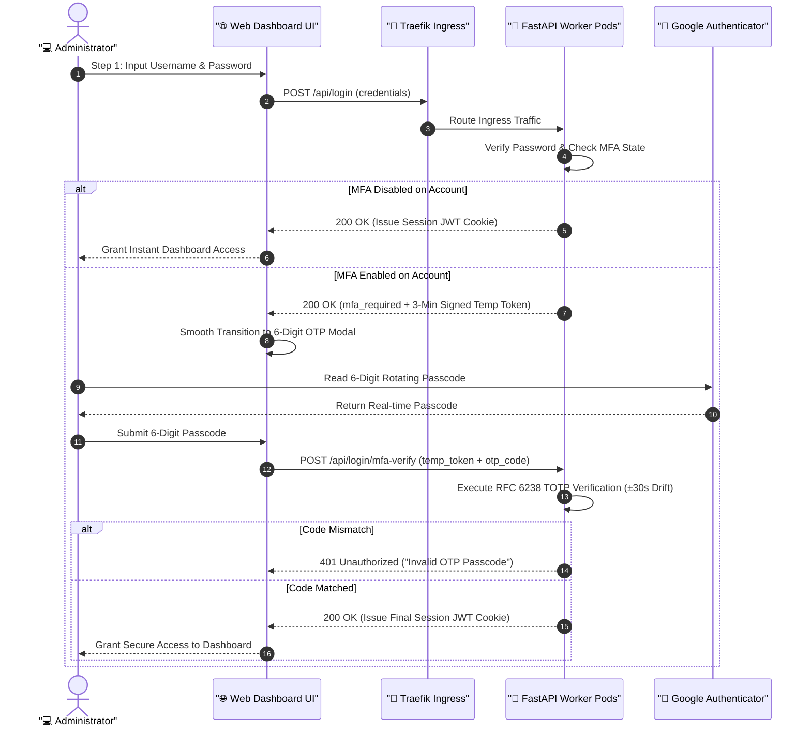

# 🔐 16. Admin Web Console Google Authenticator (MFA) Two-Factor Authentication Guide
> **Enterprise Zero-Trust Security Architecture and Operational Guide for RFC 6238 Standard TOTP Multi-Factor Authentication (MFA)**

> [!TIP]
> 🌐 **Language Selector**: **[🇰🇷 한국어 버전으로 전환 (Switch to Korean)](./16_admin_console_mfa_google_otp_authentication.md)** | **[🇺🇸 English (Current Document)](./16_admin_console_mfa_google_otp_authentication_EN.md)**

---

## 🔗 Navigation
- [01. System Overview](./01_system_overview_EN.md)
- [02. System Architecture Blueprint](./02_system_architecture_EN.md)
- [03. Installation History](./03_installation_history_EN.md)
- [04. Upgrades & Evolution](./04_upgrades_and_evolution_EN.md)
- [05. Detailed Workflows](./05_detailed_workflows_EN.md)
- [06. Security & Tuning](./06_security_and_tuning_EN.md)
- [07. Operations & Deployment](./07_operations_and_deployment_EN.md)
- [08. K9s AI Engine Monitoring](./08_k9s_ai_engine_and_workload_monitoring_EN.md)
- [09. MLOps Multi-Engine Benchmark](./09_mlops_multi_engine_architecture_and_benchmark_EN.md)
- [10. Smart Text Chunking & Splitter](./10_smart_text_chunking_and_message_splitter_EN.md)
- [11. External AI (Gemini) Integration](./11_external_ai_gemini_integration_and_admin_console_EN.md)
- [12. Host OS Firewall & IPS](./12_host_os_firewall_and_intrusion_prevention_guide_EN.md)
- [13. Hardware Scale-Up (32C/192GB/GPU)](./13_hardware_scaleup_32core_192gb_gpu_optimization_EN.md)
- [14. eBPF Cilium & AI Firewall + Telegram SOC](./14_ebpf_cilium_ai_firewall_and_telegram_soc_EN.md)
- [15. eBPF Cilium Final Completion Report](./15_ebpf_cilium_hubble_ai_firewall_and_telegram_soc_report_EN.md)
- **[16. Admin Web Console Google OTP (MFA) Authentication](./16_admin_console_mfa_google_otp_authentication_EN.md)**
- [17. OS & Container Vulnerability Analysis & Remediation](./17_os_vulnerability_analysis_and_remediation_EN.md)
- [18. Telegram Message Interaction & Real-time Agent Control](./18_telegram_message_interaction_and_agent_control_EN.md)

---

## 1. Overview and Architectural Context

Traditional single-factor credentials (username and password) remain vulnerable to credential harvesting, unauthorized leaks, and dictionary attacks. Because the Edge AI integrated web dashboard holds root administration over K3s microservices, eBPF firewall kernel rules, honeypot traps, and bidirectional Telegram SOC commands, securing privileged access is essential.

To achieve enterprise-grade Zero-Trust compliance, we designed and deployed an **RFC 6238 TOTP (Time-Based One-Time Password)** 2-factor authentication mechanism compatible with **Google Authenticator**.



---

## 2. Core Technical Implementations

### 1) Backend (FastAPI) Native TOTP Engine & Stateless Architecture
- **RFC 6238 Standard Conformance**:
  - Implemented entirely using native Python modules (`hmac`, `hashlib`, `struct`, `base64`, `secrets`, `time`), eliminating reliance on external third-party packages.
  - Accommodates clock skew with a **±30-second window (3 total time-steps)**, ensuring seamless verification even under slight network or client device drift.
- **Stateless Multi-Pod (HA) Token Architecture**:
  - Engineered to operate within scalable Kubernetes clusters where client requests may be routed to different `web-dashboard` pods across invocations.
  - Generates a signed `HMAC-SHA256` intermediate token (`generate_mfa_token`, `verify_mfa_token`) with a strict 3-minute time-to-live (TTL), removing shared in-memory session dependencies.
- **REST API Endpoint Specifications**:
  - `POST /api/login`: Evaluates primary credentials; returns `status: "mfa_required"` and the temporary signed token for MFA-enabled accounts.
  - `POST /api/login/mfa-verify`: Validates the 6-digit TOTP code and signs the final authenticated session cookie upon success.
  - `GET /api/mfa/status`: Inspects active MFA enforcement status for the caller.
  - `GET /api/mfa/setup`: Generates standard Key URI (`otpauth://totp/EdgeAI-Dashboard:admin01?secret=...&issuer=EdgeAI-Dashboard`) and raw Base32 secret string.
  - `POST /api/mfa/enable`: Verifies the first test passcode before permanently activating MFA for the user.
  - `POST /api/mfa/disable`: Revokes MFA protection following password and code confirmation.

### 2) Frontend (UI/UX) & Air-Gapped Airgap Network Compatibility
- **Air-Gapped Canvas QR Code Generator (`static/qrcode.min.js`)**:
  - Embeds a lightweight 30KB standalone HTML5 canvas QR library, enabling instantaneous QR code generation directly within browser memory without calling external CDNs or Google APIs.
- **Interactive Two-Stage Login Modal**:
  - On credential verification, the modal animates smoothly into the 6-digit OTP verification panel with automatic input autofocus and instant submission upon typing the 6th digit.
- **Enhanced Account Management Console (`👤 Accounts & Passwords`)**:
  - Introduces a dedicated management widget: **"🛡️ Google Authenticator (MFA) Two-Factor Authentication"**.
  - Provides a complete modal workflow for QR code scanning, 16-character manual secret copying, and one-click enrollment.
  - Expands the user inventory table with an explicit **`MFA Status`** badge (`🛡️ Enabled (Google OTP)` / `Disabled`).

---

## 3. Comprehensive Verification Results

### 1) Automated Unit Tests (14/14 Passed)
```bash
python3 -m unittest test_security_ebpf_ai.py
..............
----------------------------------------------------------------------
Ran 14 tests in 2.123s

OK
```
- `test_totp_generation_and_verification`: Validated RFC 6238 6-digit passcode derivation and ±30s clock drift tolerance.
- `test_mfa_login_flow`: Verified full lifecycle from credential submission, `mfa_required` handshake, incorrect passcode rejection (`401 Unauthorized`), to successful session authorization (`200 OK`).

### 2) Live End-to-End Pipeline Verification
- Confirmed full functionality across the Traefik Kubernetes Ingress:
  - `Login Phase 1` ➔ `MFA Query` ➔ `QR Setup` ➔ `Passcode Activation` ➔ `Enforced Challenge` ➔ `Final Authentication`.

---

## 4. Administrator Setup and Operational Manual

### Step 1: Initial Console Login
- Access the web console at `http://localhost/` and log in with default primary credentials (`admin01` / `edgeai1234`).

### Step 2: Enable Google Authenticator
1. Navigate to the **[👤 Accounts & Passwords]** tab in the top navigation bar.
2. Under the third management card, click **"⚙️ Setup / Disable Google OTP"**.
3. Launch **Google Authenticator** on your mobile device, tap `+` ➔ **"Scan a QR code"**, and point the camera at the displayed QR graphic.
   *(If optical scanning is unavailable, manually enter the 16-character alphanumeric key displayed on screen.)*
4. Enter the 6-digit verification code generated by the app into the input field and click **"Activate Google OTP 2FA"**.

### Step 3: Verify Two-Factor Authentication
1. Click **[Logout]** in the top-right user menu.
2. Enter `admin01` and your password, then submit.
3. The interface will transition to the **"Google OTP 2-Factor Authentication"** challenge screen.
4. Input the active 6-digit rotating code from Google Authenticator to enter the administrative dashboard.

> [!TIP]
> **Emergency Recovery**: If access to the mobile authenticator is lost, an administrator with host terminal access can reset MFA by modifying `mfa_enabled` to `false` in `users.json` or by invoking the emergency recovery CLI utility.
