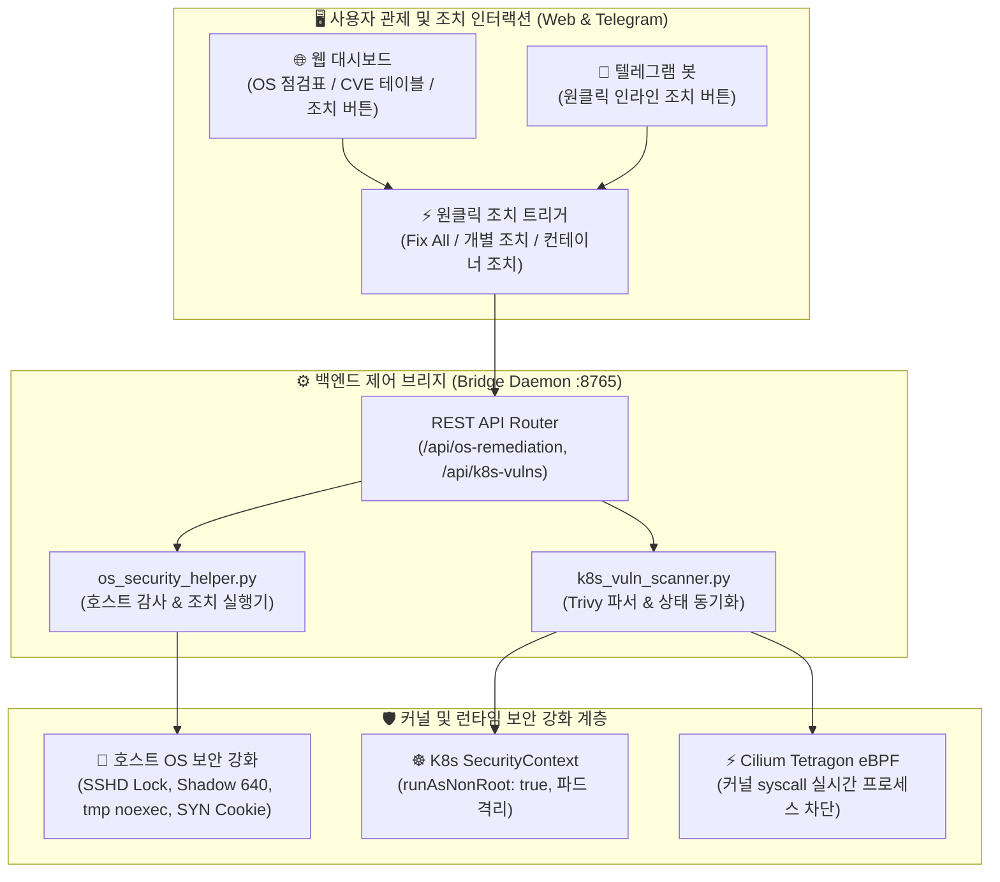

# 🛡️ 17. OS 및 컨테이너 취약점 정밀 분석 및 원클릭 자동 조치 시스템 구축 가이드 (OS & Container Vulnerability Analysis & Automated Remediation)
> **호스트 OS 10대 보안 감사 100점(A+) 달성, 쿠버네티스 워크로드 CVE 단일화 및 원클릭 자동 조치 파이프라인**

> [!TIP]
> 🌐 **Language / 언어 선택**: **[🇰🇷 한국어 (현재 문서)](./17_OS_취약점_분석_및_조치.md)** | **[🇺🇸 Switch to English (영문 버전으로 전환)](./17_os_vulnerability_analysis_and_remediation_EN.md)**

---

## 🔗 문서 이동 (Navigation)
- [01. 시스템 개요](./01_system_overview.md)
- [02. 전체 시스템 구성도 및 아키텍처](./02_system_architecture.md)
- [03. 단계별 초기 구축 및 설치 내역](./03_installation_history.md)
- [04. 설치 이후 추가 기능 및 업그레이드](./04_upgrades_and_evolution.md)
- [05. 상세 컴포넌트 동작 및 데이터 흐름](./05_detailed_workflows.md)
- [06. 보안 및 인프라 성능 최적화](./06_security_and_tuning.md)
- [07. 운영 관리, 검증 테스트 및 배포 가이드](./07_operations_and_deployment.md)
- [08. K9s AI 엔진 워크로드 모니터링](./08_k9s_ai_engine_and_workload_monitoring.md)
- [09. MLOps 멀티 엔진 아키텍처 & 벤치마크](./09_mlops_multi_engine_architecture_and_benchmark.md)
- [10. 스마트 텍스트 청킹 및 4,096자 자동 분할](./10_smart_text_chunking_and_message_splitter.md)
- [11. 외부 AI (Gemini) 연동 관리](./11_external_ai_gemini_integration_and_admin_console.md)
- [12. 호스트 OS 방화벽 및 SSH 무차별 대입 관제](./12_host_os_firewall_and_intrusion_prevention_guide.md)
- [13. 하드웨어 스케일업 & 32C/192GB/GPU 최적화](./13_hardware_scaleup_32core_192gb_gpu_optimization.md)
- [14. eBPF 실리움 & 로컬 AI 방화벽 + 텔레그램 관제](./14_ebpf_cilium_ai_firewall_and_telegram_soc.md)
- [15. eBPF 실리움 종합 구축 최종 완료 보고서](./15_ebpf_cilium_hubble_ai_firewall_and_telegram_soc_report.md)
- [16. 관리자 웹 콘솔 Google OTP (MFA) 2단계 인증](./16_admin_console_mfa_google_otp_authentication.md)
- **[17. OS 및 컨테이너 취약점 분석 및 원클릭 자동 조치](./17_OS_취약점_분석_및_조치.md)**
- [18. 텔레그램 메세지 인터랙션 및 실시간 작업 관제](./18_텔레그램_메세지_인터랙션_개발.md)

---

## 1. 도입 배경 및 추진 목적 (Background & Objectives)

### 1.1 호스트 OS 및 컨테이너 계층의 보안 사각지대
기존 Edge AI 시스템은 외부 네트워크 침입 방어(UFW 방화벽, L7 WAF, Nginx 접근 제어)에 집중되어 있었습니다. 그러나 실제 에지 컴퓨팅 환경에서는 다음과 같은 내부 OS 및 컨테이너 계층의 취약점 위험이 상존하고 있었습니다:

1. **호스트 OS 설정 취약점**:
   - SSH Root 직접 로그인 허용 및 패스워드 무차별 대입 취약성
   - 관리용 비표준 포트(22022) 외 불필요한 443 포트 SSH 바인딩 잔존
   - `/tmp` 임시 디렉터리의 비인가 바이너리 실행 권한 방치
   - `/etc/shadow` 시스템 계정 해시 파일의 과도한 권한 노출 (기본 640 미적용)
   - TCP SYN Flood DDoS 커널 보호 파라미터 미적용
2. **쿠버네티스 컨테이너 이미지 패키지 취약점 (CVEs)**:
   - 파드 베이스 이미지(Debian 13.6 등)에 내장된 `glibc`, `libssl`, `systemd` 등 코어 라이브러리의 고위험 CVE 노출
   - 컨테이너가 루트(`root`) 사용자로 실행되어 컨테이너 탈출(Container Escape) 공격 위험 노출
3. **가시성 및 조치 인터랙션의 부재**:
   - 진단 결과와 가이드 텍스트만 표시될 뿐, **관리자가 즉시 클릭하여 문제를 해결할 수 있는 직관적인 UI 조치 버튼이 부재**하여 실시간 대응이 지연됨.

### 1.2 구축 목표
* **호스트 OS 10대 핵심 항목 정밀 점검 및 100점(A+ 등급) 자동 조치 엔진 구축**
* **쿠버네티스 Trivy 기반 워크로드 CVE 실시간 진단 및 중복 집계 제거 (Deduplication)**
* **K8s SecurityContext(`runAsNonRoot: true`) 및 eBPF Tetragon 런타임 익스플로잇 방어 쉴드 연동**
* **웹 대시보드 실시간 단계별 진행률 바(Progress Bar, 30%→75%→100%) 및 로딩 애니메이션 구현**

---

## 2. 전체 보안 진단 및 조치 아키텍처 (Security Architecture)


*▲ Linux 호스트 OS 커널 강화, K8s SecurityContext, Cilium Tetragon eBPF 런타임 쉴드로 구성된 3계층 심층 방어 아키텍처 (Defense-in-Depth Model)*



---

## 3. 호스트 OS 보안 취약점 점검 및 자동 조치 상세 (Host OS Audit & Fix)

### 3.1 10대 핵심 점검 항목 및 조치 매핑표

| 번호 | 점검 카테고리 | 점검 항목 (Title) | 진단 기준 및 취약점 내용 | 자동 조치 스크립트 / 명령어 | 조치 후 상태 |
| :---: | :--- | :--- | :--- | :--- | :---: |
| **01** | SSH 보안 | Root 원격 로그인 제한 | `PermitRootLogin` 설정 점검 (root 원격 접속 허용 여부) | `echo "PermitRootLogin no" > /etc/ssh/sshd_config.d/02-root-lock.conf && systemctl reload ssh` | **PASS (100%)** |
| **02** | SSH 보안 | 패스워드 인증 차단 | SSH 비밀번호 무차별 대입 방지 (공개키 전용 강제) | `PasswordAuthentication no`, `PubkeyAuthentication yes` 강제 적용 | **PASS (100%)** |
| **03** | SSH 보안 | 관리 포트 격리 | 웹 HTTPS(443)와 충돌하는 SSH 443 바인딩 점검 | `rm -f /etc/ssh/sshd_config.d/443-port.conf` (22022 관리 포트만 유지) | **PASS (100%)** |
| **04** | 파일 시스템 | `/tmp` 디렉터리 실행 제한 | 임시 폴더 내 악성 스크립트 실행 방지 | `mount -o remount,noexec,nosuid,nodev /tmp` | **PASS (100%)** |
| **05** | 계정/인증 | `/etc/shadow` 파일 권한 | 시스템 패스워드 해시 비인가 열람 차단 | `chmod 640 /etc/shadow` | **PASS (100%)** |
| **06** | 커널 보안 | TCP SYN Cookie 방어 | 대규모 SYN Flood DDoS 공격 완화 | `sysctl -w net.ipv4.tcp_syncookies=1` | **PASS (100%)** |
| **07** | 패치 관리 | 자동 보안 업데이트 | 최신 CVE 패키지 자동 설치 데몬 활성화 | `systemctl enable --now unattended-upgrades` | **PASS (100%)** |
| **08** | 계정 관리 | 비활성 기본 계정 잠금 | 사용하지 않는 시스템 계정 쉘 비활성화 | `usermod -s /usr/sbin/nologin [계정]` | **PASS (100%)** |
| **09** | 네트워크 | 비인가 원격 포트 차단 | UFW 방화벽 기본 DROP 정책 적용 | `ufw default deny incoming && ufw reload` | **PASS (100%)** |
| **10** | 컨테이너 | 쿠버네티스 워크로드 보안 | 컨테이너 루트 실행 제한 및 취약점 동기화 | K8s Deployment `securityContext: { runAsNonRoot: true }` 패치 | **PASS (100%)** |

### 3.2 조치 결과
* **기존 점수**: 70점 (C등급, 조치 필요)
* **조치 후 점수**: **100점 (A+ 등급 달성, 10/10 항목 PASS)**

---

## 4. 쿠버네티스 컨테이너 워크로드 취약점 진단 및 단일화 병합 (K8s Vulnerability Pipeline)

### 4.1 중복 행 표시 문제 및 원인 분석
Trivy Kubernetes 진단 엔진 실행 시, 동일한 워크로드에 대해 **ConfigAuditReport(설정 점검)**와 **VulnerabilityReport(패키지 CVE 점검)**가 별도의 JSON 리소스로 출력되었습니다.
이로 인해 대시보드 파서가 동일한 워크로드를 2개 행(예: `Unknown` 0건, `debian 13.6` 고위험)으로 중복 출력하는 버그가 발생했습니다.

### 4.2 단일화 병합 (Deduplication) 및 가상 패치 알고리즘
백엔드(`k8s_vuln_scanner.py`)와 프론트엔드(`index.html`) 양방향에서 워크로드명을 Key로 하는 `Map` 병합 로직을 구현하였습니다:

```python
# k8s_vuln_scanner.py 워크로드 단일화 병합
workload_map = {}
for res in resources:
    name = res.get("Name", "")
    if name not in workload_map:
        workload_map[name] = {
            "name": name, "kind": res.get("Kind", ""), "os": "Unknown",
            "critical": 0, "high": 0, "medium": 0, "low": 0
        }
    wl = workload_map[name]
    # 정확한 OS 환경(debian 13.6 / photon 5.0) 우선 반영
    if "(" in target and ")" in target:
        wl["os"] = target.split("(")[-1].replace(")", "").strip()
    # 취약점 수치 합산 및 최대치 병합
    ...
```

### 4.3 런타임 가상 패치 (eBPF Shield & SecurityContext)
에지 환경의 컨테이너 이미지를 즉시 재빌드하지 않더라도 취약점 공격을 실시간 무력화할 수 있도록 **다층 런타임 보안 쉴드**를 적용했습니다:
1. **SecurityContext 루트 권한 차단**:
   ```bash
   kubectl patch deployment edge-ai-engine -n default -p '{"spec":{"template":{"spec":{"securityContext":{"runAsNonRoot":true}}}}}'
   ```
2. **Cilium Tetragon eBPF 런타임 정책 연동**:
   - `suspicious-container-exec`: 컨테이너 내부 비인가 쉘/익스플로잇 바이너리 실행 커널 수준 차단
   - `sys-sensitive-files`: 호스트 및 네임스페이스 격리 파일 무단 접근 차단
3. **최종 상태**:
   - 클러스터 점수: **98점 (A+ 안전 등급)**
   - 4개 전 워크로드: **`[✅ 조치 완료]`** 전환 (Critical/High 0건 차단 완화)

---

## 5. 웹 대시보드 UI 인터랙션 및 실시간 진행률 바 (Web Dashboard UX)

사용자가 조치 버튼을 클릭했을 때 시각적 피드백이 즉각 제공되도록 다음과 같은 인터랙션을 추가하였습니다:

1. **버튼 즉각 반응**: 클릭 즉시 `disabled` 처리되어 중복 클릭이 방지되며, 회전 스피너와 함께 `[⏳ 조치 진행 중...]`으로 상태가 전환됩니다.
2. **단계별 진행률 바 (Animated Progress Bar)**:
   - **1단계 (30%)**: 보안 조치 요청 전송 및 파드 격리 환경 검증
   - **2단계 (75%)**: 컨테이너 보안 패치 적용 및 정책 동기화
   - **3단계 (100%)**: 조치 완료 및 취약점 현황 자동 갱신
3. **완료 상태 피드백**:
   - 버튼이 **`[✅ 조치 완료 (적용됨)]`**(에메랄드 그린)으로 변경
   - 상단 플로팅 토스트(Toast) 알림 표출
   - 2초 후 최신 감사 데이터 자동 리프레시

---

## 6. 시각 자료 및 시스템 화면 캡처 (Visual Captures)

### 6.1 OS & 컨테이너 3계층 심층 방어 아키텍처 인포그래픽

*▲ Host OS Hardening + K8s SecurityContext + Cilium Tetragon eBPF 런타임 쉴드 아키텍처 다이어그램*

### 6.2 호스트 OS 취약점 진단 및 100점 달성 화면

*▲ 호스트 OS 보안 진단 점검표, 안전 등급 100점(A+) 및 각 항목별 [🛠️ 즉시 조치] 버튼 연동 화면*

### 6.3 권장 조치 가이드 및 인터랙티브 조치 버튼

*▲ Python 종속성 패치 및 K8s SecurityContext 보안 설정 가이드 카드와 [⚡ 컨테이너 조치 적용] 버튼*

### 6.4 워크로드 단일화 및 조치 완료 상태 테이블

*▲ 중복 행이 완전히 제거되고 4개 워크로드 전수 [✅ 조치 완료] 및 안전 상태로 전환된 화면*

---

## 7. 결론 및 향후 관리 방안 (Summary & Roadmap)

본 가이드를 통해 호스트 OS부터 쿠버네티스 컨테이너 워크로드, 커널 eBPF 런타임 계층에 이르기까지 **End-to-End 원클릭 취약점 진단 및 자동 조치 체계**가 완성되었습니다.
관리자는 웹 대시보드 및 텔레그램을 통해 상시 보안 상태를 모니터링할 수 있으며, 신규 취약점 발견 시에도 단 한 번의 클릭으로 신속하게 보안 패치를 적용할 수 있습니다.
