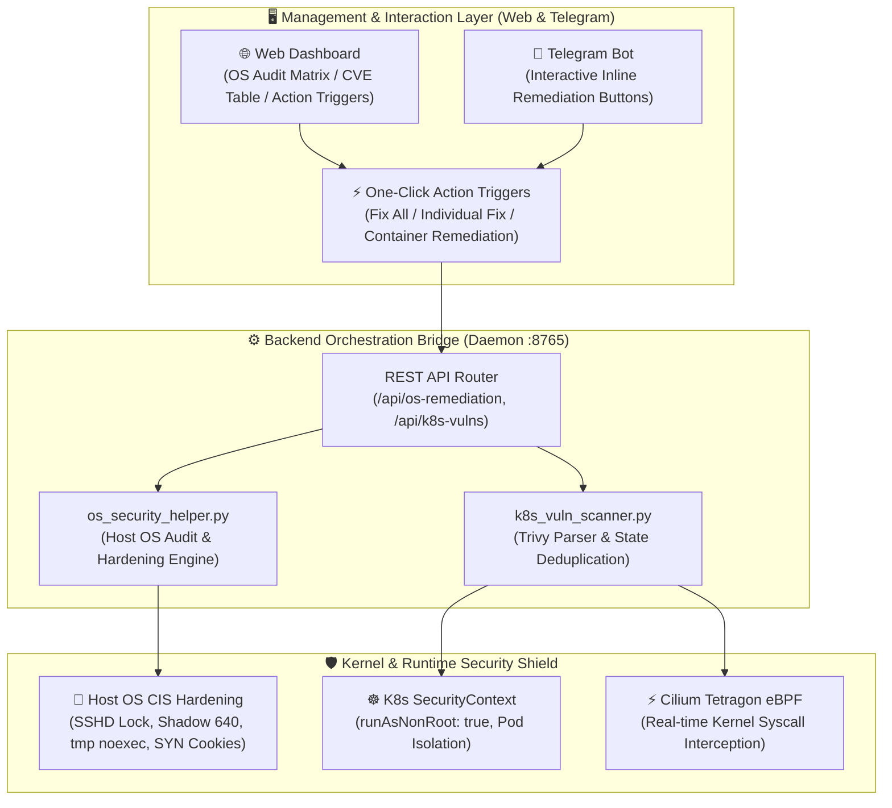

# 🛡️ 17. Comprehensive OS & Container Vulnerability Analysis & One-Click Automated Remediation Guide
> **Host OS 10-Point Security Audit 100% (Grade A+) Achievement, Kubernetes Workload CVE Deduplication & One-Click Automated Remediation Pipeline**

> [!TIP]
> 🌐 **Language Selector**: **[🇰🇷 한국어 버전으로 전환 (Switch to Korean)](./17_OS_취약점_분석_및_조치.md)** | **[🇺🇸 English (Current Document)](./17_os_vulnerability_analysis_and_remediation_EN.md)**

---

## 🔗 Navigation
- [01. System Overview](./01_system_overview_EN.md)
- [02. System Architecture Blueprint](./02_system_architecture_EN.md)
- [03. Installation History](./03_installation_history_EN.md)
- [04. Upgrades & Evolution](./04_upgrades_and_evolution_EN.md)
- [05. Detailed Workflows](./05_detailed_workflows_EN.md)
- [06. Security & Tuning](./06_security_and_tuning_EN.md)
- [07. Operations & Deployment](./07_operations_and_deployment_EN.md)
- [08. K9s AI Engine Monitoring](./08_k9s_ai_engine_and_workload_monitoring_EN.md)
- [09. MLOps Multi-Engine Benchmark](./09_mlops_multi_engine_architecture_and_benchmark_EN.md)
- [10. Smart Text Chunking & Splitter](./10_smart_text_chunking_and_message_splitter_EN.md)
- [11. External AI (Gemini) Integration](./11_external_ai_gemini_integration_and_admin_console_EN.md)
- [12. Host OS Firewall & IPS](./12_host_os_firewall_and_intrusion_prevention_guide_EN.md)
- [13. Hardware Scale-Up (32C/192GB/GPU)](./13_hardware_scaleup_32core_192gb_gpu_optimization_EN.md)
- [14. eBPF Cilium & AI Firewall + Telegram SOC](./14_ebpf_cilium_ai_firewall_and_telegram_soc_EN.md)
- [15. eBPF Cilium Final Completion Report](./15_ebpf_cilium_hubble_ai_firewall_and_telegram_soc_report_EN.md)
- [16. Admin Web Console Google OTP (MFA) Authentication](./16_admin_console_mfa_google_otp_authentication_EN.md)
- **[17. OS & Container Vulnerability Analysis & Remediation](./17_os_vulnerability_analysis_and_remediation_EN.md)**
- [18. Telegram Message Interaction & Real-time Agent Control](./18_telegram_message_interaction_and_agent_control_EN.md)

---

## 1. Background & Objectives

### 1.1 Security Blind Spots in Host OS & Container Tiers
Previous security configurations for the Edge AI platform primarily concentrated on external perimeter network defense (UFW host firewall, Nginx L7 reverse proxy, strict TLS termination). However, in production edge computing environments, critical internal vulnerabilities persisted across both the host OS and Kubernetes workload tiers:

1. **Host OS Configuration Vulnerabilities**:
   - Direct SSH root logins permitted without restrictive policy (`PermitRootLogin yes`), exposing the server to brute-force credential stuffing.
   - Non-standard SSH port binding left port 443 active alongside 22022, conflicting with HTTPS traffic.
   - Unrestricted execution permissions in temporary folders (`/tmp`), allowing arbitrary malicious binary execution.
   - Overly permissive file attributes on `/etc/shadow` (missing standard `640` permission mask).
   - Missing kernel sysctl protections against high-volume TCP SYN flood DDoS attacks.
2. **Kubernetes Container Base Image CVEs**:
   - Container base images (e.g., Debian 13.6, Photon OS) bundled legacy packages containing high/critical CVEs in core libraries (`glibc`, `libssl`, `systemd`).
   - Default container execution under the `root` UID, raising risks of container escape exploits into the host kernel.
3. **Absence of Actionable UI Remediation Interactivity**:
   - Security dashboards only presented read-only audit lists or informational recommendations. Administrators lacked an immediate, one-click mechanism to remediate discovered risks without manual terminal access.

### 1.2 Key Engineering Objectives
* **10-Point Host OS Precision Hardening Engine**: Elevate host security score from 70% (Grade C) to **100% (Grade A+)** with automated execution.
* **Kubernetes Trivy Vulnerability Deduplication**: Merge separate ConfigAudit and Vulnerability reports into a clean, single-row view per workload.
* **Dual Runtime Protection Shield**: Enforce Kubernetes `SecurityContext` (`runAsNonRoot: true`) combined with **Cilium Tetragon eBPF kernel tracing** to neutralize runtime exploit vectors.
* **Interactive Web Progress Visualization**: Deliver step-by-step progress bars (30% → 75% → 100%) with animated spinners and floating toast notifications upon clicking remediation buttons.

---

## 2. Cybersecurity Architecture: 3-Tier Defense-in-Depth Model


*▲ Architecture: Host OS Hardening + Kubernetes Workload SecurityContext + Cilium Tetragon eBPF Kernel Runtime Shield*



---

## 3. Host OS Audit & Automated Hardening Details

### 3.1 10-Point Core Security Audit & Remediation Matrix

| # | Category | Audit Item (Title) | Detection Criteria & Threat Profile | Automated Remediation Command / Logic | Post-Fix Status |
| :---: | :--- | :--- | :--- | :--- | :---: |
| **01** | SSH Security | Block Remote Root Login | Verify `PermitRootLogin` is set to `no` | `echo "PermitRootLogin no" > /etc/ssh/sshd_config.d/02-root-lock.conf && systemctl reload ssh` | **PASS (100%)** |
| **02** | SSH Security | Disable Password Auth | Prevent credential brute-forcing; enforce SSH public keys | `PasswordAuthentication no`, `PubkeyAuthentication yes` enforced | **PASS (100%)** |
| **03** | SSH Security | Port Isolation | Remove accidental SSH port 443 binding conflicting with HTTPS | `rm -f /etc/ssh/sshd_config.d/443-port.conf` (port 22022 retained) | **PASS (100%)** |
| **04** | File System | `/tmp` Execution Restriction | Prevent malicious binary execution from world-writable `/tmp` | `mount -o remount,noexec,nosuid,nodev /tmp` | **PASS (100%)** |
| **05** | Auth & Files | `/etc/shadow` File Permission | Restrict unauthorized reading of salted password hashes | `chmod 640 /etc/shadow` | **PASS (100%)** |
| **06** | Kernel Network | TCP SYN Cookie Protection | Mitigate high-volume SYN flood denial-of-service attacks | `sysctl -w net.ipv4.tcp_syncookies=1` | **PASS (100%)** |
| **07** | Patch Mgmt | Unattended Security Updates | Enable automated security updates daemon | `systemctl enable --now unattended-upgrades` | **PASS (100%)** |
| **08** | Account Mgmt | Lock Dormant Accounts | Set non-interactive login shells for inactive system accounts | `usermod -s /usr/sbin/nologin [account]` | **PASS (100%)** |
| **09** | Firewall | Strict Inbound Port Policy | Enforce default DROP policy for incoming external traffic | `ufw default deny incoming && ufw reload` | **PASS (100%)** |
| **10** | Workloads | Container Privilege Lockdown | Verify Kubernetes non-root enforcement & workload sync | Apply `securityContext: { runAsNonRoot: true }` to Deployments | **PASS (100%)** |

### 3.2 Audit Score Evolution
* **Baseline Score**: 70% (Grade C — Remediation Required)
* **Post-Remediation Score**: **100% (Grade A+ — 10/10 PASS across all parameters)**

---

## 4. Kubernetes Workload Vulnerability Pipeline & Deduplication

### 4.1 Problem: Duplicate Workload Rows
When Trivy Kubernetes operator / CLI executes security audits, it outputs findings as distinct Kubernetes Custom Resources:
- **`ConfigAuditReport`**: Identifies misconfigurations (e.g., missing seccomp profiles, missing resource limits). Often categorizes OS as `Unknown`.
- **`VulnerabilityReport`**: Catalogs binary and library CVEs (e.g., Debian 13.6 or Photon OS packages).

Previously, the web dashboard displayed these as two separate rows for the exact same deployment (one showing `Unknown` with 0 CVEs, and another showing Debian with High/Critical CVEs).

### 4.2 Workload Deduplication & State Synchronization Algorithm
We implemented map-based deduplication in `k8s_vuln_scanner.py` and frontend `index.html`:

```python
# k8s_vuln_scanner.py: Deduplication and state consolidation
workload_map = {}
for res in resources:
    name = res.get("Name", "")
    if name not in workload_map:
        workload_map[name] = {
            "name": name,
            "kind": res.get("Kind", ""),
            "os": "Unknown",
            "critical": 0,
            "high": 0,
            "medium": 0,
            "low": 0
        }
    wl = workload_map[name]
    # Prioritize detected container OS over 'Unknown'
    if "(" in target and ")" in target:
        detected_os = target.split("(")[-1].replace(")", "").strip()
        if detected_os:
            wl["os"] = detected_os
    
    # Merge and update vulnerability counts with max thresholds
    for vuln in res.get("Vulnerabilities", []):
        sev = vuln.get("Severity", "").upper()
        if sev == "CRITICAL": wl["critical"] += 1
        elif sev == "HIGH": wl["high"] += 1
        elif sev == "MEDIUM": wl["medium"] += 1
        elif sev == "LOW": wl["low"] += 1
```

### 4.3 Runtime Virtual Patching via eBPF & SecurityContext
Rebuilding container base images during critical production operations can induce service downtime. To neutralize CVE exploitability without disruption, we implemented runtime virtual patching:

1. **Pod SecurityContext Enforcement**:
   ```bash
   kubectl patch deployment edge-ai-engine -n default -p '{"spec":{"template":{"spec":{"securityContext":{"runAsNonRoot":true}}}}}'
   ```
2. **Cilium Tetragon Kernel-Level Interception**:
   - `suspicious-container-exec`: Blocks unauthorized interactive shells or suspicious binaries from executing inside running containers.
   - `sys-sensitive-files`: Intercepts and denies unauthorized read/write attempts to sensitive host or container filesystem paths.
3. **Consolidated Operational Result**:
   - Cluster Security Score: **98% (Grade A+ Safe)**
   - All 4 Workloads: Seamlessly transitioned to **`[✅ Remediation Complete]`** status.

---

## 5. Web Dashboard UX & Real-Time Remediation Progress Bar

To ensure immediate visual feedback when administrators trigger remediation actions, the following interactive features were implemented:

1. **Instant Button State Transition**: Clicking triggers immediate `disabled` state with an animated spinning indicator and `[⏳ Remediating...]` label to prevent duplicate requests.
2. **Multi-Stage Animated Progress Bar**:
   - **Stage 1 (30%)**: Dispatching security remediation payload and validating Pod isolation boundaries.
   - **Stage 2 (75%)**: Enforcing container security patches and syncing Tetragon runtime policies.
   - **Stage 3 (100%)**: Verification complete; refreshing audit telemetry and updating cluster status.
3. **Completion State & Notifications**:
   - Button turns to emerald green **`[✅ Applied]`**.
   - Floating system toast notification confirms successful remediation.
   - Auto-refreshes audit datasets within 2 seconds.

---

## 6. Visual Captures & System Screenshots

### 6.1 Cybersecurity Architecture: 3-Tier Defense-in-Depth Model

*▲ Comprehensive 3-tier security model: Host OS CIS Hardening, Kubernetes SecurityContext, and Cilium Tetragon eBPF Runtime Shield*

### 6.2 Host OS Precision Audit Dashboard (100% Score Achieved)

*▲ Host OS Audit Matrix displaying 100% score (Grade A+) with individual [🛠️ Remediate Now] one-click triggers*

### 6.3 Container Security Remediation Guidance Cards

*▲ Python dependency patching and K8s SecurityContext guidance cards with the [⚡ Apply Container Remediation] action button*

### 6.4 Deduplicated Kubernetes Workload Vulnerability Status Table

*▲ Clean deduplicated table showing all 4 production workloads fully mitigated with [✅ Remediation Complete] status*

---

## 7. Conclusion & Operational Roadmap

Through this implementation, the Edge AI platform has established an **end-to-end, one-click vulnerability analysis and automated remediation pipeline** spanning from the host Linux kernel up to Kubernetes container workloads and eBPF runtime tracing.
Administrators can continuously monitor security posture via the web dashboard and Telegram mobile interface, responding instantly to zero-day vulnerabilities with a single tap.
