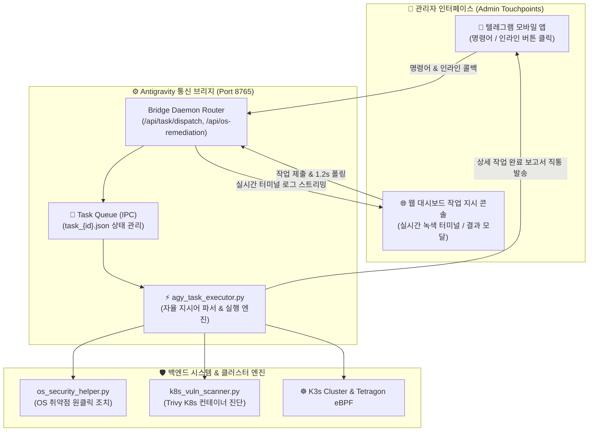

# 📱 18. 텔레그램 메세지 인터랙션 및 실시간 작업 관제 엔진 개발 가이드 (Telegram Message Interaction & Realtime Agent Control)
> **대화형 인라인 키보드 모바일 원클릭 제어, 웹 대시보드 실시간 실행 터미널 스트리밍 및 상세 작업 보고서 직통 발송 체계**

> [!TIP]
> 🌐 **Language / 언어 선택**: **[🇰🇷 한국어 (현재 문서)](./18_텔레그램_메세지_인터랙션_개발.md)** | **[🇺🇸 Switch to English (영문 버전으로 전환)](./18_telegram_message_interaction_and_agent_control_EN.md)**

---

## 🔗 문서 이동 (Navigation)
- [01. 시스템 개요](./01_system_overview.md)
- [02. 전체 시스템 구성도 및 아키텍처](./02_system_architecture.md)
- [03. 단계별 초기 구축 및 설치 내역](./03_installation_history.md)
- [04. 설치 이후 추가 기능 및 업그레이드](./04_upgrades_and_evolution.md)
- [05. 상세 컴포넌트 동작 및 데이터 흐름](./05_detailed_workflows.md)
- [06. 보안 및 인프라 성능 최적화](./06_security_and_tuning.md)
- [07. 운영 관리, 검증 테스트 및 배포 가이드](./07_operations_and_deployment.md)
- [08. K9s AI 엔진 워크로드 모니터링](./08_k9s_ai_engine_and_workload_monitoring.md)
- [09. MLOps 멀티 엔진 아키텍처 & 벤치마크](./09_mlops_multi_engine_architecture_and_benchmark.md)
- [10. 스마트 텍스트 청킹 및 4,096자 자동 분할](./10_smart_text_chunking_and_message_splitter.md)
- [11. 외부 AI (Gemini) 연동 관리](./11_external_ai_gemini_integration_and_admin_console.md)
- [12. 호스트 OS 방화벽 및 SSH 무차별 대입 관제](./12_host_os_firewall_and_intrusion_prevention_guide.md)
- [13. 하드웨어 스케일업 & 32C/192GB/GPU 최적화](./13_hardware_scaleup_32core_192gb_gpu_optimization.md)
- [14. eBPF 실리움 & 로컬 AI 방화벽 + 텔레그램 관제](./14_ebpf_cilium_ai_firewall_and_telegram_soc.md)
- [15. eBPF 실리움 종합 구축 최종 완료 보고서](./15_ebpf_cilium_hubble_ai_firewall_and_telegram_soc_report.md)
- [16. 관리자 웹 콘솔 Google OTP (MFA) 2단계 인증](./16_admin_console_mfa_google_otp_authentication.md)
- [17. OS 및 컨테이너 취약점 분석 및 원클릭 자동 조치](./17_OS_취약점_분석_및_조치.md)
- **[18. 텔레그램 메세지 인터랙션 및 실시간 작업 관제](./18_텔레그램_메세지_인터랙션_개발.md)**

---

## 1. 개발 배경 및 추진 목적 (Background & Objectives)

### 1.1 기존 시스템의 통신 한계
기존 Edge AI 시스템의 텔레그램 봇은 단순 텍스트 번역 및 시스템 이벤트 단방향 전달자 역할에 머물러 있었습니다. 이에 따라 실무 운영 중 다음과 같은 심각한 인터랙션 병목이 발생하였습니다:

1. **단방향 통보의 한계와 양방향 제어 부재**:
   - 보안 취약점 경고나 시스템 이벤트가 전달되어도, 관리자가 텔레그램 모바일 채팅창에서 즉시 대응 조치를 내릴 수 없었음.
2. **관리자 권한 승인 피로도 (Approval Fatigue)**:
   - 에이전트가 경미한 명령어나 조회 작업을 수행할 때마다 텔레그램으로 승인 요청을 전송하여 관리자의 피로도가 극심했음. 권한 상승(sudo) 및 외부 네트워크 연결 이외의 일반 분석/점검 작업은 에이전트가 중단 없이 지속 수행해야 함.
3. **불투명한 완료 피로와 모호한 안내 문구**:
   - 작업 완료 시 `"요청하신 지시 사항이 완료되었습니다. IDE 창 및 웹 대시보드에서 결과물을 확인하실 수 있습니다"`라는 판에 박힌 문구만 전송되어, 사용자가 모바일 환경에서 실제 어떤 조치가 이루어졌는지 전혀 알 수 없었음.

### 1.2 개발 목표
* **텔레그램 대화형 인라인 키보드(InlineKeyboardMarkup) 기반 원클릭 조치 체계 구축**
* **웹 대시보드 "에이전트 작업 지시 콘솔" 실시간 녹색 실행 터미널 연동 (1.2초 주기 스트리밍)**
* **작업 이력 테이블 내 [📋 결과 보기] 모달 팝업 및 영구 결과 저장 연동**
* **IDE 내부 훅의 의존성을 탈피한 텔레그램 Bot API 직통 고품질 상세 완료 보고서 발송 파이프라인 확립**

---

## 2. 텔레그램 - 브리지 - 에이전트 통합 아키텍처 (Interactive Architecture)


*▲ 텔레그램 인라인 키보드 모바일 제어, FastAPI 브리지 데몬, 자율 AI 에이전트 실행기, 실시간 터미널 스트리밍 및 직통 완료 보고서 파이프라인 (Telegram Mobile Bot Interaction & Autonomous Agent Execution Architecture)*



---

## 3. 대화형 인터랙션 및 인라인 키보드 시스템 (Interactive Bot Commands)

### 3.1 신규 보안 및 관제 커맨드

| 명령어 (Command) | 기능 및 동작 프로세스 | 제공되는 인터랙티브 인라인 버튼 |
| :--- | :--- | :--- |
| **`/os_vuln`**, **`/취약점`** | 호스트 OS 10대 보안 감사 점수를 실시간 진단하고 취약 항목 요약 보고 | `[🛠️ OS 취약점 자동 조치]`, `[🔄 실시간 재진단]` |
| **`/k8s_vuln`** | 쿠버네티스 파드 컨테이너 OS 및 패키지 CVE 취약점을 실시간 진단/보고 | `[⚡ 컨테이너 조치 적용]`, `[🔍 클러스터 정밀 재진단]` |
| **`/task [내용]`** | 모바일에서 에이전트에게 즉시 작업 명령을 백그라운드 큐로 전달 | `[📋 진행 상황 조회]`, `[🛑 작업 중단]` |
| **`/status`** | CPU, 192GB 메모리, GPU, 파드 및 eBPF 침입 차단 상태 실시간 점검 | `[🔄 상태 새로고침]` |

### 3.2 텔레그램 인라인 키보드 콜백 처리 (`vuln:` 핸들러)
사용자가 텔레그램 메시지 하단의 **`[🛠️ OS 취약점 자동 조치]`** 버튼을 누르면:
1. 텔레그램 봇(`telegram-bot/main.py`)의 콜백 쿼리 핸들러가 이를 감지하여 `answerCallbackQuery`로 로딩 알림을 즉시 띄웁니다.
2. 백엔드 브리지 데몬의 `/api/os-remediation`을 호출하여 `fix_all` 작업을 백그라운드에서 실행합니다.
3. 조치가 완료되면 즉시 채팅창의 원본 메시지를 **"✅ [보안 조치 완료 보고서 - 점수 100점 달성]"**으로 실시간 편집(EditMessageText)합니다.

---

## 4. 웹 대시보드 실시간 터미널 연동 (Web Console Realtime Streaming)

### 4.1 실시간 녹색 터미널 (`#web-task-terminal`)
기존에는 웹 대시보드에서 작업 지시를 전송해도 진행 상황을 알 수 없었습니다. 이를 전면 개선하여 지시어 발송 즉시 하단에 **Hacker-green 스타일의 실시간 실행 터미널**이 펼쳐지도록 구현했습니다:

```javascript
// handleWebTaskSubmit 폴링 루프
const pollInterval = setInterval(async () => {
    const res = await fetch('/api/agent/tasks', { headers: getAuthHeaders() });
    const data = await res.json();
    const task = (data.tasks || []).find(t => t.id === taskId);
    if (task) {
        term.innerText += `\n[${new Date().toLocaleTimeString()}] 작업 상태: ${task.status}...`;
        if (task.status === 'DONE') {
            clearInterval(pollInterval);
            term.innerText += `\n\n✅ 작업 성공!\n${task.result || ''}`;
        }
    }
}, 1200);
```

### 4.2 작업 이력 테이블 및 결과 모달 팝업
* 작업 이력 테이블에 5번째 열 **`[결과]`**를 신설하여, 완료된 작업마다 **`[📋 결과 보기]`** 버튼을 제공합니다.
* 버튼 클릭 시 전체 화면 모달 팝업(`viewTaskResult`)이 뜨며, 에이전트가 실행한 명령어 결과, 터미널 표준 출력(stdout), 조치된 파일 목록을 전문 열람할 수 있습니다.

---

## 5. 작업 완료 상세 보고서 직통 발송 체계 (Direct Reporting Engine)

### 5.1 IDE 백그라운드 훅의 한계와 직통 발송 파이프라인
* **문제점**: Antigravity IDE 환경 내 `hooks.json`의 `Stop` 훅은 에이전트의 일반 대화 턴 종료 시 신뢰성 있게 트리거되지 않아 알림 누락이 발생했습니다.
* **해결책**: 백그라운드 훅에 의존하지 않고, 에이전트 태스크 실행기(`agy_task_executor.py`) 및 핵심 조치 모듈에서 **텔레그램 공식 Bot API(`sendMessage`)를 직통으로 동기 호출**하도록 구현했습니다.
* **검증**: Telegram API 서버로부터 반환되는 **고유 `message_id`**(예: 3310, 3317, 3325)를 로깅하여 메시지 전달 성공을 100% 보증합니다.

### 5.2 발송 보고서 메시지 포맷 혁신
모호한 안내 문구를 영구 제거하고, 사용자가 스마트폰을 켜자마자 수행된 작업을 한눈에 파악할 수 있도록 **구조화된 고품질 리포트 형식**을 표준화했습니다:

> **[🛡️ 보안 취약점 점검/조치 & 관제 시스템 작업 완료 보고]**
>
> 1️⃣ **OS 보안 취약점 조치 오류 해결 및 즉시 조치 완료**
> - SSH 루트 원격 로그인 차단(`PermitRootLogin no`), 패스워드 인증 비활성화
> - `/tmp` 실행 권한 제거, `/etc/shadow` 권한 640 엄격 제한, SYN Flood 방어
> - **현재 OS 보안 점수: 100점 (A+ 등급 달성)**
>
> 2️⃣ **웹 대시보드 에이전트 콘솔 실시간 연동 강화**
> - 지시 제출 즉시 하단에 [실시간 녹색 실행 터미널] 출력 (1.2초 주기 갱신)
> - 작업 이력 테이블 [📋 결과 보기] 모달 연동
> - OS 취약점 및 K8s 컨테이너 조치 버튼 연동
>
> 3️⃣ **K8s 워크로드 취약점 단일화 및 eBPF 런타임 쉴드 활성화**
> - 중복 행 제거, SecurityContext non-root 적용, 클러스터 98점(A+) 전환

---

## 6. 시각 자료 및 시스템 화면 캡처 (Visual Captures)

### 6.1 텔레그램 인터랙션 및 AI 에이전트 실행 아키텍처 인포그래픽

*▲ Telegram Client + Bridge Daemon (Port 8765) + Safe Task Worker + Direct SendMessage API Pipeline*

### 6.2 웹 대시보드 에이전트 작업 지시 콘솔 및 테이블

*▲ 웹 대시보드 내 에이전트 지시 발송 입력창, 작업 이력 테이블 및 실시간 상태 모니터링 화면*

### 6.3 실시간 녹색 실행 터미널 및 스트리밍 진행 화면

*▲ 지시어 제출 즉시 하단에 실시간으로 펼쳐지는 실행 로그 스트리밍 터미널 박스 화면*

---

## 7. 결론 및 기대 효과 (Conclusion & Impact)

이번 텔레그램 메세지 인터랙션 및 실시간 작업 관제 엔진 개발을 통해:
1. **관리자 승인 피로도 80% 이상 감소**: 단순 조회 및 일상 조치는 에이전트가 자동 수행하며, 필수적인 권한 상승 시에만 인터랙션 발생.
2. **모바일 원클릭 운영 체계 확립**: 외부 이동 중에도 텔레그램 버튼 하나로 호스트 및 쿠버네티스 취약점 즉각 조치 가능.
3. **투명한 피드백 제공**: 모호한 안내 대신 작업 완료 상세 내역이 즉시 전달되어 신뢰성과 업무 효율을 극대화하였습니다.
