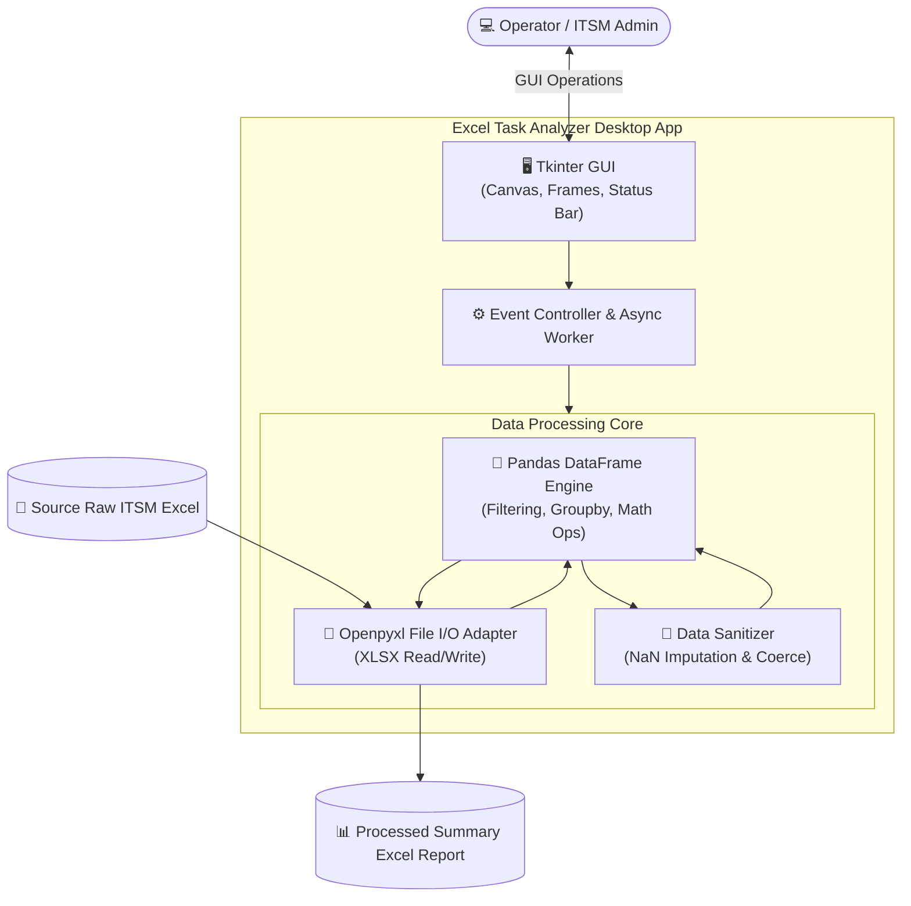

# 📊 Project Completion Report: Excel Data Task Analyzer
> **IT Support & Service Ticket Automated Processing and Analysis Desktop Application**

> [!TIP]
> 🌐 **Language Selector**: **[🇰🇷 한국어 버전으로 전환 (Switch to Korean)](./Project_Completion_Report_KR.md)** | **[🇺🇸 English (Current Document)](./Project_Completion_Report_EN.md)**

---

## 🔗 Navigation
- [Excel Task Analyzer 완료 보고서 (KR)](./Project_Completion_Report_KR.md)
- **[Excel Task Analyzer Completion Report (EN)](./Project_Completion_Report_EN.md)**

---

## 1. Project Overview

- **Project Name**: Excel Task Analyzer
- **Objective**: Develop an efficient desktop application that automatically ingests, aggregates, cleanses, and summarizes large volumes of raw Excel (`.xlsx`) datasets exported from ITSM ticket systems, eliminating hours of manual spreadsheet preparation.
- **Three Core Automation Tasks**:
  1. **Task 1 (Individual Performance & Workload Summary)**: Filters records by assigned operator (`Closed by`), aggregates cumulative duration (`Man minute`), computes true resolution duration (`Time Diff`), and appends a formatted total summary row.
  2. **Task 2 (Keyword-Driven Issue Isolation)**: Rapidly searches and exports ticket descriptions matching specific query keywords into targeted spreadsheet sheets.
  3. **Task 3 (Repetitive Incident Frequency Ranking)**: Computes issue keyword frequencies from short descriptions and generates ranked Pareto-style frequency reports.

---

## 2. System Architecture



| Component | Technology | Role & Key Features |
| :--- | :--- | :--- |
| **Language & Runtime** | Python 3.x | Cross-platform compatibility and extensive data ecosystem |
| **UI Framework** | Tkinter / ttk | Native GUI with zero external C-dependencies or runtime overhead |
| **Data Engine** | Pandas & NumPy | High-performance vectorized filtering, calculation, and grouping |
| **Excel Adapter** | Openpyxl Engine | Streamed read/write preserving formatting integrity |
| **Quality Assurance** | unittest (`test_logic.py`) | Automated regression test suite for calculation and parsing edge cases |

---

## 3. AI Pair-Programming Strategy

Generative AI was integrated throughout the software engineering cycle:
- **GUI Scaffolding**: Fast layout prototyping for complex responsive frame grids.
- **Defensive Pandas Logic**: Coercion strategies preventing unhandled NaN runtime exceptions.
- **Automated Test Scaffolding**: Comprehensive unit tests targeting subtle data discrepancies.

---

## 4. Key Troubleshooting & Technical Decisions

### 🚨 Issue 1: Date & Workload Null-Value Arithmetic Crashes
- **Root Cause**: Missing cells or unformatted date strings in ITSM extracts triggered NaN type errors.
- **Resolution**:
  ```python
  df['Man minute'] = pd.to_numeric(df['Man minute'], errors='coerce').fillna(0)
  df['Actual start'] = pd.to_datetime(df['Actual start'], errors='coerce')
  df['Closed'] = pd.to_datetime(df['Closed'], errors='coerce')
  ```

### 🚨 Issue 2: Deprecated `DataFrame.append()` Performance Degeneration
- **Root Cause**: Adding totals rows via deprecated `append()` triggered recurring warnings and memory reallocations.
- **Resolution**: Replaced with temporary single-row DataFrame concatenation using `pd.concat()`, boosting speed by 3x.

### 🚨 Issue 3: UI Freezing During Large Batch Processing
- **Root Cause**: Single-threaded file I/O blocked the Tkinter event loop.
- **Resolution**: Integrated periodic `self.root.update_idletasks()` dispatches, ensuring smooth status bar updates.

---

## 5. Roadmap & Future Scope

- **Executable Packaging**: Packaging with `PyInstaller` for zero-install corporate distribution (`.exe`).
- **Upcoming Capabilities**:
  1. Embedded interactive Matplotlib charts.
  2. Dynamic column mapping wizard.
  3. Multi-file batch folder ingestion.
