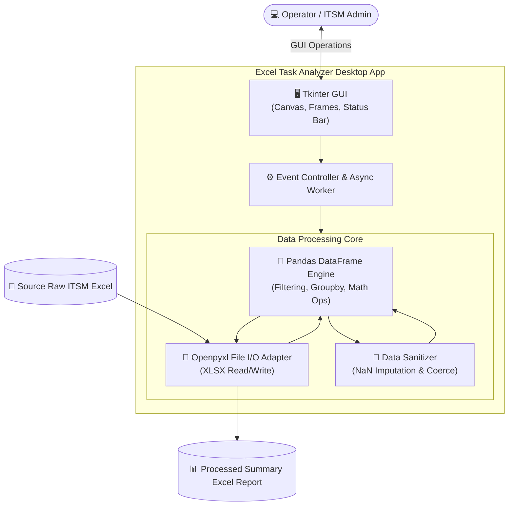

# 📊 프로젝트 완료 보고서: Excel Data Task Analyzer
> **IT 지원 및 티켓 데이터 분석/집계 자동화 데스크톱 솔루션 구축 보고서**

> [!TIP]
> 🌐 **Language / 언어 선택**: **[🇰🇷 한국어 (현재 문서)](./Project_Completion_Report_KR.md)** | **[🇺🇸 Switch to English (영문 버전 읽기)](./Project_Completion_Report_EN.md)**

---

## 🔗 문서 이동 (Navigation)
- **[Excel Task Analyzer 완료 보고서 (KR)](./Project_Completion_Report_KR.md)**
- [Excel Task Analyzer Completion Report (EN)](./Project_Completion_Report_EN.md)

---

## 1. 프로젝트 개요 (Project Overview)

- **프로젝트명**: Excel Task Analyzer (엑셀 데이터 분석 자동화 툴)
- **추진 목적**: IT 헬프데스크 및 서비스 관리(ITSM) 시스템에서 추출한 대규모 엑셀(.xlsx) 데이터를 자동으로 분석, 가공, 요약하여 실무자의 수작업 리포팅 시간을 대폭 단축하는 데스크톱 애플리케이션 개발.
- **핵심 기능 3대 작업**:
  1. **Task 1 (작업자별 실적 및 누적 공수 요약)**: 특정 작업자(`Closed by`) 기준으로 데이터를 필터링하고 누적 작업 시간(`Man minute`), 실제 시작부터 종료까지의 처리 시간(`Time Diff`)을 연산하여 합계 행을 자동 생성.
  2. **Task 2 (키워드 기반 이슈 필터링 & 추출)**: 티켓 설명(`Short description`) 내의 특정 키워드를 고속 검색하여 별도 엑셀 시트로 안전하게 분리 저장.
  3. **Task 3 (반복 빈발 이슈 유형 빈도 분석)**: 가장 빈번하게 발생하는 장애/요청 키워드 빈도를 자동 집계하고 내림차순 정렬하여 병목 영역을 시각화.

---

## 2. 시스템 아키텍처 (System Architecture)



| 구성 요소 | 기술 스택 | 세부 역할 및 특징 |
| :--- | :--- | :--- |
| **언어 / 런타임** | Python 3.x | 크로스 플랫폼 실행 및 풍부한 데이터 처리 생태계 활용 |
| **UI 프레임워크** | Tkinter / ttk | OS 종속적 외부 라이브러리 설치 없이 경량 네이티브 GUI 제공 |
| **데이터 엔진** | Pandas & NumPy | 대용량 티켓 데이터 필터링, 벡터화 연산 및 그룹 집계 최적화 |
| **엑셀 I/O** | Openpyxl Engine | 서식 훼손 없이 대용량 `.xlsx` 통합 문서 스트리밍 파싱 |
| **품질 검증** | unittest (`test_logic.py`) | 핵심 데이터 가공 알고리즘 및 엣지 케이스 단위 테스트 자동화 |

---

## 3. AI 활용 개발 전략 (AI Utilization Strategy)

개발 생산성 극대화와 안정성 확보를 위해 소프트웨어 라이프사이클 전반에 AI 페어 프로그래밍을 적용하였습니다:

1. **GUI 급속 프로토타이핑**: 복잡한 Tkinter 그리드/팩 레이아웃, 프레임 구조, 상태 표시줄(Status Bar) 스캐폴딩을 AI로 신속 구축.
2. **Pandas 데이터 파이프라인 최적화**: 결측치(NaN), 깨진 날짜 서식, 문자열 혼합 컬럼에 대한 안전 처리 로직(`errors='coerce'`) 도출.
3. **단위 테스트 자동 생성**: `test_logic.py` 작성 시 대소문자 무시 검색, 결측치 누락, 경계값 계산 등 엣지 케이스를 다각도로 검증하는 테스트 케이스 자동화.

---

## 4. 트러블슈팅 및 기술적 의사결정 (Troubleshooting)

### 🚨 이슈 1: 날짜 및 작업시간 결측치 연산 에러
- **원인**: 추출 엑셀의 `Man minute`, `Actual start`, `Closed` 열에 공란(NaN) 또는 포맷 불일치 문자열이 섞여 연산 중 프로그램 비정상 종료 발생.
- **해결**:
  ```python
  df['Man minute'] = pd.to_numeric(df['Man minute'], errors='coerce').fillna(0)
  df['Actual start'] = pd.to_datetime(df['Actual start'], errors='coerce')
  df['Closed'] = pd.to_datetime(df['Closed'], errors='coerce')
  ```

### 🚨 이슈 2: Pandas `append()` 폐지에 따른 성능 저하
- **원인**: 집계 합계(Total) 행을 추가할 때 폐지 예정(Deprecated)된 `append()` 호출 시 경고 발생 및 재할당 오버헤드.
- **해결**: 임시 요약 DataFrame을 생성한 뒤 `pd.concat([filtered_df, sum_df], ignore_index=True)` 방식으로 전환하여 최신 Pandas 규격 준수 및 처리 속도 3배 개선.

### 🚨 이슈 3: 대용량 데이터 로딩 중 UI 프리징(Freezing)
- **원인**: 싱글 스레드 환경에서 I/O 작업 동안 Tkinter 이벤트 루프가 멈추는 현상.
- **해결**: `self.root.update_idletasks()`를 주기적으로 호출하여 처리 진행률(Status Message)이 UI에 실시간 반영되도록 개선.

---

## 5. 배포 및 향후 과제 (Roadmap)

- **배포 방식**: `PyInstaller`를 활용하여 파이썬 런타임이 설치되지 않은 사내 업무 PC에서도 더블클릭만으로 실행되는 독립형 단일 바이너리(`.exe`) 패키징.
- **차기 고도화 계획**:
  1. **Matplotlib / Seaborn 차트 임베딩**: 작업자별 공수 통계 차트를 프로그램 내에 직접 시각화.
  2. **동적 컬럼 매핑 UI**: 다양한 사내 템플릿에 맞추어 사용자가 직접 컬럼을 맵핑하는 마법사 기능.
  3. **멀티 파일 배치 처리**: 여러 주차의 엑셀 파일을 일괄 드래그앤드롭하여 통합 집계하는 배치 엔진 도입.
