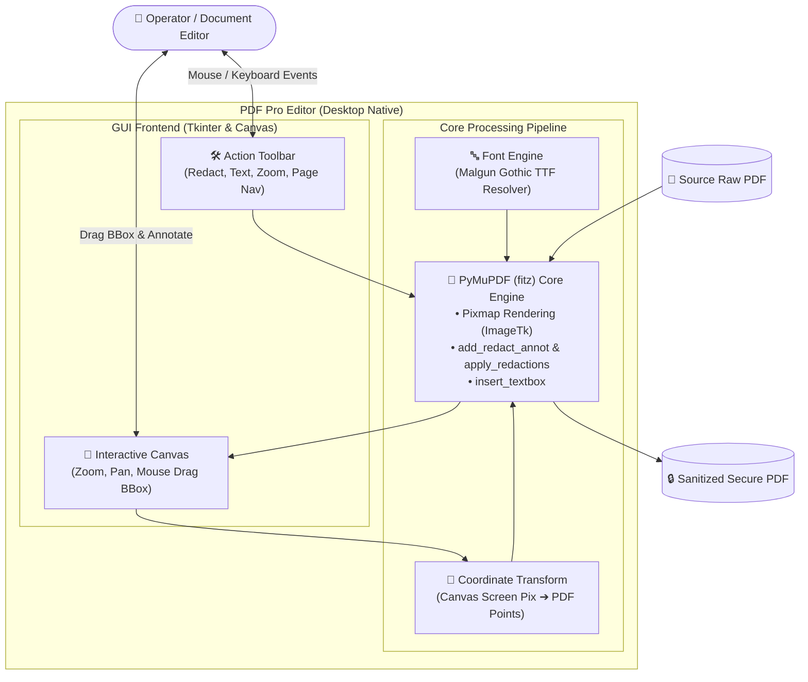

# 📄 Project Completion Report: PDF Pro Security Editor
> **Desktop Utility for Permanent PII Redaction, Text Injection, and Secure PDF Manipulation**

> [!TIP]
> 🌐 **Language Selector**: **[🇰🇷 한국어 버전으로 전환 (Switch to Korean)](./Project_Completion_Report_KR.md)** | **[🇺🇸 English (Current Document)](./Project_Completion_Report_EN.md)**

---

## 🔗 Navigation
- [PDF 프로 편집기 완료 보고서 (KR)](./Project_Completion_Report_KR.md)
- **[PDF Pro Editor Completion Report (EN)](./Project_Completion_Report_EN.md)**

---

## 1. Project Overview

This project engineered a lightweight, secure **desktop application (PDF Pro Editor)** empowering users to redact sensitive personally identifiable information (PII) and insert localized text boxes into PDF documents.

Unlike primitive cosmetic masking tools that merely overlay black rectangles over text, this solution enforces **true structural redaction** by purging underlying character stream bytes within the PDF DOM structure, guaranteeing zero possibility of data extraction or copy-paste leaks.

---

## 2. System Architecture

| Layer | Technology | Responsibilities & Architectural Profile |
| :--- | :--- | :--- |
| **Desktop GUI** | Python Tkinter & ttk | Lightweight native desktop shell with low memory footprint and fluid zoom/pan |
| **PDF Core Backend** | `PyMuPDF (fitz)` | High-throughput page rendering to Pixmap, true cryptographic redaction, and font synthesis |
| **Image Bridge** | `Pillow (PIL)` | Real-time byte buffer transformation from fitz Pixmaps into Tkinter-compatible images |
| **Typography Resolver** | System TTF Engine | Enforces system font bindings (`malgun.ttf`) preventing Korean character corruption |

---

## 3. AI-Assisted Engineering

* **2D Canvas to PDF Point Transformation**: Generative AI co-pilot accelerated the formulation of dynamic scaling matrices (`img_scale_x`, `img_scale_y`) that map screen pixel drag events accurately back to native PDF vector points across zoom ratios.
* **Cryptographic Redaction Mechanics**: Clarified structural behavioral nuances between superficial annotation layers and destructive byte purging routines (`add_redact_annot` followed by mandatory `apply_redactions`).

---

## 4. Key Troubleshooting & Technical Decisions

### 🚨 Issue 1: Superficial Masking Vulnerability
* **Incident**: Early prototypes only painted black rectangles over target regions, allowing users to highlight and copy the underlying sensitive text.
* **Remediation**: Transitioned to PyMuPDF's low-level `apply_redactions()` pipeline, permanently excising underlying font vectors from the binary stream.

### 🚨 Issue 2: Coordinate Drift Under Zoom Scaling
* **Incident**: Modifying canvas zoom ratios caused redaction bounding boxes to shift offset from the intended text.
* **Remediation**: Implemented dynamic dimensional ratio scaling, multiplying screen coordinates by reciprocal zoom factors prior to committing annotations.

### 🚨 Issue 3: CJK Character Encoding Corruption (Mojibake)
* **Incident**: Text box injections corrupted Korean characters into replacement question marks.
* **Remediation**: Dynamically resolved system font paths (`malgun.ttf`) and injected explicit `fontname="malgun"` properties into the text writer.

---

## 5. Deployment & Future Roadmap

* **Packaging**: Standalone zero-dependency executable (`.exe`) compiled via `PyInstaller`.
* **Upcoming Scope**:
  1. Multi-tier Undo/Redo historical event stack.
  2. Tabbed workspace for concurrent document comparison.
  3. AI-driven automated PII entity recognition (detecting social security numbers, credit cards, and addresses).
