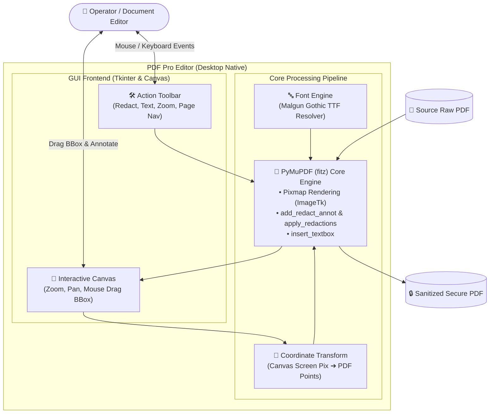

# 📄 프로젝트 완료 보고서: PDF 프로 보안 편집기 (PDF Pro Editor)
> **개인정보 보호 영구 마스킹 및 실무 텍스트 편집을 위한 데스크톱 유틸리티 구축 보고서**

> [!TIP]
> 🌐 **Language / 언어 선택**: **[🇰🇷 한국어 (현재 문서)](./Project_Completion_Report_KR.md)** | **[🇺🇸 Switch to English (영문 버전 읽기)](./Project_Completion_Report_EN.md)**

---

## 🔗 문서 이동 (Navigation)
- **[PDF 프로 편집기 완료 보고서 (KR)](./Project_Completion_Report_KR.md)**
- [PDF Pro Editor Completion Report (EN)](./Project_Completion_Report_EN.md)

---

## 1. 프로젝트 개요 (Project Overview)

본 프로젝트는 사용자가 민감한 개인정보가 포함된 PDF 문서를 안전하게 가공할 수 있도록 지원하는 **경량 데스크톱 애플리케이션(PDF 프로 편집기)** 개발을 목표로 진행되었습니다. 

단순히 글자 위에 검은색 사각형을 얹는 시각적 가림 처리를 넘어, PDF 문서 내부의 바이트 구조 자체에서 텍스트 스트림을 영구 파기하는 **'보안 마스킹(Redaction)'** 기능과 한글 인코딩이 보장된 **'사용자 정의 텍스트 상자'** 기능을 제공하여 데이터 유출을 원천 방지합니다.

---

## 2. 시스템 아키텍처 (System Architecture)

| 계층 구분 | 사용 기술 | 핵심 역할 및 특징 |
| :--- | :--- | :--- |
| **GUI 프론트엔드** | Python Tkinter & ttk | 경량 네이티브 데스크톱 환경, Canvas 기반 부드러운 스크롤 및 줌 제어 |
| **PDF 코어 엔진** | `PyMuPDF (fitz)` | 고속 렌더링(Pixmap 변환), 물리적 영구 마스킹 및 페이지 조작 |
| **이미지 가공 연동** | `Pillow (PIL)` | PyMuPDF Pixmap 바이너리를 Tkinter 호환 포맷(`ImageTk.PhotoImage`)으로 실시간 브릿지 |
| **폰트 / 인코딩** | `malgun.ttf` | Windows 환경 한글 글꼴 강제 매핑으로 텍스트 상자 저장 시 한글 깨짐 원천 방지 |

---

## 3. AI 페어 프로그래밍 전략 (AI Utilization)

* **복잡한 캔버스 2D 좌표 변환식 신속 설계**: 화면 확대/축소(Zoom) 비율 변화에 따른 마우스 드래그 좌표와 실제 PDF 포인트(Points) 간의 역산 알고리즘을 AI와의 페어 프로그래밍으로 빠르게 구현.
* **PyMuPDF 마스킹 API 최적화**: 단순 시각적 오버레이와 물리적 데이터 파기 API(`add_redact_annot` ➔ `apply_redactions`) 간의 구조적 차이를 AI 레퍼런스 분석을 통해 명확히 식별하고 안전하게 적용.

---

## 4. 핵심 트러블슈팅 및 기술적 의사결정

### 🚨 이슈 1: 마스킹 텍스트의 복사/유출 취약점
* **상황**: 초기 버전에서는 검은색 사각형 도형만을 글자 위에 오버레이하여, PDF 뷰어에서 텍스트를 드래그하여 복사할 경우 원본 글자가 그대로 노출되는 심각한 결함 발생.
* **해결**: PyMuPDF의 `add_redact_annot()`를 적용한 뒤, 명시적으로 `apply_redactions()` 함수를 호출하도록 로직을 개편하여 원본 스트림에서 바이트를 영구 삭제하도록 완벽 조치.

### 🚨 이슈 2: 화면 줌(Zoom) 시 캔버스 위치와 실제 PDF 좌표의 불일치
* **상황**: 사용자가 화면 배율을 확대/축소한 상태에서 드래그하여 지정한 영역이 실제 PDF 저장 시 엉뚱한 위치에 그려지는 문제.
* **해결**: 원본 PDF 페이지 크기와 렌더링된 픽셀 크기를 실시간 비교하는 스케일 팩터(`img_scale_x`, `img_scale_y`)를 도입하여 스크린 좌표를 PDF 내부 포인트 좌표로 정확히 변환.

### 🚨 이슈 3: PDF 내보내기 시 한글 폰트 깨짐 (Mojibake)
* **상황**: 텍스트 상자 추가 시 영문은 정상 저장되나 한글 입력 시 글자가 깨지거나 물음표로 저장되는 현상.
* **해결**: OS 기본 한글 글꼴인 `malgun.ttf`의 절대 경로를 탐색하여 `insert_textbox()` 호출 시 `fontname="malgun"`으로 강제 고정 적용.

---

## 5. 배포 및 향후 과제 (Roadmap)

* **배포 형태**: 현재 단일 파이썬 스크립트(`PDF_APPS_1.py`)에서 `PyInstaller`를 활용한 독립 실행형 `.exe` 패키징 지원.
* **차기 고도화 계획**:
  1. **다단계 Undo / Redo**: 히스토리 스택을 활용한 무제한 실행 취소/다시 실행 지원.
  2. **다중 탭(Multiple Tabs)**: 여러 PDF 문서를 동시에 탭으로 열람하며 교차 편집.
  3. **지능형 개인정보 자동 탐지(AI Redaction)**: 주민등록번호, 전화번호, 계좌번호 정규식 및 로컬 AI를 통한 원클릭 자동 마스킹 추천 기능 도입.
