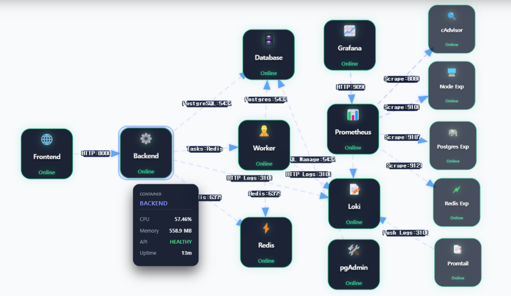
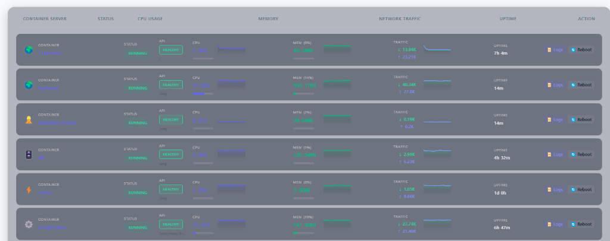
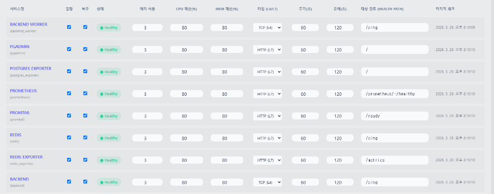

# [Phase 4] chaeyul.uk Admin Dashboard Overhaul & Advanced DevOps Integration

**Update Period**: March 22, 2026 – March 29, 2026

**Project Overview**: This phase focused heavily on establishing an enterprise-grade **DevOps Control Center** within the admin dashboard. By isolating the monitoring components and modernizing the overall UI architecture, the framework achieved unparalleled aesthetic consistency alongside real-time algorithmic performance tracking.

## 🌟 1. Key Achievements & Highlights

### DevOps Infrastructure Automation
- **Dedicated Observability Plane**: Successfully decoupled heavily populated Grafana iframes and infrastructure charting logic into an independent, lazy-loading lifecycle. This structural pivot reduced payload burdens and completely negated earlier administrative UI-blocking glitches.
- **Dynamic Chart Embedding**: Migrated static frontend HTML implementations of Grafana configurations into dynamic database-fed parameters. System administrators can now inject fresh dashboard UIDs directly without orchestrating backend redeployments.
- **Granular Service Matrix**: Transitioned away from universal health-checks to microservice-specific isolation. Support boundaries such as CPU tracking targets, L4/L7 polling `HEALTH_PATH`, interval timers, and Automated Reboot permissions are now distinctively configured per container (DB, API, Frontend, Prometheus).
- **IP Safe-Guarding**: Re-wired SSH threshold protection and login-brute-force rate limits to strictly honor system-wide admin whitelist models.

*<Figure: Service Map Node Graph detailing real-time architectural components>*

*<Figure: Modernized Container Dashboard featuring real-time HEALTH checks and reboot actions>*

*<Figure: DevOps Service Monitoring Matrix allowing L4/L7 interval tuning and auto-recovery toggles>*

### Premium Admin UI/UX Refactoring
- **Componentized Tab Architecture**: Dismantled the previous monolithic JavaScript control loop into a scalable `switchLmsTab()` tab-based switching layout. Operations including real-time user-loading and dictionary querying now execute completely asynchronously upon focal isolation, eliminating state bleeding and DOM caching bugs.
- **Real-Time Backend Querying**: Phased out limiting frontend-only object filtering for the massive dictionary base; paired frontend search-bars with Postgres `ILIKE` clauses delivering instantaneous CRUD efficiency. 
- **Premium Design Systems**: Radically purged antiquated inline CSS styles. All subsidiary dashboards are now woven under a continuous, premium Utility-first CSS class umbrella (`.admin-card`, `.v3-tabs`). Subtle glassmorphic depth boundaries and harmonious colorways extensively elevate UX metrics for prolonged oversight workloads.

*<Figure: Radically reorganized Admin Interface leaning onto dynamic component sidebars>*

## 📌 2. Conclusion & Operational Impact
The integration patterns validated during Phase 4 unequivocally shifted `chaeyul.uk` from a manual web-portal to a sophisticated automated DevOps orchestrator. Compartmentalization has exponentially advanced loading speeds, whilst backend refactoring yielded an airtight architectural defense foundation for pending scale complexities.
