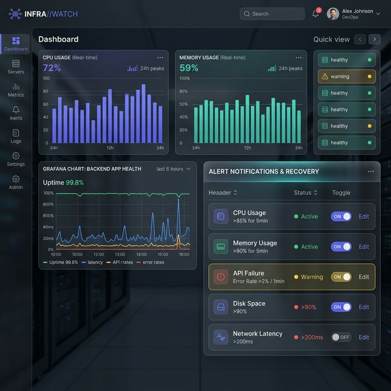
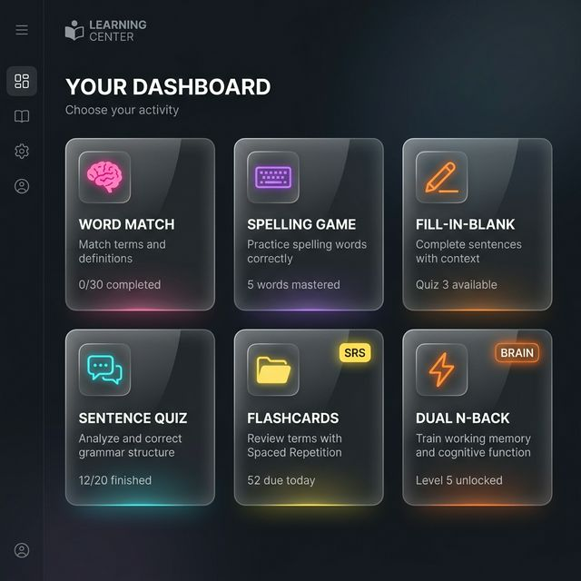
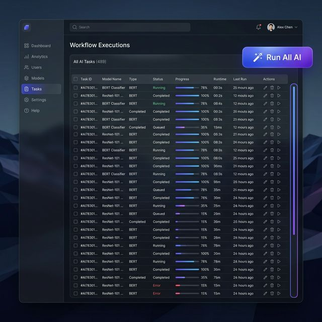
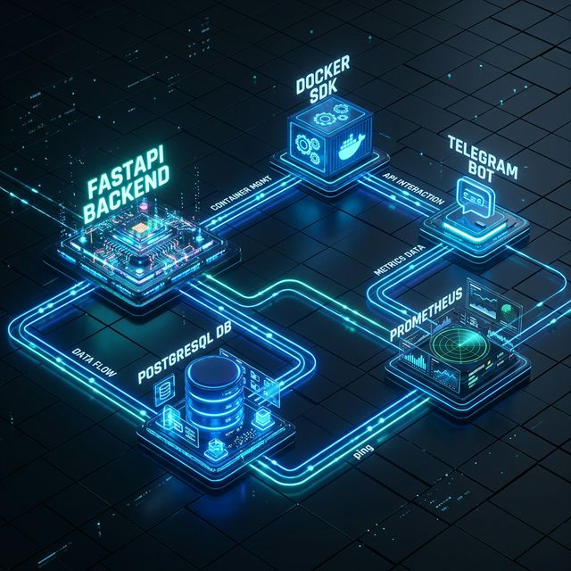
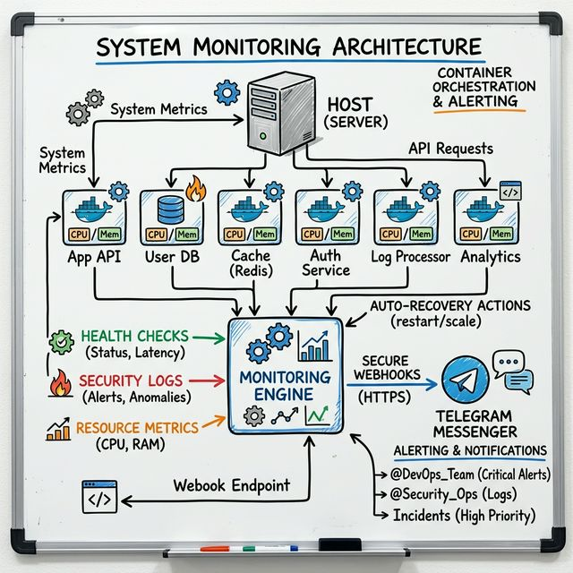

# 🚀 chaeyul.uk Final Project Completion Report (V3.0)

## 📌 1. Project Overview
This report summarizes the final completion of the 3rd enhancement phase and V3.0 pipeline deployment for the `chaeyul.uk` web service. Through this latest update, the platform has evolved beyond a simple web service by successfully integrating an **Intelligent Infrastructure Monitoring & Secure Auto-Recovery System**, a **Global Localization (i18n) Engine**, a **Smart Learning System (Flashcards)**, and a high-capacity **V3.0 Multimodal Subtitle Pipeline**.

---

## 🌟 2. Core Features & Implementations

### ① Intelligent Infrastructure Monitoring & Secure Recovery System
We built an infrastructure that detects system load and server health in real-time to minimize failure impacts and grant immediate control to administrators.
* **Premium Monitoring Dashboard**: Implemented a vertical stack design based on Glassmorphism.
* **Secured Telegram Webhook**: Prevent hacking and accomplish remote incident response through real-time monitoring alerts and a dedicated "Instant Reboot" webhook for authorized admins.

*<Figure 1: Next-Generation Monitoring Dashboard (Container Status and CPU/MEM Real-time Surveillance)>*

### ② Smart Learning System (Flashcards) & UI Integration
Combined 3D interactions and learning retention algorithms to maximize learner immersion.
* **3D Interactive Learning UI**: Applied 3D Flip effects simulating real physical cards.
* **SRS (Spaced Repetition System) Algorithm**: Custom exposure frequency auto-adjustment based on user proficiency (Known/Unknown).
* **Integrated Quiz Center**: Unified Dark Mode-based Speed Quiz, Flashcards, and Dual N-Back training.

*<Figure 2: Unified Dark Mode Learning Center UI connecting Speed Quiz, Flashcards, and Dual N-Back>*

### ③ Premium Admin Dashboard UI & Bulk AI
Innovated productivity by introducing a queue scheduler that allows one-click processing of AI-driven operational tasks.
* **Bulk AI Queue**: Automated sequential execution of complex AI workloads across the video list and database.
* **Premium Custom Scrollbars & Usability**: Full UI enhancement, overscroll prevention logic, and frontend pagination system implementation.

*<Figure 3: Polished Premium Admin Interface and Process Status View>*

### ④ Overall System & Monitoring Architecture V2
An advanced architecture diagram providing a comprehensive view of the service's data consistency and security authentication framework.

*<Figure 4: 3D Engine-Visualized Full System Data Flow & Security Architecture>*

*<Figure 5: Detailed Monitoring Drawing Visualizing Infra Health Check & Secure Auto-Recovery Mechanisms>*

---

## 💡 3. Project Achievements & Expected Impacts
- **Maximized Operational Stability**: Achieved 24/7 zero-downtime smart surveillance by preventing deadlocks at the source, adopting automated DB migrations, and building a Telegram-based auto-recovery engine.
- **Secured Global Scalability (i18n)**: Applied Incremental DOM updates using MutationObserver to completely mitigate multilingual rendering delays, even on large-scale documents and dashboards.
- **Enhanced User Experience (UX)**: Drastically improved service value through a consistent and luxurious look-and-feel provided by premium 3D UI, custom scrollbars, and a unified dark mode.
