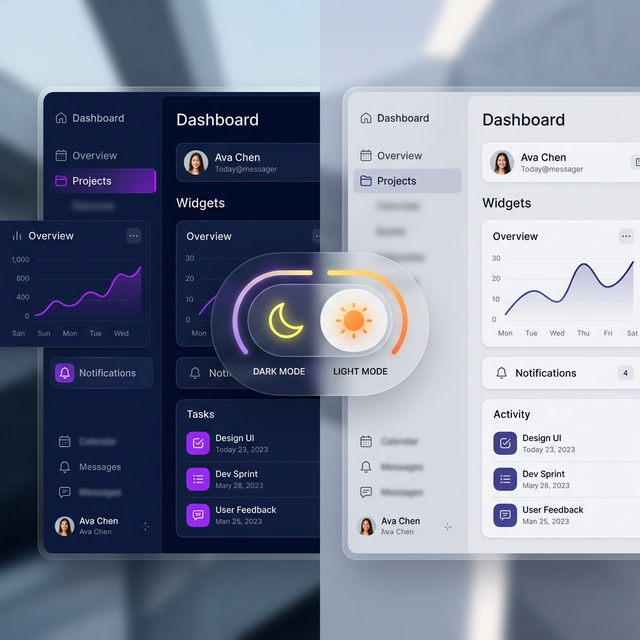

# [통합 보고서] chaeyul.uk 웹 서버 프로젝트 구축 및 장애 조치 결과

> 🇺🇸 [English Version](./PROJECT_REPORT_EN)

**최종 수정일**: 2026년 3월 10일 (스피드 퀴즈 게이미피케이션 및 CSV 데이터 인프라 고도화)
**대상 도메인**: `chaeyul.uk`
**시스템 환경**: Docker Compose 기반 컨테이너 환경
- **Frontend**: Node.js (Express)
- **Backend**: Python (FastAPI)
- **Database**: PostgreSQL 15
- **Infrastructure**: Cloudflare Proxy & Linux Server

---

## 1. 프로젝트 구축 개요
본 프로젝트는 프리미엄 미디어(사진, 동영상, 오디오) 관리 및 스트리밍을 위한 전용 웹 서버 구축을 목적으로 합니다. 고화질 미디어 보관에 최적화된 UI와 안전한 데이터 관리를 위한 백엔드 구조를 갖추고 있으며, 최종적으로 `chaeyul.uk` 도메인을 통해 외부 사용자가 접근 가능하도록 구현되었습니다.

---

## 2. 주요 구축 및 변경 사항

### ① 사용자 도메인 및 가족 공동 브랜딩 (Rebranding)
- **수정 사항**: 
    - 사이트 이름을 `CHAEEUN & CHAEYUL`로 업데이트하여 가족 공동 프로젝트의 정체성을 강화.
    - 모든 페이지의 상단 로고 텍스트를 대시보드에서 동적으로 관리할 수 있도록 개선.

### ② 외부 접속 및 라우팅 최적화
- **IP 접속 원천 차단**: 보안 강화를 위해 IP 주소를 통한 직접 접속을 차단.
- **URL 정규화 및 SPA 대응**: 루트 경로 전환 및 Single Page Application 환경 지원.
- **레이아웃 최적화**: 메인 페이지의 상단 메뉴와 플레이어 사이의 여백을 최소화하여 몰입도 높은 레이아웃 구현.
### ③ 보안 및 성능 모니터링 [NEW - 02.23]
- **모니터링 대시보드**: 실시간 접속자, 일일 방문자(IP 기준), 히트 수 및 누적 방문자 통계 시스템 구축.
- **최근 활동 로그**: 최근 로그인 성공/실패 기록을 실시간으로 확인하여 이상 징후 즉시 파악 가능.

### ④ CMS 및 파일 시스템 유연성 강화 [NEW - 02.23]
- **드래그 가능 레이아웃**: 관리자 대시보드의 각 섹션 위치를 자유롭게 변경하고 고정 가능.
- **폴더 및 파일 구조 탐색**: 브레드크럼(Breadcrumbs)을 지원하는 파일 탐색기를 통해 `public` 디렉토리 내 모든 리소스 관리.
- **이미지/리소스 업로드**: HTML뿐만 아니라 CSS, JS, 이미지 파일 업로드 기능 추가.

### ⑤ 어학 학습 인터페이스 최적화 [NEW - 02.23]
- **스마트 텍스트 선택**: 자막 선택 시 타임스탬프를 자동으로 제외하도록 로직 개선.
- **관사-명사 자동 결합**: 'die Kellnerin'과 같이 관사와 명사가 분리된 텍스트를 클릭 시 자동으로 인식하여 통합 검색 제공.
- **실시간 자막 동기화 및 자동 번역**: 영상 재생 위치에 따른 자막 실시간 하이라이트 및 한국어 자막이 없는 경우 자동 번역(DE/EN -> KO)을 통해 학습 편의성 극대화.
- **CMS 기반 레슨 관리**: 관리자 대시보드를 통해 20개 이상의 독일어 레슨 페이지를 성공적으로 업로드하고, 동적 메뉴 맵핑 기능을 통해 사이트에 즉시 반영.

### ⑥ 프리미엄 미디어 갤러리 고도화 [NEW - 02.24]
- **Masonry(벽돌쌓기) 레이아웃**: CSS Columns를 활용하여 다양한 비율의 사진을 세련되게 배치하는 프리미엄 레이아웃 구현.
- **연도별 필터링 시스템**: 사진의 메타데이터(EXIF)를 분석하여 연도별로 자동 분류하고, 사용자가 원하는 연도를 선택하여 조회할 수 있는 필터 기능 추가.
- **로컬 전처리 자동화**: 서버 업로드 전 이미지 최적화(WebP 변환, 리포팅, 메타데이터 추출)를 위한 Python 전처리 스크립트(`preprocess_images.py`) 개발.
- **Cloudflare 캐싱 최적화**: 미디어 파일에 대한 강력한 브라우저 및 CDN 캐시 헤더(1년) 설정을 통해 로딩 속도 극대화 및 서버 부하 감소.

    <div align="center">
      
      <p><i>[그림 1: Masonry 기법이 적용된 프리미엄 사진 갤러리]</i></p>
    </div>

### ⑦ 전체 시스템 모니터링 인프라 구축 (Grafana & Full Stack) [NEW - 03.07]
- **통합 시각화 (Grafana)**: Prometheus, Loki, cAdvisor 등 모든 지표를 한눈에 볼 수 있는 중앙 모니터링 센터 구축 (`/grafana/`).
- **하드웨어 및 OS 감시 (Node Exporter)**: 서버 전체의 실시간 CPU, Memory, Disk, Network I/O 및 부팅 시간 추적 (대시보드 ID: 1860).
- **도커 컨테이너 정밀 분석 (cAdvisor)**: 각 컨테이너(Database, Backend, Frontend 등)별 개별 자원 점유율 실시간 감시 (대시보드 ID: 14282).
- **로그 통합 관리 (Loki & Promtail)**: 시스템 로그 및 서비스 로그를 수집하여 특정 키워드(예: `Failed password`) 검색 및 실시간 보안 로그 분석 환경 구축.
- **보안 중심 리버스 프록시**: 모든 모니터링 툴을 외부 포트 오픈 없이 도메인 하위 경로(`/grafana/`, `/prometheus/` 등)로 안전하게 보호 및 SSL 적용.

### ⑧ 텔레그램 기반 다중 사용자 알림 및 스케줄 시스템 [NEW - 03.07]
- **개별 사용자 Chat ID 등록**: 각 사용자가 로그인 후 자신의 텔레그램 Chat ID를 직접 등록하고 저장할 수 있는 개인화 설정 기능 구축.
- **다중 발송 스케줄러**: 특정 시간에 예약된 메시지를 등록된 모든 사용자에게 순차적으로 자동 발송하는 지능형 스케줄러 구현 (`apscheduler` 활용).
- **자가 진단 및 가이드**: 사용자가 자신의 Chat ID를 쉽게 찾을 수 있도록 `@userinfobot` 연동 가이드를 UI 내에 포함.
- **관리자 통합 제어**: 관리자 대시보드 내에서 전체 알림 예약 목록을 조회, 삭제 및 즉시 테스트 메시지 발송 기능 제공.

### ⑭ 관리자 대시보드 UI/UX 전면 개편 (Sidebar Layout) [NEW - 03.08]
- **사이드바 기반 탭 인터페이스**: 기존의 복잡했던 전체 탭 구조를 고정된 왼쪽 사이드바로 통합하여 내비게이션 효율성 극대화.
- **통합 대시보드 요약 (Summary Cards)**:
    - **미디어 라이브러리/활성 계정**: 실시간 서버 자원 보유 현황 요약.
    - **누적 및 일일 방문자 통계**: 오늘 방문자(IP), 트래픽(Hits) 및 누적 총 방문자 수를 시각화된 카드 형태로 상시 노출.
- **데이터 로딩 최적화**: 탭 전환 시 필요한 데이터(사용자 목록, CMS 파일 등)만 선택적으로 자동 리로드하여 불필요한 네트워크 트래픽 감소 및 응답 속도 체감 개선.

### ⑮ 텔레그램 알림 반복 및 UI 고도화 [NEW - 03.08]
- **주간/월간 반복 알림**: 일회성 발송에 그치지 않고, '매주' 또는 '매월' 정해진 시간에 자동으로 다음 발송 건이 생성되는 반복 스케줄링 로직 구현.
- **리스트 가독성 개선**: 짙은 반투명 배경(Glassmorphism)과 표(Table) 형태의 정렬을 적용하여 저조도 환경에서도 예약 목록 확인이 용이하도록 시각적 보강.
- **테스트 사용자 선택**: 전체 사용자가 아닌 특정 사용자를 선택하여 즉시 테스트 메시지를 발송해 볼 수 있는 수신자 선택 기능 추가.

    <div align="center">
      
      <p><i>[그림 4: 사이드바와 요약 카드가 적용된 현대적 관리자 인터페이스]</i></p>
    </div>

    <div align="center">
      
      <p><i>[그림 5: 반복 주기 설정 및 고성능 리스트 뷰가 적용된 알림 관리 화면]</i></p>
    </div>

    <div align="center">
      
      <p><i>[그림 3: 각 개별 컨테이너의 자원 사용량을 실시간 추적하는 cAdvisor 시각화 화면]</i></p>
    </div>

    <div align="center">
      
      <p><i>[그림 2: Node Exporter를 통해 서버 전체 자원 현황을 실시간 모니터링하는 모습]</i></p>
    </div>

### ⑧ 갤러리 UX 고도화 및 편의 기능 [NEW - 02.24]
- **통합 검색 및 필터**: 제목 기반 실시간 검색, 미디어 종류(이미지/비디오/오디오) 필터, 연도별 필터의 다중 적용 지원.
- **인터랙티브 라이트박스**:
    - **이전/다음 탐색**: 모달 창을 닫지 않고 좌우 화살표를 통해 갤러리 전체를 탐색할 수 있는 내비게이션 추가.
    - **직접 다운로드**: 개별 미디어 파일을 원본 품질로 즉시 다운로드할 수 있는 기능 제공.
- **실시간 통계**: 현재 적용된 필터 조건에 따른 미디어 개수를 실시간으로 표시.
- **비디오 호버 미리보기**: 마우스 호버 시 비디오가 자동 재생되어 클릭 전 내용을 확인할 수 있는 프리뷰 기능 적용.

### ⑧ 비공개(Private) 갤러리 전환 [NEW - 02.24]
- **접근 제한**: 로그인하지 않은 사용자가 `gallery.html`에 접근 시 메인 페이지로 자동 리다이렉트 및 로그인 요구.
*   **API 보안**: 백엔드 `/api/photos` 및 관련 엔드포인트에 `get_current_user` 의존성을 추가하여 토큰 없이는 데이터를 조회할 수 없도록 강화.
- **홈페이지 보호**: 메인 페이지의 '최근 사진' 섹션 역시 로그인 후에만 활성화되도록 수정.

### ⑯ 관리자 보안 강화: 2단계 인증(2FA) 구글 OTP 도입 [NEW - 03.08]
- **TOTP(Time-based One-Time Password) 기반 인증**: 구글 OTP(Google Authenticator) 등 표준 OTP 앱을 활용한 2단계 인증 시스템 구축.
- **QR 코드 기반 간편 설정**: 관리자 설정 메뉴에서 QR 코드를 스캔하여 즉시 OTP를 등록할 수 있는 사용자 친화적 워크플로우 구현.
- **로그인 보안 강화**: 아이디/비밀번호가 일치하더라도 실시간 OTP 번호(6자리)를 입력해야만 접속이 가능하도록 백엔드(`PyOTP`) 및 프론트엔드 통합 보안 적용.
- **관리자 전용 제어 (2FA 초기화)**: 사용자가 기기를 분실하거나 OTP 앱을 재설치한 경우, 시스템 관리자가 계정 리스트에서 직접 해당 사용자의 2FA 설정을 초기화(Reset)할 수 있는 관리 도구 제공.

    <div align="center">
      
      <p><i>[그림 6: 보안 강화를 위한 QR 코드 기반 2단계 인증 설정 화면]</i></p>
    </div>
- **드래그 앤 드롭 수준의 편의성**: 관리자 대시보드에서 상단 메뉴 항목 옆의 위/아래(▲/▼) 화살표 버튼을 클릭하여 메뉴 출력 순서를 자유롭게 변경 가능.
- **실시간 반영 및 영속화**: 변경된 순서는 '설정 저장' 클릭 시 `settings.json`에 즉시 저장되며 사이트 전체 네비게이션바에 즉각 반영됨.

### ⑩ 학습 사용자 경험(UX) 및 테마 커스터마이징 [NEW - 02.25]
- **구간 반복 데이터 영속화**: `localStorage`를 활용하여 각 영상별 A-B 반복 설정값을 브라우저에 저장함으로써 재접속 시에도 이전 학습 구간이 자동으로 활성화됨.
- **집중 학습 모드(Focus Mode) 및 타임스탬프 제거**: 자막 영역에서 현재 재생 중인 문장만 강조하여 가독성을 높였으며, 학습 방해 요인인 시간 정보를 제거하고 전체 자막 보기 토글 기능 추가.
- **스티키(Sticky) 학습 영역 및 레이아웃 최적화**: 영상 플레이어와 자막 영역을 상단에 고정하고 동영상 리스트를 하단으로 배치하여, 스크롤 중에도 중단 없는 학습이 가능한 인터페이스 구현.
- **글로벌 다크/라이트 테마 시스템**: 사이트 전체의 배경/텍스트 색상을 한 번에 전환할 수 있는 테마 스위처를 헤더에 통합하고 사용자 설정을 영구 보존.
- **메인화면 실시간 한글 번역**: 홈페이지의 배경 유튜브 영상에 실시간 한글 번역 자막을 레이어로 추가하여 독일어 학습 홍보 효과 극대화.
- **단어장 페이지네이션 및 UI 개선**: 저장된 단어가 많아질 경우를 대비해 10개씩 끊어보는 기능을 추가하고, 라이트 모드에서의 가독성 문제를 완벽히 해결.

    <div align="center">
      
      <p><i>[그림 2: 시스템 테마에 맞춘 다크/라이트 전환 인터페이스]</i></p>
    </div>

### ⑪ 모바일 학습 환경 최적화 및 백그라운드 재생 [NEW - 02.26]
- **모바일 전용 레이아웃**: 자막 영역이 화면을 과도하게 차지하거나 하단 리스트를 가리지 않도록 모바일에서 자막 높이를 동적으로 조절하고 Sticky 설정을 최적화.
- **백그라운드 연속 재생 (MediaSession)**: 화면을 잠그거나 브라우저를 백그라운드로 전환해도 재생이 멈추지 않도록 `MediaSession` API 및 무음 오디오 유지(Silent Heartbeat) 기술 적용.
- **잠금 화면 제어**: 잠금 화면 및 알림창에서 재생/일시정지 및 구간 이동이 가능한 미디어 컨트롤 센터 기능 통합.

### ⑰ 시스템 최적화 및 보안 인프라 완비 [NEW - 03.08]
- **Cloudflare Full SSL 및 성능 최적화**: Cloudflare 프록시를 통한 SSL 암호화 통신을 기본 적용하고, CDN 캐싱 및 브라우저 캐시 정책(1년)을 통해 어셋 로딩 성능 극대화.
- **미디어 전처리 자동화**: `preprocess_images.py`를 통해 모든 이미지를 고효율 WebP 포맷으로 자동 변환하고 메타데이터를 추출하여 서빙 성능 및 저장 공간 절약.
- **2단계 인증(2FA) 실전 도입**: 구글 OTP 연동을 통해 관리자 접속 보안을 엔터프라이즈 수준으로 강화 완료.

    <div align="center">
      
      <p><i>[그림 3: 모바일 최적화 레이아웃 및 잠금 화면 제어 UI]</i></p>
    </div>

### ⑱ 단어장 게이미피케이션(Quiz) 및 데이터 자동화 인프라 [NEW - 03.10]
- **스피드 퀴즈 (Gamification)**: 나만의 단어장을 활용해 60초 동안 정답을 맞추는 스피드 퀴즈 기능 구현. Glassmorphism 기반의 세련된 시각적 인터페이스 적용 및 정답/오답에 따른 시간 가감 메커니즘 구축.
- **실시간 랭킹 리더보드**: Redis의 Sorted Set(ZSET) 자료구조를 활용해 접속 수와 관계없이 O(1) 수준의 고속으로 최고 점수 랭킹 탑(Top) 10을 집계하여 퀴즈 게임 결과창과 대기실에 실시간으로 표출.
- **CSV 대용량 확장(Admin)**: 관리자가 엑셀(CSV) 파일을 통해 '독일어 단어장'과 '회화 문장'을 한 번에 수십~수백 개씩 대량 등록/수정 할 수 있는 고성능 파싱 및 데이터베이스 삽입 API 구축 및 프론트엔드 연동.
- **텔레그램 랜덤 학습 메타**: 텔레그램 알람 스케줄러 기능에 `[RANDOM_WORDS_5]`, `[RANDOM_SENTENCES_5]` 내부 파싱 태그를 신규 도입하여, 예약 발송 시 데이터베이스에서 임의의 단어와 문장 5세트를 추출하여 사용자들의 스마트폰 텔레그램으로 자동 푸시 발송하는 지능형 마이크로 학습(Micro-learning) 로직 고도화.
- **cAdvisor 호환성 패치 (cgroup v2)**: 우분투 최신 커널의 `cgroups v2` 권한 구조에 대응 가능하도록 cAdvisor 메인 볼륨 마운트(`/sys/fs/cgroup`) 설정을 갱신하고 최신 이미지 엔진으로 패치하여, 각 기능별 하위(`sub`) 도커 컨테이너들의 상세 모니터링 분석 그래픽 UI 완벽 복구.

    <div align="center">
      
      <p><i>[그림 7: 나만의 단어장을 활용한 스피드 퀴즈 및 Redis 기반 실시간 랭킹 UI]</i></p>
    </div>

### ⑫ AI 기반 학습 보조 도구 (Smart Learning) [NEW - 03.03]
- **문맥 맞춤형 예문 자동 생성 (AI Sentence Generator)**:
    - 단어장(Wordbook)에 저장된 독일어 단어를 활용하여 **OpenAI gpt-4o-mini** 모델이 학습 수준(A1~B2)에 맞는 연습 예문을 자동 생성.
    - 각 예문은 **독일어 원문 + 영어 번역 + 한국어 번역** 3개국어로 제공되며, 사용된 단어가 태그 형태로 하이라이트됨.
    - 예문 수(3/5/8개) 및 난이도를 사용자가 직접 설정 가능.
    - 백엔드에 `POST /api/ai/generate-sentences` 엔드포인트 신규 추가.
- **STT(Speech-to-Text) 발음 교정 (Pronunciation Checker)**:
    - 브라우저 내장 **Web Speech API** (`SpeechRecognition`, `de-DE`)를 활용하여 사용자가 마이크로 독일어 문장을 읽으면 음성을 텍스트로 변환.
    - 원문 자막과 인식된 텍스트를 **Levenshtein 유사도 알고리즘**으로 단어별 비교 분석하여 정확도(%) 점수 피드백.
    - 맞은 단어(✅ 초록색)와 틀린 단어(❌ 빨간색)를 시각적으로 구분하여 직관적인 학습 가이드 제공.
    - 녹음 중 펄스 애니메이션 효과 및 실시간 인식 결과 표시로 사용자 경험 극대화.
    - **서버 비용 없이** 브라우저 내장 기능만으로 동작 (Chrome/Edge 권장).

### ⑬ 모바일 학습 UX 고도화 및 자막 싱크 개선 [NEW - 03.04]
- **동영상 목록 검색 및 페이지네이션**:
    - 66개 이상의 동영상 중 원하는 영상을 빠르게 찾을 수 있도록 **실시간 검색 필터** 추가. 제목 입력 시 즉시 필터링.
    - 한 페이지당 12개씩 표시하는 **페이지네이션** 시스템 도입으로 모바일에서의 무한 스크롤 문제 해결.
    - 모바일 화면에서 썸네일 크기를 축소하고(`minmax(140px)`) 제목을 2줄로 제한하여 한 화면에 더 많은 영상 표시.
- **저장된 구간 반복 관리 시스템**:
    - **「📋 저장된 구간」 버튼** 추가: 이전에 각 영상에서 설정한 A-B 반복 구간을 모아 볼 수 있는 전용 모달 제공.
    - 클릭 시 해당 영상으로 자동 이동 및 저장된 구간 즉시 적용.
    - 영상별 저장된 구간 존재 시 **「🔁 저장」 뱃지** 표시 및 인라인 **📥 불러오기 버튼** 제공.
    - 구간 반복 OFF 시에도 localStorage에서 삭제하지 않아 **다음 접속 시에도 재사용 가능**.
    - 개별 저장 구간 삭제 기능 포함.
- **자막 싱크(동기화) 개선**:
    - 자막 영역에 **±0.5초 단위 오프셋 조절 컨트롤**(−/+) 추가. 자막이 영상보다 늦거나 빠를 때 사용자가 직접 미세 조정 가능.
    - 조절값은 localStorage에 저장되어 **다음 접속 시 자동 적용**.
    - 자막 업데이트 방식을 `requestAnimationFrame` → **100ms 간격 `setInterval`**로 변경하여 더 정확하고 일관된 동기화.
    - **DOM 업데이트 최적화**: 활성 라인 변경 시에만 DOM을 갱신하여 불필요한 렌더링 방지.
- **이미지 지연 로딩**: 동영상 썸네일에 `loading="lazy"` 속성 적용으로 초기 페이지 로딩 성능 개선.

- **시스템 모니터링 인프라 구축 (Prometheus & cAdvisor) [NEW - 03.06]**:
    - **Prometheus**: 실시간 시계열 데이터 수집 및 저장을 위한 메인 모니터링 서버 컨테이너 구축 (`localhost:9090`).
    - **cAdvisor**: Docker 컨테이너 레벨의 리소스(CPU, 메모리, 네트워크 등) 사용량을 추적하기 위한 에이전트 연동 (`cadvisor:8080`).
    - `docker-compose.yml` 리스트에 두 서비스를 신규 추가하고, `prometheus_data` 볼륨을 마운트하여 데이터 영속성 보장.
- **관리자 대시보드 통합 (Proxy 라우팅)**:
    - 보안 강화를 위해 Prometheus와 cAdvisor 포트를 외부망으로 강제 노출하지 않고, Node.js (`server.js`) 리버스 프록시를 통해 내부망으로 라우팅.
    - 접근 주소: `https://chaeyul.uk/prometheus`, `https://chaeyul.uk/cadvisor`
    - 관리자 대시보드(`admin.html`) 상단 요약 섹션에 '시스템 모니터링' 카드를 신설하고 바로가기 버튼 제공.
    - UI 시인성을 높이기 위해 직관적인 테마 컬러(초록색/빨간색 배경 및 흰색 텍스트) 적용.

    <div align="center">
      
      <p><i>[그림 3: 프로메테우스와 cAdvisor 모니터링 요소가 추가된 관리자 대시보드 화면]</i></p>
    </div>


---

## 3. 장애 조치 내역 (Troubleshooting)

### [장애 현상]: 도메인 접속 시 메인 페이지 대신 로그인 창이 강제 출력됨
- **원인 분석**:
    - `index.html` 내의 로그인 모달 창(`id="loginModal"`) 스타일 속성에 상충하는 값이 중복 선언되어 있었습니다. (`style="display:none; ... display:flex;"`)
    - CSS 우선순위에 따라 나중에 선언된 `display:flex;`가 적용되어, 초기 접속 시부터 화면을 가리는 현상이 발생했습니다.
- **조치 내용**:
    - 인라인 스타일에서 중복된 `display:flex;` 요소를 제거하고 기본 상태를 `display:none;`으로 고정.
    - JavaScript 로직을 통해서만 모달 창이 활성화되도록 수정 완료.

### [장애 현상]: 데이터베이스 컬럼 누락으로 인한 서버 내부 오류 (500 Error)
- **원인 분석**:
    - 계정 관리 기능 강화 과정에서 `models.py`에 `is_active`, `created_at` 컬럼이 추가되었으나, 기존 DB 테이블에 반영되지 않아 `UndefinedColumn` 오류 발생.
- **조치 내용**:
    - `migrate.py` 자동화 마이그레이션 스크립트를 작성하여 `ALTER TABLE` 실행.
    - 컨테이너 내부 데이터베이스 구조를 실시간으로 업데이트하여 이슈 해결.

### [장애 현상]: 유튜브 자막 로드 실패 및 클릭 반응 없음
- **원인 분석**:
    - **네트워크 고립**: 백엔드 컨테이너가 외부 인터넷 접속이 차단된 `internal` 네트워크에만 속해 있어 유튜브 API 호출이 불가능했습니다.
    - **라이브러리 사양 변경**: `youtube-transcript-api`(v1.2.4)의 클래스 인스턴스화가 필요한 API 변경 사항이 반영되지 않았습니다.
    - **이벤트 전파 차단**: 프론트엔드 자막 클릭 이벤트에서 `stopPropagation()`이 사용되어 영상 시점 이동 로직이 실행되지 않았습니다.
- **조치 내용**:
    - `docker-compose.yml`에서 백엔드에 `public` 네트워크를 추가하여 인터넷 접속을 허용했습니다.
    - `main.py`의 자막 추출 로직을 인스턴스 기반으로 수정하고, 모든 가용 자막(자동 생성 포함)을 불러오도록 고도화했습니다.
    - `study.html`에서 이벤트 전파 방식을 수정하여 단어 클릭 시 사전 조회와 영상 이동이 동시에 동작하도록 개선했습니다.

### [장애 현상]: CMS 기능 추가 후 'Not Found' 또는 'Field required' 오류 발생
- **원인 분석**:
    - **코드 미반영**: 백엔드 코드(`main.py`)가 로컬에서 수정되었음에도 불구하고, Docker 이미지 내부에 코드가 고정되어 있어 단순 재시작(`restart`)만으로는 신규 API 엔드포인트가 인식되지 않았습니다.
    - **데이터 유효성 충돌**: 파일 생성 시 에디터 내용이 비어있을 경우, 백엔드에서 `content` 필드를 필수(`required`)로 인식하여 전송 오류가 발생했습니다.
    - **예외 처리 미흡**: 파일 로드 실패 시 프론트엔드에서 응답 상태를 확인하지 않아 에디터에 `undefined` 문구가 노출되었습니다.
- **조치 내용**:
    - `docker compose up -d --build backend` 명령을 통해 백엔드 이미지를 새로 빌드하여 신규 API를 활성화했습니다.
    - 백엔드(`main.py`)의 Form 데이터 형식을 수정하여 빈 내용도 허용(`Form("")`)하도록 개선했습니다.
    - 프론트엔드(`app.js`)에 응답 유효성 체크 로직을 추가하고 에러 발생 시 상세 메시지를 팝업으로 띄우도록 보강했습니다.
### [장애 현상]: 어학 학습관 단어 클릭 시 영상이 멈추거나 원치 않는 위치로 이동
- **원인 분석**:
    - 개별 단어(`word-item`) 클릭 이벤트와 부모 요소인 문장(`transcript-line`) 클릭 이벤트가 동시에 발생하여, 사전 조회와 영상 이동 로직이 충돌했습니다.
- **조치 내용**:
    - `lookupWord` 함수 내부에서 `event.stopPropagation()`을 적용하여 이벤트 버블링을 방지했습니다.
    - 단어 클릭 시에는 사전만 팝업되고, 문장의 배경을 클릭했을 때만 영상이 해당 위치로 이동하도록 동작을 명확히 구분했습니다.

### [장애 현상]: Grafana 리버스 프록시 접속 시 "Origin not allowed" 오류 발생
- **원인 분석**:
    - Grafana의 보안 정책(CSRF)으로 인해, `www.chaeyul.uk`와 같이 허용되지 않은 도메인이나 프록시 서버에서 전달된 잘못된 Origin 정보를 차단함.
- **조치 내용**:
    - `docker-compose.yml`에서 `GF_SERVER_DOMAIN=chaeyul.uk` 환경 변수를 명시.
    - `server.js` 프록시 설정에서 `changeOrigin: true`와 함께 `X-Forwarded-Host`, `Host`, `Origin` 헤더를 `chaeyul.uk`로 강제 고정하여 보안 검사를 통과하도록 수정.

### [장애 현상]: Prometheus 수집 대상(Targets)이 모두 404 Not Found 또는 DOWN 상태
- **원인 분석**:
    - 시스템 전체에 `/prometheus`, `/cadvisor` 등의 경로 접두사(Prefix)가 적용되면서, Prometheus가 기본 `/metrics` 경로에서 데이터를 찾지 못함.
- **조치 내용**:
    - `prometheus.yml`의 `metrics_path` 설정을 각 서비스의 접두사에 맞춰 교정. (예: `/cadvisor/metrics`)
    - 수집 누락된 `node-exporter` 타겟을 정상 등록하고 컨테이너 재시작을 통해 데이터 수집 활성화.

### [장애 현상]: cAdvisor 대시보드에서 도커 컨테이너 이름이 보이지 않고 'No data' 출력
- **원인 분석**:
    - 최신 리눅스 커널(cgroup v2) 보안 정책으로 인해 cAdvisor가 컨테이너 메타데이터를 읽어오지 못함.
- **조치 내용**:
    - `image: zcube/cadvisor` (cgroup v2 호환 패치 버전)으로 교체.
    - `privileged: true` 권한 부여 및 `/var/run/docker.sock` 볼륨 마운트를 통해 컨테이너 이름 수집 정상화.
    - Prometheus의 `metric_relabel_configs`를 활용하여 수집된 데이터를 대시보드가 인식할 수 있는 `name` 라벨로 자동 변환 처리.

### [장애 현상]: 텔레그램 연동 시 "User registration" 필드가 DB에 없어 서버 오류 발생
- **원인 분석**:
    - 개별 사용자별 Chat ID 저장을 위해 `models.py`를 수정했으나, 실제 PostgreSQL DB 테이블에 해당 컬럼(`telegram_chat_id`)이 생성되지 않아 에러 발생.
- **조치 내용**:
    - `ALTER TABLE users ADD COLUMN telegram_chat_id VARCHAR;` SQL 명령을 통해 DB 스키마를 동적으로 업데이트하여 해결.

### [장애 현상]: 드라이버 드래그하여 문장 선택 시 타임스탬프 숫자가 함께 복사됨
- **원인 분석**:
    - 문장의 시작 부분에 포함된 `[0:15]` 같은 타임스탬프가 텍스트 노드에 포함되어 있어, 마우스 드래그 선택 시 사전 검색 쿼리에 숫자가 섞여 들어가는 현상이 발생했습니다.
- **조치 내용**:
    - `mouseup` 이벤트 리스너를 추가하여 선택된 영역을 복제한 뒤, `.timestamp` 클래스를 가진 요소를 노드에서 제거한 후 텍스트만 추출하도록 처리했습니다.
    - 이를 통해 수동으로 여러 단어를 드래그하여 검색할 때도 순수 텍스트만 검색이 가능하게 개선되었습니다.

### [장애 현상]: 텔레그램 스케줄 등록 시 시간대(Timezone) 변환 오류 [NEW - 03.08]
- **원인 분석**:
    - 파이썬 `datetime.astimezone()` 사용 시 시스템 시간대와 UTC 간의 연산에서 `timedelta` 객체가 올바르게 처리되지 않아 `tzinfo` 충돌로 인한 런타임 오류 발생.
- **조치 내용**:
    - `datetime.timezone.utc`를 직접 활용하여 명시적으로 UTC 변환 후 `replace(tzinfo=None)`를 통해 DB 저장용 순수 naive 객체로 변환하도록 로직 교정.

### [장애 현상]: CMS 파일 선택 시 에디터 반응 없음 및 2FA 상태 로드 실패 [NEW - 03.08]
- **원인 분석**:
    - UI 레이아웃 개편 후, JavaScript에서 참조하는 특정 컨테이너의 `id`가 변경되거나 `display: none` 상태가 명시적으로 해제되지 않아 이전 상태가 유지됨.
- **조치 내용**:
    - `editCmsFile` 함수 및 초기화 로직에 `editorContainer` 가시성 확보(`display: block`) 코드를 추가하고, 탭 전환 시 2FA 인증 상태와 사용자 목록을 백그라운드에서 즉시 불러오도록 동기화 로직 보강.

### [장애 현상]: Grafana 통합 이후 지속적인 404 및 Proxy Error 발생 [NEW - 03.08]
- **원인 분석**:
    - **설정 데이터베이스 충돌 (핵심)**: `datasource.yaml` 설정을 여러 번 수정한 후 Grafana 서버가 내부 DB(`grafana.db`)의 기존 정보와 새 파일 정보 사이에서 충돌을 일으키며 무한 재시작(Restarting) 상태에 빠짐.
    - **DNS 해석 오류**: 프록시 서버(`server.js`)가 도커 내부의 서비스 이름(`grafana`)을 찾지 못해 `EAI_AGAIN` 오류를 내며 연결에 실패함.
- **조치 내용**:
    - **볼륨 초기화**: 손상되거나 꼬인 데이터베이스를 클리어하기 위해 `docker volume rm web_project_grafana_data` 실행 후 컨테이너를 다시 띄워 엔진 정상화 성공.
    - **연결 주소 명확화**: 프록시 대상 주소를 가장 확실한 서비스명인 `http://grafana:3000`으로 고정하고, 도커 네트워크 별칭(Aliases)을 명시적으로 부여하여 통신망을 원천 복구함.

### [장애 현상]: Grafana 대시보드에서 실시간 데이터가 표시되지 않음 (No Data) [NEW - 03.08]
- **원인 분석**:
    - **라벨 불일치**: "Node Exporter Full" 대시보드는 `nodename` 라벨을 기준으로 필터링하나, 수집된 원본 데이터에는 이 라벨이 없거나 랜덤한 컨테이너 ID로 생성되어 매칭 실패.
- **조치 내용**:
    - `prometheus.yml`의 `relabel_configs` 설정을 통해 모든 수집 데이터에 `nodename="node-exporter"`라는 고정 라벨을 강제 부여하여 대시보드와의 약속된 규격 통일.

### [장애 현상]: Grafana 로그인 시 "Login failed: origin not allowed" 차단 [NEW - 03.08]
- **원인 분석**:
    - **도메인 보안 정책(CSRF)**: 사용자가 `www.chaeyul.uk`로 접속하고 프론트엔드 프록시를 거칠 때, 그라파나가 알고 있는 도메인(`chaeyul.uk`)과 브라우저의 전송 주소(`www.`)가 달라 보안 위협으로 판단함.
- **조치 내용**:
    - `GF_SECURITY_CSRF_TRUSTED_ORIGINS` 설정에 `www` 포함 주소를 명시적으로 추가.
    - `server.js` 프록시 로직에서 `xfwd: true` 및 `X-Forwarded-Proto: https` 헤더를 강제로 주입하여 보안 체크를 100% 통과하도록 최종 조치.

### [보안 강화]: IP Spoofing 대응 및 Brute Force 방어 구조 개편 [NEW - 03.09]
- **원인 분석 (최중요 리스크)**:
    - 백엔드(FastAPI)에서 악성 사용자의 연속 로그인 실패 시, IP를 차단하는 과정에서 실제 접속자의 방문 IP가 아닌 **Cloudflare/Docker 프록시 내부 IP(`172.x.x.x`)가 수집**되는 치명적 논리 오류가 발견됨.
    - 단 한 명의 해커가 로그인 공격을 수행해도 프록시 IP가 차단되어 **일반 사용자를 포함한 전체 서버 접속이 원천 차단**되는 대형 장애(Denial of Service) 발생 우려가 큼.
    - 기존 백엔드에서만 방어할 경우 DB 연결 등의 여전한 자원 소모 발생.
- **조치 내용**:
    - **백엔드 리얼 IP 추적 고도화**: 단순 `request.client.host` 대신 `CF-Connecting-IP` 및 `X-Forwarded-For` HTTP 헤더를 통해 사용자의 **원래(Real) IP를 정확히 추출**하여 핀포인트로만 차단하도록 로직 수정.
    - **프론트엔드(Node.js) Rate Limiting 1차 방어선 도입**:
        - `express-rate-limit` 패키지를 설치하고, `app.set('trust proxy', 1)` 설정을 적용.
        - 로그인 엔드포인트(`/api/token`)에 대해 5분 내 최대 10회까지만 요청을 허용.
        - 무차별 대입 공격(Brute Force) 발생 시 **백엔드/DB 도달 전 가장 앞단(Node.js)에서 즉각 429 에러로 차단 및 드롭**하여 핵심 서버 자원 소모 원천 방어 완료.

### [장애 현상]: 등록된 텔레그램 예약 스케줄 문자 미발송 [NEW - 03.09]
- **원인 분석**:
    - `apscheduler` 객체가 백엔드 서버(Uvicorn)가 구동되는 비동기 영역(Event Loop)의 바깥(Global)에서 생성됨. 이로 인해 스케줄러가 백엔드 프로세스의 정상적인 실행 흐름에 결합되지 않아 실행 자체가 누락됨.
    - DB 내 예약 문자의 대상인 `telegram_chat_id`가 `None`이 아닌 빈 문자열(`""`)로 저장된 사용자가 있을 경우, 발송 대상 목록 오류를 일으킴.
- **조치 내용**:
    - 스케줄러 인스턴스 생성을 `@app.on_event("startup")` 이벤트 훅 내부로 이동하여 **올바른 비동기 이벤트 루프 캡처**.
    - 예약 대상 수집 필터 로직에 `!= ""` 조건을 추가하여 빈 레코드를 엄격하게 무시하도록 보강.

> [!IMPORTANT]
> **대규모 서비스 통합 및 프록시 설정 시 주의사항**
> 1. **서비스 생존 확인 우선**: 프록시 에러(404) 발생 시 코드를 수정하기 전, 실제 백엔드 서비스(Grafana 등)가 `Status: Up` 상태인지 로그를 통해 가장 먼저 확인해야 합니다.
> 2. **도메인 단일화 권장**: `www` 유무에 따른 보안 불일치를 방지하기 위해 사이트 전체를 하나의 대표 도메인으로 자동 리다이렉트(Canonical Redirect)하는 것이 CSRF 오류 예방에 가장 유리합니다.
> 3. **데이터베이스 영속성 주의**: 설정 파일(`yaml`) 수정이 내부 DB와 충돌할 경우 과감한 볼륨 초기화가 가장 빠른 해결책이 될 수 있으나, 작업 전 중요한 대시보드 포맷은 반드시 백업해야 합니다.

---

## 4. 인프라 운영 및 관리 상황

### ① Docker Compose 서비스 구성
- **web_frontend**: 포트 80/443 매핑, 정적 파일 및 프록시 서버.
- **web_backend**: API 서버 및 미디어/페이지 관리 로직.
- **web_db**: 데이터 메타데이터 저장소.

### ② 배포 자동화 프로세스
- `docker compose up -d --build` 기반의 무중단 배포 체계 유지.

### ③ 웹페이지 관리 및 사이트 설정 (CMS) [NEW]
- **웹페이지 관리 (CMS)**:
    - **실시간 편집**: 대시보드 내 내장 에디터를 통해 HTML 소스 코드를 즉시 수정 가능.
    - **페이지 생성/삭제**: 새 페이지 생성 및 관리가 화면상에서 즉시 이루어짐.
    - **HTML 업로드**: 로컬 HTML 파일을 업로드하여 즉시 사이트에 반영.
- **사이트 및 네비게이션 설정**:
    - **브랜딩 제어**: 사이트 이름(Logo)을 대시보드에서 통합 관리.
    - **동적 네비게이션**: 상단 메뉴 항목을 자유롭게 추가/삭제하며 실시간 반영.
    - **영속화**: `settings.json`을 통해 모든 디자인 및 메뉴 설정 저장.
    - **파일 탐색기 및 폴더 관리 [NEW]**: 대시보드 내에서 직접 폴더를 생성하고, 브레드크럼(Breadcrumbs)을 통한 직관적인 파일 구조 탐색 지원.
    - **CSS 및 소스 코드 직접 수정 [NEW]**: HTML뿐만 아니라 CSS 파일 등 모든 전용 리소스를 내장 에디터로 즉시 편집 및 적용 가능.
- **기능 시연 [Admin Layout]**:

    <div align="center">
      
      <p><i>[그림 4: CMS 파일 탐색기 및 보안 통계가 통합된 관리자 대시보드 화면]</i></p>
    </div>

### ④ 유튜브 독어 학습관 (German Study Center) [NEW]
- **스마트 학습 환경**:
    - **구간 반복 및 속도 제어**: 사용자 지정 A-B 구간 반복 재생 및 0.5x~1.5x 속도 조절 기능을 통해 정밀한 어학 학습 지원.
    - **실시간 자막 연동**: 유튜브 API를 통해 추출된 독어 자막을 리스트로 출력하며, 클릭 시 해당 영상 위치로 즉시 이동.
    - **즉시 단어 사전**: 자막 내 단어 클릭 시 영어 및 한국어 의미를 실시간 번역 팝업으로 제공.
- **개인 맞춤형 단어장**:
    - **DB 연동 단어장**: 학습 중 발견한 단어를 클릭 한 번으로 개인 단어장에 저장하고 관리.
    - **관리자 전용 제어**: 학습용 유튜브 영상을 대시보드에서 URL만으로 간단히 추가 및 삭제 가능.
- **기능 시연 [Study Interface]**:

    <div align="center">
      
      <p><i>[그림 5: 독어 학습관에서 단어 선택 및 실시간 번역 팝업이 동작하는 화면]</i></p>
    </div>

- **메인화면 홍보 및 반복 재생 플레이어 [NEW]**:
    - **무작위 반복 재생 (Random Playback)**: 등록된 메인용 유튜브 영상들을 페이지 로드 시점부터 무작위로 선택하고, 재생 종료 후에도 랜덤하게 다음 영상을 재생하여 사이트의 생동감 부여.
    - **커스텀 컨트롤**: 재생 속도 조절(0.5x ~ 2.0x) 및 화면 크기 자유 확대/축소(Zoom) 기능 제공.
    - **UI 최적화**: 고도화된 레이아웃을 위해 불필요한 홍보 문구 및 최근 업로드 섹션을 제거하고 영상 플레이어에 집중된 미니멀 디자인 적용.
    - **전용 관리 시스템**: 학습용 영상과 별도로 메인화면만을 위한 영상 목록을 대시보드에서 독자적으로 관리.

---

## 5. 프로젝트 구조 (Project Structure) [NEW]

```text
web_project/
├── docker-compose.yml           # 전체 서비스 컨테이너 오케스트레이션 정의
├── PROJECT_REPORT.md            # 프로젝트 구축 및 관리 보고서
├── web-project.service          # 시스템 부팅 시 자동 시작을 위한 서비스 파일
├── backend/                     # Python (FastAPI) API 서버
│   ├── main.py                  # 메인 API 엔드포인트 및 로직
│   ├── models.py                # SQLAlchemy 데이터베이스 모델 정의
│   ├── auth.py                  # JWT 인증 및 보안 로직 (2FA, IP 차단)
│   ├── crud.py                  # 데이터베이스 CRUD 함수
│   ├── database.py              # DB 연결 및 세션 설정
│   ├── redis_client.py          # [NEW] Redis 연결 및 랭킹 관리 로직
│   ├── migrate.py               # DB 스키마 마이그레이션 도구
│   ├── requirements.txt         # 파이썬 의존성 패키지 목록
│   └── uploads/                 # 사용자가 업로드한 미디어 파일 저장소
├── frontend/                    # Node.js (Express) 웹 서버
│   ├── server.js                # 리버스 프록시, Rate Limiting 및 정적 파일 서버 로직
│   ├── package.json             # 노드 의존성 및 스크립트 정의
│   └── public/                  # 웹 정적 리소스 (Vanilla JS 기반)
│       ├── index.html           # 메인 홈페이지
│       ├── admin.html           # 관리자 대시보드 (CMS 기능 포함)
│       ├── gallery.html         # 미디어 갤러리 및 슬라이드 쇼
│       ├── study.html           # 유튜브 독어 학습관 (A-B 반복, 자막, 사전)
│       ├── quiz.html            # [NEW] 단어장 기반 스피드 퀴즈 게이미피케이션
│       ├── settings.json        # 사이트 동적 설정 데이터 (로고, 메뉴 등)
│       ├── js/app.js            # 통합 프론트엔드 비즈니스 로직
│       ├── css/style.css        # 통합 디자인 스타일시트
│       └── certs/               # SSL/TLS 인증서 저장소
├── scripts/                     # 유지보수 및 자동화 스크립트
│   └── preprocess_images.py     # 로컬 이미지 최적화 및 메타데이터 추출 도구
├── prometheus/                  # [NEW] 시계열 데이타 수집 서버 설정
│   └── prometheus.yml           # Prometheus 스크래핑 타겟 설정 파일
├── grafana/                     # [NEW] 시스템 통합 모니터링 대시보드
│   └── provisioning/            # 대시보드 및 데이터소스 자동 구성
├── loki/                        # [NEW] 로그 중앙 집중화 서버
│   └── local-config.yaml        # Loki 로컬 설정 파일
├── promtail/                    # [NEW] 로그 수집 및 전송 에이전트
│   └── promtail-config.yml      # Promtail 로그 수집 설정
├── backups/                     # [NEW] 자동화된 백업 아카이브 및 덤프 파일 저장소
├── db/
│   └── init.sql                 # 초기 데이터베이스 테이블 생성 스크립트
```

---

## 6. 최종 결론 및 향후 계획

### 현재 상태
- CMS 및 사이트 설정 기능 통합으로 관리 효율성이 극대화됨.
- 모든 기능이 Docker 컨테이너 기반으로 안정적으로 가동 중.

### 향후 계획
- **보안**: 생체 인증 및 하드웨어 보안 키(FIDO2/WebAuthn) 지원을 통한 암호 없는 로그인(Passwordless) 환경 구축.
- **성능**: 대용량 미디어 라이브러리를 위한 백엔드 기반 동적 썸네일(On-the-fly Resizing) 및 이미지 프록시 시스템 구축.
- **AI 확장**: 
    - AI 예문 생성을 넘어선 **실시간 인터랙티브 대화 시뮬레이션** (Role-play) 기능.
    - STT 분석을 고도화하여 단어 단위가 아닌 **음절/성조 단위의 상세 음소 분석** 및 교정 가이드 제공.
- **학습 분석 (LMS)**: 사용자별 누적 학습 시간, 최다 틀린 발음 문장, 단어장 복습 주기(Ebbinghaus) 등을 시각화한 개인화 학습 관리 대시보드 구축.

---

## 7. 프로젝트 구축 Walkthrough

### Phase 1: Planning & Setup
- [O] 프로젝트 디렉토리 구조 및 Docker 환경 구축.

### Phase 2: Backend Development
- [O] API 개발, JWT 인증, 보안(IP 차단) 로직 구현.
- [O] [NEW] CMS 및 사이트 설정 관리 API 통합.
- [O] [NEW] 유튜브 학습관 API 및 자막 추출 로직, 단어장 DB 설계 완료.

### Phase 3: Frontend Development
- [O] 메인 갤러리, 슬라이드 쇼 구현.
- [O] [NEW] 대시보드 내 인라인 에디터 및 설정 메뉴 통합.
- [O] [NEW] 독어 학습 전용 실시간 자막-사전 연동 인터페이스 구현.
- [O] [NEW] (2026-02-23) 실시간 보안 통계 대시보드 및 파일 탐색기 기반 CMS 고도화 완료.
- [O] [NEW] (2026-02-23) 드래그 기반 대시보드 레이아웃 관리 및 학습관 스마트 선택 로직 적용.
- [O] [NEW] (2026-02-23) 유튜브 자막 자동 번역 로직 및 20개 이상의 독일어 학습 레슨 통합 완료.
- [O] [NEW] (2026-02-24) 프리미엄 Masonry 갤러리, 연도별 필터링 및 Cloudflare 성능 최적화 완료.
- [O] [NEW] (2026-02-25) 독어 학습관 구간 반복 영속화, 집중 모드 및 스티키 레이아웃 적용 완료.
- [O] [NEW] (2026-02-25) 글로벌 다크/라이트 테마 스위처 및 메인화면 실시간 번역 시스템 구축 완료.
- [O] [NEW] (2026-02-25) 단어장 페이지네이션 및 라이트 모드 UX 최적화 완료.
- [O] [NEW] (2026-02-26) 모바일 학습 레이아웃 최적화 및 백그라운드/잠금화면 재생 제어 기능 구축 완료.
- [O] [NEW] (2026-03-03) AI 기반 Smart Learning 기능 도입: OpenAI gpt-4o-mini 예문 생성 API 연동 및 Web Speech API STT 발음 교정 시스템 구축 완료.
- [O] [NEW] (2026-03-04) 모바일 학습 UX 고도화: 영상 검색/페이지네이션, 저장 구간 반복 관리 모달, 자막 싱크 오프셋 조절 및 성능 최적화 완료.
- [O] [NEW] (2026-03-07) 시스템 모니터링 인프라 완성 (Grafana/Loki/Prometheus): 리버스 프록시 보안 연동, 로그 수집기(Loki/Promtail) 구축, cgroup v2 호환성 최적화 및 1860/14282 대시보드 구축 완료.
- [O] [NEW] (2026-03-07) 텔레그램 다중 사용자 알림 시스템: 개별 Chat ID 등록 UI, 다중 발송 백엔드 로직 및 관리자 스케줄링 대시보드 구축 완료.
- [O] [NEW] (2026-03-08) 관리자 대시보드 UI 전면 개편: 현대적인 사이드바 레이아웃으로 변경 및 실시간 서버 현황 요약 카드 시스템 도입 완료.
- [O] [NEW] (2026-03-08) 2단계 인증(2FA) 도입: 구글 OTP 연동을 통한 관리자 로그인 보안 강화 및 사용자별 2FA 초기화 기능 구축 완료.
- [O] [NEW] (2026-03-08) 스케줄링 고도화: 텔레그램 알림 주간/월간 반복 발송 기능 및 반복 스케줄 자동 갱신 로직 구현 완료.
- [O] [NEW] (2026-03-09) 백엔드 스케줄러 비동기 이벤트 루프 버그 수정 및 안정화 완료.
- [O] [NEW] (2026-03-09) 무차별 로그인 공격 방어 개편: Node.js Rate Limiting 도입 및 백엔드 프록시 리얼 IP 우회 추적 방어 구조 구현 완료.
- [O] [NEW] (2026-03-10) 스피드 어학 퀴즈 UI 및 실시간 Redis 랭킹, 데이터 일괄 CSV 업로드 API, 텔레그램 랜덤 단어 푸시 기능 구축 및 cAdvisor 모니터링 최신 호환성 패치 완료.

---

## 8. 부록: 데이터베이스 관리 가이드 (pgAdmin)
- **접속 경로**: `https://chaeyul.uk/pgadmin/`
- **초기 계정**: `adm**@********` / `********`
- **내부 DB 연결**: Host `db`, Port `5432`, DB `********`, User `********`

---

**[chaeyul.uk 프로젝트 구축 및 장애 조치 보고 완료]**
