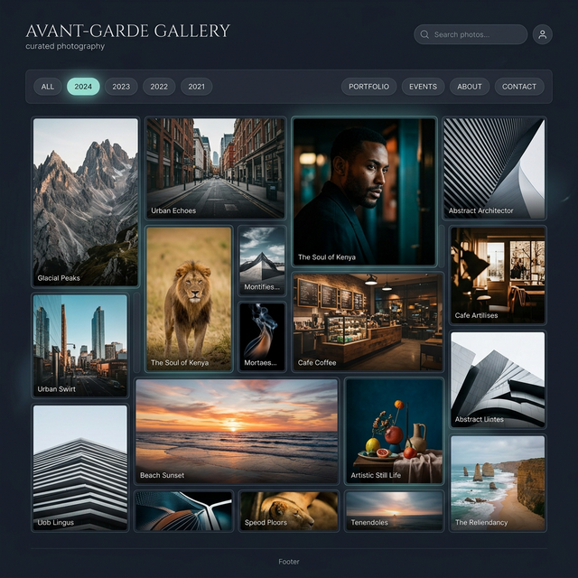
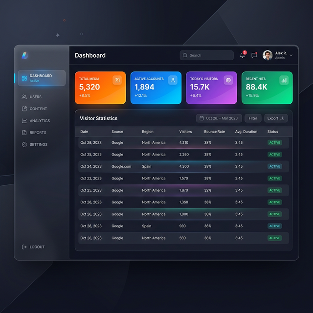
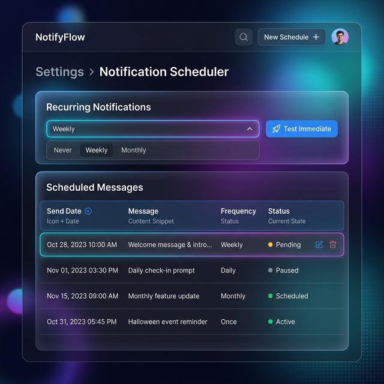
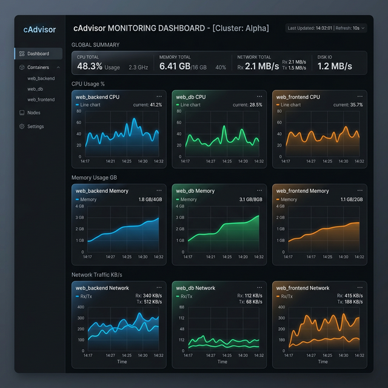
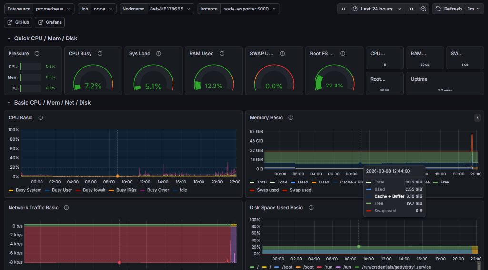
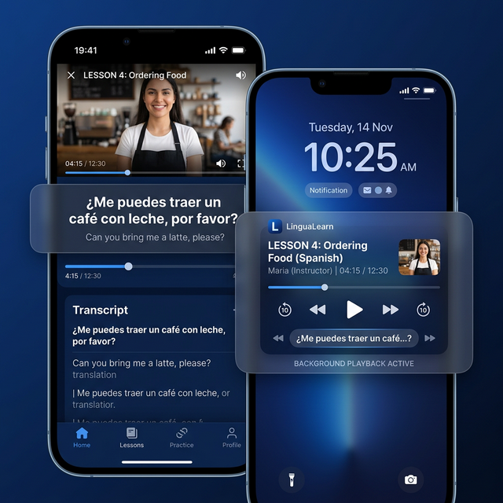
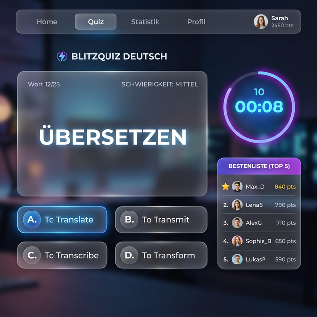
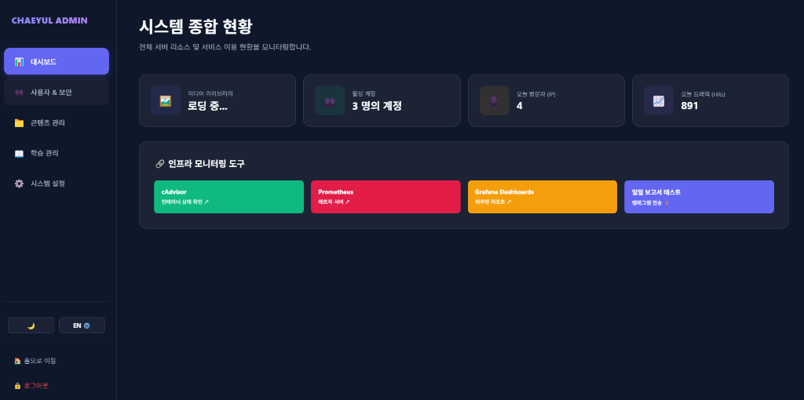
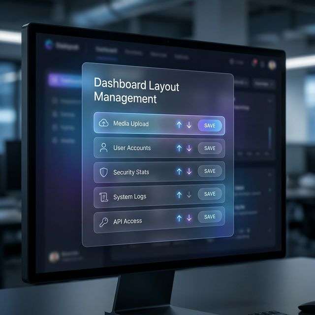
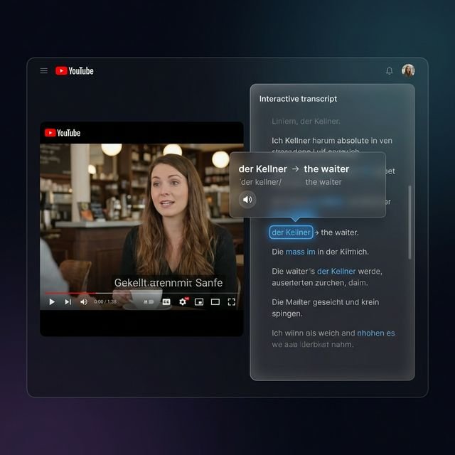

# [Integrated Report] chaeyul.uk Web Server Project Construction & Troubleshooting Results

**Last Updated**: March 10, 2026 (Speed Quiz Gamification, Bulk CSV Upload & Data Infrastructure)
**Target Domain**: `chaeyul.uk`
**System Environment**: Docker Compose-based Container Environment
- **Frontend**: Node.js (Express)
- **Backend**: Python (FastAPI)
- **Database**: PostgreSQL 15
- **Infrastructure**: Cloudflare Proxy & Linux Server

---

## 1. Project Overview
The objective of this project is to build a dedicated web server for premium media (photo, video, audio) management and streaming. It features a UI optimized for high-definition media storage and a robust backend structure for secure data management, finally made accessible to external users via the `chaeyul.uk` domain.

---

## 2. Key Implementations & Changes

### ① Rebranding (Custom Domain & Family Identity)
- **Enhancement**: 
    - Updated the site name to `CHAEEUN & CHAEYUL` to strengthen the identity as a family shared project.
    - Improved the system to dynamically manage top logo text and branding settings through the dashboard.

### ② External Access & Routing Optimization
- **Direct IP Access Block**: Blocked direct access via IP addresses to enhance security.
- **URL Normalization & SPA Support**: Supported root path transitions and Single Page Application (SPA) environment.
- **Layout Optimization**: Minimized the spacing between the top navigation menu and the video player to create an immersive layout.
- **Security Monitoring Dashboard [NEW]**: Established a system for monitoring real-time visitors, daily unique IPs, cumulative counters, and recent login logs (success/failure).
- **CMS-Driven Lesson Management [NEW]**: Successfully uploaded and managed 20+ German lesson pages via the dashboard, with immediate site reflection.
- **Auto-Translation for Study [NEW]**: Logic to automatically translate transcripts (DE/EN -> KO) when native Korean subtitles are unavailable.
- **Premium Masonry Gallery [NEW - 02.24]**: Implemented a sophisticated Masonry layout and year-based filtering system using photo metadata (EXIF).
- **Asset Optimization [NEW - 02.24]**: Developed a local Python preprocessing tool (`preprocess_images.py`) and enforced 1-year cache headers for improved Cloudflare and edge-node performance.

    <div align="center">
      
      <p><i>[Figure 1: High-end Masonry gallery layout with smart filtering]</i></p>
    </div>

### ⑦ Full System Monitoring Infrastructure (Grafana & Full Stack) [NEW - 03.07]
- **Unified Visualization (Grafana)**: Established a central monitoring hub (`/grafana/`) to visualize metrics from Prometheus, Loki, and cAdvisor.
- **Hardware & OS Monitoring (Node Exporter)**: Real-time tracking of server-wide CPU, Memory, Disk, Network I/O, and Uptime (Dashboard ID: 1860).
- **Granular Container Analytics (cAdvisor)**: Real-time monitoring of individual resource consumption for each Docker container (Database, Backend, Frontend, etc.) (Dashboard ID: 14282).
- **Log Aggregation (Loki & Promtail)**: Implemented system and service log collection, enabling keyword searches (e.g., `Failed password`) for real-time security auditing.
- **Security-First Reverse Proxy**: Secured all monitoring tools behind a reverse proxy (subpaths like `/grafana/`, `/prometheus/`) with SSL, eliminating the need for open external ports.

### ⑧ Telegram-Based Multi-User Notification & Scheduling System [NEW - 03.07]
- **Individual Chat ID Registration**: Personality-based setting enabling each user to register and store their own Telegram Chat ID after logging in.
- **Multi-Recipient Scheduler**: Intelligent scheduler (`apscheduler`) that automatically broadcasts scheduled messages to all registered users sequentially.
- **Self-Service ID Guide**: Built-in instructions using `@userinfobot` to help users easily find and register their Chat Id.
- **Unified Admin Control**: Enables administrators to view, delete scheduled notifications, and send instant test messages via the dashboard.

### ⑭ Admin Dashboard UI/UX Overhaul (Sidebar Layout) [NEW - 03.08]
- **Sidebar-Based Tabbed Interface**: Consistently improved navigation by consolidating all admin modules into a fixed left-hand sidebar.
- **Integrated Summary Dashboard**:
    - **Asset Overview**: Real-time counters for media items and active user accounts.
    - **Traffic Analytics**: Visual cards for Today's Visitors (Unique IP), Today's Traffic (Hits), and Cumulative Total Visitors.
- **Intelligent Data Prefetching**: Automatic data synchronization when switching tabs, ensuring fresh lists (Users, CMS files) without manual refreshes.

### ⑮ Telegram Recurring Alarms & UI Refinement [NEW - 03.08]
- **Weekly/Monthly Recurring Tasks**: Expanded scheduling capabilities to support automated interval-based notifications (Weekly/Monthly) with auto-rescheduling.
- **Enhanced List Readability**: Upgraded the scheduler UI with a dark Glassmorphism table and refined typography for better legibility in all lighting conditions.
- **Granular Testing**: Added a recipient selector to target specific users for immediate Telegram testing/debugging.

    <div align="center">
      
      <p><i>[Figure 4: Modern Admin Interface with Sidebar Navigation and Summary Statistics]</i></p>
    </div>

    <div align="center">
      
      <p><i>[Figure 5: Notification Management with Recurring Interval Settings and Improved Visibility]</i></p>
    </div>

    <div align="center">
      
      <p><i>[Figure 3: Real-time resource usage tracking for individual containers via cAdvisor]</i></p>
    </div>

    <div align="center">
      
      <p><i>[Figure 2: Real-time monitoring of server-wide resource status via Node Exporter]</i></p>
    </div>
- **Learning UX & Theme Customization [NEW - 02.25]**:
    - **A-B Repeat Persistence**: Automated saving/restoration of loop points using `localStorage`.
    - **Focus Mode & Hidden Timestamps**: Optimized the transcript UI to highlight only the current active sentence while stripping time markers for better focus.
    - **Sticky Study UI**: Fixed the player and transcript to the top of the viewport for continuous access while scrolling.
    - **Global Theme Switcher**: Implemented a site-wide Dark/Light mode toggle with persistent user settings.
    - **Real-time Home Translation**: Added live DE-to-KO translation overlays on promotional homepage videos.
    - **Wordbook Pagination**: Enhanced vocabulary management with 10-item pagination and refined visibility for various theme contexts.

### ⑯ Admin Security Hardening: 2FA (Google OTP) Integration [NEW - 03.08]
- **TOTP-Based Authentication**: Established a two-factor authentication system utilizing standard OTP apps like Google Authenticator.
- **QR Code Workflow**: User-friendly setup involving scanning a unique QR code from the admin settings to link the account.
- **Enhanced Login Security**: Integrated security where a valid 6-digit OTP code is required even after a successful password check, powered by the `PyOTP` backend.
- **Administrative Override (2FA Reset)**: Admin dashboard includes tools to reset 2FA settings for individual users in case of device loss or reinstallation issues.

    <div align="center">
      
      <p><i>[Figure 6: QR code-based Two-Factor Authentication setup for enhanced security]</i></p>
    </div>
- **Mobile Learning Optimization & Background Playback [NEW - 02.26]**:
    - **Mobile-Responsive Layout**: Dynamically adjusted transcript heights and optimized sticky positioning for smaller screens to ensure visibility of the video selection list.
    - **Background Playback & MediaSession**: Integrated `MediaSession` API and a silent heartbeat mechanism to prevent video pausing when the screen is locked or the browser is backgrounded.
    - **Lock Screen Controls**: Enabled play/pause and seeking capabilities directly from the mobile lock screen and notification center.

### ⑰ System Optimization & Security Infrastructure [NEW - 03.08]
- **Cloudflare Full SSL & Edge Caching**: Enforced end-to-end SSL encryption via Cloudflare Proxy and implemented aggressive CDN/browser caching policies (1-year headers).
- **Automated Media Preprocessing**: Developed an automated workflow via `preprocess_images.py` to convert assets to optimized WebP formats, saving bandwidth and storage while improving TTI (Time to Interactive).
- **Production-Ready 2FA**: Successfully deployed 2FA (Google OTP) for all administrative accounts, elevating site security to an enterprise grade.

    <div align="center">
      
      <p><i>[Figure 3: Mobile-optimized study UI with lock screen background controls]</i></p>
    </div>

### ⑱ Vocab Gamification (Quiz) & Data Automation Infrastructure [NEW - 03.10]
- **Speed Quiz Gamification**: Engineered a 60-second time-attack speed quiz leveraging the user's personal wordbook. The UI incorporates sleek Glassmorphism design and dynamic time-penalty mechanics (correct +2s, incorrect -3s).
- **Real-time Leaderboard via Redis**: Utilized Redis Sorted Set (ZSET) structures to dynamically fetch and display the top-10 highest scoring players in O(1) time complexity natively on the Quiz result screen.
- **Bulk CSV Upload Pipeline (Admin)**: Built a high-performance backend parser and endpoint enabling administrators to upload hundreds of 'Words' and 'Conversational Sentences' via standard CSV files directly into the PostgreSQL database.
- **Randomized Telegram Study Alarms**: Introduced parsing tags `[RANDOM_WORDS_5]` and `[RANDOM_SENTENCES_5]` to the notification scheduler. Evaluates at runtime to push 5 random vocabularies and sentences to the user's smartphone, promoting continuous micro-learning.
- **cAdvisor cgroup v2 Compatibility Patch**: Secured complete visibility of all individual sub-containers in cAdvisor by remounting the appropriate `sys/fs/cgroup` endpoints required by modern Ubuntu kernels.

    <div align="center">
      
      <p><i>[Figure 7: High-speed Gamification Quiz & Real-time Redis Leaderboard UI]</i></p>
    </div>

- **AI-Powered Smart Learning Tools [NEW - 03.03]**:
    - **Context-Aware Sentence Generation**: Leverages **OpenAI gpt-4o-mini** to automatically generate practice sentences using words saved in the user's Wordbook. Sentences are provided in German with English and Korean translations, with adjustable CEFR difficulty levels (A1–B2) and sentence count (3/5/8).
    - **STT Pronunciation Checker**: Utilizes the browser's built-in **Web Speech API** (`SpeechRecognition`, `de-DE`) to capture user's spoken German and compare it against the original transcript using a **Levenshtein similarity algorithm**. Provides word-by-word accuracy feedback with color-coded highlights (✅ correct / ❌ incorrect) and an overall accuracy percentage score.
    - **Zero Server Cost for STT**: The pronunciation feature operates entirely within the browser (Chrome/Edge recommended), requiring no additional server resources or API fees.
    - **New Backend Endpoint**: `POST /api/ai/generate-sentences` added to handle AI-powered sentence generation requests.
- **Mobile Learning UX Overhaul & Subtitle Sync Enhancement [NEW - 03.04]**:
    - **Video Search & Pagination**: Added a real-time search filter bar for quickly finding videos among 66+ entries by title. Introduced 12-per-page pagination to eliminate endless scrolling on mobile devices.
    - **Compact Mobile Thumbnails**: Reduced thumbnail sizes (`minmax(140px)`) and limited titles to 2 lines on mobile for higher density display, showing more videos per screen.
    - **Saved Loop Manager**: Added a dedicated 「📋 Saved Loops」 button and modal to display all previously saved A-B repeat segments across all videos. Clicking an item auto-loads the video and applies the saved loop. Each video card displays a 「🔁 Saved」 badge if a loop exists.
    - **Persistent Loop Storage**: Turning off A-B repeat no longer deletes the saved segment from `localStorage`, enabling users to reload saved loops on subsequent visits.
    - **Subtitle Sync Offset Control**: Added ±0.5s offset adjustment buttons (−/+) next to the transcript header, allowing users to fine-tune subtitle timing. Settings persist across sessions via `localStorage`.
    - **Optimized Highlight Engine**: Replaced `requestAnimationFrame` with a **100ms `setInterval`** for more consistent subtitle synchronization. Added DOM change detection to only update when the active line changes, reducing unnecessary renders.
    - **Lazy Loading**: Applied `loading="lazy"` to video thumbnails for improved initial page load performance.

- **System Monitoring Infrastructure (Prometheus & cAdvisor) [NEW - 03.06]**:
    - **Prometheus**: Established the main monitoring server container (`localhost:9090`) for real-time time-series data collection and storage.
    - **cAdvisor**: Integrated the agent (`cadvisor:8080`) to track Docker container-level resource usage (CPU, Memory, Network, etc.).
    - Added both services to the `docker-compose.yml` list and mounted the `prometheus_data` volume to ensure data persistence.
- **Admin Dashboard Integration (Proxy Routing)**:
    - To enhance security, Prometheus and cAdvisor ports are not exposed to the external network. Instead, they are routed to the internal network via a Node.js (`server.js`) reverse proxy.
    - Access URLs: `https://chaeyul.uk/prometheus`, `https://chaeyul.uk/cadvisor`
    - Created a new 'System Monitoring' card in the summary section at the top of the Admin Dashboard (`admin.html`) providing direct shortcut buttons.
    - Applied intuitive theme colors (Green/Red backgrounds with white text) to improve UI visibility.

    <div align="center">
      
      <p><i>[Figure 3: Admin Dashboard screen with Prometheus and cAdvisor monitoring elements added]</i></p>
    </div>


---

## 3. Troubleshooting Log

### [Issue]: Login modal appears forcefully on initial domain access instead of the home page
- **Root Cause Analysis**:
    - Conflicting style attributes were declared in the login modal (`id="loginModal"`) within `index.html`. (`style="display:none; ... display:flex;"`)
    - Due to CSS priority, the later declared `display:flex;` was applied, causing the modal to cover the screen upon initial access.
- **Action Taken**:
    - Removed the redundant `display:flex;` from inline styles and fixed the default state to `display:none;`.
    - Modified logic to ensure the modal is only activated via JavaScript.

### [Issue]: Internal Server Error (500) due to missing database columns
- **Root Cause Analysis**:
    - New columns `is_active` and `created_at` were added to `models.py` during account management enhancement but were not reflected in the existing DB tables, causing `UndefinedColumn` errors.
- **Action Taken**:
    - Developed an automated migration script (`migrate.py`) to execute `ALTER TABLE` commands.
    - Real-time update of the containerized database schema resolved the issue.

### [Issue]: YouTube transcript load failure and no click response
- **Root Cause Analysis**:
    - **Network Isolation**: The backend container was exclusively in an `internal` network, blocking external YouTube API calls.
    - **Library Specification Change**: Updates in `youtube-transcript-api` required class instantiation, which was not reflected in the code.
    - **Event Propagation Block**: `stopPropagation()` in frontend transcript clicks prevented the video seek logic from executing.
- **Action Taken**:
    - Added a `public` network to the backend in `docker-compose.yml` to allow internet access.
    - Upgraded the transcript extraction logic in `main.py` to be instance-based, fetching all available transcripts including auto-generated ones.
    - Fixed event propagation in `study.html` to allow both word dictionary lookup and video seeking on click.

### [Issue]: 'Not Found' or 'Field required' errors after adding CMS features
- **Root Cause Analysis**:
    - **Code Desync**: Even though the backend code (`main.py`) was edited locally, the Docker image held a static copy. A simple `restart` was insufficient for the container to recognize the new API endpoints.
    - **Data Validation Conflict**: When creating a page with empty editor content, the backend expected the `content` field as mandatory (`required`), leading to validation errors.
    - **Insufficient Exception Handling**: The frontend failed to check the response status during file loading, causing the editor to display `undefined` upon fetch failure.
- **Action Taken**:
    - Rebuilt the backend image using `docker compose up -d --build backend` to activate the updated APIs.
    - Refactored the form data handling in `main.py` to allow empty content sequences (`Form("")`).
    - Enhanced `app.js` with robust response verification and explicit error alerts to replace silent failures.

### [Issue]: Study Center: Video stops or jumps incorrectly when clicking words
- **Root Cause Analysis**:
    - Event bubbling from `word-item` to the parent `transcript-line` caused both the dictionary lookup and the video seek logic to fire simultaneously, leading to conflicts.
- **Action Taken**:
    - Implemented `event.stopPropagation()` within the `lookupWord` function to prevent bubbling.
    - Clearly separated dictionary lookup (click on word) from video seeking (click on line background).

### [Issue]: "Origin not allowed" error when accessing Grafana via Reverse Proxy
- **Root Cause Analysis**:
    - Grafana's security policy (CSRF) blocked requests with unexpected Origin headers from the proxy server.
- **Action Taken**:
    - Set `GF_SERVER_DOMAIN=chaeyul.uk` in `docker-compose.yml`.
    - Configured the `server.js` proxy with `changeOrigin: true` and forced `X-Forwarded-Host`, `Host`, and `Origin` headers to `chaeyul.uk` to bypass security checks.

### [Issue]: Prometheus Scrape Targets returning 404 Not Found or DOWN
- **Root Cause Analysis**:
    - The introduction of path prefixes (`/prometheus`, `/cadvisor`) caused Prometheus to miss the default `/metrics` endpoint.
- **Action Taken**:
    - Corrected `metrics_path` in `prometheus.yml` (e.g., `/cadvisor/metrics`) and ensured `node-exporter` targets were properly registered.

### [Issue]: Docker container names missing in cAdvisor ('No data')
- **Root Cause Analysis**:
    - Modern Linux kernel (cgroup v2) policies prevented the default cAdvisor image from accessing container metadata.
- **Action Taken**:
    - Switched to `image: zcube/cadvisor` (cgroup v2 compatibility patch).
    - Granted `privileged: true` and mounted `/var/run/docker.sock` to enable metadata collection.
    - Used Prometheus `metric_relabel_configs` to map raw container labels to the standard `name` label for dashboard compatibility.

### [Issue]: Server error due to missing "telegram_chat_id" column in DB
- **Root Cause Analysis**:
    - `models.py` was updated with the new field for individual Chat IDs, but the existing PostgreSQL table was not migrated, leading to "Column not found" errors.
- **Action Taken**:
    - Resolved by executing `ALTER TABLE users ADD COLUMN telegram_chat_id VARCHAR;` to dynamically update the database schema.

### [Issue]: Timestamp numbers included when dragging text for selection
- **Root Cause Analysis**:
    - Timestamps like `[0:15]` were part of the text nodes, causing them to be copied along with sentences when manually dragged, which broke dictionary queries.
- **Action Taken**:
    - Added a `mouseup` listener to clone the selection and strip out all nodes with the `.timestamp` class before extracting text.
    - Ensures pure text search even when selecting multiple words manually.

### [Issue]: Python Datetime Timezone Conversion Error [NEW - 03.08]
- **Root Cause Analysis**:
    - Conflicting `tzinfo` and `timedelta` calculations in `astimezone()` caused runtime exceptions during Telegram schedule registration.
- **Action Taken**:
    - Refactored the conversion logic to use explicit `datetime.timezone.utc` objects and sanitized into naive objects for standardized storage.

### [Issue]: CMS Editor & 2FA Status Visibility desync [NEW - 03.08]
- **Root Cause Analysis**:
    - After the sidebar layout overhaul, some old `id` references and `display` state logic for the CMS editor and 2FA status text became inconsistent.
- **Action Taken**:
    - Standardized container IDs and forced explicit visibility states in `app.js`. Added background sync for user metadata upon tab switches.

---

## 4. Infrastructure Operations & Management

### ① Docker Compose Service Configuration
- **web_frontend**: Port 80/443 mapping, static file and proxy server.
- **web_backend**: API server and media/page management logic.
- **web_db**: Database for metadata storage.

### ② Deployment Automation
- Maintained a seamless deployment system based on `docker compose up -d --build`.

### ③ Web Page Management (CMS) [NEW]
- **Web Page Management (CMS)**:
    - **Real-time Editing**: Instant modification of HTML source code via an embedded editor in the dashboard.
    - **Page CRUD**: Direct creation and deletion of custom pages.
    - **HTML Upload**: Immediate reflection of uploaded local HTML files to the site.
- **Site & Navigation Settings**:
    - **Branding Control**: Unified management of site name (Logo) through the dashboard.
    - **Dynamic Navigation**: Freedom to add/remove top menu items with real-time reflection.
    - **Persistence**: All design and menu settings are stored via `settings.json`.
    - **File Explorer & Folder Management [NEW]**: Supports creating folders directly in the dashboard and intuitive navigation via Breadcrumbs.
    - **Direct CSS & Source Editing [NEW]**: Instant editing and application of all dedicated resources, including CSS files, through the built-in editor.
- **Feature Demo [Admin Layout]**:

    <div align="center">
      
      <p><i>[Figure 4: Admin Dashboard with integrated File Explorer and Security Stats]</i></p>
    </div>


### ④ German Study Center [NEW]
- **Smart Learning Environment**:
    - **A-B Repeat & Speed Control**: Supports precise language learning with user-defined repeat intervals and 0.5x~1.5x speed adjustments.
    - **Real-time Transcript Integration**: Displays transcripts extracted via YouTube API with instant video seeking upon click.
    - **Instant Dictionary**: Provides real-time English and Korean translations via a lookup popup when clicking words in the transcript.
- **Personalized Vocabulary**:
    - **DB-Linked Vocab**: Save and manage encountered words in a personal vocabulary list with one click.
    - **Admin Control**: Easy addition/deletion of study videos via URL in the dashboard.
- **Feature Demo [Study Interface]**:

    <div align="center">
      
      <p><i>[Figure 5: German Study Center with word selection and real-time translation popup]</i></p>
    </div>

- **Homepage Promo & Loop Player [NEW]**:
    - **Randomized Loop Playback**: Infuses life into the site by randomly selecting and continuously looping YouTube videos registered for the homepage.
    - **Custom Controls**: Offers playback speed control (0.5x ~ 2.0x) and free zoom in/out for screen size.
    - **UI Optimization**: Minimalist design focused on the video player by removing unnecessary promo text and the 'Recent Uploads' section.
    - **Dedicated Management**: Independently manage the homepage video list separately from study videos via the dashboard.

---

## 5. Project Structure

```text
web_project/
├── docker-compose.yml           # Service container orchestration
├── PROJECT_REPORT.md            # Detailed project report (Korean)
├── PROJECT_REPORT_EN.md         # Detailed project report (English)
├── web-project.service          # Systemd service for auto-start
├── backend/                     # Python (FastAPI) API Server
│   ├── main.py                  # API endpoints and logic
│   ├── models.py                # SQLAlchemy DB models
│   ├── auth.py                  # JWT Auth and Security logic (2FA, IP blocking)
│   ├── crud.py                  # Database CRUD functions
│   ├── database.py              # DB connection and session
│   ├── redis_client.py          # [NEW] Redis connection and ranking management logic
│   ├── migrate.py               # DB schema migration tool
│   ├── requirements.txt         # Python dependencies
│   └── uploads/                 # User-uploaded media storage
├── frontend/                    # Node.js (Express) Web Server
│   ├── server.js                # Reverse proxy, Rate Limiting, and static file server logic
│   ├── package.json             # Node dependencies
│   └── public/                  # Static resources (Vanilla JS)
│       ├── index.html           # Main Landing Page
│       ├── admin.html           # Admin Dashboard (CMS)
│       ├── gallery.html         # Media Gallery & Slideshow
│       ├── study.html           # YouTube Learning Center
│       ├── quiz.html            # [NEW] Vocabulary-based speed quiz gamification
│       ├── settings.json        # Dynamic site settings
│       ├── js/app.js            # Integrated frontend business logic
│       ├── css/style.css        # Unified design stylesheet
│       └── certs/               # SSL/TLS certificates
├── scripts/                     # Utility and automation scripts
│   └── preprocess_images.py     # Local image optimization & metadata tool
├── prometheus/                  # [NEW] Time-series data collection server configuration
│   └── prometheus.yml           # Prometheus scraping target settings
├── grafana/                     # [NEW] System integration monitoring dashboard
│   └── provisioning/            # Auto-provisioning for dashboards and datasources
├── loki/                        # [NEW] Centralized log aggregation server
│   └── local-config.yaml        # Loki local configuration file
├── promtail/                    # [NEW] Log collection and forwarding agent
│   └── promtail-config.yml      # Promtail log collection settings
├── backups/                     # [NEW] Automated backup archives and dump files storage
└── db/
    └── init.sql                 # Initial database schema
```

---

## 6. Conclusion & Future Roadmap

### Current Status
- Management efficiency maximized through the integration of CMS and site settings.
- All functions are operating stably on a Docker container basis.

### Future Roadmap
- **Security**: Passwordless authentication via Biometrics and Hardware Security Keys (FIDO2/WebAuthn).
- **Performance**: Dynamic on-the-fly image transformation and backend-driven thumbnail proxy system.
- **Advanced AI Extension**: 
    - **Interactive Voice Simulation**: AI-driven role-play for conversational practice beyond static sentence generation.
    - **Pragmatic Phoneme Analysis**: Enhancing STT to provide feedback at the syllable and intonation level for precise accent correction.
- **Learning Management (LMS)**: Visual learning analytics dashboards tracking user-specific study time, heatmaps for difficult sentences, and Ebbinghaus-based review cycles.

---

## 7. Build Walkthrough

### Phase 1: Planning & Setup
- [O] Establishment of project directory structure and Docker environment.

### Phase 2: Backend Development
- [O] API development, JWT Auth, and security (IP blocking) implementation.
- [O] [NEW] Integration of CMS and site settings management APIs.
- [O] [NEW] Completion of YouTube Study Center API, transcript extraction, and vocabulary DB design.

### Phase 3: Frontend Development
- [O] Implementation of main gallery and slideshow.
- [O] [NEW] Integration of dashboard inline editor and settings menu.
- [O] [NEW] Real-time transcript-dictionary interface for German learning.
- [O] [NEW] (2026-02-23) Real-time security stats dashboard and file explorer-based CMS enhancement completed.
- [O] [NEW] (2026-02-23) Drag-and-drop dashboard layout management and smart learning selection logic applied.
- [O] [NEW] (2026-02-23) Automated YouTube transcript translation and integration of 20+ German lesson pages.
- [O] [NEW] (2026-02-24) Premium Masonry gallery, year-based filtering, and Cloudflare performance optimization completed.
- [O] [NEW] (2026-02-25) Study Center A-B persistence, focus mode, and sticky layout implemented.
- [O] [NEW] (2026-02-25) Global Light/Dark theme switcher and real-time translation system established.
- [O] [NEW] (2026-02-25) Vocabulary pagination and light mode UX optimization completed.
- [O] [NEW] (2026-02-26) Mobile learning layout optimization and background/lock screen playback control functionality completed.
- [O] [NEW] (2026-03-03) AI-powered Smart Learning: OpenAI gpt-4o-mini sentence generation API integration and Web Speech API STT pronunciation correction system implemented.
- [O] [NEW] (2026-03-04) Mobile learning UX overhaul: video search/pagination, saved loop management modal, subtitle sync offset controls, and rendering performance optimization completed.
- [O] [NEW] (2026-03-07) System monitoring infrastructure finalized (Grafana/Loki/Prometheus): Reverse proxy security integration, Log aggregation (Loki/Promtail), cgroup v2 compatibility optimization, and 1860/14282 dashboards established.
- [O] [NEW] (2026-03-07) Telegram Multi-User Notification System: Individual Chat ID registration UI, multi-recipient backend logic, and admin scheduling dashboard completed.
- [O] [NEW] (2026-03-08) Admin UI Overhaul: Modern sidebar layout and real-time status summary card system implemented.
- [O] [NEW] (2026-03-08) 2FA Implementation: Hardened admin security via Google OTP integration and user-level reset tools.
- [O] [NEW] (2026-03-08) Advanced Scheduling: Telegram recurring notifications (Weekly/Monthly) and automatic rescheduling logic implemented.
- [O] [NEW] (2026-03-10) Language Quiz gamification, Bulk CSV upload endpoints, Randomized Telegram schedule integrations, and cAdvisor monitoring compatibility fixes completed.


---

## 8. Appendix: DB Management Guide (pgAdmin)
- **Path**: `https://chaeyul.uk/pgadmin/`
- **Initial Account**: `adm**@********` / `********`
- **Internal Connection**: Host `db`, Port `5432`, DB `********`, User `********`

---

**[chaeyul.uk Project Construction & Troubleshooting Report Completed]**
