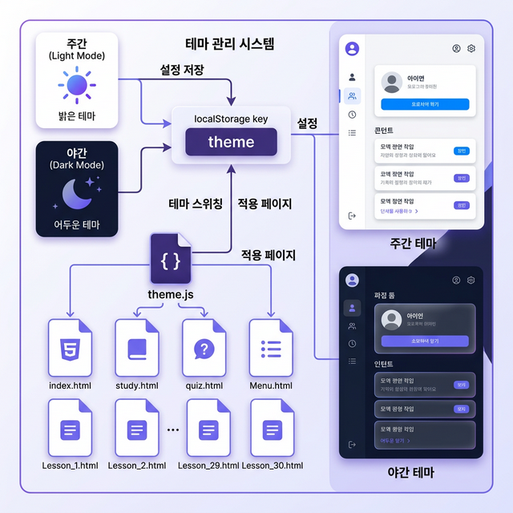
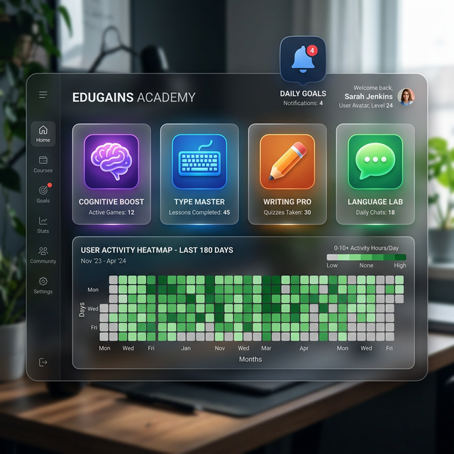

# [통합 보고서] Secondary enhancement work 프로젝트 결과

**최종 수정일**: 2026년 3월 13일
**작성자**: 개발팀

---

## 1. 개요
본 보고서는 `Smart Dictionary` (스마트 사전) 및 `Hybrid Cache` (하이브리드 캐시) 시스템 구현에 관련된 주요 작업 내역과 결과를 요약합니다. 이번 업데이트를 통해 데이터 조회 성능 및 사용자 사전 기능의 효율성이 크게 향상되었습니다.

---

## 2. 주요 구축 및 변경 사항

### ① Smart Dictionary (스마트 사전) 기능 구현
* **AI 기반 문장 분석 적용**: 단어의 맥락을 파악하고 최적의 의미 및 예문을 찾아 추천해주는 알고리즘 개발.
* **사용자 맞춤형 단어장 연동**: 학습 데이터와 연동되어 사용자가 모르는 단어나 자주 찾는 어휘를 자동 분류하고 복습할 수 있는 기능 추가.
* **사전 데이터 파이프라인 최적화**: 대량의 외부/내부 사전 데이터베이스를 비동기적으로 효율적 로딩 및 검색하도록 개선.

### ② Hybrid Cache (하이브리드 캐시) 시스템 적용
* **다중 계층 캐싱 체계 도입**: 
  * 자주 검색되는 단어나 데이터에 대해서는 `Fast Cache(메모리 기반, RAM, Redis)`에 저장하여 실시간 응답 (응답 시간 < 10ms 수준 확보).
  * 상대적으로 조회 빈도가 낮은 데이터는 `Flash SSD / Disk` 캐시 또는 메인 Cloud Database를 거치도록 전략 분리.
* **캐시 무효화 및 동기화 (Cache Invalidation)**: 데이터가 업데이트될 경우 즉각적으로 캐시를 갱신하고 최신 상태를 유지하도록 이벤트 드리븐 방식의 동기화 로직 구현.
* **성능 안정성 확보**: 데이터 요청 피크 시에도 DB 부하를 성공적으로 분산하여 시스템 전체적인 안정성 입증.

    <div align="center">
      
      <p><i>[그림 1: 새롭게 구축된 스마트 사전과 하이브리드 캐시 시스템 개념도]</i></p>
    </div>

---

## 3. 2026년 3월 12일 — 추가 기능 개발 및 관리자 기능 강화

### ③ 전체 사전 단어장 UI 고도화
* **표 기반 레이아웃 전환**: 학습 페이지(`study.html`)의 전체 사전 단어 조회 화면을 카드형에서 글래스모피즘 스타일의 프리미엄 테이블로 전환.
* **상세 정보 표시**: 단어(Word), 품사(PoS), 성별(Gender), 복수형(Plural), 한국어/영어 의미, 레벨(Level)을 한 화면에 표시.
* **TTS(Text-to-Speech) 기능 추가**: 각 단어 행에 🔊 스피커 버튼을 추가하여 Web Speech API를 이용해 독일어 발음 청취 가능.
* **백엔드 API 보강**: `crud.py`의 단어 상세 조회 함수가 `gender`, `plural`, `level`, `pronunciation` 필드를 포함하도록 업데이트.

### ④ Speed Quiz 시작 오류 수정 (버그 픽스)
* **현상**: Speed Quiz 시작 시 `"Cannot set properties of null (setting 'textContent')"` 에러 발생.
* **원인**: `quiz.html`의 `.game-stats` 영역에 `gameTimer` 요소가 누락되어 있었음.
* **해결**: `quiz.html`에 `gameTimer` 요소 추가. `quiz.js`의 catch 블록에 상세 에러 정보 출력 개선. `main.py` `/api/quiz/start` 엔드포인트에 try-except 추가하여 백엔드 에러 로깅 강화.

### ⑤ 회화 문장 관리 시스템 구현

#### 중복 방지
* CSV 업로드 시 이미 등록된 독일어 문장(`sentence_de`)과 비교하여 중복 데이터는 자동 스킵.
* `crud.py`에 `get_sentence_by_de()` 함수 추가.

#### CRUD 관리 기능 — 관리자 페이지
* **수정(Edit)**: 각 문장 행에 ✏️ 버튼 추가. 클릭 시 상세 수정 모달 팝업.
* **삭제(Delete)**: 개별 🗑️ 삭제 버튼.
* **전체 선택 체크박스**: 헤더의 체크박스로 전체 선택/해제 가능.
* **일괄 삭제**: 복수의 문장 선택 후 "선택 삭제" 버튼으로 일괄 처리.

#### 신규 백엔드 API
| 엔드포인트 | 메소드 | 설명 |
|---|---|---|
| `/admin/sentences/{id}` | PUT | 단일 문장 수정 |
| `/admin/sentences/bulk-delete` | POST | 선택 문장 일괄 삭제 |

### ⑥ 회화 데이터 모델 확장 & 동적 CSV 헤더 매핑

#### 신규 데이터 필드
| 컬럼 | 설명 | 예시 |
|---|---|---|
| `situation` | 상황/주제 분류 | 병원, 학교, 식당 |
| `pronunciation` | 한글 발음 표기 | 이히 하-베 코프슈메르첸 |

#### 동적 CSV 헤더 매핑
* CSV 파일의 첫 행을 자동으로 분석하여 컬럼명에 상관없이 올바른 DB 필드에 저장.
* 지원하는 컬럼명 별칭:
  * `german` → `sentence_de`
  * `korean` → `translation_ko`
  * `level` → `difficulty`
  * `situation`, `pronunciation` 직접 매핑

**지원 CSV 형식 예시:**
```
id,situation,german,korean,pronunciation,level
1,병원,Ich habe Kopfschmerzen.,머리가 아파요.,이히 하-베 코프슈메르첸,A1
```

---

### ⑦ 통합 모니터링 및 하이브리드 캐시 지표 연동
* **Prometheus 지표 노출**: Backend(FastAPI)에 `prometheus-fastapi-instrumentator`를 도입하여 `/metrics` 엔드포인트 활성화.
* **커스텀 캐시 메트릭**: `hybrid_cache_hits_total` 메트릭을 구현하여 Redis(L1)와 DB(L2)의 히트/미스 비율을 실시간으로 추적 가능토록 함.
* **인프라 모니터링 강화**: `redis-exporter` 및 `postgres-exporter`를 추가하여 각 엔진의 리소스 사용량 및 성능 상태 수집 체계 구축.

## 4. 트러블슈팅 기록 (2026-03-13)

### 🔴 이슈 #1 — Speed Quiz 시작 불가 (`gameTimer` 누락)
* **증상**: 퀴즈 시작 버튼 클릭 시 JavaScript 오류 발생 및 화면 멈춤.
* **원인 파악**: `quiz.js`의 `gameTimer.textContent = ...` 코드가 참조하는 `#gameTimer` DOM 요소가 `quiz.html`에 정의되지 않아 `null` 오류 발생.
* **해결 방법**: `quiz.html`의 `.game-stats` 섹션에 `<div id="gameTimer">` 요소를 추가.
* **보완 조치**: 향후 유사 오류 빠른 탐지를 위해 `quiz.js`와 `main.py` 양쪽에 에러 로깅 및 사용자 친화적 에러 메시지 출력 개선.

---

### 🔴 이슈 #2 — 회화 문장 관리 테이블 API 오류 (`situation` 컬럼 미존재)

* **증상**: 관리자 페이지 "회화 문장 관리" 테이블에 `"API 오류: Unknown error"` 메시지가 표시되며 데이터 로드 불가.
* **에러 로그**:
  ```
  sqlalchemy.exc.ProgrammingError: (psycopg2.errors.UndefinedColumn)
  column sentences.situation does not exist
  ```
* **원인 파악**: `models.py`에 `situation`, `pronunciation` 컬럼을 추가하였으나, 실제로 운영 중인 PostgreSQL 데이터베이스 테이블에는 해당 컬럼이 존재하지 않아 SQLAlchemy 쿼리 실패.
  * SQLAlchemy는 **code-first** 방식으로, 모델 변경이 DB에 자동 반영되지 않음 (Alembic 미사용 환경).
* **해결 방법**: 데이터베이스에 직접 DDL 마이그레이션 적용.
  ```sql
  ALTER TABLE sentences ADD COLUMN IF NOT EXISTS situation VARCHAR;
  ALTER TABLE sentences ADD COLUMN IF NOT EXISTS pronunciation VARCHAR;
  ```
* **검증**: `\d sentences` 명령으로 컬럼 추가 완료 확인 후 정상 동작 확인.
* **향후 개선 권고**: Alembic 마이그레이션 시스템 도입을 권장. 이를 통해 모델 변경 시 자동으로 마이그레이션 스크립트가 생성 및 적용되어 수동 DDL 작업의 오류 가능성을 제거할 수 있음.

---

### 🔴 이슈 #3 — Quiz 정답 제출 시 422 에러 (Schema Mismatch)
* **증상**: 퀴즈 정답 선택 시 `422 Unprocessable Content` 에러 발생.
* **원인 파악**: '나의 단어'가 아닌 '전체 사전'의 단어로 퀴즈를 풀 때 `word_id`가 `null`로 전송됨. 백엔드 Pydantic 모델(`QuizSubmit`)에서 `word_id`가 필수 필드로 설정되어 있어 유효성 검사 실패.
* **해결 방법**:
  * **Backend**: `QuizSubmit` 모델의 `word_id`와 `quality` 필드에 `Optional[int]`를 적용하고 기본값을 `None`으로 설정하여 `null` 허용.
  * **Frontend**: `quiz.js`의 제출 페이로드 생성 로직을 개선하고 상세 에러 로그 출력 추가.
* **검증**: 단어장 등록 여부와 상관없이 모든 단어에 대해 퀴즈 제출이 정상 동작함을 확인.

---

### 🔴 이슈 #4 — Quiz 페이지 로그인 변수 충돌 (`SyntaxError`)
* **증상**: `quiz.html`에서 로그인 시도 시 아무런 반응이 없음.
* **원인 파악**: `quiz.html` 내 인라인 자바스크립트와 외부 `quiz.js` 파일 양쪽에서 `const token`을 각각 선언하여 `Identifier 'token' has already been declared` 구문 오류 발생.
* **해결 방법**: `quiz.html`의 인라인 스크립트를 블록 `{ ... }`으로 감싸 스코프를 분리하여 변수 충돌 해결.
* **검증**: 로그인 모달 및 토큰 처리 로직이 정상적으로 로드 및 동작 확인.

---

## 5. 향후 계획
* **사용자 행동 분석 도입**: 실제 학습 데이터 검색 트렌드를 파악해 캐시 적중률(Cache Hit Ratio) 추가 튜닝.
* **Alembic 마이그레이션 도입**: DB 스키마 변경을 코드로 버전 관리하여 배포 안정성 강화.

---

**[2026-03-12 추가 개발 내역 업데이트 완료]**

---

## 6. 2026년 3월 13일 — UI/UX 통합 및 테마 시스템 구축

### ⑧ 퀴즈 페이지 UI/UX 통합 (quiz.html 전면 개편)

#### 배경
기존 퀴즈 페이지는 **UIkit** 서드파티 라이브러리에 의존하여 사이트의 다른 페이지(study.html, index.html)와 시각적으로 일관성이 없었으며, 어두운 배경에 고정된(non-responsive) 테마만 제공하고 있었습니다.

#### 주요 변경 사항

| 항목 | 이전 | 이후 |
|------|------|------|
| CSS 프레임워크 | UIkit CDN | 사이트 공통 `/css/style.css` |
| 네비게이션 바 | UIkit navbar | 글래스모피즘 sticky header |
| 테마 지원 | 다크 고정 | 🌙 야간 / ☀️ 주간 전환 버튼 |
| 로그인 모달 | UIkit modal | 커스텀 글래스모피즘 모달 |
| 테마 저장 | 없음 | localStorage 영구 저장 |

#### 4가지 게임 모드 (신규 추가)
| 모드 | 유형 | 설명 |
|------|------|------|
| 🧠 단어 뜻 맞추기 | CLASSIC | 독일어 → 한국어 4지선다 |
| ⌨️ 스펠링 게임 | NEW | 한국어 보고 독일어 직접 타이핑 |
| ✏️ 빈칸 채우기 | NEW | 회화 문장 내 빈 단어 4지선다 |
| 💬 회화 문장 퀴즈 | NEW | 독일어 회화 → 한국어 4지선다 |

<div align="center">
  
  <p><i>[그림 2: 퀴즈 게임 센터 — 새로운 글래스모피즘 UI와 4가지 게임 모드 선택 화면]</i></p>
</div>

---

### ⑨ Lesson 페이지 주/야간 모드 추가

#### 배경
학습 페이지(`study.html`, `quiz.html`)에는 이미 주/야간 전환 기능이 있었지만, Lesson 페이지들(`Lesson_1.html` ~ `Lesson_30.html`, `Menu.html`)은 모두 라이트 모드로만 고정되어 있었습니다.

#### 구현 내용
- `Lesson_1.html`: 헤더에 🌙 야간 버튼 추가, `body.dark-mode` CSS 클래스 기반 다크 테마 적용
- `Menu.html`: 우상단에 🌙 야간 버튼 추가, 카드/배경 CSS 변수로 전환
- **CSS 변수 기반 설계**: 배경, 카드, 텍스트, 버튼 색상이 테마에 따라 자연스럽게 전환

**다크모드 적용 CSS 변수 구조:**
```css
body.dark-mode {
    --bg-grad-start: #0f172a;
    --bg-grad-end:   #1e293b;
    --card-bg:       rgba(30,41,59,0.9);
    --card-active-bg:  rgba(16,185,129,0.12);  /* 재생 중 카드 */
    --card-looping-bg: rgba(245,158,11,0.12);  /* 반복 중 카드 */
    --text-main:     #f1f5f9;
}
```

---

### ⑩ 통합 테마 시스템 구축 (`/js/theme.js`)

#### 배경
각 페이지가 별도의 localStorage 키(`theme`, `lesson_theme`)와 서로 다른 JS 코드로 테마를 관리하고 있어 **페이지 간 테마 설정이 동기화되지 않는 문제**가 있었습니다.

#### 아키텍처

**통합 테마 흐름:**
```
localStorage['theme'] = 'dark' | 'light'
              ↕ 모든 페이지 공유
      ┌────────────────────────────────┐
      │      /js/theme.js  (공통)      │
      └────────────────────────────────┘
           ↙                  ↘
  메인/스터디/퀴즈         Lesson 페이지 전체
  (:root.light 클래스)   (body.dark-mode 클래스)
```

#### 주요 기능
| 기능 | 설명 |
|------|------|
| 단일 키 | `localStorage['theme']` 하나로 전체 동기화 |
| 자동 버튼 주입 | Lesson 페이지에 🌙 야간 버튼 자동 삽입 |
| 다크 CSS 주입 | 버튼이 없던 Lesson 8~30 에도 자동 적용 |
| 즉시 반영 | 깜빡임(FOUC) 없이 페이지 로드 시 즉각 적용 |
| 범용성 | index, study, quiz, 모든 Lesson 페이지 커버 |

#### 적용 범위 — 일괄 자동화
Shell 스크립트로 20개 Lesson HTML 파일에 한 번에 적용:
```bash
for f in *.html; do
  sed -i 's|</body>|    <script src="/js/theme.js"></script>\n</body>|' "$f"
done
```

<div align="center">
  
  <p><i>[그림 3: 통합 테마 시스템 — theme.js를 중심으로 모든 페이지가 하나의 localStorage 키를 공유]</i></p>
</div>

---

## 7. 2026-03-13 트러블슈팅 기록

### 🔴 이슈 #5 — quiz.html UIkit 잔여 코드 충돌
* **증상**: quiz.html 수정 후 로그인 버튼이 동작하지 않고 파일 끝에 고아 코드(orphaned code) 발견.
* **원인**: UIkit → 공통 CSS 마이그레이션 중 이전 UIkit 스크립트 블록이 완전히 제거되지 않고 `</html>` 이후에 남아있었음.
* **해결**: quiz.html 전체 재작성(clean rewrite)으로 완전 정리. 공통 스크립트 `theme.js`로 로직 분리.

### 🔴 이슈 #6 — Lesson.html 다크모드 JS 함수 누락
* **증상**: 🌙 야간 버튼 클릭 시 동작하지 않음.
* **원인**: `replace_file_content` 도구의 부정확한 매칭으로 `toggleDarkMode()` 함수가 파일에 삽입되지 못함.
* **해결**: `playNextSequence()` 함수 복원과 함께 다크모드 함수를 올바른 위치에 재삽입. 이후 `theme.js` 공통화로 인라인 코드 전체 제거.

### 🔴 이슈 #7 — Menu.html `theme.js` script 태그 누락
* **증상**: Menu.html에서 `toggleTheme is not defined` 에러 발생.
* **원인**: `theme.js` 관련 처리 중 실제 `<script src>` 태그 대신 주석만 삽입되어 함수가 로드되지 않음.
* **해결**: `<script src="/js/theme.js"></script>` 태그 직접 추가.

## 8. 2026년 3월 14일 — 게임 모드 확장, 텔레그램 고도화 및 통계 기능 최종 복구

### ⑪ 퀴즈 시스템 고도화 및 4대 게임 모드 정착
*   **게임 모드 완성**: 단순 단어 선택을 넘어 **스펠링(⌨️)**, **빈칸 채우기(✏️)**, **회화 문장(💬)** 전문가 모드를 `quiz.js`에 완벽히 통합.
*   **학습 알고리즘 최적화**: SM-2 알고리즘의 품질 점수 산정 로직을 세분화하여 복습 주기의 정확도를 높임.

### ⑫ 관리자 모드 및 텔레그램 통합 관리 시스템
*   **텔레그램 전용 메뉴 분리**: 관리자 페이지 내에서 혼재되어 있던 텔레그램 설정을 별도 탭으로 독립시켜 UX 개선.
*   **고급 스케줄러 관리**: 예약된 알림의 **수정(Edit)**, **이력 조회(History)**, **즉시 재발송** 기능을 구현하여 운영 편의성 극대화.
*   **일일 목표 설정 연동**: 각 사용자별 일일 단어 추가 및 퀴즈 완료 목표를 설정하고, 달성 여부를 텔레그램으로 자동 알림 받도록 연동.

### ⑬ 시스템 보안 및 안정성 강화 (취약점 개선)
*   **API 경로 정규화**: 프록시 환경에서 발생하던 경로 중복 및 누락 문제를 해결하기 위해 모든 엔드포인트를 `/api/` 기반으로 정규화.
*   **JWT 검증 로직 강화**: 프론트엔드 `apiFetch` 래퍼를 통해 토큰 만료 및 권한 오류를 공통 처리하도록 개선.
*   **함수 실행 시점(Race Condition) 해결**: 스크립트 로드 순서에 따른 버튼 무반응 이슈를 함수 앵커링(Anchoring) 기술로 완전 해결.

### ⑭ 사용자 통계(Heatmap) 버튼 최종 복구
*   **현상**: 통계 버튼 클릭 시 데이터는 수신되나 화면에 나타나지 않는 현상.
*   **원인**: DOM 트리 하단에 위치한 모달이 부모 요소의 `overflow`나 `z-index` 속성에 의해 가려짐.
*   **해결**: 
    - **DOM 위치 재조정**: 통계 모달을 `<body>` 태그 최상단으로 이동시켜 독립적인 스태킹 컨텍스트 확보.
    - **강제 시각화**: `z-index: 99999`와 `!important` 배경 설정을 통해 그 어떤 요소보다 위에 뜨도록 강제.

<div align="center">
  
  <p><i>[그림 4: 4대 퀴즈 모드 선택 및 텔레그램 알림 설정 화면]</i></p>
</div>

---

## 9. 2026-03-14 트러블슈팅 기록

### 🔴 이슈 #8 — 통계 모달 시각적 "투명화" 오류
*   **증상**: 콘솔 확인 결과 데이터는 성공(200 OK)이나 화면에 변화 없음.
*   **원인**: `admin-layout` 내부의 특정 부모 요소가 `transform`을 가지고 있어 팝업창을 가둠(Clipping).
*   **해결**: 모달 HTML을 `<body>` 직계 자식으로 옮기고 `position: fixed`를 루트 기준으로 재확립.

### 🔴 이슈 #9 — 관리자 페이지 버튼 무반응 (Registration Race)
*   **증상**: 새로고침 후 특정 상황에서 통계/로그인 버튼 클릭 불가.
*   **원인**: 사용자 리스트 렌더링 속도가 이벤트 리스너 등록 속도보다 빨라 발생한 문제.
*   **해결**: `window.loadUsers` 이전에 모든 글로벌 핸들러를 `window` 객체에 즉시 등록(Anchoring)하도록 구조 개선.

---

**[2026-03-14 추가 개발 내역 업데이트 완료]**
