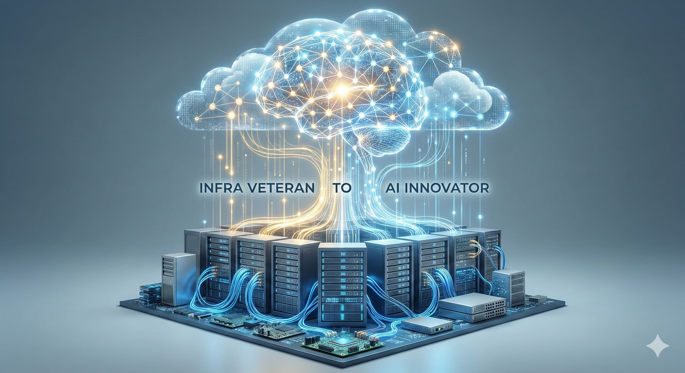

# Building on the solid foundation of 17 years of infrastructure, we are building a new structure called AI.

We interpret AI through the lens of a veteran infrastructure engineer who has been responsible for stability at the deepest levels of the system.
By combining physical server management expertise with cutting-edge AI technology, we create robust yet innovative services.

 
---

## 📂 Key Projects and Technical Notes
* [[LangChain AI Agent]]
* [[openclaw_Test]]
* [[Project_Completion_Report_EN]]
* [[project_completion_report]]
* [[Project_Completion_Report_EN]]
* [[Web_PROJECT_REPORT_EN]]
* [[Website]]
