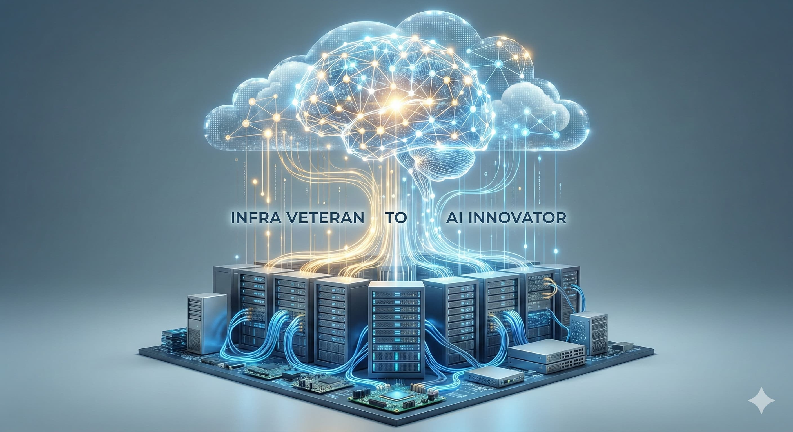

# 🚀 인프라 엔지니어에서 AI 혁신가로 (Infra Veteran ➔ AI Innovator)

> [!TIP]
> 🌐 **Language / 언어 선택**: **[🇰🇷 한국어 (현재 페이지)]** | **[🇺🇸 Switch to English (영문 전용 메인으로 이동)](./index_EN.md)**

> **"엔터프라이즈 인프라의 견고한 기반 위에 차세대 AI 혁신의 지평을 엽니다."**
> 본 디지털 가든은 17년 이상의 글로벌 데이터센터 및 인프라 운영 전문성(CDCP 인증)을 바탕으로, 실무 중심의 AI 통합 및 시스템 자동화 여정을 기록한 기술 지식 저장소입니다.

 

## 🛠️ 핵심 역량 (Core Competencies)

---

## 🔍 주요 하이라이트 (Quick Highlights)
| 분야 | 핵심 마일스톤 | 바로가기 |
| :--- | :--- | :--- |
| **Edge AI & eBPF SOC** | 32코어/192GB 스케일업, eBPF Cilium/Hubble 방화벽 & 텔레그램 SOC 관제 구축 | [[Edge_AI/14_ebpf_cilium_ai_firewall_and_telegram_soc|방화벽 & 텔레그램 관제 보고서]] |
| **AI Agent R&D** | OpenClaw 멀티에이전트 아키텍처, HIL 승인 체계, 일회용 브라우저 샌드박스 | [[Openclaw/openclaw_Test_KR|OpenClaw 아키텍처 가이드]] |
| **DevOps & 웹 인프라** | Quartz 기술 블로그 배포, Prometheus & Grafana 실시간 관측 스택 구축 | [[Personal Website/05_Final_Completion_Report_KR|인프라 최종 완료 보고서]] |
| **업무 자동화 & 도구** | ITSM 티켓 자동 분석 툴 & PyMuPDF 개인정보 영구 파기 보안 편집기 | [[Excel_Analyzer/Project_Completion_Report_KR|엑셀 분석기]] · [[PDF_APPS/Project_Completion_Report_KR|PDF 보안 편집기]] |

---

## 📂 기술 문서 카탈로그 (한국어 전용 목록)

### 📁 AI-Governance
> 기술 구현 및 아키텍처 문서

* [[AI-Governance/AI_Governance_Sandbox_Log|AI Governance & Sandbox Lab Log]]
  - *Living notes on how I am translating 17 years of infra/operations experience into practical AI guardrails and safe experimentation workflows.*

### 📁 Account Management
> 기술 구현 및 아키텍처 문서

* [[Account Management/Account Management|Project Completion Report: AD External Account Management Tool Enhancement & Security Hardening 🛠️]]
  - ***Date:** 2026-01-30*

### 🤖 엣지 AI & 인클러스터 딥러닝 (Edge AI)
> K3s 클러스터 기반 멀티모달 딥러닝 파이프라인 및 eBPF 방화벽 SOC 관제

* [[Edge_AI/01_system_overview|🤖 01. 시스템 개요 (System Overview)]]
  - *Edge AI 텔레그램 멀티모달 번역 및 웹 통합 관리 시스템 가이드*
* [[Edge_AI/02_system_architecture|🧠 02. 전체 시스템 구성도 및 아키텍처 (System Architecture & Drawings)]]
  - *Edge AI 텔레그램 멀티모달 번역 및 웹 통합 관리 시스템 가이드*
* [[Edge_AI/03_installation_history|🛠️ 03. 단계별 초기 구축 및 설치 내역 (Step-by-Step Installation History)]]
  - *Edge AI 텔레그램 멀티모달 번역 및 웹 통합 관리 시스템 가이드*
* [[Edge_AI/04_upgrades_and_evolution|🚀 04. 설치 이후 추가 기능 및 시스템 업그레이드 내역 (Post-Setup Upgrades & Evolution)]]
  - *Edge AI 텔레그램 멀티모달 번역 및 웹 통합 관리 시스템 가이드*
* [[Edge_AI/05_detailed_workflows|⚙️ 05. 상세 컴포넌트별 동작 및 데이터 흐름도 (Detailed Workflow Diagrams)]]
  - *Edge AI 텔레그램 멀티모달 번역 및 웹 통합 관리 시스템 가이드*
* [[Edge_AI/06_security_and_tuning|🛡️ 06. 보안 및 인프라 성능 최적화 (Security & Performance Tuning)]]
  - *Edge AI 텔레그램 멀티모달 번역 및 웹 통합 관리 시스템 가이드*
* [[Edge_AI/07_operations_and_deployment|⚙️ 07. 운영 관리, 검증 테스트 및 배포 가이드 (Operations & Deployment Guide)]]
  - *Edge AI 텔레그램 멀티모달 번역 및 웹 통합 관리 시스템 가이드*
* [[Edge_AI/08_k9s_ai_engine_and_workload_monitoring|📊 08. K9s 대시보드 실시간 AI 엔진 및 파드 작업 가시화 가이드 (K9s AI & Workload Monitoring)]]
  - *Edge AI 텔레그램 멀티모달 번역 및 웹 통합 관리 시스템 가이드*
* [[Edge_AI/09_mlops_multi_engine_architecture_and_benchmark|🚀 09. MLOps 파이프라인 및 멀티 AI 엔진 도입 아키텍처 & 성능 벤치마크 (MLOps Multi-Engine Architecture & Benchmark)]]
  - *Edge AI 텔레그램 멀티모달 번역 및 웹 통합 관리 시스템 가이드*
* [[Edge_AI/10_smart_text_chunking_and_message_splitter|📄 10. 초장문 텍스트 스마트 청킹 및 텔레그램 4,096자 자동 분할 발송 가이드 (Smart Text Chunking & Message Splitter)]]
  - *Edge AI 텔레그램 멀티모달 번역 및 웹 통합 관리 시스템 가이드*
* [[Edge_AI/11_external_ai_gemini_integration_and_admin_console|🤖 11. 외부 AI API(Google Gemini) 연동 및 관리자 콘솔 구축 가이드 (External Gemini AI & Admin Console)]]
  - *Edge AI 텔레그램 멀티모달 번역 및 웹 통합 관리 시스템 가이드*
* [[Edge_AI/12_host_os_firewall_and_intrusion_prevention_guide|🛡️ 12. 호스트 OS 침입 차단 방화벽(UFW) 및 SSH 무차별 대입 공격 실시간 관제 시스템 가이드 (Host OS Firewall & Intrusion Prevention)]]
  - *Edge AI 텔레그램 멀티모달 번역 및 웹 통합 관리 시스템 가이드*
* [[Edge_AI/13_hardware_scaleup_32core_192gb_gpu_optimization|🚀 13. 하드웨어 스케일업 및 가용화 가이드 (32 vCPU / 192GB RAM / NVIDIA Quadro P620 GPU)]]
  - *Edge AI 텔레그램 멀티모달 번역 및 웹 통합 관리 시스템 가이드*
* [[Edge_AI/14_ebpf_cilium_ai_firewall_and_telegram_soc|🛡️ 14. eBPF 실리움(Cilium) & 허블(Hubble) + 로컬 AI 지능형 침입 차단 및 텔레그램 관제 시스템]]
  - *Edge AI 엔터프라이즈 인프라 보안 진단, 6대 방화벽 고도화 및 텔레그램 SOC 관제 구축 완료 보고서*
* [[Edge_AI/15_ebpf_cilium_hubble_ai_firewall_and_telegram_soc_report|🛡️ 15. eBPF 실리움(Cilium) & 허블(Hubble) + 로컬 AI 지능형 침입 차단 및 텔레그램 관제 종합 구축 최종 완료 보고서]]
  - *Edge AI 엔터프라이즈 인프라 보안 진단, 6대 방화벽 고도화 및 텔레그램 SOC 관제 구축 결과 종합 보고서*
* [[Edge_AI/16_admin_console_mfa_google_otp_authentication|🔐 16. 관리자 웹 콘솔 Google OTP (MFA) 2단계 인증 구축 및 운영 가이드]]
  - *엔터프라이즈 제로 트러스트 보안을 위한 표준 RFC 6238 TOTP 기반 2단계 다중 인증(MFA) 아키텍처 및 관리자 운영 가이드*
* [[Edge_AI/implementation_plan|[구현 계획] 방화벽 고도화 6대 핵심 기능 및 스마트 국가 통제 시스템 구축]]
  - *eBPF 실리움(Cilium) & 허블(Hubble) 및 로컬 AI 기반 침입 차단 시스템에 **제안 6대 핵심 기능**을 전면 구축하고, 관리자의 중요한 질문인 **"차단 국가에서의 정상 접속 허용 여부(오탐 방지...*
* [[Edge_AI/walkthrough|🛡️  eBPF 실리움(Cilium) & 허블(Hubble) + 로컬 AI 지능형 침입 차단 시스템 및 텔레그램 관제 구축]]
  - *본 문서는 요청하신 **운영 OS 및 웹 애플리케이션 보안 현황 진단**, **eBPF 실리움 & 허블 + 로컬 AI 지능형 침입 차단 방화벽 시스템**, **전체 시스템 In/Out 전방위 통신 노선도**, 그리고...*

### 📊 업무 자동화: 엑셀 데이터 분석기
> ITSM 티켓 데이터 집계, 작업자별 처리 시간 분석 및 반복 장애 추출 도구

* [[Excel_Analyzer/project_completion_report|📊 프로젝트 완료 보고서: Excel Data Task Analyzer]]
  - *IT 지원 및 티켓 데이터 분석/집계 자동화 데스크톱 솔루션 구축 보고서*
* [[Excel_Analyzer/Project_Completion_Report_KR|📊 프로젝트 완료 보고서: Excel Data Task Analyzer]]
  - *IT 지원 및 티켓 데이터 분석/집계 자동화 데스크톱 솔루션 구축 보고서*

### 📁 LangChain
> 기술 구현 및 아키텍처 문서

* [[LangChain/PROJECT_REPORT_KR|📘 LangChain AI Agent - 프로젝트 완료 보고서]]
  - *Next.js & FastAPI 기반 엔터프라이즈 AI 에이전트 및 멀티모달 폴백 시스템 구축 보고서*

### 📄 보안 유틸리티: PDF 프로 보안 편집기
> PyMuPDF 기반 개인정보 영구 파기 마스킹 및 한글 텍스트 박스 편집 데스크톱 앱

* [[PDF_APPS/Project_Completion_Report_KR|📄 프로젝트 완료 보고서: PDF 프로 보안 편집기 (PDF Pro Editor)]]
  - *개인정보 보호 영구 마스킹 및 실무 텍스트 편집을 위한 데스크톱 유틸리티 구축 보고서*

### 🌐 데브옵스 & 디지털 가든 (chaeyul.uk)
> Quartz 디지털 가든 인프라, Grafana & Prometheus 모니터링 시스템 구축

* [[Personal Website/01_Phase1_Initial_Setup_KR|[Phase 1] chaeyul.uk 초기 웹 서버 구축 및 핵심 기능 (Initial Setup)]]
  - ***프로젝트 개요**: 본 프로젝트는 프리미엄 미디어(사진, 동영상, 오디오) 관리 및 스트리밍을 위한 전용 웹 서버 구축을 목적으로 합니다. 고화질 미디어 보관에 최적화된 UI와 안전한 데이터 관리를 위한 백엔드 ...*
* [[Personal Website/02_Phase2_Secondary_Enhancement_KR|[Phase 2] chaeyul.uk 2차 고도화 (Secondary Enhancements)]]
  - ***업데이트 기간**: 2026년 3월 12일 ~ 3월 14일*
* [[Personal Website/03_Phase3_V3_Pipeline_Update_KR|[Phase 3] chaeyul.uk V3.0 파이프라인 및 아키텍처 고도화 (V3.0 Pipeline Update)]]
  - ***기준 기간**: 2026년 3월 15일 ~ 3월 21일*
* [[Personal Website/04_Phase4_V4_Dashboard_Overhaul_KR|[Phase 4] chaeyul.uk 관리자 대시보드 대개편 및 DevOps 통합 (V4.0 Dashboard Overhaul)]]
  - ***업데이트 기간**: 2026년 3월 22일 ~ 3월 29일*
* [[Personal Website/05_Final_Completion_Report_KR|[Phase 5] chaeyul.uk 프로젝트 최종 완료 보고서 (Final Completion Report)]]
  - ***작성 목적**: 본 보고서는 `chaeyul.uk` 프로젝트의 초기 기획(Phase 1)부터 대규모 시각화 최적화(Phase 4)까지의 기나긴 항해를 마무리하며, 최종적으로 확립된 차세대 인프라와 주요 성과를 종...*
* [[Personal Website/06_Monitoring_Guide_KR|[Phase 6] 모니터링 시스템 실전 가이드 (Monitoring Guide)]]
  - ***목적**: 본 문서는 `chaeyul.uk` 인프라를 관제하기 위해 구축된 중앙 모니터링 스택 (Grafana, Prometheus, Loki)의 실무 활용법을 안내합니다.*
* [[Personal Website/07_Future_Developments_KR|[Phase 7] 향후 발전 방향 및 인프라 고려 사항 (Future Developments)]]
  - ***문서 개요**: 단일 노드(Single-Node) 환경에서 고도화된 `chaeyul.uk` 프로젝트의 현재(V4.0) 아키텍처를 진단하고, 서비스 트래픽이 크게 늘어났을 때를 대비하여 향후 시스템 고도화 시 고려...*

### 🇩🇪 웹앱: 독일어 학습 플랫폼
> 글래스모피즘 UI, Web Speech TTS, 인터랙티브 퀴즈 기반 어학 학습 시스템

* [[Self-study German/Project_Completion_Report_KR|🇩🇪 프로젝트 완료 보고서: 독일어 학습 웹 애플리케이션]]
  - *글래스모피즘 UI, Web Speech TTS, 인터랙티브 퀴즈를 결합한 어학 학습 플랫폼*

### 📁 openclaw
> 기술 구현 및 아키텍처 문서

* [[openclaw/AI_Governance_Sandbox|AI Governance & Sandbox Field Notes]]
  - *Purpose**: Document how an infrastructure-focused engineer can transition into AI-era DevOps by building repeatable guidelines, safe sandboxes, and concrete evaluation logs.*
* [[openclaw/openclaw_Test_KR|🤖 OpenClaw: 자율 AI 에이전트 아키텍처 및 제로 트러스트 보안 체계]]
  - *일회용 브라우저 샌드박스, 보안 가드레일, 인간 참여형(HIL) 승인 체계를 갖춘 보안 중심 자율 에이전트*

---

## 🗂️ 프로젝트 폴더 안내 (Folder Directory)

- **AI-Governance/** → 기술 문서
- **Account Management/** → 기술 문서
- **Edge_AI/** → K3s 클러스터 기반 멀티모달 딥러닝 파이프라인 및 eBPF 방화벽 SOC 관제
- **Excel_Analyzer/** → ITSM 티켓 데이터 집계, 작업자별 처리 시간 분석 및 반복 장애 추출 도구
- **LangChain/** → 기술 문서
- **PDF_APPS/** → PyMuPDF 기반 개인정보 영구 파기 마스킹 및 한글 텍스트 박스 편집 데스크톱 앱
- **Personal Website/** → Quartz 디지털 가든 인프라, Grafana & Prometheus 모니터링 시스템 구축
- **Self-study German/** → 글래스모피즘 UI, Web Speech TTS, 인터랙티브 퀴즈 기반 어학 학습 시스템
- **openclaw/** → 기술 문서

 

  

