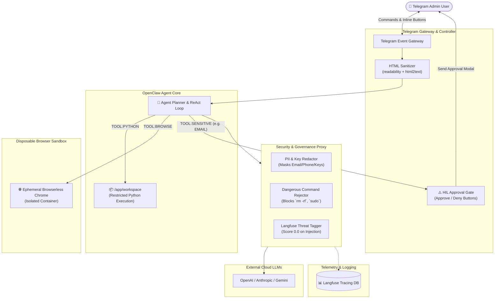
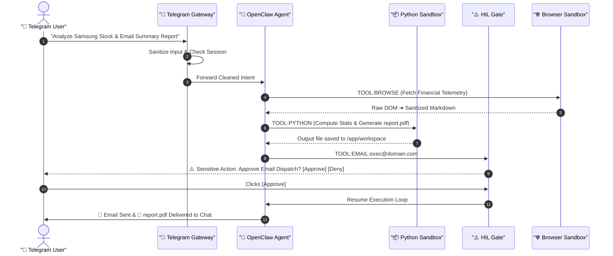

# 🤖 OpenClaw: Autonomous AI Agent Architecture & Security Playbook
> **Security-First Autonomous Agent with Disposable Browser Sandbox, Guardrails, and Human-in-the-Loop Governance**

> [!TIP]
> 🌐 **Language Selector**: **[🇰🇷 한국어 버전으로 전환 (Switch to Korean)](./openclaw_Test_KR.md)** | **[🇺🇸 English (Current Document)](./openclaw_Test.md)**

---

## 🔗 Navigation
- **[OpenClaw Architecture & Security (EN)](./openclaw_Test.md)**
- [OpenClaw 아키텍처 및 보안 체계 (KR)](./openclaw_Test_KR.md)

---

## 📌 Project Overview
**OpenClaw** is a secure AI agent platform architected for high-stakes operational environments.
Unlike naive LLM wrappers, it enforces strict **zero-trust isolation, continuous observability, and multi-tier approval gates**.
The architecture integrates a **Disposable Browser Sandbox**, an **Isolated Code Execution Volume**, and **Human-in-the-Loop (HIL) Telegram authorization**.

---

## 🏗️ System Architecture Blueprint

---

## 🧩 Core Architectural Components

### 1. `guardrails-proxy` (Security Gateway)
* **Role**: Mediates ALL inbound and outbound communications with external LLM APIs (OpenAI, Gemini, Anthropic).
* **Security Guardrails**:
  * **PII Redaction**: Strips emails, phone numbers, and enterprise API keys prior to external transmission.
  * **Command Whitelisting**: Strictly rejects dangerous shell patterns (`rm -rf`, `sudo`, `dd`).
  * **Zero-Trust Filtering**: Sanitizes prompt injection payloads, flags traces as `security_threat` with `0.0` safety scores, and triggers real-time alerts.
* **Observability**: Direct telemetry ingestion into Langfuse for end-to-end token and audit traceability.

### 2. `openclaw-agent` (Autonomous Brain & Sandbox)
* **Role**: Autonomous reasoning engine and task solver.
* **Capabilities**:
  * **Execution Sandbox**: Executes Python pipelines inside an ephemeral `/app/workspace` mount for data processing and PDF/chart generation.
  * **ReAct Planner**: Formulates multi-step execution plans (`Search` ➔ `Code` ➔ `Python` ➔ `Artifact Deliver`).

### 3. `telegram-gateway` (Human-in-the-Loop Controller)
* **Role**: The operational interface connecting administrators to the autonomous agent.
* **Functionality**:
  * **HTML Pre-Sanitizer**: Uses `readability` + `html2text` to strip malicious JavaScript and hidden tags from untrusted web scrapes before passing them to the LLM.
  * **Human-in-the-Loop (HIL)**: Automatically pauses execution when high-risk actions (`EMAIL`, `DELETE`, `DB_WRITE`) are requested, requiring explicit admin button confirmation.

### 4. `browser-sandbox` (Disposable Containerized Browser)
* **Role**: Isolated headless Chromium/Browserless instance.
* **Security Profile**: Ephemeral browser sessions run in zero-permission Docker containers. Malicious web payloads cannot touch the host server or agent workspace.

---

## 🔄 End-to-End Workflow: "Analyze & Report"

---

## 🔒 Security Principles
1. **Zero-Trust External Ingestion**: All external web data is tagged with `<<<EXTERNAL_DATA>>>` delimiters and stripped of raw executable tags.
2. **Deterministic Permissions**: Agents cannot self-authorize irreversible side-effects without explicit administrator sign-off.
