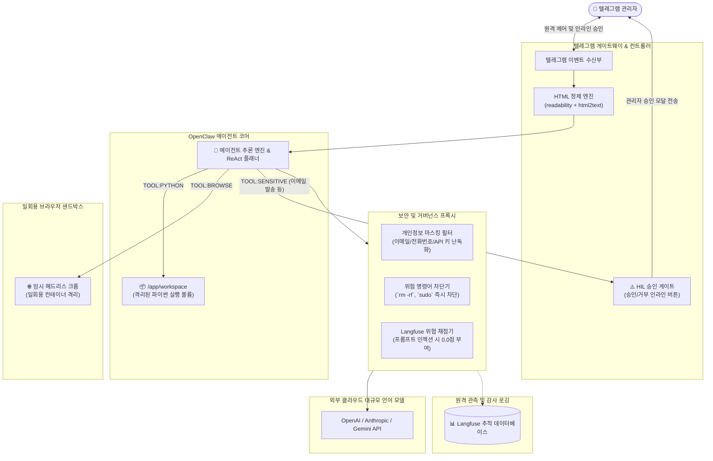
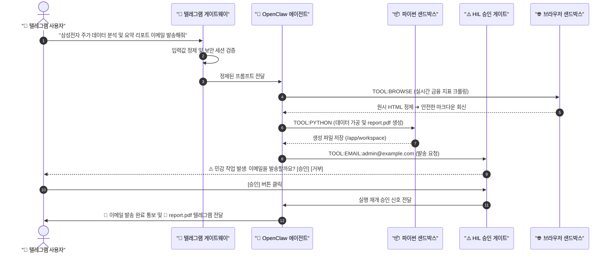

# 🤖 OpenClaw: 자율 AI 에이전트 아키텍처 및 제로 트러스트 보안 체계
> **일회용 브라우저 샌드박스, 보안 가드레일, 인간 참여형(HIL) 승인 체계를 갖춘 보안 중심 자율 에이전트**

> [!TIP]
> 🌐 **Language / 언어 선택**: **[🇰🇷 한국어 (현재 문서)](./openclaw_Test_KR.md)** | **[🇺🇸 Switch to English (영문 버전 읽기)](./openclaw_Test.md)**

---

## 🔗 문서 이동 (Navigation)
- [OpenClaw Architecture & Security (EN)](./openclaw_Test.md)
- **[OpenClaw 아키텍처 및 보안 체계 (KR)](./openclaw_Test_KR.md)**

---

## 📌 프로젝트 개요 (Project Overview)

**OpenClaw**는 고신뢰 엔터프라이즈 환경을 위해 설계된 보안 중심 자율 AI 에이전트 플랫폼입니다.
단순한 LLM Wrapper 라이브러리와 달리, **철저한 제로 트러스트(Zero-Trust) 격리, 전방위 관측성(Observability), 그리고 다단계 인간 승인(Human-in-the-Loop)** 원칙을 엄격하게 준수합니다.
이 시스템은 **일회용 브라우저 샌드박스(Disposable Browser Sandbox)**, **독립 코드 실행 볼륨(Code Execution Sandbox)**, 그리고 **텔레그램 관리자 양방향 승인 게이트웨이**를 유기적으로 결합하여 구축되었습니다.

---

## 🏗️ 전체 시스템 아키텍처 (Architecture Blueprint)

---

## 🧩 5대 핵심 아키텍처 컴포넌트

### 1. `guardrails-proxy` (보안 게이트웨이)
* **역할**: 외부 상용 LLM(OpenAI, Gemini 등)과 주고받는 모든 입출력 트래픽을 단일 통로로 검증 및 필터링합니다.
* **주요 보안 기능**:
  * **개인정보(PII) 필터링**: 이메일, 전화번호, 사내 비밀 API 키를 외부 전송 전 자동 마스킹.
  * **위험 명령어 차단**: 셸 인젝션 및 파괴적 명령어(`rm -rf`, `sudo`, `dd` 등)를 사전 차단.
  * **필터 우선 정책**: 프롬프트 인젝션이 감지되면 입력을 강제 소독하고, Langfuse에 `security_threat` 태그를 부착(위협 점수 0.0점)한 뒤 관리자 경보를 발생시킵니다.
* **관측성(Observability)**: 모든 호출 트레이스를 Langfuse에 중앙 집중식으로 보관하여 감사를 보장합니다.

### 2. `openclaw-agent` (추론 두뇌 및 코드 샌드박스)
* **역할**: 복잡한 문제 해결을 자율적으로 수행하는 에이전트 본체.
* **기능**:
  * **코드 실행 격리 샌드박스**: `/app/workspace` 전용 마운트 공간 내에서만 파이썬 코드를 실행하여 데이터 분석 및 보고서(PDF, 차트)를 생성합니다.
  * **자율 계획(ReAct)**: 다단계 작업(정보 검색 ➔ 코드 작성 ➔ 파이썬 실행 ➔ 결과 파일 송출)을 스스로 수립하고 실행합니다.

### 3. `telegram-gateway` (인터페이스 및 HIL 컨트롤러)
* **역할**: 사용자와 에이전트 간의 실시간 브릿지 인터페이스.
* **기능**:
  * **HTML 무해화(Sanitizer)**: 외부 웹 페이지를 스크래핑할 때 악성 자바스크립트 및 태그를 `readability`와 `html2text`로 전처리하여 LLM에 전달.
  * **인간 참여형(Human-in-the-Loop)**: 이메일 외부 전송, 파일 삭제 등 민감도가 높은 도구 실행 시 임의로 처리하지 않고 관리자 텔레그램으로 **[승인 / 거부]** 모달을 띄워 최종 결재를 받습니다.

### 4. `browser-sandbox` (일회용 브라우저)
* **역할**: 도커 기반 독립 컨테이너로 구동되는 브라우저리스(Browserless) 크롬 인스턴스.
* **격리 원칙**: 웹 탐색 세션은 임시(Ephemeral)로 생성되고 파기되므로 악성 사이트에 접속하더라도 호스트나 에이전트 컨테이너에 일절 영향을 주지 않습니다.

---

## 🔄 엔드-투-엔드 데이터 흐름: "주식 분석 및 리포트 발송"

---

## 🔒 핵심 보안 설계 원칙
1. **외부 데이터 불신 원칙**: 인터넷에서 수집된 모든 외부 데이터는 `<<<EXTERNAL_DATA>>>` 구획으로 격리되며, 날것의 실행 태그는 전면 제거됩니다.
2. **비가역적 행위 통제**: 외부 발송, DB 변경, 파일 영구 삭제와 같은 비가역적 액션은 관리자의 명시적 버튼 승인 없이 자율 수행될 수 없습니다.
